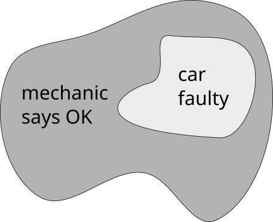
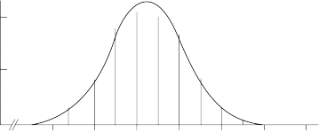

---
jupyter:
  jupytext:
    metadata_filter:
      notebook:
        additional: all
        excluded:
        - language_info
    text_representation:
      extension: .Rmd
      format_name: rmarkdown
      format_version: '1.0'
      jupytext_version: 0.8.6
  kernelspec:
    display_name: Python 3
    language: python
    name: python3
resampling_with:
    ed2_fname: 29-Chap-25
---

# Bayesian Analysis by Simulation

Bayesian analysis is a way of thinking about problems in probability and
statistics that can help one reach otherwise-difficult decisions. It
also can sometimes be used in science. The range of its recommended uses
is controversial, but this chapter deals only with those uses of
Bayesian analysis that are uncontroversial.

Better than defining Bayesian analysis in formal terms is to demonstrate
its use. Therefore, to make clear the nature of "Bayes' theorem", we shall
start with the simplest sort of problem, and proceed gradually from
there.

## Simple decision problems

**Assessing the Likelihood That a Used Car Will Be Sound**

Consider a problem in estimating the soundness of a used car one
considers purchasing (after Wonnacott and Wonnacott, 1990, p. 93).
Seventy percent of the cars are known to be OK on average, and 30
percent are faulty. Of the cars that *are* really OK, a mechanic
correctly identifies 80 percent as "OK" but says that 20 percent are
"faulty"; of those that are faulty, the mechanic correctly identifies 90
percent as faulty and says (incorrectly) that 10 percent are OK.

We wish to know the probability that if the mechanic *says* a car is
"OK," it *really* is faulty.  Phrased differently, what is the
probability of a car being faulty if the mechanic said it was OK.

One can get the desired probabilities directly by simulation without
knowing Bayes' theorem, as we shall see. But one must be able to model the
physical problem correctly in order to proceed with the simulation; this
requirement of a clearly visualized model is a strong point in favor of simulation.

We approach the simulation as follows:


1. Note that we are only interested in outcomes where the mechanic says the cars are OK.

2. Start with N=100000 cars.  For each car, generate a number between 0
   and 1.  If this number is between 0 and 0.3, the car is faulty.  If
   between 0.3 and 1, the car is working.

3. We now repeat the above procedure to determine how many working and faulty cars, respectively, are judged to be OK by a mechanic.

   For each car, generate a number between 0 and 1.

   - For faulty cars, if the number is between 0 and 0.1, the mechanic says the car is OK.
   - For working cars, if the number is between 0 and 0.8, the mechanic says the car is OK.

4. Now, we count.  We would like to know how often a car is faulty,
   out of all the times the car is determined to be OK by a mechanic.  So, we count the number of times that a car is been called OK but is faulty, and divide it by the number of times cars are labeled OK.

Here is the code:

```{python}
import numpy as np

N = 1000000

dice = np.random.random(N)
faulty = dice < 0.3
non_faulty = ~faulty

dice = np.random.random(N)
mechanic_says_OK = np.zeros(N, dtype=bool)
mechanic_says_OK[faulty & (dice < 0.1)] = True
mechanic_says_OK[~faulty & (dice < 0.8)] = True

k = np.count_nonzero(mechanic_says_OK & faulty) / np.count_nonzero(mechanic_says_OK)

print(f'{k * 100:.2}%')
```

The result is around 5.1%.  If we look at the numbers on our diagram, this makes sense: if we started with 100 cars, 59 are declared OK by a mechanic.  Of those, 3 were faulty, and `3/59 = 0.0508`.

### Probability interpretation

**Probability from proportion**

In these examples, it is very common for us to calculate proportions.  In a given simulation: How many cars are declared OK by a mechanic?  59/100.  How many of those 59 were faulty?  3/59.  Given evidence of events, we can count how common they were.

A natural extension of this idea is to predict the probability of an event occurring.  We can say "in past 100 experiments, condition X occurred 20 times, therefore I  estimate that the probability of X occurring, $P(X)$, is 20/100".  The more trial outcomes we examine, the better our probability estimates become.

**Ratios of proportions / probabilities**

At our mechanic's yard, we ask "how many red cars here are broken"?  To calculate that, we first count the number of red cars, then the number of those red cars that are broken, then calculate the ratio: `red_cars_broken / red_cars`.

We could just as well have worked in percentages, and we would have gotten the same answer: `percentage_of_red_cars_broken / percentage_of_cars_that_are_red`, since
that is `(red_cars_broken / 100) / (red_cars / 100)`.  And probabilities would have worked too, given our assumption that the counts are good representations of the yard: `P(red_cars_broken_in_the_yard) / P(red_cars_in_the_yard)`.

**Probability relationships: conditional probability**

We return to the quantity computed above: the **number** of cars being faulty *given* that the mechanic said they were OK.  We use this ratio as an estimate of the probability that that will be true, i.e: the **probability** of cars being faulty *given* that the mechanic said they were OK.

This is called a *conditional probability*, $P(X | Y)$.  Given a certain outcome Y, calculate the probability of X occurring.

Conditional probabilities are calculated as follows:

$P(X | Y) = P(X \cup Y) / P(Y)$

From our car example, what is the probability of a car being broken given that a mechanic said it was OK?  It is, out of all the cars that the mechanic said were OK, the fraction that weren't or:

$P(car_broken & mechanic_said_OK) / P(mechanic_said_OK)$.

**Example: conditional probability**

Let's discuss a very relevant example.  You get a COVID test, and the test is negative.  Now, you would like to know what the chance is of you having COVID.

We have the following information:

- 1.5% of people in your area have COVID
- The false positive rate of the tests (i.e., that they detect COVID when it is absent) is very low at 0.5%
- The false negative rate (i.e., that they fail to detect COVID when it is present) is quite high at 40%

You would like to know the probability of having COVID given that your test was negative.  Using the conditional probability relationship from above, we can write:

$P(covid | test_negative) = P(covid \cup test_negative) / P(test_negative)$

We notice that $P(covid \cup test_negative) = P(test_negative | covid) * P(covid) = .4 * .015 = 0.006$.
We also observe that $P(test_negative) = P(test_negative | covid) + P(test_negative | not_covid) = 0.4 + 0.995 = 1.395$.

We fill in the quantities above and obtain:

$P(covid | test_negative) = 0.006 / 1.395 = 0.004$.

OK, so we have a number... is that number even close to correct?  Doing the simulation is a lot easier than figuring out the calculation above:

```{python}
N = 1000000

person_has_covid = np.random.random(N) < 0.015  # True if person has covid
nr_with_covid = np.count_nonzero(person_has_covid)
nr_without_covid = N - nr_with_covid

test_result = np.zeros_like(person_has_covid, dtype=bool)
test_result[person_has_covid] = np.random.random(nr_with_covid) > 0.4
test_result[~person_has_covid] = np.random.random(nr_without_covid) < 0.005

covid_status_negative_test = person_has_covid[~test_result]
nr_with_negative_test = len(covid_status_negative_test)

k = np.count_nonzero(covid_status_negative_test) / nr_with_negative_test

print(k)
```

This gives around 0.006, which means our calculated answer is .... probably wrong.  Oy!


**Some other messy text I need to clean up...**

You can also think of this in terms of a diagram of the event space:



Inside the space of all cars that mechanics determine to be OK, there are some that are faulty.  The fraction of the faulty cars *given that a mechanic said the car is OK* is $\mathrm{P}( \mathrm{car\_faulty} | \mathrm{mechanic\_says\_OK} )$.

A key observation of the program above is that we only examine the outputs that we are interested in.  This defines the "outer ring" of the diagram.  We then look for a specific source of that outcome to see how frequently it occurs.

Something to keep in mind is that universes of cars differ: when there is a 30% probability of cars being faulty, it does not mean that *exactly* 30 out of every 100 cars will be broken.  We can simulate the distribution of outcomes by repeating the above experiment for many batches of 100 cars:

```{python}
import numpy as np
import matplotlib.pyplot as plt

cars = 1000
experiments = 10000

ks = np.zeros(experiments)

for i in range(experiments):
    dice = np.random.random(cars)
    faulty = dice < 0.3
    non_faulty = ~faulty

    dice = np.random.random(cars)
    mechanic_says_OK = np.zeros(cars, dtype=bool)
    mechanic_says_OK[faulty & (dice < 0.1)] = True
    mechanic_says_OK[~faulty & (dice < 0.8)] = True

    k = np.count_nonzero(mechanic_says_OK & faulty) / np.count_nonzero(mechanic_says_OK)

    ks[i] = k * 100

plt.hist(ks, bins=np.arange(15), density=True)
plt.xlabel('% of times car is broken when mechanic says it\'s OK')
plt.ylabel(f'Probability of this outcome with {cars} cars')
plt.show()
```

**Estimating Driving Risk for Insurance Purposes**

Another sort of introductory problem, following after @feller1968introduction,
p 122:

A mutual insurance company charges its members according to the risk of
having an auto accident. It is known that there are two classes of
people---80 percent of the population with good driving judgment and
with a probability of .06 of having an accident each year, and 20
percent with poor judgment and a probability of .6 of having an accident
each year. The company's policy is to charge (in addition to a fee to
cover overhead expenses) \$100 for each percent of risk, i. e., a driver
with a probability of .6 should pay 60\*\$100 = \$6000.

If nothing is known of a driver except that he had an accident last
year, what fee should he pay?

This procedure will produce the answer:

1.  Construct bucket A with 6 red and 94 green balls, and bucket B with 60 red
    and 40 green balls.

2.  Randomly select a bucket with probabilities for A = .8 and B = .2, and
    record the bucket chosen.

3.  Select a ball at random from the chosen bucket. If the ball is green,
    go back to step 2; if red, continue to step 4. In either case,
    replace the ball selected.

4.  Select another ball from the bucket chosen in step 2. If it is red,
    record "Y," if green, record "N."

5.  Repeat steps 2 - 4 perhaps 1000 times, and determine the proportion
    "Y" in relation to (Y + N). The final answer should be approximately
    \$4450.

**Screening for Disease**

This is a classic Bayesian problem (quoted by Tversky and Kahnemann,
1982, pp. 153-154, from Cascells, Schoenberger, and Grayboys, 1978, p.
999):

If a test to detect a disease whose prevalence is 1/1000 has a false
positive rate of 5%, what is the chance that a person found to have a
positive result actually has the disease, assuming you know nothing
about the persons's symptoms or signs?

Tversky and Kahnemann note that among the respondents--- students and
staff at Harvard Medical School---"the most common response, given by
almost half of the participants, was 95%," very much the wrong answer.

To obtain an answer by simulation, we may rephrase the question above
with (hypothetical) absolute numbers as follows:

If a test to detect a disease whose prevalence has been estimated to be
about 100,000 in the population of 100 million persons over age 40 (that
is, about 1 in a thousand) has been observed to have a false positive
rate of 60 in 1200 observations, and never gives a negative result if a
person really has the disease, what is the chance that a person found to
have a positive result actually has the disease, assuming you know
nothing about the persons's symptoms or signs?

If the raw numbers are not available, the problem can be phrased in such
terms as "about 1 case in 1000" and "about 5 false positives in 100
cases.")

One may obtain an answer as follows:

1.  Construct bucket A with 999 white beads and 1 black bead, and bucket B
    with 95 green beads and 5 red beads. A more complete problem that
    also discusses false negatives would need a third bucket.

2.  Pick a bead from bucket A. If black, record "T," replace the bead, and
    end the trial. If white, continue to step 3.

3.  If a white bead is drawn from bucket A, select a bead from bucket

    B. If red, record "F" and replace the bead, and if green record "N"
    and replace the bead.

4.  Repeat steps 2-4 perhaps 10,000 times, and in the results count the
    proportion of "T"s to ("T"s plus "F"s) ignoring the "N"s).

    Of course 10,000 draws would be tedious, but even after a few
    hundred draws a person would be likely to draw the correct
    conclusion that the proportion of "T"s to ("T"s plus "F"s) would be
    small. And it is easy with a computer to do 10,000 trials very
    quickly.

    Note that the respondents in the Cascells et al. study were not
    naive; the medical staff members were supposed to understand
    statistics. Yet most doctors and other personnel offered wrong
    answers. If simulation can do better than the standard deductive
    method, then simulation would seem to be the method of choice. And
    only one piece of training for simulation is required: Teach the
    habit of saying "I'll simulate it" and then actually doing so.

    Fundamental problems in statistical practice
    --------------------------------------------

    Box and Tiao begin their classic exposition of Bayesian statistics
    with the analysis of a famous problem first published by Fisher
    (1959).

    ...there are mice of two colors, black and brown. The black mice are
    of two genetic kinds, homozygotes ( *BB* ) and heterozygotes ( *Bb*
    ), and the brown mice are of one kind ( *bb* ). It is known from
    established genetic theory that the probabilities associated with
    offspring from various matings are as \[in Table 25-1\]:

    Suppose we have a "test" mouse which is black and has been produced
    by a mating between two ( *Bb* ) mice. Using the information in the
    last line of the table, it is seen that, in this case, the prior
    probabilities of the test mouse being homozygous ( *BB* ) and
    heterozygous ( *Bb* ) are precisely known, and are 1/3 and 2/3
    respectively. Given this prior information, Fisher supposed that the
    test mouse was now mated with a brown mouse and produced (by way of
    data) seven black offspring. One can then calculate, as Fisher
    (1959, p.17) did, the probabilities, posterior to the data, of the
    test mouse being homozygous ( *BB* ) and heterozygous ( *Bb* ) using
    Bayes' theorem. . .

    We see that, given the genetic characteristics of the offspring, the
    mating results of 7 black offspring changes our knowledge
    considerably about the test mouse being ( *BB* ) or ( *Bb* ), from a
    prior probability ratio of 2:1 in favor of ( *Bb* ) to a posterior
    ratio of 64:1 against it (1973, pp. 12-14).

    1.  Let us begin, as do Box and Tiao, by restricting our attention
        to the third line in Table 25-1, and let us represent those
        results with 4 balls---1 black with "BB" painted on it, 2 black
        with "Bb" painted on them, and 1 brown which we immediately
        throw away because we are told that the "test mouse" is black.
        The remaining 3 (black) balls are put into a bucket labeled
        "test."

        Table 25-1

        **Probabilities for Genetic Character of Mice Offspring**

        **Mice BB (black) Bb (black) bb (brown)**

          ------------------ --- --- ---
          BB mated with bb   0   1   0
          Bb mated with bb   0   ½   ½
          Bb mated with Bb   ¼   ½   ¼
          ------------------ --- --- ---

         Source: Box and Tiao, 1973, pp. 12-14

    2.  From prior knowledge we know that a BB black mouse mated with a
        bb brown mouse will produce all black mice (line 1 in the
        table), and a Bb black mouse mated with a bb brown mouse will
        produce 50 percent black mice and 50 percent brown mice. We
        therefore construct two more buckets, one with a single black ball
        (the bucket labeled "BB") and the other with one black ball and one
        brown ball (the bucket labeled "Bb"). We now have three buckets.

    3.  Take a ball from bucket "test." If its label is "BB," record that
        fact, take a ball (the only ball, which is black) from the BB
        bucket, record its color (we knew this already), and replace the
        ball into the BB bucket; the overall record of this trial is
        "BB-black." If the ball drawn from bucket "test" says "Bb," draw a
        ball from the Bb bucket, record, and replace; the record will
        either be "Bb-black" or "Bb-brown."

    4.  Repeat step 3 seven times.

    5.  Examine whether the record of the seven balls drawn from the BB
        and Bb buckets are all black; if so, record "Y," otherwise "N."

    6.  Repeat steps 3-5 perhaps 1000 times.

    7.  Ignore all "N" records. Proceeding now if the result of step 5
        is "Y": Count the number of cases which are BB and the number
        which are Bb. The proportions of BB/"Y" and Bb/"Y" trials are
        the probabilities that the test mouse is BB and Bb respectively.

Creating the correct simulation procedure is not easy, because Bayesian
reasoning is very subtle---a reason it has been the cause of controversy
for more than two centuries. But it certainly is not easier to create a
correct procedure using analytic tools (except in the cookbook sense of
plug in and pray). And the difficult mathematics that underlie the
analytic method (see

e\. g., Box and Tiao, Appendix A1.1) make it almost impossible for the
statistician to fully understand the procedure from be-

ginning to end; if one is interested in insight, the simulation
procedure might well be preferred. ^2^

A computer program to speed the above steps appears in the Appendix to
this chapter. The result found with a set of 1000 repetitions is .987.

## Problems based on normal and other distributions

This section should be skipped by all except advanced practitioners of
statistics.

Much of the work in Bayesian analysis for scientific purposes treats the
combining of prior distributions having Normal and other standard shapes
with sample evidence which may also be represented with such standard
functions. The mathematics involved often is formidable, though some of
the calculational formulas are fairly simple and even intuitive.

These problems may be handled with simulation by replacing the Normal
(or other) distribution with the original raw data when data are
available, or by a set of discrete sub-universes when distributions are
subjective.

Measured data from a continuous distribution present a special problem
because the probability of any one observed value is very low, often
approaching zero, and hence the probability of a given set of observed
values usually cannot be estimated sensibly; this is the reason for the
conventional practice of working with a continuous distribution itself,
of course. But a simulation necessarily works with discrete values. A
feasible procedure must bridge this gulf.

The logic for a problem of Schlaifer's will be only be sketched out. The
procedure is rather novel, but it has not heretofore been published and
therefore must be considered tentative and requiring particular
scrutiny.

**An Intermediate Problem in Conditional Probability**

Schlaifer employs a quality-control problem for his leading example of
Bayesian estimation with Normal sampling. A chemical manufacturer wants
to estimate the amount of yield of a crucial ingredient X in a batch of
raw material in order to decide whether it should receive special
handling. The yield ranges between 2 and 3 pounds (per gallon), and the
manufacturer has compiled the distribution of the last 100 batches.

The manufacturer currently uses the decision rule that if the mean of
nine samples from the batch (which vary only because of measurement
error, which is the reason that he takes nine samples rather than just
one) indicates that the batch mean is greater than 2.5 gallons, the
batch is accepted. The first question Schlaifer asks, as a
sampling-theory waystation to the more general question, is the
likelihood that a given batch with any given yield---say 2.3
gallons---will produce a set of samples with a mean as great or greater
than 2.5 gallons.

We are told that the manufacturer has in hand nine samples from a given
batch; they are 1.84, 1.75, 1.39, 1.65, 3.53, 1.03,

2.73, 2.86, and 1.96, with a mean of 2.08. Because we are also told that
the manufacturer considers the extent of sample variation to be the same
at all yield levels, we may---if we are again working with 2.3 as our
example of a possible universe---therefore add (2.3 minus 2.08 =) 0.22
to each of these nine observations, so as to constitute a bootstrap-type
universe; we do this on the grounds that this is our best guess about
the constitution of that distribution with a mean at (say) 2.3.

We then repeatedly draw samples of nine observations from this
distribution (centered at 2.3) to see how frequently its mean exceeds
2.5. This work is so straightforward that we need not even state the
steps in the procedure.

**Estimating the Posterior Distribution**

Next we estimate the posterior distribution. Figure 25-1 shows the prior
distribution of batch yields, based on 100 previous batches.



.2

.1

0

0 2.0 2.2 2.4 2.6 2.8 3.0 3.2

**Figure 25-1**

Notation: S ~m~ = set of batches (where total S = 100) with a particular
mean m (say, m = 2.1). x ~i~ = particular observation (say, x ~3~ =
1.03). s = the set of x ~i~ .

We now perform for each of the S ~m~ (categorized into the
tenth-of-gallon divisions between 2.1 and 3.0 gallons), each
corresponding to one of the yields ranging from 2.1 to 3.0, the same
sort of sampling operation performed for S ~m=2.3~ in the previous
problem. But now, instead of using the manufacturer's decision criterion
of 2.5, we construct an interval of arbitrary width around the sample
mean of 2.08---say at

.1 intervals from 2.03 to 2.13---and then work with the weighted

proportions of sample means that fall into this interval.

1.  Using a bootstrap-like approach, we presume that the sub-universe of
    observations related to each S ~m~ equals the mean of that S ~m~
    ---(say, 2.1) plus (minus) the mean of the x ~i~ (equals 2.05) added
    to (subtracted from) each of the nine x ~i~ , say, 1.03 +

    .05 = 1.08. For a distribution centered at 2.3, the values would

    be (1.84 + .22 = 2.06, 1.75 + .22 = 1.97...).

2.  Working with the distribution centered at 2.3 as an example:
    Constitute a universe of the values (1.84+.22=2.06, 1.75 + .22 =
    1.97...). Here we may notice that the variability in the sample
    enters into the analysis at this point, rather than when the sample
    evidence is combined with the prior distribution; this is in
    contrast to conventional Bayesian practice where the posterior is
    the result of the prior and sample means weighted by the reciprocals
    of the variances (see e.g. Box-Tiao, 1973, p. 17 and Appendix A1.1).

3.  Draw nine observations from this universe (with replacement, of
    course), compute the mean, and record.

4.  Repeat step 2 perhaps 1000 times and plot the distribution of
    outcomes.

5.  Compute the percentages of the means within (say) .5 on each side of
    the sample mean, i. e. from 2.03--2.13. The resulting number---call
    it UP ^i^ ---is the un-standardized (un-normalized) effect of this
    sub-distribution in the posterior distribution.

6.  Repeat steps 1-5 to cover each other possible batch yield from 2.0
    to 3.0 (2.3 was just done).

7.  Weight each of these sub-distributions---actually, its UP ^i^ --- by
    its prior probability, and call that WP ^i^ -.

8.  Standardize the WP ^i^ s to a total probability of 1.0. The result
    is the posterior distribution. The value found is 2.283, which the
    reader may wish to compare with a theoretically-obtained result
    (which Schlaifer does not give).

    This procedure must be biased because the numbers of "hits" will
    differ between the two sides of the mean for all sub-distributions
    except that one centered at the same point as the sample, but the
    extent and properties of this bias are as-yet unknown. The bias
    would seem to be smaller as the interval is smaller, but a small
    interval requires a large number of simulations; a satisfactorily
    narrow interval surely will contain relatively few trials, which is
    a practical problem of still-unknown dimensions.

    Another procedure---less theoretically justified and probably more
    biased---intended to get around the problem of the narrowness of the
    interval, is as follows:

    **5a.** Compute the percentages of the means on each side of the
    sample mean, and note the smaller of the two (or in another possible
    process, the difference of the two). The resulting number---call it
    UP ^i^ ---is the un-standardized (un-normalized) weight of this
    sub-distribution in the posterior distribution.

    Another possible criterion---a variation on the procedure in 5a---is
    the *difference* between the two tails; for a universe with the same
    mean as the sample, this difference would be zero.

    Conclusion
    ----------

    All but the simplest problems in conditional probability are
    confusing to the intuition even if not difficult mathematically. But
    when one tackles Bayesian and other problems in probability with
    experimental simulation methods rather than with logic, neither
    simple nor complex problems need be difficult for experts or
    beginners.

    This chapter shows how simulation can be a helpful and illuminating
    way to approach problems in Bayesian analysis.

    Simulation has two valuable properties for Bayesian analysis:

    1.  It can provide an effective way to handle problems whose
        analytic solution may be difficult or impossible. 2) Simulation
        can provide insight to problems that otherwise are difficult to
        understand fully, as is peculiarly the case with Bayesian
        analysis.

Bayesian problems of updating estimates can be handled easily and
straightforwardly with simulation, whether the data are discrete or
continuous. The process and the results tend to be intuitive and
transparent. Simulation works best with the original raw data rather
than with abstractions from them via percentages and distributions. This
can aid the understanding as well as facilitate computation.

## Endnotes

1.  Darrell Huff provides the quote but without reference: "This branch
    of mathematics \[probability\] is the only one, I believe, in which
    good writers frequently get results entirely erroneous." (Huff,
    1959, frontispage)

2.  We can use a similar procedure to illustrate an aspect of the
    Bayesian procedure that Box and Tiao emphasize, its
    sequentially-consistent character. First let us carry out the above
    procedure but observe only three black balls in a row. The program
    to be used is the same except for the insertion of "3" for "7" where
    "7" appears. We then estimate the probability for BB, which turns
    out to be about 1/5 instead of about 1/65. We then substitute for
    bucket A a bucket A' with appropriate numbers of black Bb's and black
    BB's, to represent the "updated" prior probability. We may then
    continue by substituting "4" for "3" above (to attain a total of
    seven observed black balls), and find that the probability is about
    what it was when we observed 7 black balls in a single sample
    (1/65). This shows that the Bayesian procedure accumulates
    information without "leakage" and with consistency.
