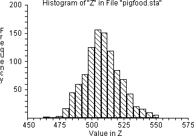
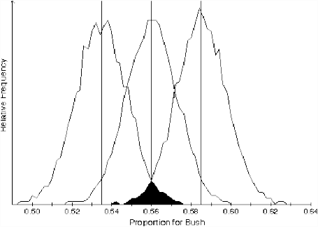
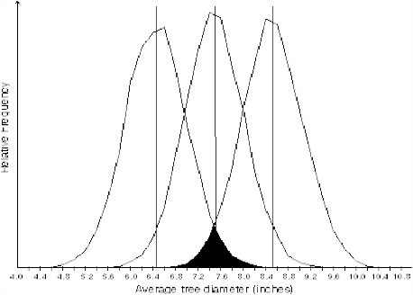

---
jupyter:
  jupytext:
    metadata_filter:
      notebook:
        additional: all
        excluded:
        - language_info
    text_representation:
      extension: .Rmd
      format_name: rmarkdown
      format_version: '1.0'
      jupytext_version: 0.8.6
  kernelspec:
    display_name: Python 3
    language: python
    name: python3
resampling_with:
    ed2_fname: 25-Chap-21
---

```{r setup, include=FALSE}
source("_common.R")
```

# Confidence Intervals, Part 2: The Two Approaches to Estimating Confidence Intervals {#sec-confidence-two-approaches}

:::{.callout-warning}
## Draft page partially ported from original PDF

This page is an automated and partial import from the [original second-edition
PDF](https://resample.com/content/text/25-Chap-21.pdf).

We are in the process of updating this page for formatting, and porting any
code from the original [RESAMPLING-STATS
language](http://www.statistics101.net) to Python and R.

Feel free to read this version for the sense, but expect there to be multiple
issues with formatting.

We will remove this warning when the page has adequate formatting, and we have
ported the code.
:::


There are two broad conceptual approaches to the question at hand: 1)
Study the probability of various distances between the sample mean and
the *likeliest* population mean; and 2) study the behavior of particular
*border* universes. Computationally, both approaches often yield the
same result, but their interpretations differ. Approach 1 follows the
conventional logic although carrying out the calculations with
resampling simulation.

## Approach 1: The distance between sample and population mean

If the study of probability can tell us the probability that a given
population will produce a sample with a mean at a given distance x from
the population mean, and if a sample is an unbiased estimator of the
population, then it seems natural to turn the matter around and
interpret the same sort of data as telling us the probability that the
estimate of the population mean is that far from the "actual" population
mean. A fly in the ointment is our lack of knowledge of the dispersion,
but we can safely put that aside for now. (See below, however.)

This first approach begins by assuming that the universe that actually
produced the sample has the same amount of dispersion (but not
necessarily the same mean) that one would estimate from the sample. One
then produces (either with resampling or with Normal distribution
theory) the distribution of sample means that would occur with repeated
sampling from that designated universe with samples the size of the
observed sample. One can then compute the distance between the (assumed)
population mean and (say) the inner 45 percent of sample means on each side of
the actually observed sample mean.

The crucial step is to shift vantage points. We look from the sample to
the universe, instead of *from a hypothesized universe to simulated
samples* (as we have done so far). This same interval as computed above
must be the relevant distance as when one looks from the sample to the
universe. Putting this algebraically, we can state (on the basis of
either simulation or formal calculation) that for any given population
S, and for any given distance $d$ from its mean $\mu$, that $P((\mu - \bar{x})
< d) = \alpha$, where $\bar{x}$ is a randomly generated sample mean and
$\alpha$ is the probability resulting from the simulation or calculation.

The above equation focuses on the deviation of various sample means
($\bar{x}$) from a stated population mean ($\mu$). But we are logically
entitled to read the algebra in another fashion, focusing on the deviation of
$\mu$ from a randomly generated sample mean. This implies that for any given
randomly generated sample mean we observe, the same probability ($\alpha$)
describes the probability that $\mu$ will be at a distance $d$ or less from
the observed $\bar{x}$. (I believe that this is the logic underlying the
conventional view of confidence intervals, but I have yet to find a clear-cut
statement of it; in any case, it appears to be logically correct.)

To repeat this difficult idea in slightly different words: If one draws a
sample (large enough to not worry about sample size and dispersion), one can
say in advance that there is a probability $p$ that the sample mean
($\bar{x}$) will fall within $z$ standard deviations of the population mean
($\mu$). One estimates the population dispersion from the sample. If there is
a probability $p$ that $\bar{x}$ is within $z$ standard deviations of $\mu$,
then with probability $p$, $\mu$ must be within that same $z$ standard
deviations of $\bar{x}$. To repeat, this is, I believe, the heart of the
standard concept of the confidence interval, to the extent that there is
thought through consensus on the matter.

So we can state for such populations the probability that the distance between
the population and sample means will be $d$ or less. Or with respect to a
given distance, we can say that the probability that the population and sample
means will be that close together is $p$.

That is, we start by focusing on how much the sample mean diverges from
the known population mean. But then — and to repeat once more this key
conceptual step — we refocus our attention to *begin with the sample mean* and
then discuss the probability that the population mean will be within a given
distance. The resulting distance is what we call the "confidence interval."

Please notice that the distribution (universe) assumed at the beginning
of this approach did not include the assumption that the distribution is
centered on the sample mean or anywhere else. It is true that the sample
mean is used *for purposes of reporting the location of the estimated
universe mean* . But despite how the subject is treated in the
conventional approach, the estimated population mean is not part of the
work of constructing confidence intervals. Rather, the calculations
apply in the same way to *all universes in the neighborhood of the
sample* (which are assumed, for the purpose of the work, to have the
same dispersion). And indeed, it must be so, because the probability
that the universe from which the sample was drawn is centered exactly at
the sample mean is very small.

This independence of the confidence-intervals construction from the mean
of the sample (and the mean of the estimated universe) is surprising at
first, but after a bit of thought it makes sense.

In this first approach, as noted more generally above, we do *not* make
estimates of the confidence intervals on the basis of any logical
inference from any one particular sample to any one particular universe,
because *this cannot be done in principle* ; it is the futile search for
this connection that for decades roiled the brains of so many
statisticians and now continues to trouble the minds of so many
students. Instead, we investigate the behavior of (in this first
approach) the universe that has a higher probability of producing the
observed sample than does any other universe (in the absence of any
additional evidence to the contrary), and whose characteristics are
chosen on the basis of its resemblance to the sample. In this way the
estimation of confidence intervals is like all other statistical
inference: One investigates the probabilistic behavior of one or more
hypothesized universes, the universe(s) being implicitly suggested by
the sample evidence but not logically implied by that evidence. And
there are no grounds for dispute about exactly what is being done — only
about how to interpret the results.

One difficulty with the above approach is that the estimate of the
population *dispersion* does not rest on sound foundations; this matter
will be discussed later, but it is not likely to lead to a seriously
misleading conclusion.

A second difficulty with this approach is in interpreting the result.
What is the justification for focusing our attention on a universe
centered on the sample mean? While this particular universe may be more
likely than any other, it undoubtedly has a low probability. And indeed,
the statement of the confidence intervals refers to the probabilities
that the sample has come from universes *other than* the universe
centered at the sample mean, and quite a distance from it.

My answer to this question does not rest on a set of meaningful
mathematical axioms, and I assert that a meaningful axiomatic answer is
impossible in principle. Rather, I reason that we should consider the
behavior of this universe because other universes near it will produce
much the same results, differing only in dispersion from this one, and
this difference is not likely to be crucial; this last assumption is
all-important, of course. True, we do not know what the dispersion might
be for the "true" universe. But elsewhere (Simon, forthcoming) I argue
that the concept of the "true universe" is not helpful — or maybe even
worse than nothing — and should be forsworn. And we can postulate a
dispersion for any *other* universe we choose to investigate. That is,
for this postulation we unabashedly bring in any other knowledge we may
have. The defense for such an almost-arbitrary move would be that this
is a second-order matter relative to the location of the estimated
universe mean, and therefore it is not likely to lead to serious error.
(This sort of approximative guessing sticks in the throats of many
trained mathematicians, of course, who want to feel an unbroken logic
leading backwards into the mists of axiom formation. But the axioms
themselves inevitably are chosen arbitrarily just as there is
arbitrariness in the practice at hand, though the choice process for
axioms is less obvious and more hallowed by having been done by the
masterminds of the past. (See @simon1998philosophy, on the necessity for
judgment.) The absence of a sequence of equations leading from some first
principles to the procedure described in the paragraph above is evidence of
what is felt to be missing by those who crave logical justification. The key
equation in this approach is formally unassailable, but it seems to come from
nowhere.)

In the examples in the following chapter may be found computations for
two population distributions — one binomial and one quantitative — of
the histograms of the sample means produced with this procedure.

Operationally, we use the observed sample mean, together with an
estimate of the dispersion from the sample, to estimate a mean and
dispersion for the population. Then with reference to the sample mean we
state a combination of a distance (on each side) and a probability pertaining
to the population mean. The computational examples will illustrate this
procedure.

Once we have obtained a numerical answer, we must decide how to
interpret it. There is a natural and almost irresistible tendency to
talk about the probability that the mean of the universe lies within the
intervals, but this has proven confusing and controversial.
Interpretation in terms of a repeated process is not very satisfying
intuitively.[^intuitive-confidence]

[^intuitive-confidence]: An example of this sort of interpretation is as
    follows.  Let us say the actual (unknown) population mean is some number
    we will call $\mu$. We have a specific sample, and that sample has a mean
    we will call $\bar{x}$.  The mean $\bar{x}$ that we happen to observe is
    almost certain to be a bit high or a bit low. Accordingly, if we want to be
    reasonably confident that our inference is correct, we cannot claim that
    $\mu$ is precisely equal to the observed $\bar{x}$. Instead, we must
    construct an interval estimate or confidence interval of the form: $\mu =
    \bar{x} \pm \text{sampling error}$.

    The crucial question is: How wide must this allowance for sampling error
    be? The answer, of course, will depend on how much $\bar{x}$ fluctuates...

    > Constructing 95% confidence intervals is like pitching horseshoes. In
    each there is a fixed target, either the population $\mu$ or the stake. We
    are trying to bracket it with some chancy device, either the random
    interval or the horseshoe. ...
    >
    > There are two important ways, however, that confidence intervals differ
    from pitching horseshoes. First, only one confidence interval is
    customarily constructed. Second, the target $\mu$ is not visible like a
    horseshoe stake. Thus, whereas the horseshoe player always knows the score
    (and specifically, whether or not the last toss bracketed the stake), the
    statistician does not. He continues to "throw in the dark," without knowing
    whether or not a specific interval estimate has bracketed $\mu$. All he has
    to go on is the statistical theory that assures him that, in the long run,
    he will succeed 95% of the time. @wonnacott1990introductory, (p. 258).

    Savage refers to this type of interpretation as follows: [@savage1972foundations, pages 260--261]:

    > ... whenever its advocates talk of making assertions that have high
    probability, whether in connection with testing or estimation, they do not
    actually make such assertions themselves, but endlessly pass the buck,
    saying in effect, "This assertion has arisen according to a system that
    will seldom lead you to make false assertions, if you adopt it. As for
    myself, I assert nothing but the properties of the system."

    Lee writes at greater length [@lee2012bayesian, preface to the first
    edition]:

    > ... the statement that a 95% confidence interval for an unknown parameter
    ran from -2 to +2 sounded as if the parameter lay in that interval with 95%
    probability and yet I was warned that all I could say was that if I carried
    out similar procedures time after time then the unknown parameters would
    lie in the confidence intervals I constructed 95% of the time. ...
    >
    > Subsequently, I discovered that the whole theory had been worked out in
    very considerable detail in such books as Lehmann (1959 and 1986). But
    attempts such as those that Lehmann describes to put everything on a firm
    foundation raised even more questions.

In my view, it is not worth arguing about any "true" interpretation of these
computations. One could sensibly interpret the computations in terms of the
odds a decision maker, given the evidence, would reasonably offer about the
relative probabilities that the sample came from one of two specified universes
(one of them probably being centered on the sample); this does provide some
information on reliability, but this procedure departs from the concept of
confidence intervals.

### Example: Counted Data: The Accuracy of Political Polls

Consider the reliability of a randomly selected 1988 presidential
election poll, showing 840 intended votes for Bush and 660 intended
votes for Dukakis out of 1500 [@wonnacott1990introductory, page 5]. Let us
work through the logic of this example.

<!---
From the Wonnacott book text:

Just before the 1998 presidential election, a Gallup poll of about 1500 voters
showed ...

.. multistage sampling ...
-->

*   **What is the question?** Stated technically, what are the 95% confidence
    limits for the proportion of Bush supporters in the population? (The
    proportion is the mean of a binomial population or sample, of course.) More
    broadly, within which bounds could one confidently believe that the
    population proportion was likely to lie? At this stage of the work, we must
    already have translated the conceptual question (in this case,
    a decision-making question from the point of view of the candidates) into
    a statistical question. (See @sec-framing-questions on translating
    questions into statistical form.)
*   **What is the purpose** to be served by answering this question? There is
    no sharp and clear answer in this case. The goal could be to satisfy public
    curiosity, or strategy planning for a candidate (though a national
    proportion is not as helpful for planning strategy as state data would be).
    A secondary goal might be to help guide decisions about the sample size of
    subsequent polls.
*   **Is this a "probability" or a "probability-statistics" question?** The
    latter; we wish to infer from sample to population rather than the
    converse.
*   **Given that this is a statistics question: What is the form of the
    statistics question — confidence limits or hypothesis testing?** Confidence
    limits.
*   **Given that the question is about confidence limits: What is the
    description of the sample that has been observed?** a) The raw sample data
    — the observed numbers of interviewees are 840 for Bush and 660 for Dukakis
    — constitutes the best description of the universe. The *statistics of the
    sample* are the given proportions — 56 percent for Bush, 44 percent for
    Dukakis.
*   **Which universe?** (Assuming that the observed sample is
    representative of the universe from which it is drawn, what is your *best
    guess about the properties* of the universe about whose parameter you wish
    to make statements? The best guess is that the population proportion is the
    sample proportion — that is, the population contains 56 percent Bush votes,
    44 percent Dukakis votes.
*   **Possibilities for Bayesian analysis?**  Not in this case, unless you
    believe that the sample was biased somehow.
*   **Which parameter(s) do you wish to make statements about?** Mean,
    median, standard deviation, range, interquartile range, other? We wish
    to estimate the proportion in favor of Bush (or Dukakis).
*   **Which symbols for the observed entities?** Perhaps 56 green and 44
    yellow balls, if a bucket is used, or "0" and "1" if the computer is used.
*   **Discrete or continuous distribution?** In principle, discrete. (*All*
    distributions must be discrete *in practice*.)
*   **What values or ranges of values?*** "0" or "1."
*   **Finite or infinite?** Infinite — the sample is small relative to the
    population.
*   **If the universe is what you guess it to be, for which samples do you
    wish to estimate the variation?** A sample the same size as the observed
    poll.

Here one may continue either with resampling or with the conventional
method. Everything done up to now would be the same whether continuing
with resampling or with a standard parametric test.

## Conventional Calculational Methods

*Estimating the Distribution of Differences Between Sample and
Population Means With the Normal Distribution*.

In the conventional approach, one could in principle work from first
principles with lists and sample space, but that would surely be too
cumbersome. One could work with binomial proportions, but this problem
has too large a sample for tree-drawing and
[quincunx](https://en.wikipedia.org/wiki/Galton_board) techniques; even the
ordinary textbook table of binomial coefficients is too small for this job.
Calculating binomial coefficients also is a big job. So instead one would use
the Normal approximation to the binomial formula.

(Note to the beginner: The distribution of means that we manipulate has
the Normal shape because of the operation of the Law of Large Numbers
(The Central Limit theorem). Sums and averages, when the sample is
reasonably large, take on this shape even if the underlying distribution
is not Normal. This is a truly astonishing property of randomly drawn
samples — the distribution of their means quickly comes to resemble a
"Normal" distribution, no matter the shape of the underlying
distribution. We then standardize it with the standard deviation or
other devices so that we can state the probability distribution of the
sampling error of the mean for any sample of reasonable size.)

The exercise of creating the Normal shape *empirically* is simply a
generalization of particular cases such as we will later create here for
the poll by resampling simulation. One can also go one step further and
use the formula of de Moivre-Laplace-Gauss to describe the empirical
distributions, and to serve instead of the empirical distributions.
Looking ahead now, the difference between resampling and the
conventional approach can be said to be that in the conventional
approach we simply plot the Gaussian distribution very carefully, and
use a formula instead of the empirical histograms, afterwards putting
the results in a standardized table so that we can read them quickly
without having to recreate the curve each time we use it. More about the
nature of the Normal distribution may be found in Simon (forthcoming).

All the work done above uses the information specified previously — the
sample size of 1500, the drawing with replacement, the observed
proportion as the criterion.

## Confidence Intervals Empirically — With Resampling

*Estimating the Distribution of Differences Between Sample and
Population Means By Resampling*

* **What procedure to produce entities?**: Random selection from bucket or
  computer.
* **Simple (single step) or complex (multiple "if" drawings)?**: Simple.
* **What procedure to produce resamples?** That is, with or without
  replacement? With replacement.
* **Number of drawings observations in actual sample, and hence, number of
  drawings in resamples?** 1500.
* **What to record as result of each resample drawing?** Mean, median,
  or whatever of resample? The proportion is what we seek.
* **Stating the distribution of results** **:** The distribution of
  proportions for the trial samples.
* **Choice of confidence bounds?** **:** 95%, two tails (choice made by
  the textbook that posed the problem).
* **Computation of probabilities within chosen bounds** **:** Read the
  probabilistic result from the histogram of results.
* **Computation of upper and lower confidence bounds:** Locate the
  values corresponding to the 2.5^th^ and 97.5^th^ percentile of the resampled
  proportions.

Because the theory of confidence intervals is so abstract (even with the
resampling method of computation), let us now walk through this
resampling demonstration slowly, using the conventional Approach 1
described previously. We first produce a sample, and then see how the
process works in reverse to estimate the reliability of the sample,
using the Bush-Dukakis poll as an example. The computer program follows
below.

* **Step 1:** Draw a sample of 1500 voters from a universe that, based on the
  observed sample, is 56 percent for Bush, 44 percent for Dukakis. The first
  such sample produced by the computer happens to be 53 percent for Bush; it
  might have been 58 percent, or 55 percent, or very rarely, 49 percent for
  Bush.
* **Step 2:** Repeat step 1 perhaps 400 or 1000 times.
* **Step 3:** Estimate the distribution of means (proportions) of samples of
  size 1500 drawn from this 56-44 percent Bush- Dukakis universe; the
  resampling result is shown below.
* **Step 4:** In a fashion similar to what was done in steps 13, now
  compute the 95 percent confidence intervals for some *other* postulated
  universe mean — say 53% for Bush, 47% for Dukakis. This step produces
  a confidence interval that is not centered on the sample mean and the
  estimated universe mean, and hence it shows the independence of the procedure
  from that magnitude. And we now compare the breadth of the estimated
  confidence interval generated with the 53-47 percent universe against the
  confidence interval derived from the corresponding distribution of sample
  means generated by the "true" Bush-Dukakis population of 56 percent — 44
  percent. If the procedure works well, the results of the two procedures
  should be similar.

Now we interpret the results using this first approach. The histogram
shows the probability that the difference between the sample mean and
the population mean — the error in the sample result — will be about 2.5
percentage points too low. It follows that about 47.5 percent (half of
95 percent) of the time, a sample like this one will be between the
population mean and 2.5 percent too low. We do not know the actual
population mean. But for any observed sample like this one, we can say
that there is a 47.5 percent chance that the distance between it and the
mean of the population that generated it is minus 2.5 percent or less.

Now a crucial step: We turn around the statement just above, and say
that there is an 47.5 percent chance that the population mean is less
than three percentage points higher than the mean of a sample drawn like
this one, but at or above the sample mean. (And we do the same for the
other side of the sample mean.) So to recapitulate: We observe a sample
and its mean. We estimate the error by experimenting with one or more
universes in that neighborhood, and we then give the probability that
the population mean is within that margin of error from the sample mean.

### Example: Measured Data Example — the Bootstrap

A feed merchant decides to experiment with a new pig ration — ration
A — on twelve pigs. To obtain a random sample, he provides twelve
customers (selected at random) with sufficient food for one pig. After 4
weeks, the 12 pigs experience an average gain of 508 ounces. The weight
gain of the individual pigs are as follows: 496, 544, 464, 416, 512,
560, 608, 544, 480, 466, 512, 496.

The merchant sees that the ration produces results that are quite
variable (from a low of 466 ounces to a high of 560 ounces) and is
therefore reluctant to advertise an average weight gain of 508 ounces.
He speculates that a different sample of pigs might well produce a
different average weight gain.

Unfortunately, it is impractical to sample additional pigs to gain
additional information about the universe of weight gains. The merchant
must rely on the data already gathered. How can these data be used to
tell us more about the sampling variability of the average weight gain?

Recalling that all we know about the universe of weight gains is the
sample we have observed, we can replicate that sample millions of times,
creating a "pseudo-universe" that embodies all our knowledge about the
real universe. We can then draw additional samples from this
pseudo-universe and see how they behave.

More specifically, we replicate each observed weight gain millions of
times — we can imagine writing each result that many times on separate
pieces of paper — then shuffle those weight gains and pick out a sample
of 12. Average the weight gain for that sample, and record the result.
Take repeated samples, and record the result for each. We can then make
a histogram of the results; it might look something like this:



Though we do not know the true average weight gain, we can use this
histogram to estimate the bounds within which it falls. The merchant can
consider various weight gains for advertising purposes, and estimate the
probability that the true weight gain falls below the value. For
example, he might wish to advertise a weight gain of 500 ounces.
Examining the histogram, we see that about 36% of our samples yielded
weight gains less than 500 ounces. The merchant might wish to choose a
lower weight gain to advertise, to reduce the risk of overstating the
effectiveness of the ration.

This illustrates the "bootstrap" method. By re-using our original sample
many times (and using nothing else), we are able to make inferences
about the population from which the sample came. This problem would
conventionally be addressed with the "t-test."

### Example: Measured Data Example: Estimating Tree Diameters

* **What is the question?** A horticulturist is experimenting with a new type
  of tree. She plants 20 of them on a plot of land, and measures their trunk
  diameter after two years. She wants to establish a 90% confidence interval
  for the population average trunk diameter. For the data given below,
  calculate the mean of the sample and calculate (or describe a simulation
  procedure for calculating) a 90% confidence interval around the mean. Here
  are the 20 diameters, in centimeters and in no particular order (@tbl-tree-diameters):

  +-----+-----+-----+-----+------+-----+------+------+-----+------+
  | 8.5 | 7.6 | 9.3 | 5.5 | 11.4 | 6.9 | 6.5  | 12.9 | 8.7 | 4.8  |
  +-----+-----+-----+-----+------+-----+------+------+-----+------+
  | 4.2 | 8.1 | 6.5 | 5.8 | 6.7  | 2.4 | 11.1 | 7.1  | 8.8 | 7.2  |
  +-----+-----+-----+-----+------+-----+------+------+-----+------+

  : Tree Diameters, in Centimeters {#tbl-tree-diameters}

* **What is the purpose to be served by answering the question?** Either
  research & development, or pure science.
* **Is this a "probability" or a "statistics" question?** Statistics.
* **What is the form of the statistics question?** Confidence limits.
* **What is the description of the sample that has been observed?** The raw
  data as shown above.
* **Statistics of the sample** **?** Mean of the tree data.
* **Which universe?** Assuming that the observed sample is
  representative of the universe from which it is drawn, what is your best
  guess about the properties of the universe whose parameter you wish to make
  statements about? Answer: The universe is like the sample above but much,
  much bigger. That is, in the absence of other information, we imagine this
  "bootstrap" universe as a collection of (say) one million trees of 8.5
  centimeters width, one million of 7.2 centimeters, and so on. We'll see in
  a moment that the device of sampling with replacement makes it unnecessary
  for us to work with such a large universe; by replacing each element after we
  draw it in a resample, we achieve the same effect as creating an
  almost-infinite universe from which to draw the resamples. (Are there
  possibilities for Bayesian analysis?) No Bayesian prior information will be
  included.
* **Which parameter do you wish to make statements about?** The mean.
* **Which symbols for the observed entities?** Cards or computer entries
  with numbers 8.5...7.2, sample of an infinite size.
* **If the universe is as guessed at, for which samples do you wish to estimate
  the variation?** Samples of size 20.

Here one may continue with the conventional method. Everything up to now
is the same whether continuing with resampling or with a standard
parametric test. The information listed above is the basis for a
conventional test.

Continuing with resampling:

* **What procedure will be used to produce the trial entities?** Random
  selection: simple (single step), not complex (multiple "if") sample
  drawings).
* **What procedure to produce resamples?** With replacement. As noted above,
  sampling with replacement allows us to forego creating a very large bootstrap
  universe; replacing the elements after we draw them achieves the same effect
  as would an infinite universe.
* **Number of drawings?** 20 trees
* **What to record as result of resample drawing?** The mean.
* **How to state the distribution of results?** See histogram.
* **Choice of confidence bounds?** 90%, two-tailed.
* **Computation of values of the resample statistic corresponding to chosen
  confidence bounds?** Read from histogram.

As has been discussed in @sec-point-estimation, it often is more appropriate to
work with the median than with the mean. One reason is that the median is not
so sensitive to the extreme observations as is the mean. Another reason is that
one need not assume a Normal distribution for the universe under study: this
consideration affects conventional statistics but usually does not affect
resampling, but it is worth keeping mind when a statistician is making a choice
between a parametric (that is, Normal-based) and a non-parametric procedure.

### Example: Determining a Confidence Interval for the Median Aluminum Content in Theban Jars

Data for the percentages of aluminum content in a sample of 18 ancient
Theban jars [@catling1977theban] are as follows, arranged in ascending order:
11.4, 13.4, 13.5, 13.8, 13.9, 14.4, 14.5, 15.0, 15.1, 15.8, 16.0, 16.3, 16.5,
16.9, 17.0, 17.2, 17.5, 19.0. Consider now putting a confidence interval around
the median of 15.45 (halfway between the middle observations 15.1 and 15.8).

One may simply estimate a confidence interval around the median with a
bootstrap procedure by substituting the median for the mean in the usual
bootstrap procedure for estimating a confidence limit around the mean,
as follows:


```{python}
import numpy as np
import matplotlib.pyplot as plt

rnd = np.random.default_rng()

data = np.array(
    [11.4, 13.4, 13.5, 13.8, 13.9, 14.4, 14.5, 15.0, 15.1, 15.8, 16.0, 16.3,
     16.5, 16.9, 17.0, 17.2, 17.5, 19.0]
)

n = 10000
medians = np.zeros(n)

for i in range(n):
    sample = rnd.choice(data, size=18, replace=True)
    # In the line above, replace=True is the default, so we could leave it out to
    # get the same result.  We added it just to emphasize that bootstrap samples
    # are samples _with_ replacement.
    medians[i] = np.median(sample)

plt.hist(medians, bins='auto')

pp = np.percentile(medians, (2.5, 97.5))
print(pp)

# This problem would be approached conventionally with a binomial
# procedure leading to quite wide confidence intervals (Deshpande, p. 32).
```

<!---
Reference is @deshpande1995statistical

In fact, it is the exact Theban jars problem they describe there.
-->

**Example 21-5: Determining a Confidence Interval for the Median Price
Elasticity of Demand for Cigarettes**

The data for a measure of responsiveness of demand to a price change
(the "elasticity" — percent change in demand divided by percent change
in price) are shown for cigarette price changes as follows
(@tbl-cigarette-price).  I (JLS) computed the data from cigarette sales data
preceding and following a tax change in a state [@lyon1968price].

+--------+--------+--------+--------+--------+--------+--------+--------+
| 1.725  | 1.139  | .957   | .863   | .802   | .517   | .407   | .304   |
+--------+--------+--------+--------+--------+--------+--------+--------+
| .204   | .125   | .122   | .106   | .031   | -.032  | -.1    | -.142  |
+--------+--------+--------+--------+--------+--------+--------+--------+
| -.174  | -.234  | -.240  | -.251  | -.277  | -.301  | -.302  | -.302  |
+--------+--------+--------+--------+--------+--------+--------+--------+
| -.307  | -.328  | -.329  | -.346  | -.357  | -.376  | -.377  | -.383  |
+--------+--------+--------+--------+--------+--------+--------+--------+
| -.385  | -.393  | -.444  | -.482  | -.511  | -.538  | -.541  | -.549  |
+--------+--------+--------+--------+--------+--------+--------+--------+
| -.554  | -.600  | -.613  | -.644  | -.692  | -.713  | -.724  | -.734  |
+--------+--------+--------+--------+--------+--------+--------+--------+
| -.749  | -.752  | -.753  | -.766  | -.805  | -.866  | -.926  | -.971  |
+--------+--------+--------+--------+--------+--------+--------+--------+
| -.972  | -.975  | -1.018 | -1.024 | -1.066 | -1.118 | -1.145 | -1.146 |
+--------+--------+--------+--------+--------+--------+--------+--------+
| -1.157 | -1.282 | -1.339 | -1.420 | -1.443 | -1.478 | -2.041 | -2.092 |
+--------+--------+--------+--------+--------+--------+--------+--------+
| -7.100 |        |        |        |        |        |        |        |
+--------+--------+--------+--------+--------+--------+--------+--------+

: Price elasticity of demand in various states at various dates {#tbl-cigarette-price}

The positive observations (implying an increase in demand when the price
rises) run against all theory, but can be considered to be the result
simply of measurement errors, and treated as they stand. Aside from this
minor complication, the reader may work this example similarly to the
case of the Theban jars. Consider this program:


```{python}
import numpy as np
import matplotlib.pyplot as plt

rnd = np.random.default_rng()

data = np.array([
    1.725, 1.139, 0.957, 0.863, 0.802, 0.517, 0.407, 0.304,
    0.204, 0.125, 0.122, 0.106, 0.031, -0.032, -0.1,  -0.142,
    -0.174, -0.234, -0.240, -0.251, -0.277, -0.301, -0.302, -0.302,
    -0.307, -0.328, -0.329, -0.346, -0.357, -0.376, -0.377, -0.383,
    -0.385, -0.393, -0.444, -0.482, -0.511, -0.538, -0.541, -0.549,
    -0.554, -0.600, -0.613, -0.644, -0.692, -0.713, -0.724, -0.734,
    -0.749, -0.752, -0.753, -0.766, -0.805, -0.866, -0.926, -0.971,
    -0.972, -0.975, -1.018, -1.024, -1.066, -1.118, -1.145, -1.146,
    -1.157, -1.282, -1.339, -1.420, -1.443, -1.478, -2.041, -2.092,
    -7.100
])
data_median = np.median(data)

n = 10000

medians = np.zeros(n)

for i in range(n):
    sample = np.random.choice(data, size=73, replace=True)
    medians[i] = np.median(sample)

plt.hist(medians, bins='auto')

print('Observed median elasticity', data_median)

pp = np.percentile(medians, (2.5, 97.5))
print('Estimate of 95% confidence interval', pp)
```

## Measured Data Example: Confidence Intervals For a Difference Between Two Means

This is another example from the mice data.

Returning to the data on the survival times of the two groups of mice in
@sec-eg-bootstrap-sampling. It is the view of this book that confidence
intervals should be calculated for a difference between two groups only if one
is reasonably satisfied that the difference is not due to chance. Some
statisticians might choose to compute a confidence interval in this case
nevertheless, some because they believe that the confidence-interval machinery
is more appropriate to deciding whether the difference is the likely outcome
of chance than is the machinery of a hypothesis test in which you are
concerned with the behavior of a benchmark or null universe. So let us
calculate a confidence interval for these data, which will in any case
demonstrate the technique for determining a confidence interval for
a difference between two samples.

Our starting point is our estimate for the difference in mean survival
times between the two samples — 30.63 days. We ask "How much might this
estimate be in error? If we drew additional samples from the control
universe and additional samples from the treatment universe, how much
might they differ from this result?"

We do not have the ability to go back to these universes and draw more
samples, but from the samples themselves we can create hypothetical
universes that embody all that we know about the treatment and control
universes. We imagine replicating each element in each sample millions
of times to create a hypothetical control universe and (separately) a
hypothetical treatment universe. Then we can draw samples (separately)
from these hypothetical universes to see how reliable is our original
estimate of the difference in means (30.63 days).

Actually, we use a shortcut — instead of copying each sample element a
million times, we simply replace it after drawing it for our resample,
thus creating a universe that is effectively infinite.

Here are the steps:

**Step 1:** Consider the two samples separately as the relevant
universes.

**Step 2:** Draw a sample of 7 with replacement from the treatment group
and calculate the mean.

**Step 3:** Draw a sample of 9 with replacement from the control group
and calculate the mean.

**Step 4:** Calculate the difference in means (treatment minus control)
& record.

**Step 5:** Repeat steps 2-4 many times.

**Step 6:** Review the distribution of resample means; the 5th and 95th
percentiles are estimates of the endpoints of a 90 percent confidence
interval.

Here is a  example:

```{python}
import numpy as np
import matplotlib.pyplot as plt

rnd = np.random.default_rng()

treatment = np.array([94, 38, 23, 197, 99, 16, 141])
control = np.array([52, 10, 40, 104, 51, 27, 146, 30, 46])

observed_diff = np.mean(treatment) - np.mean(control)

n = 10000
mean_delta = np.zeros(n)

for i in range(n):
    treatment_sample = rnd.choice(treatment, size=7, replace=True)
    control_sample = rnd.choice(control, size=9, replace=True)
    mean_delta[i] = np.mean(treatment_sample) - np.mean(control_sample)

plt.hist(mean_delta, bins='auto')

print('Observed difference in means:', observed_diff)

pp = np.percentile(mean_delta, (5, 95))
print('Estimate of 90 percent confidence interval:', pp)
```

```{r}
treatment = c(94, 38, 23, 197, 99, 16, 141)
control = c(52, 10, 40, 104, 51, 27, 146, 30, 46)

observed_diff <- mean(treatment) - mean(control)

n <- 10000
mean_delta <- numeric(n)

for (i in 1:n) {
    treatment_sample <- sample(treatment, replace=TRUE)
    control_sample <- sample(control, replace=TRUE)
    mean_delta[i] <- mean(treatment_sample) - mean(control_sample)
}

hist(mean_delta)

message('Observed difference in means: ', observed_diff)

pp <- quantile(mean_delta, c(0.05, 0.95))
message('Estimate of 90 percent confidence interval: ', pp)
```

**Interpretation:** This means that one can be 90 percent confident that
the mean of the difference (which is estimated to be
`r get_var('observed_diff')`) falls between
`r get_var('pp')[1]`) and
`r get_var('pp')[2]`). So the reliability of the estimate of the mean is very
small.

## Count Data Example: Confidence Limit on a Proportion, Framingham Cholesterol Data

The Framingham cholesterol data were used in @sec-framingham-example to
illustrate the first classic question in statistical inference — interpretation
of sample data for testing hypotheses. Now we use the same data for the other
main theme in statistical inference — the estimation of confidence intervals.
Indeed, the bootstrap method discussed above was originally devised for
estimation of confidence intervals. The bootstrap method may also be used to
calculate the appropriate sample size for experiments and surveys, another
important topic in statistics.

Consider for now just the data for the sub-group of 135 high-cholesterol men in
@tbl-framingham-data. Our second classic statistical question is as follows:
How much confidence should we have that if we were to take a much larger
sample than was actually obtained, the sample mean (that is, the proportion
10/135 = .07) would be in some close vicinity of the observed sample mean? Let
us first carry out a resampling procedure to answer the questions,
waiting until afterwards to discuss the logic of the inference.

1.  Construct a bucket containing 135 balls — 10 red (infarction) and 125
    green (no infarction) to simulate the universe as we guess it to be.
2.  Mix, choose a ball, record its color, replace it, and repeat 135
    times (to simulate a sample of 135 men).
3.  Record the number of red balls among the 135 balls drawn.
4.  Repeat steps 2-3 perhaps 10000 times, and observe how much the total
    number of reds varies from sample to sample. We arbitrarily denote the
    boundary lines that include 47.5 percent of the hypothetical samples on
    each side of the sample mean as the 95 percent "confidence limits" around
    the mean of the actual population.

Here is a  program:

```{python}
import numpy as np
import matplotlib.pyplot as plt

rnd = np.random.default_rng()

men = np.repeat([1, 0], repeats=[10, 125])

n = 10000
z = np.zeros(n)

for i in range(n):
    sample = rnd.choice(men, size=135, replace=True)
    infarctions = np.sum(sample == 1)
    z[i] = infarctions / 135

plt.hist(z, bins='auto')

pp = np.percentile(z, (2.5, 97.5))
print('Estimate of 95 percent confidence interval', pp)
```

(The result is the 95 percent confidence interval, enclosing 95 percent of the
resample results)

The variation in the histogram above highlights the fact that a sample
containing only 10 cases of infarction is very small, and the number of
observed cases — or the proportion of cases — necessarily varies
greatly from sample to sample. Perhaps the most important implication of
this statistical analysis, then, is that we badly need to collect
additional data.

Again, this is a classic problem in confidence intervals, found in all
subject fields. The language used in the cholesterol-infarction example
is exactly the same as the language used for the Bush-Dukakis poll above
except for labels and numbers.

As noted above, the philosophic logic of confidence intervals is quite
deep and controversial, less obvious than for the hypothesis test. The
key idea is that we can estimate for any given universe the probability
P that a sample's mean will fall within any given distance D of the
universe's mean; we then turn this around and assume that if we know the
sample mean, the probability is P that the universe mean is within
distance D of it. This inversion is more slippery than it may seem. But
the logic is exactly the same for the formulaic method and for
resampling. The only difference is how one estimates the
probabilities — either with a numerical resampling simulation (as here),
or with a formula or other deductive mathematical device (such as
counting and partitioning all the possibilities, as Galileo did when he
answered a gambler's question about three dice). And when one uses the
resampling method, the probabilistic calculations are the least
demanding part of the work. One then has mental capacity available to
focus on the crucial part of the job — framing the original question
soundly, choosing a model for the facts so as to properly resemble the
actual situation, and drawing appropriate inferences from the
simulation.

## Approach 2: Probability of various universes producing this sample

A second approach to the general question of estimate accuracy is to
analyze the behavior of a variety of universes centered at *other*
points on the line, rather than the universe centered on the sample
mean. One can ask the probability that a distribution centered away from
the sample mean, with a given dispersion, would produce (say) a 10-apple
scatter having a mean as far away from the given point as the observed
sample mean. If we assume the situation to be symmetric, we can find a
point at which we can say that a distribution centered there would have
only a (say) 5 percent chance of producing the observed sample. And we
can also say that a distribution *even further away from the sample
mean* would have an even lower probability of producing the given
sample. But we cannot turn the matter around and say that there is any
particular chance that the distribution that *actually produced* the
observed sample is between that point and the center of the sample.

Imagine a situation where you are standing on one side of a canyon, and
you are hit by a baseball, the only ball in the vicinity that day. Based
on experiments, you can estimate that a baseball thrower who you see
standing on the other side of the canyon has only a 5 percent chance of
hitting you with a single throw. But this does not imply that the source
of the ball that hit you was someone else standing in the middle of the
canyon, because that is patently impossible. That is, your knowledge
about the behavior of the "boundary" universe does not logically imply
anything about the existence and behavior of any other universes. But
just as in the discussion of testing hypotheses, if you know that one
possibility is unlikely, it is reasonable that as a result you will draw
conclusions about other possibilities in the context of your general
knowledge and judgment.

We can find the "boundary" distribution(s) we seek if we a) specify a
measure of dispersion, and b) try every point along the line leading
away from the sample mean, until we find that distribution that produces
samples such as that observed with a (say) 5 percent probability or
less.

To estimate the dispersion, in many cases we can safely use an estimate
based on the sample dispersion, using either resampling or Normal
distribution theory. The hardest cases for resampling are a) a very
small sample of data, and b) a proportion near 0 or near 1.0 (because
the presence or absence in the sample of a small number of observations
can change the estimate radically, and therefore a large sample is
needed for reliability). In such situations one should use additional
outside information, or Normal distribution theory, or both.

We can also create a confidence interval in the following fashion: We can
first estimate the dispersion for a universe in the general neighborhood of
the sample mean, using various devices to be "conservative," if we
like.[^on-accuracy] Given the estimated dispersion, we then estimate the
probability distribution of various amounts of error between observed sample
means and the population mean. We can do this with resampling simulation as
follows: a) Create other universes at various distances from the sample mean,
but with other characteristics similar to the universe that we postulate for
the immediate neighborhood of the sample, and b) experiment with those
universes. One can also apply the same logic with a more conventional
parametric approach, using general knowledge of the sampling distribution of
the mean, based on Normal distribution theory or previous experience with
resampling. We shall not discuss the latter method here.

[^on-accuracy]: More about this later; it is, as I said earlier, not of
    primary importance in estimating the accuracy of the confidence
    intervals; note, please, that as we talk about the accuracy of statements
    about accuracy, we are moving down the ladder of sizes of causes of
    error.

As with approach 1, we do not make any probability statements about
where the population mean may be found. Rather, we discuss only what
various hypothetical universes *might produce* , and make inferences
about the "actual" population's characteristics by comparison with those
hypothesized universes.

If we are interested in (say) a 95 percent confidence interval, we want
to find the distribution on each side of the sample mean that would
produce a sample with a mean that far away only 2.5 percent of the time
(2 \* .025 = 1-.95). A shortcut to find these "border distributions" is
to plot the sampling distribution of the mean at the *center* of the sample,
as in Approach 1. Then find the (say) 2.5 percent cutoffs at each end of that
distribution. On the assumption of equal dispersion at the two points along
the line, we now reproduce the previously-plotted distribution with its
centroid (mean) at those 2.5 percent points on the line. The new
distributions will have 2.5 percent of their areas on the other side of the
mean of the sample.

### Example: Approach 2 for Counted Data: the Bush-Dukakis Poll

Let's implement Approach 2 for counted data, using for comparison the
Bush-Dukakis poll data discussed earlier in the context of Approach 1.

We seek to state, for universes that we select on the basis that their
results will interest us, the probability that they (or it, for a
particular universe) would produce a sample as far or farther away from
the mean of the universe in question as the mean of the observed
sample — 56 percent for Bush. The most interesting universe is that
which produces such a sample only about 5 percent of the time, simply
because of the correspondence of this value to a conventional breakpoint
in statistical inference. So we could experiment with various universes
by trial and error to find this universe.

We can learn from our previous simulations of the Bush-- Dukakis poll in
Approach 1 that about 95 percent of the samples fall within .025 on
either side of the sample mean (which we had been implicitly assuming is
the location of the population mean). If we assume (and there seems no
reason not to) that the dispersions of the universes we experiment with
are the same, we will find (by symmetry) that the universe we seek is
centered on those points .025 away from .56, or .535 and .585.

From the standpoint of Approach 2, then, the conventional sample formula
that is centered at the mean can be considered a shortcut to estimating
the boundary distributions. We say that the boundary is at the point
that centers a distribution which has only a (say) 2.5 percent chance of
producing the observed sample; it is that distribution which is the
subject of the discussion, and not the distribution which is centered at
$\mu = \bar{x}$. Results of these simulations are shown in Figure 21-1.



**Figure 21-1**

About these distributions centered at .535 and .585 — or more
importantly for understanding an election situation, the universe
centered at .535 — one can say: Even if the "true" value is as low as
53.5 percent for Bush, there is only a 2 ½ percent chance that a sample
as high as 56 percent pro-Bush would be observed. (The values of a 2 ½
percent probability and a 2 ½ percent difference between 56 percent and
53.5 percent coincide only by chance in this case.) It would be even
more revealing in an election situation to make a similar statement
about the universe located at 50-50, but this would bring us almost
entirely within the intellectual ambit of hypothesis testing.

To restate, then: Moving progressively farther away from the sample
mean, we can eventually find a universe that has only some (any)
specified small probability of producing a sample like the one observed.
One can then say that this point represents a "limit" or "boundary" so
that the interval between it and the sample mean may be called a
confidence interval.

### Example: Approach 2 for Measured Data: The Diameters of Trees

To implement Approach 2 for measured data, one may proceed exactly as
with Approach 1 above except that the output of the simulation with the
sample mean as midpoint will be used for guidance about where to locate
trial universes for Approach 2. The results for the tree diameter data
(Table 21-1) are shown in Figure 21-2.



**Figure 21-2**

## Interpretation of Approach 2

Now to interpret the results of the second approach: Assume that the
sample is not drawn in a biased fashion (such as the wind blowing all
the apples in the same direction), and that the population has the same
dispersion as the sample. We can then say that *distributions centered
at the two endpoints of the 95 percent confidence interval (each of them
including a tail in the direction of the observed sample mean with 2.5
percent of the area), or even further away from the sample mean, will
produce the observed sample only 5 percent of the time or less* .

The result of the second approach is more in the spirit of a hypothesis
test than of the usual interpretation of confidence intervals. Another
statement of the result of the second approach is: We postulate a given
universe — say, a universe at (say) the two-tailed 95 percent boundary
line. We then say: The probability that the observed sample would be
produced by a universe with a mean as far (or further) from the observed
sample's mean as the universe under investigation is only 2.5 percent.
This is similar to the probability value interpretation of a hypothesis-test
framework. It is not a direct statement about the location of the mean of the
universe from which the sample has been drawn. But it is certainly reasonable
to derive a betting-odds interpretation of the statement just above, to wit:
The chances are 2½ in 100 (or, the odds are 2½ to 97½ ) that a population
located here would generate a sample with a mean as far away as the observed
sample. And it would seem legitimate to proceed to the further betting-odds
statement that (assuming we have no additional information) the odds are 97
½ to 2 ½ that the mean of the universe that generated this sample is no
farther away from the sample mean than the mean of the boundary universe under
discussion. About this statement there is nothing slippery, and its meaning
should not be controversial.

Here again the tactic for interpreting the statistical procedure is to
restate the facts of the behavior of the universe that we are
manipulating and examining at that moment. We use a heuristic device to
find a particular distribution — the one that is at (say) the 97 ½ --2 ½
percent boundary — and simply state explicitly what the distribution
tells us implicitly: The probability of this distribution generating the
observed sample (or a sample even further removed) is 2 ½ percent. We
could go on to say (if it were of interest to us at the moment) that
because the probability of this universe generating the observed sample
is as low as it is, we "reject" the "hypothesis" that the sample came
from a universe this far away or further. Or in other words, we could
say that because we would be very surprised if the sample were to have
come from this universe, we instead believe that another hypothesis is
true. The "other" hypothesis often is that the universe that generated
the sample has a mean located at the sample mean or closer to it than
the boundary universe.

The behavior of the universe at the 97 ½ --2 ½ percent boundary line can
also be interpreted in terms of our "confidence" about the location of
the mean of the universe that generated the observed sample. We can say:
At this boundary point lies the end of the region within which we would
bet 97 ½ to 2 ½ that the mean of the universe that generated this sample
lies to the (say) right of it.

As noted in the preview to this chapter, we do not learn about the
reliability of sample estimates of the population mean (and other
parameters) by logical inference from any one particular sample to any
one particular universe, because *in principle this cannot be done* .
Instead, in this second approach we investigate the behavior of various
universes at the borderline of the neighborhood of the sample, those
universes being chosen on the basis of their resemblances to the sample.
We seek, for example, to find the universes that would produce samples
with the mean of the observed sample less than (say) 5 percent of the
time. In this way the estimation of confidence intervals is like all
other statistical inference: One investigates the probabilistic behavior
of hypothesized universes, the hypotheses being implicitly suggested by
the sample evidence but not logically implied by that evidence.

Approaches 1 and 2 may (if one chooses) be seen as identical
conceptually as well as (in many cases) computationally (except for the
asymmetric distributions mentioned earlier). But as I see it, the
interpretation of them is rather different, and distinguishing them
helps one's intuitive understanding.

## Exercises

Solutions for problems may be found in the section titled, "Exercise
Solutions" at the back of this book.

### Exercise 1

In a sample of 200 people, 7 percent are found to be unemployed.
Determine a 95 percent confidence interval for the true population
proportion.

### Exercise 2

A sample of 20 batteries is tested, and the average lifetime is 28.85 months.
Establish a 95 percent confidence interval for the true average value. The
sample values (lifetimes in months) are listed below.

30 32 31 28 31 29 29 24 30 31 28 28 32 31 24 23 31 27 27 31

### Exercise 3

Suppose we have 10 measurements of Optical Density on a batch of HIV negative
control:

.02 .026 .023 .017 .022 .019 .018 .018 .017 .022

Derive a 95 percent confidence interval for the sample mean. Are there enough
measurements to produce a satisfactory answer?
