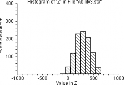

---
resampling_with:
    ed2_fname: 27-Chap-23
jupyter:
  jupytext:
    notebook_metadata_filter: all,-language_info
    split_at_heading: true
    text_representation:
      extension: .Rmd
      format_name: rmarkdown
      format_version: '1.2'
      jupytext_version: 1.14.6
  kernelspec:
    display_name: Python 3 (ipykernel)
    language: python
    name: python3
---

```{r setup, include=FALSE}
source("_common.R")
```

# Correlation and Causation

## Preview

In this chapter we'll reflect on the basic principles behind resampling in particular, and statistics or probability in
general. One way of approaching this is to ask: *Is there anything that we cannot do with resampling?*
The answer is an emphatic *yes*! In order to be able to sample, the probability distributions to sample
*from* have to be available. There are many situations where they are not. Any time a manager
at a financial institution asks whether a particular client is likely to default, if granted a loan,
it takes you outside the realm of sampling. In this case you'll need to build a probabilistic *model*
that will estimate the *probability of default*.

We'll later explain how to develop models that answer questions like these.

Another, more general question is whether everything one would ever want to know can, in principle, be learned from data.
In this case the answer is not so straightforward. Ultimately, that is a deep philosophical question, touching on the very
foundations of science in general; one we will not pursue.
However, we will consider the limitations we are subject to when available data is limited.

The aim of this chapter is to better understand the limitations of
resampling, or data, in general, and to give an indication of which
approaches are available beyond resampling.

But, first, we need to provide some background.

## An excursion into linear algebra.

:::{.callout-note}
## On solving linear systems of equations.

If you are familiar with the normal equations for solving linear least squares equations, you can safely skip this
section.
:::

Let's set it as our goal to solve any linear system of equations that can be written in matrix form as

$$
A \mathbf{x} = \mathbf{y},
$$
where $A$ is an $m\times n$ matrix, $\mathbf{x}$ is an $n\times 1$ (columns) vector, and $\mathbf{y}$ is an $m\times 1$
(column) vector. Note that we want to find a solution for any such system---there are no conditions other than that the
number of rows of $\mathbf{x}$ must be the same as the number of columns of $A$, and the number of rows of $\mathbf{y}$
must be the same as the number of rows of $A$. Note in particular that $m$ need not equal $n$, and if $m=n$ we don't
require that the determinant of $A$ be non-zero. Let's consider examples of typical situations that arise,
with emphasis on the second example.


1.  The first example represents all systems of equations where $m=n$ with non-zero determinant. In all these cases the equation is *solvable* by perhaps using
    Gaussian elimination with partial pivoting. (Not Cramer's rule!)
    $$ x = 1.$$
    This equation is so trivial that we almost don't recognize it as an equation. In this case $A = [1]$, i.e.
    a $1\times 1$ matrix, $\mathbf{x} = 1$ and $\mathbf{y} = 1$.
2. The second example, and the one we are primarily interested in, represents all overdetermined systems of
   linear equations, i.e. systems of equations where we have more equations than unknowns,
    \begin{eqnarray*}
    x &=& 1\\
    x &=& 1.1\\
    x &=& 1.2.
    \end{eqnarray*}
    This system clearly has a problem - $x$ cannot simultaneously equal 1, 1.1, and 1.2. The system has no solution (!)---at least
    not in the ordinary sense. It turns out that this system is of the form of our generic systems of equations. We see
    this by rewriting it in matrix form,

   $$
    \left[
    \begin{array}{c}
    1\\1\\1
    \end{array}
    \right]
    x = \left[
    \begin{array}{c}
    1.0\\1.1\\1.2
    \end{array}
    \right].
    $$
    This equation represents all equations where there are more equations than unknowns, i.e. all *over determined* systems.
    Since this system cannot be solved, we look
    instead for a solution that best fits the system in a sense that we'll explain later. Please take our word for it, for now,
     that the solution is given by the *normal equations*,
    $$
    A^T A \mathbf{x} = A^T \mathbf{y}.
    $$
    Here $A^T$ is the transpose of $A$, $A^TA$ is an $n\times n$, square, symmetrid matrix and $A^T \mathbf{y}$ is an $n\times 1$ (column)
    vector. Moreover, if the columns of $A$ are linearly independent, it can be shown that $A^TA$ has an inverse,
    a situation that is almost always true.

    Before we continue with the example let's point out that this situation is common in practice. When Worsely measured the
    height of the sun above the horizon 10 times, and got 10 different answers, he was in exactly this position. Recall
    that he took the expedient to calculate the mean of his observations. Let's calculate the solution of our system
    above using the normal equations,

    $$
    \left[ \begin{array}{ccc}
    1 & 1 & 1 \end{array} \right]
    \left[
    \begin{array}{c}
    1\\1\\1
    \end{array}
    \right]
    x = \left[ \begin{array}{ccc}
    1 & 1 & 1 \end{array} \right]
    \left[
    \begin{array}{c}
    1\\1\\1
    \end{array}
    \right]
    \left[
    \begin{array}{c}
    1.0\\1.1\\1.2
    \end{array}
    \right].
    $$
    Multiplying out we get

    $$
     3 x = 1.0+1.1+1.2,
    $$
    or
    $$ x = \frac{1.0+1.1+1.2}{3}.$$
    This is simply the mean of the 'measurements', exactly what Worsely used!
3. This example represents all systems of equations where we have an infinite number of solutions.
    $$
    x + y = 1.
    $$
    In contrast with the previous system of equations that did not have any solutions in the strict sense, this one suffers
    from the opposite problem—it has an infinite number of solutions. Yet it is of the form of our generic system with
    $A = [1\; 1]$, $\mathbf{x} = \left[ \begin{array}{c}x\\y \end{array} \right]$ and $\mathbf{y} = [1]$. The problem now is
    to identify a natural solution among the infinity of available solutions. To find this solution one has to calculate
    the generalized inverse that will take us too far from our core focus. But it turns out that it can again be cast as an
    optimization problem. In this case we are looking for the solution with the smallest norm. For this example it is given by
    $$
    \mathbf{x} = \left[\begin{array}{c} \frac12\\ \frac12\end{array} \right].
    $$
    It should be obvious that this is indeed a solution of the equation. What is more, it is the solution
    that is the closest to the origin, i.e. out of the infinite number of solutions, this is the one with the
    shortest length.


Armed with the normal equations we can explain the linear correlation between variables.

:::{.callout-note}
## Deriving the normal equations.
Let's return to the system of linear equations,

$$
A\mathbf{x} = \mathbf{y},
$$
where $A$ and $\mathbf{y}$ are known and $\mathbf{x}$ is unknown. $A$ is an $m\times n$
matrix with $m>n$ and $\mathbf{y}$ is an $m$-dimensional vector. We therefore have more equations
than unknowns. This means that we don't have a solution for the linear system, just as it is not possible
for $x$ to be simultaneously, $x=1$ and $x=2$. There is no value for $\mathbf{x}$ that will satisfy the system of
equations (unless we are very lucky such as in $x=1$ and $x=1$). We should therefore rather write,
$$
\mathbf{e} = A\mathbf{x} - \mathbf{y}
$$
where $\mathbf{e}$ is the difference between the vector $A\mathbf{x}$ and the given vector $\mathbf{y}$ for a specific
value of $\mathbf{x}$. It means that $\mathbf{e}$ is a functions of $\mathbf{x}$ but we don't indicate it as such
so as not to clutter the notation. Imagine that as we roam through all possible (vector) values for $\mathbf{x}$ how
$A\mathbf{x}$ evaluates to corresponding values. These values differ from the given value of $\mathbf{y}$, sometimes by
a little, sometimes by a lot. Our task is to identify that value of $\mathbf{x}$ that makes the difference between
$A\mathbf{x}$ and $\mathbf{y}$ as small as possible. But small in what sense?

Let's first take a small diversion and investigate what the components of $\mathbf{e}$ are. First we write $A$ in its
row form, that is, we explicitly write down the rows,
$$
A = \left[  \begin{array}{c}
       \mathbf{r}_1^T\\
       \vdots\\
       \mathbf{r}_m^T
           \end{array}
    \right].
$$
Note that we write down the *transpose* of the rows, $\mathbf{r}^T$ and not $\mathbf{r}$. The reason is that the latter
*always*, no exceptions allowes, indicates a *column* vector, and we need to populate the matrix with its rows.

Now we can easily write down
$$
A\mathbf{x} = \left[ \begin{matrix}
       \mathbf{r}_1^T\\
       \vdots\\
       \mathbf{r}_m^T\\
           \end{matrix}
     \right] \mathbf{x}
     =
     \left[ \begin{matrix}
       \mathbf{r}_1^T \mathbf{x}\\
       \vdots\\
       \mathbf{r}_m^T\mathbf{x}\\
           \end{matrix}
     \right],
$$
and
$$
\mathbf{e} = A\mathbf{x}-\mathbf{y} = \left[ \begin{array}{c}
       \mathbf{r}_1^T \mathbf{x}\\
       \vdots\\
       \mathbf{r}_m^T\mathbf{x}\\
           \end{array}
     \right]
     -
     \left[ \begin{array}{c}
       y_1\\
       \vdots\\
       y_m\\
           \end{array}
     \right].
$$
Therefore
$$
\mathbf{e} = \left[ \begin{array}{c}
       e_1\\
       \vdots\\
       e_m\\
           \end{array}
     \right]
     =
     \left[ \begin{array}{c}
       \mathbf{r}_1^T \mathbf{x}\\
       \vdots\\
       \mathbf{r}_m^T\mathbf{x}\\
           \end{array}
     \right]
     -
     \left[ \begin{array}{c}
       y_1\\
       \vdots\\
       y_m\\
           \end{array}
     \right]
     =
     \left[ \begin{array}{c}
       \mathbf{r}_1^T \mathbf{x} - y_1\\
       \vdots\\
       \mathbf{r}_m^T\mathbf{x} - y_m\\
           \end{array}
     \right],
$$
or, more explicitly,

\begin{eqnarray*}
e_1 &=& \mathbf{r}_1^T \mathbf{x} - y1\\
e_2 &=& \mathbf{r}_1^T \mathbf{x} - y2\\
 & \vdots &  .
\end{eqnarray*}

Returning to our question above, we want to identify that value of $\mathbf{x}$ that will minimize the errors,
$e_1, \ldots, e_m$. We are back at the question, minimize in what sense? A generally used measure for the error is,
$$
\mathbf{e}^T\mathbf{e} = e_1^2 + \cdots + e_m^2,
$$
whick is just the sum of the squares of the individual errors. Rewriting this, we find,
$$
\mathbf{e}^T\mathbf{e} = (A\mathbf{x} - \mathbf{y})^T (A\mathbf{x} - \mathbf{y}).
$$
Multiplying this out, gives,
$$
\mathbf{e}^T\mathbf{e} = \mathbf{x}^T A^T A \mathbf{x} -  \mathbf{x}^T A^T \mathbf{y} - \mathbf{y}^T A\mathbf{x} +
\mathbf{y}^T \mathbf{y}.
$$
In order to find the values of $\mathbf{x}$ that will minimize the sum of the squares of the errors, we need to set the
partial derivatives to all the components, $x_1, \ldots, x_n$ in the equation to zero. The detailed calculations are messy
and we enrourage you to work it out for a small, say $2\times 2$ example. The result is the normal equations,
$$
A^T A\mathbf{x} = A^T\mathbf{y}.
$$
:::


## Linear correlation

Later in this chapter, we'll discuss the general correlation or association between variables.  Note that we need
associated or correlated variables in order to do inference. In general terms it means that you can learn something
about one variable by observing the other. The *simplest*  is the linear correlation where the relationship for two variables, $x$ and $y$, is given by

$$ y = ax + b,$$.

Clearly, given $a$ and $b$, we can infer the value of $y$ if we are
given the value of $x$. If $a\not=0$ then we can also infer the value of $x$, given the value of $y$.
In this case, one has an *exact* correlation - there is no doubt about the value of either of the variables,
given the value of the other variable.

In practice things are never this easy—if they were we would not have had any need for statistics of
probability—variables are never exactly correlated. The best we can hope for is, if we know/observe the value of one
 variable, we can calculate an approximate value for the other variable.  The better the correlation between the two variables,
 the more accurate the estimate.

Let's illustrate the ideas by means of an example. For this, we first need to generate data, i.e.
values for $x$ and corresponding values for $y$.

First we import the necessary libraries.


```{python}
import numpy as np
from scipy import stats
from scipy.stats import uniform, pearsonr

from numpy.random import Generator, PCG64

seed = 12311 # This is a random seed so that we can reproduce the results from one run to the next

numpy_randomGen = Generator(PCG64(seed))
scipy_randomGen = uniform
scipy_randomGen.random_state=numpy_randomGen
```
Now we choose random values for $x$ in the interval $(0, 1)$ and corresponding values for $y$ in the
same interval.

```{python}
import numpy as np
from scipy import stats
from scipy.stats import uniform, pearsonr

from numpy.random import Generator, PCG64

seed = 12311 # This is a random seed so that we can reproduce the results from one run to the next

numpy_randomGen = Generator(PCG64(seed))
scipy_randomGen = uniform
scipy_randomGen.random_state=numpy_randomGen

A = 0.33  # The chosen slope of the linear relationship
B = 1.0  # The chosen intercept of the linear relationship
NOISE = 0.1 # This determined the amount of noise we add to the simulation

# Generate 50 random samples for x.
x = scipy_randomGen.rvs(size=50)

# Generate the corresponding values for y.
# Noise is added to ensure that the linear relationship is not exact.
y = A*x + B + NOISE*scipy_randomGen.rvs(size=50)

# Show the relationship
import matplotlib.pyplot as plt
fig, ax = plt.subplots(1, 1)
ax.plot(x, y, '.r')
```
Two questions now arise: Given a value for $x$, what is the estimate for $y$? And,
how good is this estimate? Let's answer the first question first. The data values are clearly clustered
around a straight line. In fact, we have the equation for this line, the one we used to generate the
samples. In practice we don't have the line, only the samples, and we would like to find the line that
best fits the data.

:::{.callout}
## Making assumptions

Let's say we are given only the values for $x$ and corresponding values for $y$, without any knowledge where it came from.
How do we know that we should fit a straight line? The answer is, we don't know. In this simple situation one can plot
the values and from the shape of the plot conclude that there might be a linear relationship. In higher dimensions visualization
becomes increasingly difficult and in that case we need to make assumptions as to the type of model that best describes the
data.

Data analysts spend an inordinate amount of time inspecting their data and trying to learn as much as possible about it.

:::

For every measurement $x_i,\;\; i=1,\ldots,n$ we have a corresponding $y_i,\;\; i=1,\ldots,n$. We are looking
for a linear relationship between the $x_i$ and $y_i$. That is, we are looking for $a$ and $b$ such that
$$
y_i = ax_i + b,\;\; i =1,\ldots, n,
$$
or, if you paid attention, find values of $a$ and $b$ that will best solve the system in the least squares sense.
This is a linear system of $n$ equations in the two unknowns, $a$ and $b$. We are back at example 2 above! We cannot
solve these equations exactly but we can solve them in a least squares sense. Writing the system in
matrix form, gives

$$
\left[ \begin{array}{cc}
x_1 & 1\\
\vdots & \\
x_n & 1
\end{array} \right]
\left[\begin{array}{c}
a\\b \end{array}
\right]
=
\left[ \begin{array}{c} y_1\\ \vdots \\ y_n\end{array} \right].
$$
The normal equations are given by
$$
\left[ \begin{array}{ccc}
x_1 & \cdots & x_n\\
1 & & 1 \end{array} \right]
\left[ \begin{array}{cc}
x_1 & 1\\
\vdots & \\
x_n & 1
\end{array} \right]
\left[\begin{array}{c}
a\\b \end{array}
\right]
=
\left[ \begin{array}{ccc}
x_1 & \cdots & x_n\\
1 & & 1 \end{array} \right]
\left[ \begin{array}{c} y_1\\ \vdots \\ y_n\end{array} \right],
$$
or after multipying,
$$
\left[ \begin{array}{cc}
\sum_i x_i^2 & \sum_i x_i\\
\sum_i x_i & n \end{array}\right]
\left[\begin{array}{c}
a\\b \end{array}
\right]
=
\left[ \begin{array}{c}
\sum_i x_i y_i\\
\sum_i y_i \end{array} \right].
$$
Let's solve these equations for the numerical example above with code and see what we find. The key function is
the `scipy` function `stats.linregress(x,y)`. It gives us the slope and intercept of the best linear fit
of the data.

```{python}
import numpy as np
from scipy import stats
from scipy.stats import uniform

from numpy.random import Generator, PCG64

seed = 12311 # This is a random seed so that we can reproduce the results from one run to the next

numpy_randomGen = Generator(PCG64(seed))
scipy_randomGen = uniform
scipy_randomGen.random_state=numpy_randomGen

A = 0.33  # The chosen slope of the linear relationship
B = 1.0  # The chosen intercept of the linear relationship
NOISE = 0.1 # This determined the amount of noise we add to the simulation

# Generate 50 random samples for x.
x = scipy_randomGen.rvs(size=50)

# Generate the corresponding values for y.
# Noise is added to ensure that the linear relationship is not exact.
y = A*x + B + NOISE*scipy_randomGen.rvs(size=50)

slope, intercept, _, _, _ = stats.linregress(x,y)

print(' slope: ', slope, '\n', 'intercept: ', intercept)

# The coordinates for drawing the best linear fit.
x_fit = np.array([0, 1])
y_fit = slope*x_fit + intercept

import matplotlib.pyplot as plt
fig, ax = plt.subplots(1, 1)
ax.plot(x,y,'.r', x_fit, y_fit, 'b')
plt.show()
```
The Figure shows that we indeed have a good linear fit of the data. Moreover, the slope and intercept
calculated from the data is close to the values we used to produce the data.

Let's now simplify the normal equations and see what we can learn from it. We can always normalize the data
by subtracting the means of both the $x_i$ and the $y_i$ before we proceed with the calculations.
This means that

$$
\sum_i x_i = 0 = \sum_i y_i,
$$
and the normal equations simplify as,

$$
\left[ \begin{array}{cc}
\sum_i x_i^2 & 0\\
0 & n \end{array}\right]
\left[\begin{array}{c}
a\\b \end{array}
\right]
=
\left[ \begin{array}{c}
\sum_i x_i y_i\\
0 \end{array} \right].
$$
This gives us $b=0$. Therefore, if we fit a straight line to the data *after* removal of the means,
the intercept is 0.

Let's do another normalization and divide the data with their standard deviations. Since we know that the
means are 0, the standard deviations $\sigma_x$ and $\sigma_y$ are just the lengths of the data vectors,

$$
\sigma_x^2 = \sum_i x_i^2
$$
and
$$
\sigma_y^2 = \sum_i y_i^2.
$$
The squares of the standard deviations, $\sigma_x^2$ and $\sigma_y^2$ also have special names, namely
the variance.

Now if we assume that we have already subtracted the means and also divided by the standard deviations,
we can set $\sum_i x_i^2 = 1$ in the normal equations. Since we already know that $b=0$, we find that
$$
a = \sum_i x_i y_i.
$$
The right hand side should be familiar from linear algebra - it is the inner product between the two data vectors
$$
\begin{eqnarray*}
\mathbf{x} & = & \left[ \begin{array}{c}
x_1 \\ \vdots \\x_n \end{array} \right]\\
\mathbf{y} & = & \left[ \begin{array}{c}
y_1 \\ \vdots \\y_n \end{array} \right].
\end{eqnarray*}
$$
But we have already normalized the two data vectors so that their respective lengths are 1. Therefore
the inner product equals the cosine of the angle between the two vectors.

We have therefore arrived at an important conclusion:

*If the data of two data vectors are normalized by first subtracting their means and then divide by their
lengths (standard deviations), the slope and intercept of the best linear fit have a special values.
The intercept $b = 0$, i.e. the best linear fit passes through the origin, and the slope equals the cosine of
the angle between the two data vectors.*

Let's reflect on the meaning of the slope. The cosine is a measure of how much the two vectors differ from
one another. If the angle between the two is zero, the cosine is either 1 or -1. If the two vectors are
perpendicular, the two vectors form a right angle and the cosine is 0.

If the cosine of the angle is either +1 or -1 we say that the two datasets are perfectly correlated. In general,
if two dataset are positively correlated ($a>0$(not necessarily perfectly) it means that if the values of one dataset
have an upward trend, the values of the other dataset will also have an upward trend. On the other hand,
if the two datasets are negatively correlated $a<0$ it means that if the values of one dataset have an upward
trend, the other dataset will have a downward trend.

The cosine of the angle between the two datasets is called the *correlation coefficient*. It is also
called *Pearson's* correlation coefficient after Karl Pearson who developed it from ideas proposed by Francis
Galton but,  actually, first formulated by Auguste Bravais about 40 years earlier. We'll stick to calling
it the *correlation coefficient*!

:::{.callout-note}
## The cosine measure.

In machine learning the cosine of the angle between two vectors are commonly used as a measure of how much
the two vectors differ from one another.
:::

The formula for the correlation coefficient between two variables, $x$ and $y$, is given by
$$
r_{xy} = \frac{ \sum_{i=1}^n (x_i - \bar{x})((y_i - \bar{y}) }
         { \sqrt{ \sum_{i=1}^n (x_i - \bar{x})^2} \times \sqrt{ \sum_{i=1}^n (y_i - \bar{y})^2} },
$$
where the means are given by,
$$
\bar{x} = \frac1n\sum_{i=1}^n x_i,
$$
$$
\bar{y} = \frac1n \sum_{i=1}^n y_i.
$$

We'll now put everything together in code.

```{python}
import numpy as np
from scipy import stats
from scipy.stats import uniform, pearsonr

from numpy.random import Generator, PCG64

seed = 12311 # This is a random seed so that we can reproduce the results from one run to the next

numpy_randomGen = Generator(PCG64(seed))
scipy_randomGen = uniform
scipy_randomGen.random_state=numpy_randomGen

A = 0.33  # The chosen slope of the linear relationship
B = 1.0  # The chosen intercept of the linear relationship
NOISE = 0.1 # This determined the amount of noise we add to the simulation

# Generate 50 random samples for x.
x = scipy_randomGen.rvs(size=50)

# Generate the corresponding values for y.
# Noise is added to ensure that the linear relationship is not exact.
y = A*x + B + NOISE*scipy_randomGen.rvs(size=50)

# Normalize the data
# Subtract the means
x = x - np.mean(x)
y = y - np.mean(y)

# Calulate the standard deviation using scipy's tsdt() method and normalize
std_x = stats.tstd(x)
std_y = stats.tstd(y)
x = x/std_x
y = y/std_y


# Calculate the best linear fit
slope, intercept, _, _, _ = stats.linregress(x,y)
x_fit = np.array([-2, 2])
y_fit = slope*x_fit + intercept

# The coordinates for drawing the best linear fit.
x_fit = np.array([-2, 2])
y_fit = slope*x_fit + intercept

# Plot the result
from matplotlib import pyplot as plt
fig, ax = plt.subplots(1, 1)
ax.plot(x,y,'.r', x_fit, y_fit, 'b')

# We are particularly interested in the values of the slope and intersect
# We also want to compare the slope with the correlation coefficient as calculated
corr = pearsonr(x,y) # The correlation coefficient

print(' intercept: ', intercept, '\n', 'slope: ', slope, '\n', 'corr coeff: ', corr.statistic)
```
This is close enough to the theoretical values to convince the most sceptical among us!

### Example: Is Athletic Ability Directly Related to Intelligence? {#sec-athletic-iq-ranks}

Question: **Is there a correlation between the two variables?**

A scientist often wants to know whether or not two characteristics go together,
that is, whether or not they are correlated (that is, related or associated).
For example, do youths with high athletic ability tend to also have high I.Q.s?

:::{.callout-note}
## The data.

This data is clearly hypothetical and should not be used to draw any important conclusions. For one, it is a very small
dataset. For larger datasets it might well be that the scores follow a different distribution.
:::

Hypothetical physical-education scores of a group of ten high-school boys are
shown in @tbl-physical-mental, ordered from high to low, along with the I.Q.
score for each boy. The ranks for each student's athletic and I.Q. scores are
then shown in the third and fourth columns:

|  Athletic Score    | I.Q. Score     | Athletic Rank     | I.Q.Rank     |
|--------------------|----------------|-------------------|--------------|
| 97                 | 114            | 1                 | 3            |
| 94                 | 120            | 2                 | 1            |
| 93                 | 107            | 3                 | 7            |
| 90                 | 113            | 4                 | 4            |
| 87                 | 118            | 5                 | 2            |
| 86                 | 101            | 6                 | 8            |
| 86                 | 109            | 7                 | 6            |
| 85                 | 110            | 8                 | 5            |
| 81                 | 100            | 9                 | 9            |
| 76                 | 99             | 10                | 10           |

: Hypothetical athletic and I.Q. scores for high school boys {#tbl-physical-mental}

From a casual inspection of the Athletic scores and the I.Q. scores it appears as if there is indeed a correlation or
association. But we don't need to guess, we can calculated the correlation coefficient.

```{python}
import numpy as np
from scipy.stats import pearsonr

athl_score = np.array([
97, 94, 93, 90, 87, 86, 86, 85, 81, 76
])
iq_score = np.array([
114, 120, 107, 113, 118, 101, 109, 110, 100, 99
])

corr = pearsonr(athl_score, iq_score)
print('correlation: ', corr.statistic)
```
The correlation coefficient indicates that there *might*  be a  (positive) correlation between athletic
ability and I.Q. The reason for the cautionary note is that this is a tiny sample and there might be many other reasons
for the relationship, such as recruitment policy, etc.

This brings us naturally to a discussion of causality: Accepting that there is a positive correlation between the two
variables, does it mean that a higher I.Q. *causes* higher athletic ability, or is it perhaps the other way round?

## Causality

Before commencing on a discussion of causality proper, let's summarize what we have just learned. Our discussion above
centered around *linear correlation*. We developed the notion of the *correlation coefficient* which is a measure of
how well two variables are *linearly* correlated. The question then arises what about more general associations between
variables, such nonlinear relationships between variables? In that case, linear correlation has nothing to contribute as
an example will shortly make clear.
If there is a nonlinear association between variables it need not show up as a linear correlation.

Then there is the matter of statistical dependence or independence. Intuitively, two variables are statistically
independent if knowledge about one variable does not tell us anything about the other variable. Here a formula makes it
clear. $x$ and $y$ are statistically independent if
$$
P(x | y) = P(x).
$$
This means that the probability distribution of $x$ remains the same, no matter what the value of $y$ might be. One cannot
do inference given statistically independent variables.

Are variables that are statistically independent, linearly uncorrelated? The answer is, yes, because there is no
association between the variables, linear or nonlinear. On the other hand, variables that are statistically dependent,
need not be  linearly correlated - there might be a nonlinear relationship between the variables,
that is linearly uncorrelated. Let's turn to an example.

```{python}
import numpy as np
from scipy import stats
from scipy.stats import uniform, pearsonr

from numpy.random import Generator, PCG64

seed = 12311 # This is a random seed so that we can reproduce the results from one run to the next

numpy_randomGen = Generator(PCG64(seed))
scipy_randomGen = uniform
scipy_randomGen.random_state=numpy_randomGen

NOISE = 0.1 # This determined the amount of noise we add to the simulation

# Generate data
t = np.linspace(0, 2*np.pi, 101)
x = np.cos(t) + NOISE*scipy_randomGen.rvs(size=101)
y = np.sin(t) + NOISE*scipy_randomGen.rvs(size=101)

slope, intercept, _, _, _ = stats.linregress(x,y)

print(' slope: ', slope, '\n', 'intercept: ', intercept)

# The coordinates for drawing the best linear fit.
x_fit = np.array([-1.1, 1.1])
y_fit = slope*x_fit + intercept

import matplotlib.pyplot as plt
fig, ax = plt.subplots(1, 1)
ax.plot(x,y,'.r', x_fit, y_fit, 'b')

# The correlation coefficient
corr = pearsonr(x, y)
print('corr coeff: ', corr.statistic)

```
Although we can clearly learn much about the value of $y$, given the  value of $x$, the correlation coefficient is tiny
and gives no hint of the strong association between the two variables. This example shows us that looking for
*linear* associations do us no good if we are dealing with nonlinear associations. In practice of course, the most
interesting associations are nonlinear, requiring techniques that are able to uncover these relationships. That is
exactly what the huge breakthroughs since about 2012 deep neural networks achieved. You can think of the
different (nonlinear) layers of a deep neural network as a nonlinear transformation of the data into a linear
relationship. Once we have that, we can apply our linear techniques.

In statistics, everything used to be about *inference*, based on the association between variables. The goal was to
extract the maximum amount of information possible from the data. To give an idea of just how wildly successful this
program has been, one has only to refer to the thoroughly impressive generative methods, such as ChatGPT, that are solely
based on data. So successful has this been that it is becoming increasingly difficult to distinguish between the
generative model and a human response. At first sight it would appear as if we have arrived at true machine intelligence.
But appearances can be misleading, and humans are gullible. One should not mistake a huge, perfect memory with intelligence
or understanding. The generative model is just as likely to repeat the latest conspiracy theory as providing useful advice.
Granted, this depends on the prevalence of data in specific fields. In some areas conspiracy theories are more prevalent
than the genuine article, in which case the generative model is more likely to regurgitate nonsense.
We don't mean to disparage generative models - their achievements are spectacular. And there is no doubt that it will change
the general landscape in significant ways. To quote a lost author (sadly lost to me), it is not hard to envisage a future
where the principle task of the programmer will be to adapt a generative model to specific situations. Something like,
get rid of your conspiracy theories, in this application they are not useful or wellcome!

What lies beyond data, what are the questions we cannot answer from data?

### Example: A statistical view.

Many years ago a statistician friend of mine made the comment that we know that the sun will rise tomorrow morning
because we have watched it rise for thousands, if not millions, of years. As a budding applied mathematician who knew
about gravity, the elliptic orbits of the planets and things like that, the comment was bothersome. Apart from the fact
that it probably reflected a specific philosophical view of the nature of science, I was hard-pressed to find an adequate
response. Because, isn't science just about observation, developing models to fit the facts, to be discarded when it comes into
conflict with the facts and replaced with another ephemeral model?

Today my response will perhaps be along the lines of, there is a reason, beyond the observations, why the sun rises
every morning. And if we ignore the reasons, we loose understanding, and the benefits that go with it.

With data there *must* be a reason as to *why* we observe what we observe. If there is no reason, no coherent mechanism that
that produces the data, there is little if anything the data can tell us. Of course, the mechanism is often too
complex to understand in any useful way in which case we have no choice but to learn as much as we can from the
data. But that inevitably limits our understanding.

:::{.callout}
## The exceptions

In exceptional cases, investigations of data suggested certain patterns that led to the discovery of the fundamental
principles behind the data. It means we should keep on asking *why*?
:::

It does sounds odd, though, that one should discard hard-earned knowledge and submit to the limitations of data. Our
understanding of gravity, that earth revolves around the sun and spins on its own axis, did not come without a considerable
effort, and price. Just ask Copernicus or Galileo. No reason to pretend that we can ignore it in favour of data!

There are situations where we cannot learn anything meaningful from data, where the information required to answer a
specific, isn't in the data.

The next example should make this clear.

### Example: A shoe sale.

A potential client approached our company asking for a model that will optimize their profit putting their unsold shoes
on sale at season's end. The problem is clear: If they give the shoes away, they will get rid of them but without any profit.
If they charge too much, they won't sell any and will be left with a lot of surplus shoes, and still no profit. Our sales people
said sure, just give us your historical data as far back as you can of prices versus sales. Our clever technical experts will
develop a model in no time. Wrong! The clever technical experts had no idea how to approach this problem. Fortunately they could
refer their sales people to The Book of Why, where Judea Pearl and Dana Mackenzie wrote, *Many scientists have been quite
traumatized to learn that none of the methods they learned in statistics will answer a simple question like "What happens
if we double the price"?* Or, as in our case, half the price.

Note that nothing in the historical data informs us about the outcome of our actions fixing the sales price. Last time
when the price was half
the present price, may have been before inflation (or covid!). Or the competing stores have an even lower or higher
price. The best-known way,  is through (time-consuming, expensive) carefully controlled
experiments. However, there is another way due to the more recent studies into cause-effect relationships - *causality* -
and that is to develop a model of consumer behaviour, including present marketing conditions. The next step is to find
surrogate data that can serve as a proxy for the real thing (see Pearl and Mackenzie). Combining the two -
a consumer behaviour model with surrogate data - allows one to develop a useful model.

### Example: Covid

During the Covid pandemic there was an association between the number of Covid tests that were performed and the number
of positive test cases. The more tests that were performed, the more positive test cases were recorded. Also, an association
was recorded between Covid-related deaths and the number of positive test cases. That did make
a politician too happy - it reflected badly on the administration. So, the politician decided to intervene and stop the
Covid tests. Sure enough the positive test cases dropped to zero. The deaths however, continued.

The politician was therefore right in asserting that there was a causal relationship between the tests and the positive
test cases. However, since, unsurprisingly,
the number of Covid-related deaths did not show any response due to the stopping of the tests there is no causal relationship
- the tests did not cause the Covid-related deaths.

The previous examples are all rooted in *causality* - a concept that was for a long time banned from statistics.
Although most of us have a pretty good idea what is meant by *causality*, a precise definition alludes us; it might be
impossible not to end up in a circular definition.
We'll therefore treat it as a primitive concept that we intuitively understand, much like points or lines in geometry.
In short, we assume that you know what we are talking about when we talk about *causality*.

Let's now look at the keys ideas of causality as illustrated by the previous examples. A very readable and popular introduction by one
of the pioneers of the field is, The Book of Why.

### Association

*Association* is just that, from data we learn that if we observe the value of some variable, we can get a quantitative
estimate of  the value of another, associated, variable. There is no understanding, no explanation of how or why this
might have come about. In order to understand, to explain, to establish causal relationships, one has to understand
the *why* of the observed data. That is, we need to understand the mechanism that produced the data.
Even if it is not in  detail, we need to have some understanding of it.

And to do this, we need to look outside the data.

One cannot explain gravitation by observing at what time the sun rises in the morning. We cannot build
an optimum sales model, based on the historical data of sales.

### Intervention

In order to make any progress beyond learning from data, we have, not only to observe, but also to act, to intervene.
We need to move beyond being a computer that consumes the data we are given, to being human, to take charge. By
*intervention* we mean that we are actively 'turning a knob', and see how that affects the value that we are interested
in. If the active intervention changes the value of the observation, we conclude a causal effect. Turning the knob
*causes* the value to change. If you press down on the accelerator of you car, it goes faster. Your action causes the
increase in speed.

Note that this is quite different from, say, linear regression that might show the relationship between how hard you
press on the accelerator and how fast you go. Given how hard one presses, it is possible to *infer* the speed for that
pressure. However, it is not possible to conclude any causal relationship. For that we need to *understand* the
relationship between force and acceleration.

It is not possible to infer causal relationships from data, mainly due to the presence of *confounders* - the common
cause of two observed variables. We already alluded to it when we examined the  relationship between I.Q.
and athletic ability. One cannot conclude that the one is the cause of the other because of confounders. It is quite
possible that the relationship is caused by the recruitment program - only talented athletes with a high I.Q. are
recruited with the individuals that score high on both abilities the most sought after. There may also be other
confounders.


### Counterfactuals

Pearl calls  this the highest level of causation. At this level one starts to ask questions about situations that have
not been observed, perhaps,  even situations that cannot be observed. One such question, and of particular importance for someone
my age, is, what is my life expectancy? It is really important to know if you will be able to survive after retirement on
your savings. But you have no observations to guide you, nothing that can inform you. By the way,  this question is very
different from the one that insurance companies ask their actuaries to calculate: what is the expected or average
life expectancy of someone  that falls in a specific category, perhaps someone who doesn't smoke or drink excessively,
has no known health issues and does not engage in any high-risk sport, etc. In that case one can use lots of data and
come with an estimate of the expected life
expectancy for different *categories* of the population, all bases on association. For me as individual,
it is meaningless. It is almost guaranteed that I will not meet the life expectancy of my category and there is no way
of finding out how much I'll over- or undershoot. Answering this question will likely be forever beyond our reach. But
there are other examples.

Physicists, among others, ask and answer counterfactual questions all the time. We don't need to observe a particular
planet orbiting a particular star to be able to predict what its position will be a thousand years from now. In this case,
as in many others, a few data points together with a good understanding of the forces involved, provide  us an  answer
of a situation never obseved.

### Summary

"In God we trust. All others [must] have data". This quote by W. E. Deming is the provocative title of one of the chapters in *The Emperor of
All Maladies: A Biography of Cancer* by Siddhartha Mukherjee. There he addresses the question of why the
radical surgery on carcinoma of the breast followed the principle that "the disease, even in its early stage, is such
a formidable enemy that it is my duty to carry out as radical an operation as the ... anatomy permits",  persisted for
so long. Tragically, proponents of radical surgery refused to run clinical trials, perhaps in fear of what the data
would tell them. When trials were eventually run, the results were unambiguous, any surgery beyond local surgery holds
no benefits. And countless number of women were maimed.

This example illustrates both the importance of data, as well as determining causal effects. What, if any, were
the benefits of  radical surgery?

Extracting associations from data is powerful. However, it is also limited - there are questions that cannot be
answered just from the data. The information just isn't always available in the data. Instead of despairing, this author
takes comfort out of it. It means that there are processes that are either hard or impossible to automate. Human ingenuity
is required. Instead of describing, we also have to understand.

The takeaway message is, perhaps, *think* carefully about your data. Try and *understand* as much as is humanly possible
about mechanisms that produced the data.


<!---
## Stuff

At the beginning everything was just about the correlation between variables. Perhaps better to explain
what we mean by this through an example.

Central to commercial banks is the granting of loans to their clients. If they grant a loan that
a client cannot afford to pay back, the bank will loose money. And that is definitely not part of their
business plan. On the other hand, the interest that client pay on their loans is a major source of
income for banks. Banks, therefore, can also not afford to not grant loans. The trick is to assess
the client's ability to pay back a loan. But how do they go about doing this? Without going into any
details of the development of credit risk models, we can make general assertions. First of all, for
every one of their clients, the bank has a client transaction history as well as demographic
information. This can be supplemented by credit bureau data - the data that credit bureaus gather
for all individuals about all their credit transactions. The idea is to use this data to assess
the credit-worthiness of a client. In technical terms, the bank calculates the probability of default
(PD) for a given client, given all the information available for that client. If the  PD is higher than
a default value (set by management, depending on the exposure appetite of the institution), the loan
application will be denied. If it is low enough, the loan will be approved (the amount might be
determined by a second, affordability, model.

The PD model is developed by investigating all loans granted by the bank in the past. Some of them
defaulted, the majority did not. The bank therefore has a database available of the Known Good Bad (KGB)
clients. And for each of these clients the historical and demographic data is
available. If the new client has be assessed, the model determines the extent to
which this client's data is correlated with the KGB clients. If the client's data is strongly
correlated with the known defaulters the loan will be declined.

The model is therefore based on **correlation** - to what extent is the data of the loan applicant
correlated with the data used to train the credit model. At this level, the specifics of the model
is irrelevant, all rely on the correlation between the applicant's data and the KGB data.

This idea is immensely powerful. It allows object recognition in images and drives ChatGPT, for example.
In fact, this idea is so powerful that everything else was banned from statistics for a very long time.
-->
<!--- Add references to Pearl -->

<!--- By the way, this points to one of the limitations of a sampling approach.>


<!---
## Preview

The correlation (speaking in a loose way for now) between two variables
measures the strength of the relationship between them. A positive "linear"
correlation between two variables x and y implies that high values of x are
associated with high values of y, and that low values of x are associated with
low values of y. A negative correlation implies the opposite; high values of x
are associated with *low* values of y. By definition a "correlation
coefficient" close to zero indicates little or no linear relationship between
two variables; correlation coefficients close to 1 and -1 denote a strong
positive or negative relationship. We will generally use a simpler measure of
correlation than the correlation coefficient, however.

One way to measure correlation with the resampling method is to rank both
variables from highest to lowest, and investigate how often in
randomly-generated samples the rankings of the two variables are as close to
each other as the rankings in the observed variables. A better approach,
because it uses more of the quantitative information contained in the data
though it requires more computation, is to multiply the values for the
corresponding pairs of values for the two variables, and compare the sum of the
resulting products to the analogous sum for randomly-generated pairs of the
observed variable values. The last section of the chapter shows how the
strength of a relationship can be determined when the data are counted, rather
than measured. First comes some discussion of the philosophical issues involved
in correlation and causation.

## Introduction to correlation and causation

The questions in examples @sec-birthday-problem to @sec-fifteen-bridge have
been stated in the following form: Does the independent variable (say,
irradiation; or type of pig ration) have an effect upon the dependent variable
(say, sex of fruit flies; or weight gain of pigs)? This is another way to state
the following question: Is there a *causal relationship* between the
independent variable(s) and the dependent variable? ("Independent" or "control"
is the name we give to the variable(s) the researcher believes is (are)
responsible for changes in the other variable, which we call the "dependent" or
"response" variable.)

A causal relationship cannot be defined perfectly neatly. Even an experiment
does not determine perfectly whether a relationship deserves to be called
"causal" because, among other reasons, the independent variable may not be
clear-cut. For example, even if cigarette smoking experimentally produces
cancer in rats, it might be the paper and not the tobacco that causes the
cancer. Or consider the fabled gentlemen who got experimentally drunk on
bourbon and soda on Monday night, scotch and soda on Tuesday night, and brandy
and soda on Wednesday night — and stayed sober Thursday night by drinking
nothing. With a vast inductive leap of scientific imagination, they treated
their experience as an empirical demonstration that soda, the common element
each evening, was the cause of the inebriated state they had experienced.
Notice that their deduction was perfectly sound, given only the recent evidence
they had. Other knowledge of the world is necessary to set them straight. That
is, even in a controlled experiment there is often no way except subject-matter
knowledge to avoid erroneous conclusions about causality. Nothing except
substantive knowledge or scientific intuition would have led them to the
recognition that it is the alcohol rather than the soda that made them drunk,
*as long as they always took soda with their drinks* . And no statistical
procedure can suggest to them that they ought to experiment with the presence
and absence of soda. If this is true for an experiment, it must also be true
for an uncontrolled study.

Here are some tests that a relationship usually must pass to be called causal.
That is, a working definition of a particular causal relationship is expressed
in a statement that has these important characteristics:

1.  It is an association that is strong enough so that the observer
    believes it to have a predictive (explanatory) power great enough to
    be scientifically useful or interesting. For example, he is not
    likely to say that wearing glasses causes (or is a cause of) auto
    accidents if the observed correlation is .07, even if the sample is
    large enough to make the correlation statistically significant. In
    other words, unimportant relationships are not likely to be labeled
    causal.

    Various observers may well differ in judging whether or not an
    association is strong enough to be important and therefore "causal."
    And the particular field in which the observer works may affect this
    judgment. This is an indication that whether or not a relationship
    is dubbed "causal" involves a good deal of human judgment and is
    subject to dispute.
2.  The "side conditions" must be sufficiently *few* and sufficiently
    observable so that the relationship will apply under a wide enough
    range of conditions to be considered useful or interesting. In other
    words, *the relationship must not require too many "if"s, "and"s,
    and "but"s in order to hold* . For example, one might say that an
    increase in income caused an increase in the birth rate if this
    relationship were observed everywhere. But, if the relationship were
    found to hold only in developed countries, among the educated
    classes, and among the higher-income groups, then it would be less
    likely to be called "causal" — even if the correlation were
    extremely high once the specified conditions had been met. A similar
    example can be made of the relationship between income and
    happiness.
3.  For a relationship to be called "causal," there should be sound
    reason to believe that, even if the control variable were not the
    "real" cause (and it never is), other relevant "hidden" and "real"
    cause variables must also change *consistently* with changes in the
    control variables. That is, a variable being manipulated may
    reasonably be called "causal" if the real variable for which it is
    believed to be a proxy must always be tied intimately to it.
    (Between two variables, v and w, v may be said to be the "more real"
    cause and *w* a "spurious" cause, if *v* and *w* require the same
    side conditions, except that *v* does not require *w* as a side
    condition.) This third criterion (non-spuriousness) is of particular
    importance to policy makers. The difference between it and the
    previous criterion for side conditions is that a plenitude of very
    restrictive side conditions may take the relationship out of the
    class of causal relationships, *even though the effects of the side
    conditions are known* . This criterion of nonspuriousness concerns
    variables that are as yet *unknown and unevaluated* but that have a
    *possible* ability to *upset* the observed association.

    Examples of spurious relationships and hidden-third-factor causation
    are commonplace. For a single example, toy sales rise in December.
    There is no danger in saying that December causes an increase in toy
    sales, even though it is "really" Christmas that causes the
    increase, because Christmas and December practically always
    accompany each other.

    Belief that the relationship is not spurious is increased if *many*
    likely variables have been investigated and none removes the
    relationship. This is further demonstration that the test of whether
    or not an association should be called "causal" cannot be a logical
    one; there is no way that one can express in symbolic logic the fact
    that many other variables have been tried without changing the
    relationship in question.
4.  The more tightly a relationship is bound into (that is, deduced
    from, compatible with, and logically connected to) a general
    framework of theory, the stronger is its claim to be called
    "causal." For an economics example, observed positive relationships
    between the interest rate and business investment and between
    profits and investment are more likely to be called "causal" than is
    the relationship between liquid assets and investment. This is so
    because the first two statements can be deduced from classical price
    theory, whereas the third statement cannot. Connection to a
    theoretical framework provides support for belief that the side
    conditions necessary for the statement to hold true are not
    restrictive and that the likelihood of spurious correlation is not
    great; because a statement is logically connected to the rest of the
    system, the statement tends to stand or fall as the rest of the
    system stands or falls. And, because the rest of the system of
    economic theory has, over a long period of time and in a wide
    variety of tests, been shown to have predictive power, a statement
    connected with it is cloaked in this mantle.

The social sciences other than economics do not have such well-developed bodies
of deductive theory, and therefore this criterion of causality does not weigh
as heavily in sociology, for instance, as in economics. Rather, the other
social sciences seem to substitute a weaker and more general criterion, that
is, whether or not the statement of the relationship is accompanied by other
statements that seem to "explain" the "mechanism" by which the relationship
operates. Consider, for example, the relationship between the phases of the
moon and the suicide rate. The reason that sociologists do not call it causal
is that there are no auxiliary propositions that explain the relationship and
describe an operative mechanism. On the other hand, the relationship between
broken homes and juvenile delinquency is often referred to as "causal," in
large part because a large body of psychoanalytic theory serves to explain why
a child raised without one or the other parent, or in the presence of parental
strife, should not adjust readily.

Furthermore, one can never decide with perfect certainty whether in any *given*
situation one variable "causes" a particular change in another variable. At
best, given your particular purposes in investigating a phenomena, you may be
safe in judging that very likely there is causal influence.

In brief, it is correct to say (as it is so often said) that correlation does
not prove causation — if we add the word "completely" to make it "correlation
does not *completely* prove causation." On the other hand, causation can
*never* be "proven" *completely* by correlation *or any other* tool or set of
tools, including experimentation. The best we can do is make informed judgments
about whether to call a relationship causal.

It is clear, however, that in any situation where we are interested in the
possibility of causation, we must *at least* know whether there is a
relationship (correlation) between the variables of interest; the existence of
a relationship is necessary for a relationship to be judged causal even if it
is not sufficient to receive the causal label. And in other situations where we
are not even interested in causality, but rather simply want to predict events
or understand the structure of a system, we may be interested in the existence
of relationships quite apart from questions about causations. Therefore our
next set of problems deals with the probability of there being a relationship
between two measured variables, variables that can take on any values (say, the
values on a test of athletic scores) rather than just two values (say, whether
or not there has been irradiation.)[^see-simon]

[^see-simon]: For a much fuller discussion on causality and causation, see
   Simon and Burstein [-@simon1985basic].

Another way to think about such problems is to ask whether two variables are
*independent* of each other — that is, whether you know anything about the
value of one variable if you know the value of the other in a particular case —
or whether they are not independent but rather are related.

## A Note on Association Compared to Testing a Hypothesis

Problems in which we investigate a) whether there is an *association* , versus
b) whether there is a *difference* between just two groups, often look very
similar, especially when the data constitute a 2-by-2 table. There is this
important difference between the two types of analysis, however: Questions
about *association* refer to *variables* — say weight and age — and it never
makes sense to ask whether there is a difference between variables (except when
asking whether they measure the same quantity). Questions about *similarity or
difference* refer to *groups of individuals* , and in such a situation it does
make sense to ask whether or not two groups are observably different from each
other.

### Example: Is Athletic Ability Directly Related to Intelligence? {#sec-athletic-iq-ranks}

Question: **Is there correlation between two variables or are they
independent?**

A scientist often wants to know whether or not two characteristics go together,
that is, whether or not they are correlated (that is, related or associated).
For example, do youths with high athletic ability tend to also have high I.Q.s?

Hypothetical physical-education scores of a group of ten high-school boys are
shown in @tbl-physical-mental, ordered from high to low, along with the I.Q.
score for each boy. The ranks for each student's athletic and I.Q. scores are
then shown in the third and fourth columns:

|  Athletic Score    | I.Q. Score     | Athletic Rank     | I.Q.Rank     |
|--------------------|----------------|-------------------|--------------|
| 97                 | 114            | 1                 | 3            |
| 94                 | 120            | 2                 | 1            |
| 93                 | 107            | 3                 | 7            |
| 90                 | 113            | 4                 | 4            |
| 87                 | 118            | 5                 | 2            |
| 86                 | 101            | 6                 | 8            |
| 86                 | 109            | 7                 | 6            |
| 85                 | 110            | 8                 | 5            |
| 81                 | 100            | 9                 | 9            |
| 76                 | 99             | 10                | 10           |

: Hypothetical athletic and i.q. scores for high school boys {#tbl-physical-mental}

We want to know whether a high score on athletic ability tends to be found
along with a high I.Q. score more often than would be expected by chance.
Therefore, our strategy is to see how often high scores on *both* variables are
found by chance. We do this by disassociating the two variables and making two
separate and independent universes, one composed of the athletic scores and
another of the I.Q. scores. Then we draw pairs of observations from the two
universes at random, and compare the experimental patterns that occur by chance
to what actually is observed to occur in the world.

The first testing scheme we shall use is similar to our first approach to the
pig rations — splitting the results into just "highs" and "lows." We take ten
cards, one of each denomination from "ace" to "10," shuffle, and deal five
cards to correspond to the first five athletic ranks. The face values then
correspond to the I.Q. ranks. Under the benchmark hypothesis the athletic ranks
will not be associated with the I.Q. ranks. Add the face values in the first
five cards in each trial; the first hand includes 2, 4, 5, 6, and 9, so the sum
is 26. Record, shuffle, and repeat perhaps ten times. Then compare the random
results to the sum of the observed ranks of the five top athletes, which equals
17.

The following steps describe a slightly different procedure than that just
described, because this one may be easier to understand:

* **Step 1.** Convert the athletic and I.Q. scores to ranks. Then constitute a
  universe of spades, "ace" to "10," to correspond to the athletic ranks, and a
  universe of hearts, "ace" to "10," to correspond to the IQ ranks.
* **Step 2.** Deal out the well-shuffled cards into pairs, each pair with an
  athletic score and an I.Q. score.
* **Step 3.** Locate the cards with the top five athletic ranks, and add the
  I.Q. rank scores on their paired cards. Compare this sum to the observed sum
  of 17. If 17 or less, indicate "yes," otherwise "no." (Why do we use "17 or
  less" rather than "less than 17"? Because we are asking the probability of a
  score *this low or lower*.)
* **Step 4.** Repeat steps 2 and 3 ten times.
* **Step 5.** Calculate the proportion "yes." This estimates the probability
  sought.

:::{.callout-note}
## Sum of the top ranks and the difference in sums

Notice that we could also find the sum of the IQ ranks for the *top* five
athletes, as above, and then *subtract* the sum of the *bottom* five.  The
result will be negative if the athletes have lower-numbered (higher) IQ ranks
on average, and positive otherwise. But gives us no more information than the
sum of the top five.  The sum of all the ranks ($1 + 2 + ... + 10$) is $55$.
Say we find the sum of the top five ranks is 18, then the sum of the bottom
five ranks must be $55 - 18 = 37$, and the subtraction of the two is $18
- (55 - 18) = 18 * 2 - 55 = -19$.  In general, for any sum of the top five
ranks $T$, the sum of the bottom five ranks $B$ is $55 - T$, and the difference
is $T - B = T - (55 - T) = T * 2 - 55$. So, if the top-five sum $T$ is smaller,
the difference between $T - B$ will also be more negative. Put another way, if
we know the sum of the top five ranks $T$ is 18, we also know the difference is
$2 * 18 = 55 = -19$, when $T = 19$, the difference $T - B$ is $2 * 19 - 15 =
-17$, when $T = 20$,  $T - B = -15$ and so on.
:::

In @tbl-ability-trials we see that the observed sum (17) is lower than the sum
of the top 5 ranks in all but one (shown in bold) of the ten random
trials (trial 5), which suggests that there is a good chance (9 in 10) that the
five best athletes will not have I.Q. scores that high by chance. But it might
be well to deal some more to get a more reliable average. We add thirty hands,
and thirty-nine of the total forty hands exceed the observed rank value, so the
probability that the observed correlation of athletic and I.Q. scores would
occur by chance is about .025. In other words, if there is no real association
between the variables, the probability that the top 5 ranks would sum to a
number this low or lower is only 1 in 40, and it therefore seems reasonable to
believe that high athletic ability tends to accompany a high I.Q.

| Trial     |  Sum of IQ Ranks    | <= observed (17) |
|-----------|---------------------|------------------|
| 1         | 26                  | No               |
| 2         | 23                  | No               |
| 3         | 22                  | No               |
| 4         | 37                  | No               |
| **5**     | **16**              | **Yes**          |
| 6         | 22                  | No               |
| 7         | 22                  | No               |
| 8         | 28                  | No               |
| 9         | 38                  | No               |
| 10        | 22                  | No               |
| 11        | 35                  | No               |
| 12        | 36                  | No               |
| 13        | 31                  | No               |
| 14        | 29                  | No               |
| 15        | 32                  | No               |
| 16        | 25                  | No               |
| 17        | 25                  | No               |
| 18        | 29                  | No               |
| 19        | 25                  | No               |
| 20        | 22                  | No               |
| 21        | 30                  | No               |
| 22        | 31                  | No               |
| 23        | 35                  | No               |
| 24        | 25                  | No               |
| 25        | 33                  | No               |
| 26        | 30                  | No               |
| 27        | 24                  | No               |
| 28        | 29                  | No               |
| 29        | 30                  | No               |
| 30        | 31                  | No               |
| 31        | 30                  | No               |
| 32        | 21                  | No               |
| 33        | 25                  | No               |
| 34        | 19                  | No               |
| 35        | 29                  | No               |
| 36        | 23                  | No               |
| 37        | 23                  | No               |
| 38        | 34                  | No               |
| 39        | 23                  | No               |
| 40        | 26                  | No               |

: 40 random trials of the problem athletic / IQ problem {#tbl-ability-trials}

In fact we can apply an even simpler procedure to get the same result, by reasoning about the individual trial.

One trial in our procedure is:

* **Step 2.** Deal out the well-shuffled cards into pairs, each pair with an
  athletic score and an I.Q. score.
* **Step 3.** Locate the cards with the top five athletic ranks, and add the
  I.Q. rank scores on their paired cards. Compare this sum to the observed sum
  of 17. If 17 or less, indicate "yes," otherwise "no." (Why do we use "17 or
  less" rather than "less than 17"? Because we are asking the probability of a
  score *this low or lower*.)

Now consider the 5 IQ rank cards.  In the procedure above, we found these by
*first* pairing the athletic ranks and the IQ ranks, *then* selecting the IQ
ranks corresponding to the top 5 athletic ranks.  A little thought may persuade
you, that by doing this, we have have a *random selection of 5 IQ ranks*.  We
got that random selection by pairing, selecting on athletic rank — but the
initial pairing and selection will do nothing other than giving us one
particular set of randomly chosen 5 IQ rank cards.  So we can simplify our
procedure even further by missing out the pairing and selecting by rank steps;
we can just shuffle the IQ rank cards and deal out 5 to be our randomly
selected IQ ranks.

::: {.notebook name="athlete_iq" title="Athletic ability and IQ"}

::: nb-only
Question: **Is there correlation between two variables or are they
independent?**

We answer this by permuting the athletic ability and IQ *ranks*, pairing them,
and seeing if the sum of the IQs ranks (randomly) paired with the top 5 athletic scores, are less than or equal to the observed value of 17.
:::

To simulate this problem in , we first create
 containing the I.Q. rankings of the top 5 students in
athletics. The `sum` of these I.Q. rankings constitutes the observed result to
be tested against randomly-drawn samples. We observe that the actual I.Q.
rankings of the top five athletes sums to 17. The more frequently that the sum
of 5 randomly-generated rankings (out of 10) is as low as this observed number,
the higher is the probability that there is no relationship between athletic
performance and I.Q. based on these data.

First we record the 1 through 10 into  `iq_ranks`. Then we
shuffle the numbers so the rankings are in a random order. Then select the first
5 of these numbers and put them in another , `top_5`, and `sum`
them, putting the result in `top_5_sum`. We repeat this procedure `N = 10000`
times, recording each result in a scorekeeping vector: `z`. Graphing `z`, we get a
histogram that shows us how often our randomly assigned sums are equal to or
below 17.

```{python opts.label="py_ed"}
import numpy as np
rnd = np.random.default_rng()
import matplotlib.pyplot as plt
```

```{python opts.label="py_ed"}
# Number of repeats.
N = 10000
# The IQ ranks, ready for shuffling.
iq_ranks = np.arange(1, 11)  # 1 through 10.
# Scorekeeping array.
z = np.zeros(N)

for i in range(N):
    # Shuffle the ranks.
    shuffled = rnd.permuted(iq_ranks)
    # Take the first 5 ranks.
    top_5 = shuffled[:5]
    # Sum those ranks.
    top_5_sum = np.sum(top_5)
    # Keep track of the result of each trial.
    z[i] = top_5_sum
    # End the experiment, go back and repeat.

# Produce a histogram of trial results.
# Make the bins be the integers from 10 through 45.
plt.hist(z, bins=np.arange(10, 46))
plt.title('Sums of 5 ranks selected at random');
```

```{r opts.label="py_ed"}
# Number of repeats.
N <- 10000
# The IQ ranks, ready for shuffling.
iq_ranks <- 1:10  # 1 through 10.
# Scorekeeping array.
z <- numeric(N)

for (i in 1:N) {
    # Shuffle the ranks.
    shuffled <- sample(iq_ranks)
    # Take the first 5 ranks.
    top_5 <- shuffled[1:5]
    # Sum those ranks.
    top_5_sum <- sum(top_5)
    # Keep track of the result of each trial.
    z[i] <- top_5_sum
    # End the experiment, go back and repeat.
}

# Produce a histogram of trial results.
# Make the bins be the integers from 10 through 45.
hist(z, breaks=10:45, main='Sums of 5 ranks selected at random')
```

```{r echo=FALSE, eval=TRUE}
le_pct <- round(sum(get_var('z') <= 17) / get_var('N') * 100)
```

We see that in only about `r le_pct`% of the trials did random selection of
ranks produce a total of 17 or lower.  can calculate this for
us directly:

```{python}
# Determine how many trials produced sums of ranks <= 17 by chance.
k = np.sum(z <= 17)
# The proportion.
kk = k / N
# Show the result
kk
```

```{r}
# Determine how many trials produced sums of ranks <= 17 by chance.
k <- sum(z <= 17)
# The proportion.
kk <- k / N
# Show the result
kk
```

Why do we sum the ranks of the first *five* athletes rather than taking the sum
of the top three, say? Indeed, we could have looked at the top three, two,
four, or even six or seven. The first reason for splitting the group in half is
that an even split uses the available information more fully, and therefore we
obtain greater efficiency. (I cannot prove this formally here, but perhaps it
makes intuitive sense to you.) A second reason is that getting into the habit
of always looking at an even split reduces the chances that you will pick and
choose in such a manner as to fool yourself. For example, if the I.Q. ranks of
the top five athletes were 3, 2, 1, 10, and 9, we would be deceiving ourselves
if, after looking the data over, we drew the line between athletes 3 and 4.
(More generally, choosing an appropriate measure before examining the data will
help you avoid fooling yourself in such matters.)

A simpler but less efficient approach to this same problem is to classify the
top-half athletes by whether or not they were also in the top half of the I.Q.
scores. Of the first five athletes actually observed, *four* were in the top
five I.Q. scores. We can then shuffle five black and five red cards and see how
often four or more (that is, four or five) blacks come up with the first five
cards. The proportion of times that four or more blacks occurs in the trial is
the probability that an association as strong as that observed might occur by
chance even if there is no association. Table 23-3 shows a proportion of five
trials out of twenty.

In the  program below, we first note that the top 5 athletes
had 4 of the top 5 I.Q. scores. So we constitute the set of 10 IQ rankings
 `a`. We then SHUFFLE A and TAKE 5 I.Q. rankings (out of 10).
We COUNT how many are in the top 5, and keep SCORE of the result. After REPEATing 1000
times, we find out how often we select 4 of the top 5.

```{python opts.label="py_ed"}
# Number of repeats.
N = 10000
# The IQ ranks, ready for shuffling.
iq_ranks = np.arange(1, 11)  # 1 through 10.
# Scorekeeping array.
z = np.zeros(N)

for i in range(N):
    # Shuffle the ranks.
    shuffled = rnd.permuted(iq_ranks)
    # Take the first 5 ranks.
    top_5 = shuffled[:5]
    # Everything up until this point is the same as the code above.
    # Here is the difference.
    # Check whether the selected IQ ranks are in the top 5.
    are_top = top_5 <= 5
    # Count how many were in the top 5
    n_are_top = np.sum(are_top)
    # Keep track of the result of each trial.
    z[i] = n_are_top
    # End the experiment, go back and repeat.

# Determine how many trials produced 4 or more top ranks by chance.
k = np.sum(z >= 4)
#  Convert to a proportion.
kk = k / N
# Show the result.
kk
```

```{r opts.label="py_ed"}
# Number of repeats.
N <- 10000
# The IQ ranks, ready for shuffling.
iq_ranks <- 1:10  # 1 through 10.
# Scorekeeping array.
z <- numeric(N)

for (i in 1:N) {
    # Shuffle the ranks.
    shuffled <- sample(iq_ranks)
    # Take the first 5 ranks.
    top_5 <- shuffled[1:5]
    # Everything up until this point is the same as the code above.
    # Here is the difference.
    # Check whether the selected IQ ranks are in the top 5.
    are_top <- top_5 <= 5
    # Count how many were in the top 5
    n_are_top <- sum(are_top)
    # Keep track of the result of each trial.
    z[i] <- n_are_top
    # End the experiment, go back and repeat.
}

# Determine how many trials produced 4 or more top ranks by chance.
k = sum(z >= 4)
#  Convert to a proportion.
kk = k / N
# Show the result.
kk
```

Observed Score: 4

  ----------- ----------- ---------------
  **Trial**   **Score**   **Yes or No**
  1           4           Yes
  2           2           No
  3           2           No
  4           2           No
  5           3           No
  6           2           No
  7           4           Yes
  8           3           No
  9           3           No
  10          4           Yes
  11          3           No
  12          1           No
  13          3           No
  14          3           No
  15          4           Yes
  16          3           No
  17          2           No
  18          2           No
  19          2           No
  20          4           Yes
  ----------- ----------- ---------------

: Results of 20 random trials of the top-5 rank counts {#tbl-top-rank-counts}


So far we have proceeded on the theory that if there is *any* relationship
between athletics and I.Q., then the better athletes have higher rather than
lower I.Q. scores. The justification for this assumption is that past research
suggests that it is probably true. But if we had *not* had the benefit of that
past research, we would then have had to proceed somewhat differently; we would
have had to consider the possibility that the top five athletes could have I.Q.
scores either higher *or* lower than those of the other students. The results
of the "two-tail" test would have yielded odds weaker than those we observed.

### Example: Athletic ability and I.Q. a third way

The example in @sec-althletic-iq-ranks investigated the relationship between
I.Q. and athletic score by ranking the two sets of scores. But ranking of
scores loses some efficiency because it uses only an "ordinal" (rank-ordered)
rather than a "cardinal" (measured) scale; the numerical shadings and relative
relationships are lost when we convert to ranks. Therefore let us consider a
test of correlation that uses the original cardinal numerical scores.

First a little background: @fig-hypot_iq_athletic_1 and
@fig-hypot_iq_athletic_2 show two hypothetical cases of very high association
among the I.Q. and athletic scores used in previous examples.
@fig-hypot_iq_athletic_1 indicates that the higher the I.Q. score, the higher
the athletic score. With a boy's athletic score you can thus predict quite well
his I.Q. score by means of a hand-drawn line — or vice versa. The same is true
of @fig-hypot_iq_athletic_2, but in the opposite direction. Notice that even
though athletic score is on the x-axis (horizontal) and I.Q. score is on the
y-axis (vertical), the athletic score does not *cause* the I.Q. score. (It is
an unfortunate deficiency of such diagrams that *some* variable must
arbitrarily be placed on the x-axis, whether you intend to suggest causation or
not.)

```{r fig-hypot_iq_athletic_1, opts.label="svg_fig", fig.cap="Hypothetical Scores for I.Q. and Athletic Ability — 1"}
include_svg('diagrams/hypot_iq_athletic_1.svg')
```

```{r fig-hypot_iq_athletic_2, opts.label="svg_fig", fig.cap="Hypothetical Scores for I.Q. and Athletic Ability — 2"}
include_svg('diagrams/hypot_iq_athletic_2.svg')
```

In @fig-given_iq_athletic, which plots the scores as given in table 23-1 the
prediction of athletic score given I.Q. score, or vice versa, is less clear-cut
than in @fig-hypot_iq_athletic_1. On the basis of @fig-given_iq_athletic alone,
one can say only that there *might* be some association between the two
variables.

```{r fig-given_iq_athletic, opts.label="svg_fig", fig.cap="Given Scores for I.Q. and Athletic Ability"}
include_svg('diagrams/given_iq_athletic.svg')
```

## Correlation: sum of products

Now let us take advantage of a handy property of numbers. The more closely two
sets of numbers match each other in order, the higher the sums of their
products. Consider the following arrays of the numbers 1, 2, and 3:

1 x 1 = 1

2 x 2 = 4 (columns in matching order) 3 x 3 = 9

SUM = 14

1 x 2 = 2

2 x 3 = 6 (columns not in matching order) 3 x 1 = 3

SUM = 11

I will not attempt a mathematical proof, but the reader is encouraged to try
additional combinations to be sure that the highest sum is obtained when the
order of the two columns is the same. Likewise, the lowest sum is obtained when
the two columns are in perfectly opposite order:

1 x 3 = 3

2 x 2 = 4 (columns in opposite order) 3 x 1 = 3

SUM = 10

Consider the cases in Table 23-4 which are chosen to illustrate a
perfect (linear) association between *x* (Column 1) and *y* 1 (Column
2), and also between *x* (Column 1) and *y* 2 (Column 4); the numbers
shown in Columns 3 and 5 are those that would be consistent with perfect
associations. Notice the sum of the multiples of the *x* and *y* values
in the two cases. It is either higher ( *xy* 1) or lower ( *xy* 2) than
for any other possible way of arranging the *y* 's. Any other
arrangement of the *y's* ( *y* 3, in Column 6, for example, chosen at
random), when multiplied by the *x* 's in Column 1, ( *xy* 3), produces
a sum that falls somewhere between the sums of *xy* 1 and *xy* 2, as is
the case with any other set of *y* 3's which is not perfectly correlated
with the *x* 's.

Table 23-5, below, shows that the sum of the products of the *observed*
I.Q. scores multiplied by athletic scores (column 7) is between the sums
that would occur if the I.Q. scores were ranked from best to worst
(column 3) and worst to best (column 5). The extent of correlation
(association) can thus be measured by whether the sum of the multiples
of the observed *x*

and *y* values is relatively much higher or much lower than are sums of
randomly-chosen pairs of *x* and *y* .

Table 23-4

**Comparison of Sums of Multiplications**

  ---------------------------------- ---------------------------------- --------------------- -------- ----------- -------- -----------
  **Strong Positive Relationship**   **Strong Negative Relationship**   **Random Pairings**                                 
  **X**                              **Y1**                             **X\*Y1**             **Y2**   **X\*Y2**   **Y3**   **X\*Y3**
  2                                  2                                  4                     10       20          4        8
  4                                  4                                  16                    8        32          8        32
  6                                  6                                  36                    6        36          6        36
  8                                  8                                  64                    4        48          2        16
  10                                 10                                 100                   2        20          10       100
  SUMS:                                                                 220                            156                  192
  ---------------------------------- ---------------------------------- --------------------- -------- ----------- -------- -----------

 Table 23-5

**Sums of Products: IQ and Athletic Scores**

  -------------- ------------------ -------------- ------------------ -------------- ------------ --------------
  **1**          **2**              **3**          **4**              **5**          **6**        **7**
  **Athletic**   **Hypothetical**   **Col. 1 x**   **Hypothetical**   **Col. 1 x**   **Actual**   **Col. 1 x**
  **Score**      **I.Q.**           **Col.2**      **I.Q.**           **Col. 4**     **I.Q.**     **Col.6**
  97             120                11640          99                 9603           114          11058
  94             118                11092          100                9400           120          11280
  93             114                10602          101                9393           107          9951
  90             113                10170          107                9630           113          10170
  87             110                9570           109                9483           118          10266
  86             109                9374           110                8460           101          8686
  86             107                9202           113                9718           109          9374
  85             101                8585           114                9690           110          9350
  81             100                8100           118                9558           100          8100
  76             99                 7524           120                9120           99           7524
  SUMS:                             95859                             95055                       95759
  -------------- ------------------ -------------- ------------------ -------------- ------------ --------------

3 Cases:

-   Perfect positive correlation (hypothetical); column 3

-   Perfect negative correlation (hypothetical); column 5

-   Observed; column 7

Now we attack the I.Q. and athletic-score problem using the property of
numbers just discussed. First multiply the x and y values of the actual
observations, and sum them to be 95,759 (Table 23-5). Then write the ten
observed I.Q. scores on cards, and assign the cards in random order to
the ten athletes, as shown in column 1 in Table 23-6.

Multiply by the x's, and sum as in Table 23-7. If the I.Q. scores and
athletic scores are *positively associated* , that is, if high I.Q.s and
high athletic scores go together, then the sum of the multiplications
for the observed sample will be higher than for most of the random
trials. (If high I.Q.s go with low athletic scores, the sum of the
multiplications for the observed sample will be *lower* than most of the
random trials.)

Table 23-6

**Random Drawing of I.Q. Scores and Pairing (Randomly) Against Athletic
Scores (20 Trials)**

**Trial Number**

**Athletic 1 2 3 4 5 6 7 8 9 10**

**Score**

  -------------------- -------- -------- -------- -------- -------- -------- -------- -------- -------- --------
  97                   114      109      110      118      107      114      107      120      100      114
  94                   101      113      113      101      118      100      110      109      120      107
  93                   107      118      100      99       120      101      114      99       110      113
  90                   113      101      118      114      101      113      100      118      99       99
  87                   120      100      101      100      110      107      113      114      101      118
  86                   100      110      120      107      113      110      118      101      118      101
  86                   110      107      99       109      100      120      120      113      114      120
  85                   99       99       104      120      99       109      101      107      109      109
  81                   118      120      114      110      114      99       99       100      107      109
  76                   109      114      109      113      109      118      109      110      113      110
  **Trial Number**                                                                                      
  **Athletic Score**   **11**   **12**   **13**   **14**   **15**   **16**   **17**   **18**   **19**   **20**
  97                   109      118      101      109      107      100      99       113      99       110
  94                   101      110      114      118      101      107      114      101      109      113
  93                   120      120      100      120      114      113      100      100      120      100
  90                   110      118      109      110      99       109      107      109      110      99
  87                   100      100      120      99       118      114      110      110      107      101
  86                   118      99       107      100      109      118      113      118      100      118
  86                   99       101      99       101      100      99       101      107      114      120
  85                   107      114      110      114      120      110      120      120      118      100
  81                   114      107      113      113      110      101      109      114      101      100
  76                   113      109      118      107      113      120      118      99       118      107
  -------------------- -------- -------- -------- -------- -------- -------- -------- -------- -------- --------

 Table 23-7

**Results of Sum Products for Above 20 Random Trials**

  ----------- ---------------------------- ----------- ----------------------------
  **Trial**   **Sum of Multiplications**   **Trial**   **Sum of Multiplications**
  1           95,430                       11          95,406
  2           95,426                       12          95,622
  3           95,446                       13          95,250
  4           95,381                       14          95,599
  5           95,542                       15          95,323
  6           95,362                       16          95,308
  7           95,508                       17          95,220
  8           95,590                       18          95,443
  9           95,379                       19          95,421
  10          95,532                       20          95,528
  ----------- ---------------------------- ----------- ----------------------------

More specifically, by the steps:

**Step 1.** Write the ten I.Q. scores on one set of cards, and the ten
athletic scores on another set of cards.

**Step 2.** Pair the I.Q. and athletic-score cards at random. Multiply
the scores in each pair, and add the results of the ten multiplications.

**Step 3.** Subtract the experimental sum in step 2 from the observed
sum, 95,759.

**Step 4.** Repeat steps 2 and 3 twenty times.

**Step 5.** Compute the proportion of trials where the difference is
negative, which estimates the probability that an association as strong
as the observed would occur by chance.

The sums of the multiplications for 20 trials are shown in Table 23-7.
No random-trial sum was as high as the observed sum, which suggests that
the probability of an association this strong happening by chance is so
low as to approach zero. (An empirically-observed probability is never
actually zero.)

This program can be solved particularly easily with RESAMPLING STATS.
The arrays A and B in program "Ability3" list the athletic scores and
the I.Q. scores respectively of 10 "actual" students ordered from
highest to lowest athletic score. We MULTIPLY the corresponding elements
of these arrays and proceed to compare the sum of these multiplications
to the sums of experimental multiplications in which the elements are
selected randomly.

Finally, we COUNT the trials in which the sum of the products of the
randomly-paired athletic and I.Q. scores equals or exceeds the sum of
the products in the observed data.
-->

<!--- Resampling stats file; Matlab syntax closeish -->

<!---
```matlab
' Program file: "correlation_causation_03.rss"

NUMBERS (97 94 93 90 87 86 86 85 81 76) a
' Record athletic scores, highest to lowest.
NUMBERS (114 120 107 113 118 101 109 110 100 99) b
' Record corresponding IQ scores for those students.
MULTIPLY a b c
' Multiply the two sets of scores together.
SUM c d
' Sum the results — the "observed value."
REPEAT 1000
    ' Do 1000 experiments.
    SHUFFLE a e
    ' Shuffle the athletic scores so we can pair them against IQ scores.
    MULTIPLY e b f
    ' Multiply the shuffled athletic scores by the I.Q. scores. (Note that we
    ' could shuffle the I.Q. scores too but it would not achieve any greater
    ' randomization.)
    SUM f j
    ' Sum the randomized multiplications.
    SUBTRACT d j k
    ' Subtract the sum from the sum of the "observed" multiplication.
    SCORE k z
    ' Keep track of the result in z.
END
' End one trial, go back and repeat until 1000 trials are complete.
HISTOGRAM z
' Obtain a histogram of the trial results.
```

**Random Sums of Products**

ATHLETES & IQ SCORES



**observed sum less random sum**

We see that obtaining a chance trial result as great as that observed
was rare. RESAMPLING STATS will calculate this proportion for us:
-->

<!--- Resampling stats file; Matlab syntax closeish -->

<!---
```matlab
' Program file: "ability3.rss"

COUNT z <= 0 k
' Determine in how many trials the random sum of products was less than
' the observed sum of products.
DIVIDE k 1000 kk
' Convert to a proportion.
PRINT kk
' Note: The file "ability3" on the Resampling Stats software disk contains
' this set of commands.
```

**Example 23-3: Correlation Between Adherence to Medication Regime and
Change in Cholesterol**

Efron and Tibshirani [-@efron1993bootstrap, page 72] show data on the extents
to which 164 men a) took the drug prescribed to them (cholostyramine), and b)
showed a decrease in total plasma cholesterol. Table 23-8 shows these values
(note that a positive value in the "decrease in cholesterol" column denotes a
decrease in cholesterol, while a negative value denotes an increase.)

Table 23-8

  ----------- ----------- ----------- -------- ------------
  **Taken**   **Taken**   **Taken**            **Taken**
  0 -5.25     27          -1.50 71    59.50    95 32.50
  0 -7.25     28          23.50 71    14.75    95 70.75
  0 -6.25     29          33.00 72    63.00    95 18.25
  0 11.50     31          4.25 72     0.00     95 76.00
  2 21.00     32          18.75 73    42.00    95 75.75
  2 -23.00    32          8.50 74     41.25    95 78.75
  2 5.75      33          3.25 75     36.25    95 54.75
  3 3.25      33          27.75 76    66.50    95 77.00
  3 8.75      34          30.75 77    61.75    96 68.00
  4 8.75      34          -1.50 77    14.00    96 73.00
  4 -10.25    34          1.00 78     36.00    96 28.75
  7 -10.50    34          7.75 78     39.50    96 26.75
  8 19.75     35          -15.75 81   1.00     96 56.00
  8 -0.50     36          33.50 82    53.50    96 47.50
  8 29.25     36          36.25 84    46.50    96 30.25
  8 36.25     37          5.50 85     51.00    96 21.00
  9 10.75     38          25.50 85    39.00    97 79.00
  9 19.50     41          20.25 87    -0.25    97 69.00
  9 17.25     43          33.25 87    1.00     97 80.00
  10 3.50     45          56.75 87    46.75    97 86.00
  10 11.25    45          4.25 87     11.50    98 54.75
  11 -13.00   47          32.50 87    2.75     98 26.75
  12 24.00    50          54.50 88    48.75    98 80.00
  13 2.50     50          -4.25 89    56.75    98 42.25
  15 3.00     51          42.75 90    29.25    98 6.00
  15 5.50     51          62.75 90    72.50    98 104.75
  16 21.25    52          64.25 91    41.75    98 94.25
  16 29.75    53          30.25 92    48.50    98 41.25
  17 7.50     54          14.75 92    61.25    98 40.25
  18 -16.50   54          47.25 92    29.50    99 51.50
  20 4.50     56          18.00 92    59.75    99 82.75
  20 39.00    57          13.75 93    71.00    99 85.00
  21 -5.75    57          48.75 93    37.75    99 70.00
  21 -21.00   58          43.00 93    41.00    100 92.00
  21 0.25     60          27.75 93    9.75     100 73.75
  22 -10.25   62          44.50 93    53.75    100 54.00
  24 -0.50    64          22.50 94    62.50    100 69.50
  25 -19.00   64          -14.50 94   39.00    100 101.50
  25 15.75    64          -20.75 94   3.25     100 68.00
  26 6.00     67          46.25 94    60.00    100 44.75
  27 10.50    68          39.50 95    113.25   100 86.75
  ----------- ----------- ----------- -------- ------------

**% Prescribed Dosage**

**Decrease in Cholesterol**

**% Prescribed Dosage**

**Decrease in Cholesterol**

**% Prescribed Dosage**

**Decrease in Cholesterol**

**% Prescribed Dosage**

**Decrease in Cholesterol**

The aim is to assess the effect of the compliance on the improvement.
There are two related issues:

1.  What form of regression should be fitted to these data, which we
    address later, and

2.  Is there reason to believe that the relationship is meaningful? That
    is, we wish to ascertain if there is any meaningful correlation
    between the variables — because if there is no relationship between
    the variables, there is no basis for regressing one on the other.
    Sometimes people jump ahead in the latter question to first run the
    regression and then ask whether the regression slope coefficient(s)
    is (are) different than zero, but this usually is not sound
    practice. The sensible way to proceed is first to graph the data to
    see whether there is visible indication of a relationship.

Efron and Tibshirani do this, and they find sufficient intuitive basis
in the graph to continue the analysis. The next step is to investigate
whether a measure of relationship is statistically significant; this we
do as follows (program "inp10"):

1.  Multiply the observed values for each of the 164 participants on the
    independent x variable (cholostyramine — percent of prescribed
    dosage actually taken) and the dependent y variable (cholesterol),
    and sum the results — it's 439,140.

2.  Randomly shuffle the dependent variable y values among the
    participants. The sampling is being done without replacement, though
    an equally good argument could be made for sampling with
    replacement; the results do not differ meaningfully, however,
    because the sample size is so large.

3.  Then multiply these x and y hypothetical values for each of the 164
    participants, sum the results and record.

4.  Repeat steps 2 and 3 perhaps 1000 times.

5.  Determine how often the shuffled sum-of-products exceeds the
    observed value (439,140).

The following program in RESAMPLING STATS provides the solution:

-->

<!--- Resampling stats file; Matlab syntax closeish -->

<!---

```matlab
' Program file: "correlation_causation_05.rss"

READ FILE “inp10” x y
' Data
MULTIPLY x y xy
' Step 1 above
SUM xy xysum
' Note: xysum = 439,140 (4.3914e+05)
REPEAT 1000
    ' Do 1000 simulations (step 4 above)
    SHUFFLE x xrandom
    ' Step 2 above
    MULTIPLY xrandom y xy
    ' Step 3 above
    SUM xy newsum
    ' Step 3 above
    SCORE newsum scrboard
    ' Step 3 above
END
' Step 4 above
COUNT scorboard >=439140 prob
' Step 5 above
PRINT xysum prob
' Result: prob = 0. Interpretation: 1000 simulated random shufflings never
' produced a sum-of-products as high as the observed value. Hence we rule
' out random chance as an explanation for the observed correlation.
```

**Example 23-3: Is There A Relationship Between Drinking Beer And Being
In Favor of Selling Beer?** (Testing for a Relationship Between
Counted-Data Variables.) (Program "Beerpoll")

The data for athletic ability and I.Q. were measured. Therefore, we
could use them in their original "cardinal" form, or we could split them
up into "high" and "low" groups. Often, however, the individual
observations are recorded only as "yes" or "no," which makes it more
difficult to ascertain the existence of a relationship. Consider the
poll responses in Table 23-8 to two public-opinion survey questions: "Do
you drink beer?" and "Are you in favor of local option on the sale of
beer?".[^beer-data]

[^beer-data]: These data are from an example in [@dixon1983introduction, page
    278], in which the problem is tackled conventionally with a chi-square test.

<!---
Page 278 in 4th edition, example 13-5.

The actual numbers are:

Question 2  Beer Yes Beer No
==========  ======== =======
Local Yes   37       20
Local No    15        6
-->

<!---
Table 23-9

**Results of Observed Sample For Problem "Beerpoll"**

  ---------------------------------------------------- ------------------------ -------- -----------
  **Do you favor local option on the sale of beer?**   **Do you drink beer?**            
                                                       **Yes**                  **No**   **Total**
  Favor                                                45                       20       65
  Don't Favor                                          7                        6        13
  Total                                                52                       26       78
  ---------------------------------------------------- ------------------------ -------- -----------

Here is the statistical question: Is a person's opinion on "local
option" related to whether or not he drinks beer? Our resampling
solution begins by noting that there are seventy-eight respondents,
sixty-five of whom approve local option and thirteen of whom do not.
Therefore write "approve" on sixty-five index cards and "not approve" on
thirteen index cards. Now take *another* set of seventy-eight index
cards, preferably of a different color, and write "yes" on fifty-two of
them and "no" on twenty-six of them, corresponding to the numbers of
people who do and do not drink beer in the sample. Now lay them down in
random *pairs* , one from each pile.

If there is a high association between the variables, then real life
observations will bunch up in the two diagonal cells in the upper left
and lower right in Table 23-8. (Ignore the "total" data for now.)
Therefore, subtract one sum of two diagonal cells from the other sum for
the observed data: (45 + 6) - (20 + 7) = 24. Then compare this
difference to the comparable differences found in random trials. The
proportion of times that the simulated-trial difference exceeds the
observed difference is the probability that the observed difference of
+24 might occur by chance, even if there is no relationship between the
two variables. (Notice that, in this case, we are working on the
assumption that beer drinking is *positively* associated with approval
of local option and not the inverse. We are interested only in
differences that are equal to or exceed +24 when the northeast-southwest
diagonal is subtracted from the northwest-southeast diagonal.)

We can carry out a resampling test with this procedure:

**Step 1.** Write "approve" on 65 and "disapprove" on 13 red index
cards, respectively; write "Drink" and "Don't drink" on 52 and 26 white
cards, respectively.

**Step 2.** Pair the two sets of cards randomly. Count the numbers of
the four possible pairs: (1) "approve-drink," (2) "disapprove-don't
drink," (3) "disapprove-drink," and (4) "approve-don't drink." Record
the number of these combinations, as in Table 23-10, where columns 1-4
correspond to the four cells in Table 23-9.

**Step 3.** Add (column 1 plus column 4) and (column 2 plus column 3),
and subtract the result in the second parenthesis from the result in the
first parenthesis. If the difference is equal to or greater than 24,
record "yes," otherwise "no."

**Step 4.** Repeat steps 2 and 3 perhaps a hundred times.

**Step 5.** Calculate the proportion "yes," which estimates the
probability that an association this great or greater would be observed
by chance.

Table 23-10

**Results of One Random Trial of the Problem "Beerpoll"**

+-----------+-----------+-----------+-----------+-----------+-----------+
|           | **(1)**   | **(2)**   | **(3)**   | **(4)**   | **(5)**   |
+-----------+-----------+-----------+-----------+-----------+-----------+
| **Trial** | **Approve | **Approve | **Disappr | **Disappr | **(Col 1  |
|           | Yes**     | No**      | ove       | ove       | + Col 4)  |
|           |           |           | Yes**     | No**      | -**       |
|           |           |           |           |           |           |
|           |           |           |           |           | **(Col 2  |
|           |           |           |           |           | + Col     |
|           |           |           |           |           | 3)**      |
+-----------+-----------+-----------+-----------+-----------+-----------+

1 43 22 9 4 47-31=16

A series of ten trials in this case (see Table 23-9) indicates that the
observed difference is very often exceeded, which suggests that there is
no relationship between beer drinking and opinion.

The RESAMPLING STATS program "Beerpoll" does this repetitively. From the
"actual" sample results we know that 52 respondents drink beer and 26 do
not. We create the vector "drink" with 52 "1"s for those who drink beer,
and 26 "2"s for those who do not. We also create the vector "sale" with
65 "1"s (approve) and 13 "2"s (disapprove). In the actual sample, 51 of
the 78 respondents had "consistent" responses to the two
questions — that is, people who both favor the sale of beer *and* drink
beer, or who are against the sale of beer *and* do not drink beer. We
want to randomly pair the responses to the two questions to compare
against that observed result to test the relationship.

To accomplish this aim, we REPEAT the following procedure 1000 times. We
SHUFFLE drink to drink\$ so that the responses are randomly ordered. Now
when we SUBTRACT the corresponding elements of the two arrays, a "0"
will appear in each element of the new array c for which there was
consistency in the response of the two questions. We therefore COUNT the
times that c equals "0" and place this result in d, and the number of
times c does not equal 0, and place this result in e. Find the
difference (d minus e), and SCORE this to z.

SCORE Z stores for each trial the number of consistent responses minus
inconsistent responses. To determine whether the results of the actual
sample indicate a relationship between the responses to the two
questions, we check how often the random trials had a difference
(between consistent and inconsistent responses) as great as 24, the
value in the observed sample.

-->

<!--- Resampling stats file; Matlab syntax closeish -->

<!---

```matlab
' Program file: "beerpoll.rss"

URN 52#1 26#0 drink
' Constitute the set of 52 beer drinkers, represented by 52 "1"s, and the
' set of 26 non-drinkers, represented by "2"s.
URN 57#1 21#0 sale
' The same set of individuals classified by whether they favor ("1") or
' don't favor ("0") the sale of beer.

' Note: F is now the vector {1 1 1 1 1 1 \... 0 0 0 0 0 \...} where 1 =
' people in favor, 0 = people opposed.
REPEAT 1000
    ' Repeat the experiment 1000 times.
    SHUFFLE drink drink$
    ' Shuffle the beer drinkers/non-drinker, call the shuffled set drink\*.

    ' Note: drink\$ is now a vector like {1 1 1 0 1 0 0 1 0 1 1 0 0 \...}
    ' where 1 = drinker, 0 = non-drinker.
END
SUBTRACT drink$ sale c
' Subtract the favor/don't favor set from the drink/don't drink set.
' Consistent responses are someone who drinks favoring the sale of beer (a
' "1" and a "1") or someone who doesn't drink opposing the sale of beer.
' When subtracted, consistent responses *(and only consistent responses)*
' produce a "0."
COUNT c =0 d
' Count the number of consistent responses (those equal to "0").
COUNT c <> 0 e
' Count the "inconsistent" responses (those not equal to "0").
SUBTRACT d e f
' Find the difference
SCORE f z
' Keep track of the results of each trial.

' End one trial, go back and repeat until all 1000 trials are complete.
HISTOGRAM z
' Produce a histogram of the trial result.

' Note: The file "beerpoll" on the Resampling Stats software disk contains
' this set of commands.
```

**Are Drinkers More Likely to Favor Local Option & Vice Versa**


**\# consistent responses thru chance draw**

The actual results showed a difference of 24. In the histogram we see
that a difference that large or larger happened just by chance
pairing — without any relationship between the two variables — 23% of
the time. Hence, we conclude that there is little evidence of a
relationship between the two variables.

Though the test just described may *generally* be appropriate for data
of this sort, it may well not be appropriate in some particular case.
Let's consider a set of data where even if the test showed that an
association existed, we would not believe the test result to be
meaningful.

Suppose the survey results had been as presented in Table 23-11. We see
that non-beer drinkers have a higher rate of approval of allowing beer
drinking, which does not accord with experience or reason. Hence,
without additional explanation we would not believe that a meaningful
relationship exists among these variables even if the test showed one to
exist. (Still another reason to doubt that a relationship exists is that
the absolute differences are too small — there is only a 6% difference
in disapproval between drink and don't drink groups — to mean anything
to anyone. On both grounds, then, it makes sense simply to act as if
there were no difference between the two groups and to run *no test* .).

Table 23-11

**Beer Poll In Which Results Are Not In Accord With Expectation Or
Reason**

  ------------------- --------------- ------------------ -----------
                      **% Approve**   **% Disapprove**   **Total**
  Beer Drinkers       71%             29%                100%
  Non-Beer Drinkers   77%             23%                100%
  ------------------- --------------- ------------------ -----------

The lesson to be learned from this is that one should inspect the data
carefully before applying a statistical test, and only test for
"significance" if the apparent relationships accord with theory, general
understanding, and common sense.

**Example 23-4: Do Athletes Really Have "Slumps"?** (Are Successive
Events in a Series Independent, or is There a Relationship Between
Them?)

The important concept of independent events was introduced earlier.
Various scientific and statistical decisions depend upon whether or not
a series of events is independent. But how does one know whether or not
the events are independent? Let us consider a baseball example.

Baseball players and their coaches believe that on some days and during
some weeks a player will bat better than on other days and during other
weeks. And team managers and coaches act on the belief that there are
periods in which players do poorly — slumps — by temporarily replacing
the player with another after a period of poor performance. The
underlying belief is that a series of failures indicates a temporary (or
permanent) change in the player's capacity to play well, and it
therefore makes sense to replace him until the evil spirit passes on,
either of its own accord or by some change in the player's style.

But even if his hits come randomly, a player will have runs of good luck
and runs of bad luck just by chance — just as does a card player. The
problem, then, is to determine whether (a) the runs of good and bad
batting are merely runs of chance, and the probability of success for
each event remains the same throughout the series of events — which
would imply that the batter's ability is the same at all times, and
coaches should not take recent performance heavily into account when
deciding which players should play; or (b) whether a batter really does
have a tendency to do better at some times than at others, which would
imply that there is some relationship between the occurrence of success
in one trial event and the probability of success in the next trial
event, and therefore that it is reasonable to replace players from time
to time.

Let's analyze the batting of a player we shall call "Slug." Here are the
results of Slug's first 100 times at bat during the 1987 season ("H" =
hit, "X" = out):

X X X X X X H X X H X H H X X X X X X X X H X X X X X H X X X X H H X X
X X X H X X H X H X X X H H X X X X X H X H X X X X H H X H H X X X X X
X X X X X H X X X H X X H X X H X H X X H X X X H X X X.

Now, do Slug's hits tend to come in bunches? That would be the case if
he really did have a tendency to do better at some times than at others.
Therefore, let us compare Slug's results with those of a deck of cards
or a set of random numbers that we know has no tendency to do better at
some times than at others.

During this period of 100 times at bat, Slug has averaged one hit in
every four times at bat — a .250 batting average. This average is the
same as the chance of one card suit's coming up. We designate hearts as
"hits" and prepare a deck of 100 cards, twenty-five "H"s (hearts, or
"hit") and seventy-five "X"s (other suit, or "out"). Here is the
sequence in which the 100 randomly-shuffled cards fell:

X X H X X X X H H X X X H H H X X X X X H X X X H X X H X X X X H X H H
X X X X X X X X X H X X X X X X H H X X X X X H H H X X X X X X H X H X
H X X H X H X X X X X X X X X H X X X X X X X H H H X X.

Now we can compare whether or not Slug's hits are bunched up more than
they would be by random chance; we can do so by *counting the clusters*
(also called "runs") of consecutive hits and outs for Slug and for the
cards. Slug had forty-three clusters, which is more than the
thirty-seven clusters in the cards; it therefore does not seem that
there is a tendency for Slug's hits to cluster together. (A larger
number of clusters indicates a lower tendency to cluster.)

Of course, the single trial of 100 cards shown above might have an
unusually high or low number of clusters. To be safer, lay out, (say,)
ten trials of 100 cards each, and compare Slug's number of clusters with
the various trials. The proportion of trials with more clusters than
Slug's indicates whether or not Slug's hits have a tendency to bunch up.
(But caution: This proportion cannot be interpreted directly as a
probability.)

Now the steps:

**Step 1.** Constitute a bucket with 3 slips of paper that say "out" and
one that says "hit." Or "01-25" = hits (H), "26-00" = outs (X), Slug's
long-run average.

**Step 2.** Sample 100 slips of paper, with replacement, record "hit" or
"out" each time, or write a series of "H's" or "X's" corresponding to
100 numbers, each selected randomly between 1 and 100.

**Step 3.** Count the number of "clusters," that is, the number of
"runs" of the same event, "H"s or "X"s.

**Step 4.** Compare the outcome in step 3 with Slug's outcome, 43
clusters. If 43 or fewer; write "yes," otherwise "no."

**Step 5.** Repeat steps 2-4 a hundred times.

**Step 6.** Compute the proportion "yes." This estimates the probability
that Slug's record is not characterized by more "slumps" than would be
caused by chance. A very low proportion of "yeses" indicates longer (and
hence fewer) "streaks" and "slumps" than would result by chance.

In RESAMPLING STATS, we can do this experiment 1000 times.

-->

<!--- Resampling stats file; Matlab syntax closeish -->

<!---

```matlab
' Program file: "sluggo.rss"

REPEAT 1000
    URN 3#0 1#1 a
    SAMPLE 100 a b
    ' Sample 100 "at-bats" from a
    RUNS b >=1 c
    ' How many runs (of any length \>=1) are there in the 100 at-bats?
    SCORE c z
END
HISTOGRAM z
' Note: The file "sluggo" on the Resampling Stats software disk contains
' this set of commands.
```

Examining the histogram, we see that 43 runs is not at all an unusual
occurrence:

**"Runs" in 100 At-Bats**


**\# "runs" of same outcome**

The manager wants to look at this matter in a somewhat different
fashion, however. He insists that the existence of slumps is proven by
the fact that the player sometimes does not get a hit for an abnormally
long period of time. One way of testing whether or not the coach is
right is by comparing an average player's longest slump in a 100-at-bat
season with the longest run of outs in the first card trial. Assume that
Slug is a player picked *at random* . Then compare Slug's longest
slump — say, 10 outs in a row — with the longest cluster of a single
simulated 100-at-bat trial with the cards, 9 outs. This result suggests
that Slug's apparent slump might well have resulted by chance.

The estimate can be made more accurate by taking the *average* longest
slump (cluster of outs) in ten simulated 400-at-bat trials. But notice
that we do *not* compare Slug's slump against the *longest* slump found
in ten such simulated trials. We want to know the longest cluster of
outs that would be found under *average* conditions, and the hand with
the *longest* slump is *not* average or typical. Determining whether to
compare Slug's slump with the *average* longest slump or with the
*longest* of the ten longest slumps is a decision of crucial importance.
There are no mathematical or logical rules to help you. What is required
is hard, clear thinking. Experience can help you think clearly, of
course, but these decisions are not easy or obvious even to the most
experienced statisticians.

The coach may then refer to the protracted slump of one of the
twenty-five players on his team to prove that slumps really occur. But,
of twenty-five random 100-at-bat trials, one will contain a slump longer
than any of the other twenty-four, and that slump will be considerably
longer than average. A fair comparison, then, would be between the
longest slump of his longest-slumping player, and the longest run of
outs found among twenty-five random trials. In fact, the longest run
among twenty-five hands of 100 cards was fifteen outs in a row. And, if
we had set some of the hands for lower (and higher) batting averages
than .250, the longest slump in the cards would have been even longer.

Research by Roberts and his students at the University of Chicago shows
that in fact slumps do *not* exist, as I conjectured in the first
publication of this material in 1969. (Of course, a batter feels as if
he has a better chance of getting a hit at some times than at other
times. After a series of successful at-bats, sandlot players and
professionals alike feel confident — just as gamblers often feel that
they're on a "streak." But there seems to be no connection between a
player's performance and whether he feels hot or cold, astonishing as
that may be.)

Averages over longer periods may vary systematically, as Ty Cobb's
annual batting average varied non-randomly from season to season,
Roberts found. But short-run analyses of dayto-day and week-to-week
individual and team performances in most sports have shown results
similar to the outcomes that a lottery-type random-number machine would
produce.

Remember, too, the study by Gilovich, Vallone, and Twersky of basketball
mentioned in @sec-sampling-variability. To repeat, their analyses "provided no evidence
for a positive correlation between the outcomes of successive shots."
That is, knowing whether a shooter has or has not scored on the previous
sheet — or in any previous sequence of shots — is useless for predicting
whether he will score again.

The species homo sapiens apparently has a powerful propensity to believe
that one can find a pattern even when there is no pattern to be found.
Two decades ago I cooked up several series of random numbers that looked
like weekly prices of publicly-traded stocks. Players in the experiment
were told to buy and sell stocks as they chose. Then I repeatedly gave
them "another week's prices," and allowed them to buy and sell again.
The players did all kinds of fancy calculating, using a wild variety of
assumptions — although there was no possible way that the figuring could
help them.

When I stopped the game before completing the 10 buy-and-sell sessions they
expected, subjects would ask that the game go on. Then I would tell them that
there was no basis to believe that there were patterns in the data, because the
"prices" were just randomly-generated numbers. Winning or losing therefore did
not depend upon the subjects' skill. Nevertheless, they demanded that the game
not stop until the 10 "weeks" had been played, so they could find out whether
they "won" or "lost."

This study of batting illustrates how one can test for independence
among various trials. The trials are independent if each observation is
randomly chosen with replacement from the universe, in which case there
is no reason to believe that one observation will be related to the
observations directly before and after; as it is said, "the coin has no
memory."

The year-to-year level of Lake Michigan is an example in which
observations are *not* independent. If Lake Michigan is very high in one
year, it is likely to be higher than average the following year because
some of the high level carries over from one year into the next.[^wallis-example]
We could test this hypothesis by writing down whether the level in each
year from, say, 1860 to 1975 was higher or lower than the median level
for those years. We would then count the number of runs of "higher" and
"lower" and compare the number of runs of "black" and "red" with a deck
of that many cards; we would find fewer runs in the lake level than in
an average hand of 116 (1976-1860) cards, though this test is hardly
necessary. (But are the *changes* in Lake Michigan's level independent
from year to year? If the level went up last year, is there a better
than 50-50 chance that the level will also go up this year? The answer
to this question is not so obvious. One could compare the numbers of
runs of ups and downs against an average hand of cards, just as with the
hits and outs in baseball.)

[^wallis-example]: Example from [@wallis1956statistics, pages 565 -- 556].

Exercise for students: How could one check whether the successive numbers in a
random-number table are independent?

## Exercises

Solutions for problems may be found in the section titled, "Exercise
Solutions" at the back of this book.

**Exercise 23-1**

Table 23-12 shows voter participation rates in the various states in the
1844 presidential election. Should we conclude that there was a negative
relationship between the participation rate (a) and the vote spread (b)
between the parties in the election? (Adapted from [@noreen1989computer, page
20, Table 2-4]:

Table 23-12

**Voter Participation In The 1844 Presidential Election**

  ------------------ ----------------------- ----------------
  **State**          **Participation (a)**   **Spread (b)**
  Maine              67.5                    13
  New Hampshire      65.6                    19
  Vermont            65.7                    18
  Massachusetts      59.3                    12
  Rhode Island       39.8                    20
  Connecticut        76.1                    5
  New York           73.6                    1
  New Jersey         81.6                    1
  Pennsylvania       75.5                    2
  Delaware           85.0                    3
  Maryland           80.3                    5
  Virginia           54.5                    6
  North Carolina     79.1                    5
  Georgia            94.0                    4
  Kentucky           80.3                    8
  Tennessee          89.6                    1
  Louisiana          44.7                    3
  Alabama            82.7                    8
  Mississippi        89.7                    13
  Ohio               83.6                    2
  Indiana            84.9                    2
  Illinois           76.3                    12
  Missouri           74.7                    17
  Arkansas           68.8                    26
  Michigan           79.3                    6
  National Average   74.9                    9
  ------------------ ----------------------- ----------------

The observed correlation coefficient between voter participation and
spread is -.37398. Is this more negative that what might occur by
chance, if no correlation exists?

**Exercise 23-2**

We would like to know whether, among major-league baseball players, home
runs (per 500 at-bats) and strikeouts (per 500 at-bat's) are correlated.
We first use the procedure as used above for I.Q. and athletic
ability — multiplying the elements within each pair. (We will later use
a more "sophisticated" measure, the correlation coefficient.)

The data for 18 randomly-selected players in the 1989 season are as
follows, as they would appear in the first lines of the program.

-->

<!--- Resampling stats file; Matlab syntax closeish -->

<!---

```matlab
' Program file: "correlation_causation_08.rss"

NUMBERS (14 20 0 38 9 38 22 31 33 11 40 5 15 32 3 29 5 32) homeruns
NUMBERS (135 153 120 161 138 175 126 200 205 147 165 124 169 156 36 98 82 131) strikeout
' Exercise: Complete this program.
```

**Exercise 23-3**

In the previous example relating strikeouts and home runs, we used the
procedure of multiplying the elements within each pair. Now we use a
more "sophisticated" measure, the correlation coefficient, which is
simply a standardized form of the multiplicands, but sufficiently well
known that we calculate it with a pre-set command.

Exercise: Write a program that uses the correlation coefficient to test
the significance of the association between home runs and strikeouts.

**Exercise 23-4**

All the other things equal, an increase in a country's money supply is
inflationary and should have a negative impact on the exchange rate for
the country's currency. The data in the following table were computed
using data from tables in the 1983/1984 *Statistical Yearbook of the
United Nations* :

Table 23-13

**Money Supply and Exchange Rate Changes**

**% Change % Change % Change % Change**

**Exch. Rate Money Supply Exch. Rate Money Supply**

  -------------- ------- -------- -------------- -------- -------
  Australia      0.089   0.035    Belgium        0.134    0.003
  Botswana       0.351   0.085    Burma          0.064    0.155
  Burundi        0.064   0.064    Canada         0.062    0.209
  Chile          0.465   0.126    China          0.411    0.555
  Costa Rica     0.100   0.100    Cyprus         0.158    0.044
  Denmark        0.140   0.351    Ecuador        0.242    0.356
  Fiji           0.093   0.000    Finland        0.124    0.164
  France         0.149   0.090    Germany        0.156    0.061
  Greece         0.302   0.202    Hungary        0.133    0.049
  India          0.187   0.184    Indonesia      0.080    0.132
  Italy          0.167   0.124    Jamaica        0.504    0.237
  Japan          0.081   0.069    Jordan         0.092    0.010
  Kenya          0.144   0.141    Korea          0.040    0.006
  Kuwait         0.038   -0.180   Lebanon        0.619    0.065
  Madagascar     0.337   0.244    Malawi         0.205    0.203
  Malaysia       0.037   -0.006   Malta          0.003    0.003
  Mauritania     0.180   0.192    Mauritius      0.226    0.136
  Mexico         0.338   0.599    Morocco        0.076    0.076
  Netherlands    0.158   0.078    New Zealand    0.370    0.098
  Nigeria        0.079   0.082    Norway         0.177    0.242
  Papua          0.075   0.209    Philippines    0.411    0.035
  Portugal       0.288   0.166    Romania        -0.029   0.039
  Rwanda         0.059   0.083    Samoa          0.348    0.118
  Saudi Arabia   0.023   0.023    Seychelles     0.063    0.031
  Singapore      0.024   0.030    Solomon Is     0.101    0.526
  Somalia        0.481   0.238    South Africa   0.624    0.412
  Spain          0.107   0.086    Sri Lanka      0.051    0.141
  Switzerland    0.186   0.186    Tunisia        0.193    0.068
  Turkey         0.573   0.181    UK             0.255    0.154
  USA            0.000   0.156    Vanatuva       0.008    0.331
  Yemen          0.253   0.247    Yugoslavia     0.685    0.432
  Zaire          0.343   0.244    Zambia         0.457    0.094
  Zimbabwe       0.359   0.164                            
  -------------- ------- -------- -------------- -------- -------

 Percentage changes in exchange rates and money supply between 1983 and
1984 for various countries.

Are changes in the exchange rates and in money supplies related to each
other? That is, are they correlated?

<!---
Original text has "(Adapted from Noreen (1990)".  It isn't obvious how it
would be adapted from Noreen (1989), and otherwise, what Noreen (1990) might
be.
-->

<!---
Exercise: Should the algorithm of non-computer resampling steps be
similar to the algorithm for I.Q. and athletic ability shown in the
text? One can also work with the correlation coefficient rather then the
sum-of-products method, and expect to get the same result.

1.  Write a series of non-computer resampling steps to solve this
    problem.

2.  Write a computer program to implement those steps.
-->
