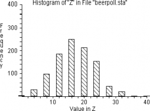

---
resampling_with:
    ed2_fname: 27-Chap-23
jupyter:
  jupytext:
    notebook_metadata_filter: all,-language_info
    split_at_heading: true
    text_representation:
      extension: .Rmd
      format_name: rmarkdown
      format_version: '1.2'
      jupytext_version: 1.14.6
  kernelspec:
    display_name: Python 3 (ipykernel)
    language: python
    name: python3
---

```{r setup, include=FALSE}
source("_common.R")
```

# Correlation and Causation {#sec-correlation-causation}

:::{.callout-warning}
## Draft page partially ported from original PDF

This page is an automated and partial import from the [original second-edition
PDF](https://resample.com/content/text/27-Chap-23.pdf).

We are in the process of updating this page for formatting, and porting any
code from the original [RESAMPLING-STATS
language](http://www.statistics101.net) to Python and R.

Feel free to read this version for the sense, but expect there to be multiple
issues with formatting.

We will remove this warning when the page has adequate formatting, and we have
ported the code.
:::


## Preview

The correlation (speaking in a loose way for now) between two variables
measures the strength of the relationship between them. A positive "linear"
correlation between two variables x and y implies that high values of x are
associated with high values of y, and that low values of x are associated with
low values of y. A negative correlation implies the opposite; high values of x
are associated with *low* values of y. By definition a "correlation
coefficient" close to zero indicates little or no linear relationship between
two variables; correlation coefficients close to 1 and -1 denote a strong
positive or negative relationship. We will generally use a simpler measure of
correlation than the correlation coefficient, however.

One way to measure correlation with the resampling method is to rank both
variables from highest to lowest, and investigate how often in
randomly-generated samples the rankings of the two variables are as close to
each other as the rankings in the observed variables. A better approach,
because it uses more of the quantitative information contained in the data
though it requires more computation, is to multiply the values for the
corresponding pairs of values for the two variables, and compare the sum of the
resulting products to the analogous sum for randomly-generated pairs of the
observed variable values. The last section of the chapter shows how the
strength of a relationship can be determined when the data are counted, rather
than measured. First comes some discussion of the philosophical issues involved
in correlation and causation.

## Introduction to correlation and causation

The questions in examples @sec-birthday-problem to @sec-fifteen-bridge have
been stated in the following form: Does the independent variable (say,
irradiation; or type of pig ration) have an effect upon the dependent variable
(say, sex of fruit flies; or weight gain of pigs)? This is another way to state
the following question: Is there a *causal relationship* between the
independent variable(s) and the dependent variable? ("Independent" or "control"
is the name we give to the variable(s) the researcher believes is (are)
responsible for changes in the other variable, which we call the "dependent" or
"response" variable.)

A causal relationship cannot be defined perfectly neatly. Even an experiment
does not determine perfectly whether a relationship deserves to be called
"causal" because, among other reasons, the independent variable may not be
clear-cut. For example, even if cigarette smoking experimentally produces
cancer in rats, it might be the paper and not the tobacco that causes the
cancer. Or consider the fabled gentlemen who got experimentally drunk on
bourbon and soda on Monday night, scotch and soda on Tuesday night, and brandy
and soda on Wednesday night — and stayed sober Thursday night by drinking
nothing. With a vast inductive leap of scientific imagination, they treated
their experience as an empirical demonstration that soda, the common element
each evening, was the cause of the inebriated state they had experienced.
Notice that their deduction was perfectly sound, given only the recent evidence
they had. Other knowledge of the world is necessary to set them straight. That
is, even in a controlled experiment there is often no way except subject-matter
knowledge to avoid erroneous conclusions about causality. Nothing except
substantive knowledge or scientific intuition would have led them to the
recognition that it is the alcohol rather than the soda that made them drunk,
*as long as they always took soda with their drinks* . And no statistical
procedure can suggest to them that they ought to experiment with the presence
and absence of soda. If this is true for an experiment, it must also be true
for an uncontrolled study.

Here are some tests that a relationship usually must pass to be called causal.
That is, a working definition of a particular causal relationship is expressed
in a statement that has these important characteristics:

1.  It is an association that is strong enough so that the observer
    believes it to have a predictive (explanatory) power great enough to
    be scientifically useful or interesting. For example, he is not
    likely to say that wearing glasses causes (or is a cause of) auto
    accidents if the observed correlation is .07, even if the sample is
    large enough to make the correlation statistically significant. In
    other words, unimportant relationships are not likely to be labeled
    causal.

    Various observers may well differ in judging whether or not an
    association is strong enough to be important and therefore "causal."
    And the particular field in which the observer works may affect this
    judgment. This is an indication that whether or not a relationship
    is dubbed "causal" involves a good deal of human judgment and is
    subject to dispute.
2.  The "side conditions" must be sufficiently *few* and sufficiently
    observable so that the relationship will apply under a wide enough
    range of conditions to be considered useful or interesting. In other
    words, *the relationship must not require too many "if"s, "and"s,
    and "but"s in order to hold* . For example, one might say that an
    increase in income caused an increase in the birth rate if this
    relationship were observed everywhere. But, if the relationship were
    found to hold only in developed countries, among the educated
    classes, and among the higher-income groups, then it would be less
    likely to be called "causal" — even if the correlation were
    extremely high once the specified conditions had been met. A similar
    example can be made of the relationship between income and
    happiness.
3.  For a relationship to be called "causal," there should be sound
    reason to believe that, even if the control variable were not the
    "real" cause (and it never is), other relevant "hidden" and "real"
    cause variables must also change *consistently* with changes in the
    control variables. That is, a variable being manipulated may
    reasonably be called "causal" if the real variable for which it is
    believed to be a proxy must always be tied intimately to it.
    (Between two variables, v and w, v may be said to be the "more real"
    cause and *w* a "spurious" cause, if *v* and *w* require the same
    side conditions, except that *v* does not require *w* as a side
    condition.) This third criterion (non-spuriousness) is of particular
    importance to policy makers. The difference between it and the
    previous criterion for side conditions is that a plenitude of very
    restrictive side conditions may take the relationship out of the
    class of causal relationships, *even though the effects of the side
    conditions are known* . This criterion of nonspuriousness concerns
    variables that are as yet *unknown and unevaluated* but that have a
    *possible* ability to *upset* the observed association.

    Examples of spurious relationships and hidden-third-factor causation
    are commonplace. For a single example, toy sales rise in December.
    There is no danger in saying that December causes an increase in toy
    sales, even though it is "really" Christmas that causes the
    increase, because Christmas and December practically always
    accompany each other.

    Belief that the relationship is not spurious is increased if *many*
    likely variables have been investigated and none removes the
    relationship. This is further demonstration that the test of whether
    or not an association should be called "causal" cannot be a logical
    one; there is no way that one can express in symbolic logic the fact
    that many other variables have been tried without changing the
    relationship in question.
4.  The more tightly a relationship is bound into (that is, deduced
    from, compatible with, and logically connected to) a general
    framework of theory, the stronger is its claim to be called
    "causal." For an economics example, observed positive relationships
    between the interest rate and business investment and between
    profits and investment are more likely to be called "causal" than is
    the relationship between liquid assets and investment. This is so
    because the first two statements can be deduced from classical price
    theory, whereas the third statement cannot. Connection to a
    theoretical framework provides support for belief that the side
    conditions necessary for the statement to hold true are not
    restrictive and that the likelihood of spurious correlation is not
    great; because a statement is logically connected to the rest of the
    system, the statement tends to stand or fall as the rest of the
    system stands or falls. And, because the rest of the system of
    economic theory has, over a long period of time and in a wide
    variety of tests, been shown to have predictive power, a statement
    connected with it is cloaked in this mantle.

The social sciences other than economics do not have such well-developed bodies
of deductive theory, and therefore this criterion of causality does not weigh
as heavily in sociology, for instance, as in economics. Rather, the other
social sciences seem to substitute a weaker and more general criterion, that
is, whether or not the statement of the relationship is accompanied by other
statements that seem to "explain" the "mechanism" by which the relationship
operates. Consider, for example, the relationship between the phases of the
moon and the suicide rate. The reason that sociologists do not call it causal
is that there are no auxiliary propositions that explain the relationship and
describe an operative mechanism. On the other hand, the relationship between
broken homes and juvenile delinquency is often referred to as "causal," in
large part because a large body of psychoanalytic theory serves to explain why
a child raised without one or the other parent, or in the presence of parental
strife, should not adjust readily.

Furthermore, one can never decide with perfect certainty whether in any *given*
situation one variable "causes" a particular change in another variable. At
best, given your particular purposes in investigating a phenomena, you may be
safe in judging that very likely there is causal influence.

In brief, it is correct to say (as it is so often said) that correlation does
not prove causation — if we add the word "completely" to make it "correlation
does not *completely* prove causation." On the other hand, causation can
*never* be "proven" *completely* by correlation *or any other* tool or set of
tools, including experimentation. The best we can do is make informed judgments
about whether to call a relationship causal.

It is clear, however, that in any situation where we are interested in the
possibility of causation, we must *at least* know whether there is a
relationship (correlation) between the variables of interest; the existence of
a relationship is necessary for a relationship to be judged causal even if it
is not sufficient to receive the causal label. And in other situations where we
are not even interested in causality, but rather simply want to predict events
or understand the structure of a system, we may be interested in the existence
of relationships quite apart from questions about causations. Therefore our
next set of problems deals with the probability of there being a relationship
between two measured variables, variables that can take on any values (say, the
values on a test of athletic scores) rather than just two values (say, whether
or not there has been irradiation.)[^see-simon]

[^see-simon]: For a much fuller discussion on causality and causation, see
   Simon and Burstein [-@simon1985basic].

Another way to think about such problems is to ask whether two variables are
*independent* of each other — that is, whether you know anything about the
value of one variable if you know the value of the other in a particular case —
or whether they are not independent but rather are related.

## A Note on Association Compared to Testing a Hypothesis

Problems in which we investigate a) whether there is an *association* , versus
b) whether there is a *difference* between just two groups, often look very
similar, especially when the data constitute a 2-by-2 table. There is this
important difference between the two types of analysis, however: Questions
about *association* refer to *variables* — say weight and age — and it never
makes sense to ask whether there is a difference between variables (except when
asking whether they measure the same quantity). Questions about *similarity or
difference* refer to *groups of individuals* , and in such a situation it does
make sense to ask whether or not two groups are observably different from each
other.

### Example: Is Athletic Ability Directly Related to Intelligence? {#sec-athletic-iq-ranks}

A more specific version of our question: **is there correlation between the two
variables or are they independent?**

A scientist often wants to know whether or not two characteristics go together,
that is, whether or not they are correlated (that is, related or associated).
For example, do youths with high athletic ability tend to also have high I.Q.s?

Hypothetical physical-education scores of a group of ten high-school boys are
shown in @tbl-physical-mental, ordered from high to low, along with the I.Q.
score for each boy. The ranks for each student's athletic and I.Q. scores are
then shown in the third and fourth columns:

```{r echo=FALSE, eval=TRUE}
# Show the table.
._df_ath_iq <- read.csv('data/athletic_iq.csv')
._df_aiq_renamed = ._df_ath_iq
names(._df_aiq_renamed) = c('Athletic Score', 'I.Q. Score',
                            'Athletic Rank', 'I.Q.Rank')
ketable(._df_aiq_renamed,
        caption='Hypothetical athletic and I.Q. scores for high school boys
        {#tbl-physical-mental}')
```

@fig-ath-iq-scatter is a *scatterplot* with "Athletic Score" on the x-axis and
"I.Q. Score" on the y-axis.  Each point on the plot corresponds to one row of
@tbl-physical-mental (and therefore one boy); in particular each point is at
the x, y coordinate given by the values in "Athletic Score" and "I.Q. Score".
For example the point for the first boy is at position x=97, y=114.

```{python echo=FALSE, label="fig-ath-iq-scatter", fig.cap="Scatter plot of I.Q. Score as a function of Athletic Score", eval=TRUE}
import numpy as np
import pandas as pd
import matplotlib.pyplot as plt

_ax_lims = [75, 95, 97, 122]
_x_ticks = np.arange(75, 96, 5)
_df = pd.read_csv('data/athletic_iq.csv')
_ath = np.array(_df['athletic_score'])
_iq = np.array(_df['iq_score'])

def aiq_plot(x, y):
    plt.scatter(x, y)
    plt.xlabel('Athletic Score')
    plt.ylabel('I.Q. Score')
    plt.axis(_ax_lims)
    plt.gca().set_xticks(_x_ticks)

aiq_plot(_ath, _iq)
plt.title('I.Q. Score (y-axis) as a function of Athletic Score (x-axis)');
```

We want to know whether a high score on athletic ability tends to be found
along with a high I.Q. score more often than would be expected by chance.
Therefore, our strategy is to see how often high scores on *both* variables are
found by chance. We do this by disassociating the two variables and making two
separate and independent universes, one composed of the athletic scores and
another of the I.Q. scores. Then we draw pairs of observations from the two
universes at random, and compare the experimental patterns that occur by chance
to what actually is observed to occur in the world.

The first testing scheme we shall use is similar to our first approach to the
pig rations — splitting the results into just "highs" and "lows." We take ten
cards, one of each denomination from "ace" to "10," shuffle, and deal five
cards to correspond to the first five athletic ranks. The face values then
correspond to the I.Q. ranks. Under the benchmark hypothesis the athletic ranks
will not be associated with the I.Q. ranks. Add the face values in the first
five cards in each trial; the first hand includes 2, 4, 5, 6, and 9, so the sum
is 26. Record, shuffle, and repeat perhaps ten times. Then compare the random
results to the sum of the observed ranks of the five top athletes, which equals
17.

The following steps describe a slightly different procedure than that just
described, because this one may be easier to understand:

* **Step 1.** Convert the athletic and I.Q. scores to ranks. Then constitute a
  universe of spades, "ace" to "10," to correspond to the athletic ranks, and a
  universe of hearts, "ace" to "10," to correspond to the IQ ranks.
* **Step 2.** Deal out the well-shuffled cards into pairs, each pair with an
  athletic score and an I.Q. score.
* **Step 3.** Locate the cards with the top five athletic ranks, and add the
  I.Q. rank scores on their paired cards. Compare this sum to the observed sum
  of 17. If 17 or less, indicate "yes," otherwise "no." (Why do we use "17 or
  less" rather than "less than 17"? Because we are asking the probability of a
  score *this low or lower*.)
* **Step 4.** Repeat steps 2 and 3 ten times.
* **Step 5.** Calculate the proportion "yes." This estimates the probability
  sought.

:::{.callout-note}
## Sum of the top ranks and the difference in sums

Notice that we could also find the sum of the IQ ranks for the *top* five
athletes, as above, and then *subtract* the sum of the *bottom* five.  The
result will be negative if the athletes have lower-numbered (higher) IQ ranks
on average, and positive otherwise. But gives us no more information than the
sum of the top five.  The sum of all the ranks ($1 + 2 + ... + 10$) is $55$.
Say we find the sum of the top five ranks is 18, then the sum of the bottom
five ranks must be $55 - 18 = 37$, and the subtraction of the two is $18
- (55 - 18) = 18 * 2 - 55 = -19$.  In general, for any sum of the top five
ranks $T$, the sum of the bottom five ranks $B$ is $55 - T$, and the difference
is $T - B = T - (55 - T) = T * 2 - 55$. So, if the top-five sum $T$ is smaller,
the difference between $T - B$ will also be more negative. Put another way, if
we know the sum of the top five ranks $T$ is 18, we also know the difference is
$2 * 18 = 55 = -19$, when $T = 19$, the difference $T - B$ is $2 * 19 - 15 =
-17$, when $T = 20$,  $T - B = -15$ and so on.
:::

In @tbl-ability-trials we see that the observed sum (17) is lower than the sum
of the top 5 ranks in all but one (shown in bold) of the ten random
trials (trial 5), which suggests that there is a good chance (9 in 10) that the
five best athletes will not have I.Q. scores that high by chance. But it might
be well to deal some more to get a more reliable average. We add thirty hands,
and thirty-nine of the total forty hands exceed the observed rank value, so the
probability that the observed correlation of athletic and I.Q. scores would
occur by chance is about .025. In other words, if there is no real association
between the variables, the probability that the top 5 ranks would sum to a
number this low or lower is only 1 in 40, and it therefore seems reasonable to
believe that high athletic ability tends to accompany a high I.Q.

| Trial     |  Sum of IQ Ranks    | <= observed (17) |
|-----------|---------------------|------------------|
| 1         | 26                  | No               |
| 2         | 23                  | No               |
| 3         | 22                  | No               |
| 4         | 37                  | No               |
| **5**     | **16**              | **Yes**          |
| 6         | 22                  | No               |
| 7         | 22                  | No               |
| 8         | 28                  | No               |
| 9         | 38                  | No               |
| 10        | 22                  | No               |
| 11        | 35                  | No               |
| 12        | 36                  | No               |
| 13        | 31                  | No               |
| 14        | 29                  | No               |
| 15        | 32                  | No               |
| 16        | 25                  | No               |
| 17        | 25                  | No               |
| 18        | 29                  | No               |
| 19        | 25                  | No               |
| 20        | 22                  | No               |
| 21        | 30                  | No               |
| 22        | 31                  | No               |
| 23        | 35                  | No               |
| 24        | 25                  | No               |
| 25        | 33                  | No               |
| 26        | 30                  | No               |
| 27        | 24                  | No               |
| 28        | 29                  | No               |
| 29        | 30                  | No               |
| 30        | 31                  | No               |
| 31        | 30                  | No               |
| 32        | 21                  | No               |
| 33        | 25                  | No               |
| 34        | 19                  | No               |
| 35        | 29                  | No               |
| 36        | 23                  | No               |
| 37        | 23                  | No               |
| 38        | 34                  | No               |
| 39        | 23                  | No               |
| 40        | 26                  | No               |

: 40 random trials of the athletic / IQ problem {#tbl-ability-trials}

In fact we can apply an even simpler procedure to get the same result, by reasoning about the individual trial.

One trial in our procedure is:

* **Step 2.** Deal out the well-shuffled cards into pairs, each pair with an
  athletic score and an I.Q. score.
* **Step 3.** Locate the cards with the top five athletic ranks, and add the
  I.Q. rank scores on their paired cards. Compare this sum to the observed sum
  of 17. If 17 or less, indicate "yes," otherwise "no." (Why do we use "17 or
  less" rather than "less than 17"? Because we are asking the probability of a
  score *this low or lower*.)

Now consider the 5 IQ rank cards.  In the procedure above, we found these by
*first* pairing the athletic ranks and the IQ ranks, *then* selecting the IQ
ranks corresponding to the top 5 athletic ranks.  A little thought may persuade
you, that by doing this, we have have a *random selection of 5 IQ ranks*.  We
got that random selection by pairing, selecting on athletic rank — but the
initial pairing and selection will do nothing other than giving us one
particular set of randomly chosen 5 IQ rank cards.  So we can simplify our
procedure even further by missing out the pairing and selecting by rank steps;
we can just shuffle the IQ rank cards and deal out 5 to be our randomly
selected IQ ranks.

::: {.notebook name="athlete_iq" title="Athletic ability and IQ"}

::: nb-only
Question: **Is there correlation between two variables or are they
independent?**

We answer this by permuting the athletic ability and IQ *ranks*, pairing them,
and seeing if the sum of the IQs ranks (randomly) paired with the top 5 athletic scores, are less than or equal to the observed value of 17.
:::

To simulate this problem in , we first create
 containing the I.Q. rankings of the top 5 students in
athletics. The `sum` of these I.Q. rankings constitutes the observed result to
be tested against randomly-drawn samples. We observe that the actual I.Q.
rankings of the top five athletes sums to 17. The more frequently that the sum
of 5 randomly-generated rankings (out of 10) is as low as this observed number,
the higher is the probability that there is no relationship between athletic
performance and I.Q. based on these data.

First we record the 1 through 10 into  `iq_ranks`. Then we
shuffle the numbers so the rankings are in a random order. Then select the first
5 of these numbers and put them in another , `top_5`, and `sum`
them, putting the result in `top_5_sum`. We repeat this procedure `N = 10000`
times, recording each result in a scorekeeping vector: `z`. Graphing `z`, we get a
histogram that shows us how often our randomly assigned sums are equal to or
below 17.

```{python}
import numpy as np
import matplotlib.pyplot as plt

rnd = np.random.default_rng()
```

```{python}
# Number of repeats.
n_trials = 10000
# The IQ ranks, ready for shuffling.
iq_ranks = np.arange(1, 11)  # 1 through 10.
# Scorekeeping array.
results = np.zeros(n_trials)

for i in range(n_trials):
    # Shuffle the ranks.
    shuffled = rnd.permuted(iq_ranks)
    # Take the first 5 ranks.
    top_5 = shuffled[:5]
    # Sum those ranks.
    top_5_sum = np.sum(top_5)
    # Keep track of the result of each trial.
    results[i] = top_5_sum
    # End the experiment, go back and repeat.

# Produce a histogram of trial results.
# Make the bins be the integers from 10 through 45.
plt.hist(results, bins=np.arange(10, 46))
plt.title('Sums of 5 ranks selected at random');
```

```{r}
# Number of repeats.
n_trials <- 10000
# The IQ ranks, ready for shuffling.
iq_ranks <- 1:10  # 1 through 10.
# Scorekeeping array.
results <- numeric(n_trials)

for (i in 1:n_trials) {
    # Shuffle the ranks.
    shuffled <- sample(iq_ranks)
    # Take the first 5 ranks.
    top_5 <- shuffled[1:5]
    # Sum those ranks.
    top_5_sum <- sum(top_5)
    # Keep track of the result of each trial.
    results[i] <- top_5_sum
    # End the experiment, go back and repeat.
}

# Produce a histogram of trial results.
# Make the bins be the integers from 10 through 45.
hist(results, breaks=10:45, main='Sums of 5 ranks selected at random')
```

```{r echo=FALSE, eval=TRUE}
le_pct <- round(sum(get_var('results') <= 17) / get_var('n_trials') * 100)
```

We see that in only about `r le_pct` % of the trials did random selection of
ranks produce a total of 17 or lower.  can calculate this for
us directly:

```{python}
# Determine how many trials produced sums of ranks <= 17 by chance.
k = np.sum(results <= 17)
# The proportion.
kk = k / n_trials
# Show the result.
kk
```

```{r}
# Determine how many trials produced sums of ranks <= 17 by chance.
k <- sum(results <= 17)
# The proportion.
kk <- k / n_trials
# Show the result.
kk
```

:::
<!---
End of notebook
-->

Why do we sum the ranks of the first *five* athletes rather than taking the sum
of the top three, say? Indeed, we could have looked at the top three, two,
four, or even six or seven. The first reason for splitting the group in half is
that an even split uses the available information more fully, and therefore we
obtain greater efficiency. (I cannot prove this formally here, but perhaps it
makes intuitive sense to you.) A second reason is that getting into the habit
of always looking at an even split reduces the chances that you will pick and
choose in such a manner as to fool yourself. For example, if the I.Q. ranks of
the top five athletes were 3, 2, 1, 10, and 9, we would be deceiving ourselves
if, after looking the data over, we drew the line between athletes 3 and 4.
(More generally, choosing an appropriate measure before examining the data will
help you avoid fooling yourself in such matters.)

A simpler but less efficient approach to this same problem is to classify the
top-half athletes by whether or not they were also in the top half of the I.Q.
scores. Of the first five athletes actually observed, *four* were in the top
five I.Q. scores. We can then shuffle five black and five red cards and see how
often four or more (that is, four or five) blacks come up with the first five
cards. The proportion of times that four or more blacks occurs in the trial is
the probability that an association as strong as that observed might occur by
chance even if there is no association. @tbl-top-rank-counts shows a proportion
of five trials out of twenty.

| Trial     |  Score    | Yes or No |
|-----------|-----------|-----------|
| 1         | 4         | Yes       |
| 2         | 2         | No        |
| 3         | 2         | No        |
| 4         | 2         | No        |
| 5         | 3         | No        |
| 6         | 2         | No        |
| 7         | 4         | Yes       |
| 8         | 3         | No        |
| 9         | 3         | No        |
| 10        | 4         | Yes       |
| 11        | 3         | No        |
| 12        | 1         | No        |
| 13        | 3         | No        |
| 14        | 3         | No        |
| 15        | 4         | Yes       |
| 16        | 3         | No        |
| 17        | 2         | No        |
| 18        | 2         | No        |
| 19        | 2         | No        |
| 20        | 4         | Yes       |

: Results of 20 random trials of the top-5 rank counts {#tbl-top-rank-counts}

::: {.notebook name="athlete_iq_rank_count" title="Athletic ability and IQ using rank counts"}

::: nb-only
Continuing with the question: **Is there correlation between two variables or are they
independent?**

This approach differs from the previous notebook in this series, in looking only at the top 5 permuted I.Q. ranks.  Now read on.
:::

In the  code below, we first note that the top 5 athletes
had 4 of the top 5 I.Q. scores. So we constitute the set of 10 IQ rankings  `iq_ranks`. We then shuffle `iq_ranks` and select the first
5 I.Q. rankings (out of 10). We count (`sum`) how many are in the top 5, and
keep track of the result. After repeating 10,000 times using a `for` loop, we
find out how often we select 4 of the top 5.

```{python}
import numpy as np
import matplotlib.pyplot as plt

rnd = np.random.default_rng()

# Number of repeats.
n_trials = 10000
# The IQ ranks, ready for shuffling.
iq_ranks = np.arange(1, 11)  # 1 through 10.
# Scorekeeping array.
results = np.zeros(n_trials)

for i in range(n_trials):
    # Shuffle the ranks.
    shuffled = rnd.permuted(iq_ranks)
    # Take the first 5 ranks.
    top_5 = shuffled[:5]
    # Everything up until this point is the same as the code above.
    # Here is the difference.
    # Check whether the selected IQ ranks are in the top 5.
    are_top = top_5 <= 5
    # Count how many were in the top 5
    n_are_top = np.sum(are_top)
    # Keep track of the result of each trial.
    results[i] = n_are_top
    # End the experiment, go back and repeat.

# Determine how many trials produced 4 or more top ranks by chance.
k = np.sum(results >= 4)
#  Convert to a proportion.
kk = k / n_trials
# Show the result.
kk
```

```{r}
# Number of repeats.
n_trials <- 10000
# The IQ ranks, ready for shuffling.
iq_ranks <- 1:10  # 1 through 10.
# Scorekeeping array.
results <- numeric(n_trials)

for (i in 1:n_trials) {
    # Shuffle the ranks.
    shuffled <- sample(iq_ranks)
    # Take the first 5 ranks.
    top_5 <- shuffled[1:5]
    # Everything up until this point is the same as the code above.
    # Here is the difference.
    # Check whether the selected IQ ranks are in the top 5.
    are_top <- top_5 <= 5
    # Count how many were in the top 5
    n_are_top <- sum(are_top)
    # Keep track of the result of each trial.
    results[i] <- n_are_top
    # End the experiment, go back and repeat.
}

# Determine how many trials produced 4 or more top ranks by chance.
k = sum(results >= 4)
#  Convert to a proportion.
kk = k / n_trials
# Show the result.
kk
```

:::
<!---
End of notebook
-->

So far we have proceeded on the theory that if there is *any* relationship
between athletics and I.Q., then the better athletes have higher rather than
lower I.Q. scores. The justification for this assumption is that past research
suggests that it is probably true. But if we had *not* had the benefit of that
past research, we would then have had to proceed somewhat differently; we would
have had to consider the possibility that the top five athletes could have I.Q.
scores either higher *or* lower than those of the other students. The results
of the "two-tail" test would have yielded odds weaker than those we observed.

### Example: Athletic ability and I.Q. — a third way

The example in @sec-athletic-iq-ranks investigated the relationship between
I.Q. and athletic score by ranking the two sets of scores. But ranking of
scores loses some efficiency because it uses only an "ordinal" (rank-ordered)
rather than a "cardinal" (measured) scale; the numerical shadings and relative
relationships are lost when we convert to ranks. Therefore let us consider a
test of correlation that uses the original cardinal numerical scores.

First a little background: @fig-hypot-spos and @fig-hypot-sneg show two
hypothetical cases of very high association among the I.Q. and athletic scores
used in previous examples. @fig-hypot-spos indicates that the higher the I.Q.
score, the higher the athletic score. With a boy's athletic score you can thus
predict quite well his I.Q. score by means of a hand-drawn line — or vice
versa. The same is true of @fig-hypot-sneg, but in the opposite direction.
Notice that even though athletic score is on the x-axis (horizontal) and I.Q.
score is on the y-axis (vertical), the athletic score does not *cause* the I.Q.
score. (It is an unfortunate deficiency of such diagrams that *some* variable
must arbitrarily be placed on the x-axis, whether you intend to suggest
causation or not.)

```{python echo=FALSE, label="fig-hypot-spos", fig.cap="Hypothetical Scores for I.Q. and Athletic Ability — 1", eval=TRUE}
_siq = np.sort(_iq)
_athi = np.argsort(_ath)
_pos_iq = _siq[_athi]
aiq_plot(_ath, _pos_iq)
```

```{python echo=FALSE, label="fig-hypot-sneg", fig.cap="Hypothetical Scores for I.Q. and Athletic Ability — 2", eval=TRUE}
_neg_iq = _siq[_athi[::-1]]
aiq_plot(_ath, _neg_iq)
```

In @fig-given_iq_athletic, which plots the scores as given in
@tbl-physical-mental, the prediction of athletic score given I.Q. score, or
vice versa, is less clear-cut than in @fig-hypot-spos. On the basis of
@fig-given_iq_athletic alone, one can say only that there *might* be some
association between the two variables.

```{python echo=FALSE, label="fig-given_iq_athletic", fig.cap="Given Scores for I.Q. and Athletic Ability", eval=TRUE}
aiq_plot(_ath, _iq)
```

## Correlation: sum of products

Now let us take advantage of a handy property of numbers. The more closely two
sets of numbers match each other in order, the higher the sums of their
products. Consider the following arrays of the numbers 1, 2, and 3:

**Columns in matching order**

$$
\begin{align*}
1 * 1 = 1 \\
2 * 2 = 4 \\
3 * 3 = 9 \\
\\
\mathrm{SUM} = 14
\end{align*}
$$

**Columns not in matching order**

$$
\begin{align*}
1 * 2 = 2 \\
2 * 3 = 6 \\
3 * 1 = 3 \\
\\
\mathrm{SUM} = 11
\end{align*}
$$


I will not attempt a mathematical proof, but the reader is encouraged to try
additional combinations to be sure that the highest sum is obtained when the
order of the two columns is the same. Likewise, the lowest sum is obtained when
the two columns are in perfectly opposite order:

**Columns in opposite order**

$$
\begin{align*}
1 * 3 = 3 \\
2 * 3 = 4 \\
3 * 1 = 3 \\
\\
\mathrm{SUM} = 10
\end{align*}
$$

Consider the cases in @tbl-pos-neg-mult which are chosen to illustrate
a perfect (linear) association between *x* (Column 1) and *y1* (Column 2), and
also between *x* (Column 1) and *y2* (Column 4); the numbers shown in Columns
3 and 5 are those that would be consistent with perfect associations. Notice
the sum of the multiples of the *x* and *y* values in the two cases. It is
either higher (*x* * *y1*) or lower (*x* * *y2*) than for any other possible
way of arranging the *y*'s. Any other arrangement of the *y*'s (*y3*, in
Column 6, for example, chosen at random), when multiplied by the *x*'s in
Column 1, (*x* * *y3*), produces a sum that falls somewhere between the sums of
*x* * *y1* and *x* * *y2*, as is the case with any other set of *y3*'s which is
not perfectly correlated with the *x*'s.

+-----------------------+--------------------+-----------------+
| Strong positive       | Strong negative    | Random          |
| relationship          | relationship       | Pairings        |
+-----+------+----------+--------+-----------+------+----------+
| X   | Y1   | X * Y1   |  Y2    | X * Y2    | Y3   | X * Y3   |
+=====+======+==========+========+===========+======+==========+
| 2   | 2    | 4        | 10     | 20        | 4    | 8        |
+-----+------+----------+--------+-----------+------+----------+
| 4   | 4    | 8        | 8      | 32        | 8    | 32       |
+-----+------+----------+--------+-----------+------+----------+
| 6   | 6    | 36       | 6      | 36        | 6    | 36       |
+-----+------+----------+--------+-----------+------+----------+
| 8   | 8    | 64       | 4      | 32        | 2    | 16       |
+-----+------+----------+--------+-----------+------+----------+
| 10  | 10   | 100      | 2      | 20        | 10   | 100      |
+=====+======+==========+========+===========+======+==========+
| **Sums**   | 220      |        | 140       |      | 192      |
+============+==========+========+===========+======+==========+

: Comparison of Sums of Multiplications {#tbl-pos-neg-mult}

@tbl-ath-iq-products shows that the sum of the products of the *observed*
I.Q. scores multiplied by athletic scores (column 7) is between the sums
that would occur if the I.Q. scores were ranked from best to worst
(column 3) and worst to best (column 5). The extent of correlation
(association) can thus be measured by whether the sum of the multiples
of the observed *x* and *y* values is relatively much higher or much lower than
are sums of randomly-chosen pairs of *x* and *y* .

<!---
Table genererated from build_corr_table.py then edited for header and footer.
-->

+------------------+----------------+-----------------+----------------+-----------------+-------------+-----------------+
| 1                | 2              | 3               | 4              | 5               | 6           | 7               |
+------------------+----------------+-----------------+----------------+-----------------+-------------+-----------------+
| Athletic score   | Hypothetical   | Col 1 x Col 2   | Hypothetical   | Col 1 x Col 4   | Actual IQ   | Col 1 x Col 6   |
|                  | IQ pos         |                 | IQ neg         |                 |             |                 |
+==================+================+=================+================+=================+=============+=================+
| 97               | 120            | 11640           | 99             | 9603            | 114         | 11058           |
+------------------+----------------+-----------------+----------------+-----------------+-------------+-----------------+
| 94               | 118            | 11092           | 100            | 9400            | 120         | 11280           |
+------------------+----------------+-----------------+----------------+-----------------+-------------+-----------------+
| 93               | 114            | 10602           | 101            | 9393            | 107         | 9951            |
+------------------+----------------+-----------------+----------------+-----------------+-------------+-----------------+
| 90               | 110            | 9900            | 107            | 9630            | 113         | 10170           |
+------------------+----------------+-----------------+----------------+-----------------+-------------+-----------------+
| 87               | 113            | 9831            | 109            | 9483            | 118         | 10266           |
+------------------+----------------+-----------------+----------------+-----------------+-------------+-----------------+
| 86               | 109            | 9374            | 113            | 9718            | 101         | 8686            |
+------------------+----------------+-----------------+----------------+-----------------+-------------+-----------------+
| 86               | 107            | 9202            | 110            | 9460            | 109         | 9374            |
+------------------+----------------+-----------------+----------------+-----------------+-------------+-----------------+
| 85               | 101            | 8585            | 114            | 9690            | 110         | 9350            |
+------------------+----------------+-----------------+----------------+-----------------+-------------+-----------------+
| 81               | 100            | 8100            | 118            | 9558            | 100         | 8100            |
+------------------+----------------+-----------------+----------------+-----------------+-------------+-----------------+
| 76               | 99             | 7524            | 120            | 9120            | 99          | 7524            |
+==================+================+=================+================+=================+=============+=================+
| **SUMS**         |                | 95850           |                | 95055           |             | 95759           |
+==================+================+=================+================+=================+=============+=================+

: Sums of Products: IQ and Athletic Scores {#tbl-ath-iq-products}

@tbl-ath-iq-products show three cases of products:

1.   Perfect positive correlation (hypothetical); column 3
2.   Perfect negative correlation (hypothetical); column 5
3.   Observed; column 7

Now we attack the I.Q. and athletic-score problem using the property of numbers
just discussed. First multiply the x and y values of the actual observations,
and sum them to be 95,759 (@tbl-ath-iq-products). Then write the ten observed
I.Q. scores on cards, and assign the cards in random order to the ten athletes,
as shown in the column for trial 1 in @tbl-random-ath-iq.

Multiply the random IQ scores by their paired *x*'s (Athletic scores), and sum
to give the values at the bottom of @tbl-random-ath-iq. If the I.Q. scores and
athletic scores are *positively associated*, that is, if high I.Q.s and high
athletic scores go together, then the sum of the multiplications for the
observed sample will be higher than for most of the random trials. (If high
I.Q.s go with low athletic scores, the sum of the multiplications for the
observed sample will be *lower* than most of the random trials.)

<!---
Table genererated from build_corr_table.py then edited for header and footer.
-->

+------------+-------------------------------------------------------------------------------+
|            | Trial no                                                                      |
+------------+-------+-------+-------+-------+-------+-------+-------+-------+-------+-------+
| Athletic   | 1     | 2     | 3     | 4     | 5     | 6     | 7     | 8     | 9     | 10    |
| score      |       |       |       |       |       |       |       |       |       |       |
+============+=======+=======+=======+=======+=======+=======+=======+=======+=======+=======+
| 97         | 101   | 107   | 99    | 114   | 120   | 118   | 107   | 100   | 101   | 107   |
+------------+-------+-------+-------+-------+-------+-------+-------+-------+-------+-------+
| 94         | 100   | 101   | 120   | 101   | 100   | 113   | 114   | 110   | 114   | 113   |
+------------+-------+-------+-------+-------+-------+-------+-------+-------+-------+-------+
| 93         | 120   | 100   | 113   | 109   | 99    | 99    | 110   | 120   | 120   | 101   |
+------------+-------+-------+-------+-------+-------+-------+-------+-------+-------+-------+
| 90         | 118   | 114   | 101   | 120   | 109   | 120   | 99    | 118   | 109   | 109   |
+------------+-------+-------+-------+-------+-------+-------+-------+-------+-------+-------+
| 87         | 99    | 113   | 110   | 110   | 110   | 101   | 109   | 113   | 110   | 100   |
+------------+-------+-------+-------+-------+-------+-------+-------+-------+-------+-------+
| 86         | 113   | 110   | 114   | 118   | 114   | 114   | 100   | 109   | 113   | 114   |
+------------+-------+-------+-------+-------+-------+-------+-------+-------+-------+-------+
| 86         | 110   | 118   | 118   | 107   | 118   | 107   | 120   | 99    | 118   | 99    |
+------------+-------+-------+-------+-------+-------+-------+-------+-------+-------+-------+
| 85         | 107   | 99    | 109   | 113   | 107   | 100   | 113   | 101   | 100   | 118   |
+------------+-------+-------+-------+-------+-------+-------+-------+-------+-------+-------+
| 81         | 114   | 109   | 107   | 100   | 101   | 109   | 101   | 114   | 99    | 120   |
+------------+-------+-------+-------+-------+-------+-------+-------+-------+-------+-------+
| 76         | 109   | 120   | 100   | 99    | 113   | 110   | 118   | 107   | 107   | 110   |
+============+=======+=======+=======+=======+=======+=======+=======+=======+=======+=======+
| **Product  |       |       |       |       |       |       |       |       |       |       |
| Sums**     | 95381 | 95236 | 95536 | 95638 | 95443 | 95557 | 95392 | 95490 | 95570 | 95332 |
+============+=======+=======+=======+=======+=======+=======+=======+=======+=======+=======+

: Random Drawing of IQ scores and Pairing Against Athletic Scores {#tbl-random-ath-iq}

More specifically, by the steps:

* **Step 1.** Write the ten I.Q. scores on one set of cards, and the ten
athletic scores on another set of cards.
* **Step 2.** Pair the I.Q. and athletic-score cards at random. Multiply the
scores in each pair, and add the results of the ten multiplications.
* **Step 3.** Subtract the experimental sum in step 2 from the observed
sum, 95,759.
* **Step 4.** Repeat steps 2 and 3 ten times.
* **Step 5.** Compute the proportion of trials where the difference is
negative, which estimates the probability that an association as strong as the
observed would occur by chance.

The sums of the multiplications for 10 trials are shown in @tbl-random-ath-iq.
No random-trial sum was as high as the observed sum, which suggests that the
probability of an association this strong happening by chance is so low as to
approach zero. (An empirically-observed probability is never actually zero.)

This algorithm can be solved particularly easily with .
The s A and B in the notebook below list the athletic scores
and the I.Q. scores respectively of 10 "actual" students ordered from highest
to lowest athletic score. We multiply the corresponding elements of these
s and proceed to compare the sum of these multiplications to
the sums of experimental multiplications in which the elements are selected
randomly.

Finally, we count (`sum`) the trials in which the sum of the products of the
randomly-paired athletic and I.Q. scores equals or exceeds the sum of the
products in the observed data.

::: {.notebook name="athlete_iq" title="Association of atheletic and IQ scores"}

::: nb-only
We use random pairings of the athletic and IQ scores to find the null-world
distribution of the sum of the products of these scores.
:::

```{python}
# Load the Numpy library for arrays.
import numpy as np
# Load the Pandas library for loading and selecting data.
import pandas as pd
# Plotting library.
import matplotlib.pyplot as plt

# Set up the random number generator
rnd = np.random.default_rng()
```

We load the file containing the data:

```{python}
# Read the data file containing athletic and IQ scores.
ath_iq_df = pd.read_csv('data/athletic_iq.csv')
# Show the data frame.
ath_iq_df
```

```{r}
# Read the data file containing pig ration data.
ath_iq_df <- read.csv('data/athletic_iq.csv')
# Show the data frame.
ath_iq_df
```

```{python}
# Turn athletic and IQ scores into arrays.
ath = np.array(ath_iq_df['athletic_score'])
iq = np.array(ath_iq_df['iq_score'])
```

```{r}
# Turn athletic and IQ scores into vectors.
ath = ath_iq_df$athletic_score
iq = ath_iq_df$iq_score
```

```{python}
# Multiply the two sets of scores together.
actual_prod = ath * iq
# Sum the results — the "observed value."
actual_sum = np.sum(actual_prod)
actual_sum
```

```{r}
# Multiply the two sets of scores together.
actual_prod <- ath * iq
# Sum the results — the "observed value."
actual_sum <- sum(actual_prod)
actual_sum
```

```{python}
# Set the number of trials
n_trials = 10_000

# An empty array to store the trial results.
results = np.zeros(n_trials)

# Do 10,000 experiments.
for i in range(n_trials):
    # Shuffle the IQ scores so we can pair them against athletic scores.
    shuffled = rnd.permuted(iq)
    # Multiply the shuffled IQ scores by the athletic scores. (Note that we
    # could shuffle the athletic scores too but it would not achieve any
    # greater randomization, because shuffling one of the set of scores
    # already gives a random pairing between the sets of scores.
    fake_prod = ath * shuffled
    # Sum the randomized multiplications.
    fake_sum = np.sum(fake_prod)
    # Subtract the sum from the sum of the "observed" multiplication.
    diff = actual_sum - fake_sum
    # Keep track of the result in results array.
    results[i] = diff
    # End one trial, go back and repeat until 10000 trials are complete.
# Obtain a histogram of the trial results.
plt.hist(results, bins=25)
plt.title('Random sums of products')
plt.xlabel('Observed sum minus sum of random pairing')
```

```{r}
# Set the number of trials
n_trials <- 10000

# An empty array to store the trial results.
results <- numeric(n_trials)

# Do 10,000 experiments.
for (i in 1:n_trials) {
    # Shuffle the IQ scores so we can pair them against athletic scores.
    shuffled <- sample(iq)
    # Multiply the shuffled IQ scores by the athletic scores. (Note that we
    # could shuffle the athletic scores too but it would not achieve any
    # greater randomization, because shuffling one of the set of scores
    # already gives a random pairing between the sets of scores.
    fake_prod <- ath * shuffled
    # Sum the randomized multiplications.
    fake_sum <- sum(fake_prod)
    # Subtract the sum from the sum of the "observed" multiplication.
    diff <- actual_sum - fake_sum
    # Keep track of the result in results array.
    results[i] <- diff
    # End one trial, go back and repeat until 10000 trials are complete.
}

# Obtain a histogram of the trial results.
hist(results, breaks=25,
    main='Random sums of products',
    xlab='Observed sum minus sum of random pairing')
```

We see that obtaining a chance trial result as great as that observed
was rare.  will calculate this proportion for us:

```{python}
# Determine in how many trials the random sum of products was less than
# the observed sum of products.
k = np.sum(results <= 0)
# Convert to a proportion.
kk = k / n_trials
# Print the result.
print('Proportion of random pairings giving sum <= observed:', kk)
```

```{r}
# Determine in how many trials the random sum of products was less than
# the observed sum of products.
k <- sum(results <= 0)
# Convert to a proportion.
kk <- k / n_trials
# Print the result.
message('Proportion of random pairings giving sum <= observed: ', kk)
```

### Example: Correlation Between Adherence to Medication Regime and Change in Cholesterol

Efron and Tibshirani [-@efron1993bootstrap, page 72] show data on the extents
to which 164 men a) took the drug prescribed to them (cholostyramine), and b)
showed a decrease in total plasma cholesterol. @tbl-cholost shows the first 15
of the values (note that a positive value in the "Decrease in cholesterol"
column denotes a decrease in cholesterol, while a negative value denotes an
increase.)

```{r echo=FALSE, eval=TRUE}
._cholost <- read.csv('data/cholost.csv')
names(._cholost) <- c('% compliance', 'Decrease in cholesterol')
ketable(head(._cholost, 15),
        caption = "First 15 rows of compliance / blood cholesterol {#tbl-cholost}")
```

The aim is to assess the effect of the compliance on the improvement.
There are two related issues:

1.  What form of regression should be fitted to these data, which we
    address later, and
2.  Is there reason to believe that the relationship is meaningful? That
    is, we wish to ascertain if there is any meaningful correlation
    between the variables — because if there is no relationship between
    the variables, there is no basis for regressing one on the other.
    Sometimes people jump ahead in the latter question to first run the
    regression and then ask whether the regression slope coefficient(s)
    is (are) different than zero, but this usually is not sound
    practice. The sensible way to proceed is first to graph the data to
    see whether there is visible indication of a relationship.

Efron and Tibshirani do this, and they find sufficient intuitive basis in the
graph to continue the analysis (see @fig-cholost-scatter).

```{python echo=FALSE, label="fig-cholost-scatter", fig.cap="Cholesterol decrease as function of compliance", eval=TRUE}
_df = pd.read_csv('data/cholost.csv')
_compliance = np.array(_df['percent_compliance'])
_cdecrease = np.array(_df['cholesterol_decrease'])

plt.scatter(_compliance, _cdecrease)
plt.xlabel('Percent compliance')
plt.ylabel('Cholesterol decrease')
plt.title('Cholesterol decrease as a function of compliance');
```

The next step is to investigate whether a measure of relationship is
statistically significant; this we do as follows:

1.  Multiply the observed values for each of the 164 participants on the
    independent x variable (cholostyramine — percent of prescribed
    dosage actually taken) and the dependent y variable (cholesterol),
    and sum the results — it's 439,141.
2.  Randomly shuffle the dependent variable y values among the
    participants. The sampling is being done without replacement, though
    an equally good argument could be made for sampling with
    replacement; the results do not differ meaningfully, however,
    because the sample size is so large.
3.  Then multiply these x and y hypothetical values for each of the 164
    participants, sum the results and record.
4.  Repeat steps 2 and 3 perhaps 10,000 times.
5.  Determine how often the shuffled sum-of-products exceeds the
    observed value (439,141).

The following notebook in  provides the solution:


```{python}
# Load the Numpy library for arrays.
import numpy as np
# Load the Pandas library for loading and selecting data.
import pandas as pd
# Plotting library.
import matplotlib.pyplot as plt

# Set up the random number generator
rnd = np.random.default_rng()

# Data as arrays.
cholost_df = pd.read_csv('data/cholost.csv')
x = np.array(cholost_df['percent_compliance'])
y = np.array(cholost_df['cholesterol_decrease'])

# Step 1 above
actual_prod = x * y
# Note: actual_sum = 439,141
actual_sum = np.sum(actual_prod)
# Show the result.
actual_sum
```

```{python}
# Set the number of trials
n_trials = 10_000

# An empty array to store the trial results.
results = np.zeros(n_trials)

# Do 10,000 experiments (step 4)
for i in range(n_trials):
    # Step 2 above.
    y_random = rnd.permuted(y)
    # Step 3 above.
    fake_prod = x * y_random
    fake_sum = np.sum(fake_prod)
    # Step 3 above
    results[i] = fake_sum
    # Step 4 above

# Step 5 above
k = np.sum(results >= actual_sum)
kk = k / n_trials

print('Proportion product sums >= observed:', kk)
```

```{r}
# Data as vectors.
cholost_df <- read.csv('data/cholost.csv')
x <- cholost_df$percent_compliance
y <- cholost_df$cholesterol_decrease

# Step 1 above
actual_prod <- x * y
# Note: actual_sum <- 439,141
actual_sum <- sum(actual_prod)
# Show the result.
actual_sum
```

```{r}
# Set the number of trials
n_trials <- 10000

# An empty array to store the trial results.
results <- numeric(n_trials)

# Do 10,000 experiments (step 4)
for (i in 1:n_trials) {
    # Step 2 above.
    y_random <- sample(y)
    # Step 3 above.
    fake_prod <- x * y_random
    fake_sum <- sum(fake_prod)
    # Step 3 above
    results[i] <- fake_sum
    # Step 4 above
}

# Step 5 above
k <- sum(results >= actual_sum)
kk <- k / n_trials

message('Proportion product sums >= observed: ', kk)
```

Interpretation: 10,000 simulated random shufflings never produced
a sum-of-products as high as the observed value. Hence we conclude that random
chance is a very unlikely explanation for the observed correlation.

### Example: Drinking Beer And Being In Favor of Selling Beer

**Testing for a relationship between counted-data variables.**

Earlier in this chapter, we analyzed measured values for athletic ability and
I.Q. We could and did use them in their original "cardinal" form, or split them
up into "high" and "low" groups. Often, however, the individual observations
are recorded only as categories such "yes" or "no," which makes it more
difficult to ascertain the existence of a relationship. Consider the poll
responses in @tbl-beerpol-data to two public-opinion survey questions: "Do you
drink beer?" and "Are you in favor of a local option on the sale of
beer?".[^beer-data]

[^beer-data]: These data are based on an example in [@dixon1983introduction,
    page 278, example 13-5], in which the problem is tackled conventionally
    with a chi-square test.

<!---
Page 278 in 4th edition, example 13-5.

The actual numbers are:

Question 2  Beer Yes Beer No
==========  ======== =======
Local Yes   37       20
Local No    15        6
-->


+--------------------------------------------------+-----------------------------+
|  Do you favor local option on the sale of beer?  | Do you drink beer?          |
+--------------------------------------------------+--------+--------+-----------+
|                                                  | Yes    | No     | **Total** |
+--------------------------------------------------+--------+--------+-----------+
| Favor                                            | 45     | 20     | **65**    |
+--------------------------------------------------+--------+--------+-----------+
| Don't favor                                      | 7      | 6      | **13**    |
+--------------------------------------------------+--------+--------+-----------+
| **Total**                                        | **52** | **26** | **78**    |
+--------------------------------------------------+--------+--------+-----------+

: Results of Observed Sample For beer poll {#tbl-beerpol-data}

Here is the statistical question: Is a person's opinion on "local
option" related to whether or not they drink beer? Our resampling
solution begins by noting that there are seventy-eight respondents,
sixty-five of whom approve local option and thirteen of whom do not.
Therefore write "approve" on sixty-five index cards and "not approve" on
thirteen index cards. Now take *another* set of seventy-eight index
cards, preferably of a different color, and write "yes" on fifty-two of
them and "no" on twenty-six of them, corresponding to the numbers of
people who do and do not drink beer in the sample. Now lay them down in
random *pairs* , one from each pile.

If there is a high association between the variables, then real life
observations will bunch up in the two diagonal cells in the upper left
and lower right in @tbl-beerpol-data. (Ignore the "total" data for now.)
Therefore, subtract one sum of two diagonal cells from the other sum for the
observed data: (45 + 6) - (20 + 7) = 24. Then compare this difference to the
comparable differences found in random trials. The proportion of times that the
simulated-trial difference exceeds the observed difference is the probability
that the observed difference of +24 might occur by chance, even if there is no
relationship between the two variables. (Notice that, in this case, we are
working on the assumption that beer drinking is *positively* associated with
approval of local option and not the inverse. We are interested only in
differences that are equal to or exceed +24 when the northeast-southwest
diagonal is subtracted from the northwest-southeast diagonal.)

We can carry out a resampling test with this procedure:

* **Step 1.** Write "approve" on 65 and "disapprove" on 13 red index cards,
  respectively; write "Drink" and "Don't drink" on 52 and 26 white cards,
  respectively.
* **Step 2.** Pair the two sets of cards randomly. Count the numbers of the
four possible pairs: (1) "approve-drink," (2) "disapprove-don't drink," (3)
"disapprove-drink," and (4) "approve-don't drink." Record the number of these
combinations, as in Table 23-10, where columns 1-4 correspond to the four cells
in Table 23-9.
* **Step 3.** Add (column 1 plus column 4), then add (column 2 plus column 3),
and subtract the result in the second parenthesis from the result in the first
parenthesis. If the difference is equal to or greater than 24, record "yes,"
otherwise "no."
* **Step 4.** Repeat steps 2 and 3 perhaps a hundred times.
* **Step 5.** Calculate the proportion "yes," which estimates the probability
that an association this great or greater would be observed by chance.

+-------+-----------+-----------+------------+------------+------------------+
|       | 1         | 2         | 3          | 4          | 5                |
+-------+-----------+-----------+------------+------------+------------------+
| Trial | Approve   | Approve   | Disapprove | Disapprove | (Col 1 + Col 4)  |
|       | Yes       | No        | Yes        | No         | -                |
|       |           |           |            |            | (Col 2 + Col 3)  |
+=======+===========+===========+============+============+==================+
|1      | 43        | 22        | 9          | 4          | 47 - 31 = 16     |
+-------+-----------+-----------+------------+------------+------------------+

: Results of one random trial of the beer poll problem {#tbl-beerpol-trial}

@tbl-beerpol-trial shows the result of one such trial.  When we run a series of
ten trials such trials, it indicates that the observed difference is very often
exceeded, which suggests that we have no good evidence here for a relationship
between beer drinking and opinion.

The  notebook below does this repetitively. From the
"actual" sample results we know that 52 respondents drink beer and 26 do
not. We create the vector "drink" with 52 "1"s for those who drink beer,
and 26 "2"s for those who do not. We also create the vector "sale" with
65 "1"s (approve) and 13 "2"s (disapprove). In the actual sample, 51 of
the 78 respondents had "consistent" responses to the two
questions — that is, people who both favor the sale of beer *and* drink
beer, or who are against the sale of beer *and* do not drink beer. We
want to randomly pair the responses to the two questions to compare
against that observed result to test the relationship.

To accomplish this aim, we repeat the following procedure 10,000 times using
a `for` loop. We shuffle drink to drink\$ so that the responses are randomly
ordered. Now when we subtract the corresponding elements of the two arrays,
a "0" will appear in each element of the new array c for which there was
consistency in the response of the two questions. We therefore counts (`sum`)
the times that c equals "0" and place this result in d, and the number of times
c does not equal 0, and place this result in e. Find the difference (d minus
e), and record the result in the `results` .

SCORE Z stores for each trial the number of consistent responses minus
inconsistent responses. To determine whether the results of the actual
sample indicate a relationship between the responses to the two
questions, we check how often the random trials had a difference
(between consistent and inconsistent responses) as great as 24, the
value in the observed sample.


<!--- Resampling stats file; Matlab syntax closeish -->

```matlab
' Program file: "beerpoll.rss"

URN 52#1 26#0 drink
' Constitute the set of 52 beer drinkers, represented by 52 "1"s, and the
' set of 26 non-drinkers, represented by "2"s.
URN 57#1 21#0 sale
' The same set of individuals classified by whether they favor ("1") or
' don't favor ("0") the sale of beer.

' Note: F is now the vector {1 1 1 1 1 1 \... 0 0 0 0 0 \...} where 1 =
' people in favor, 0 = people opposed.
REPEAT 1000
    ' Repeat the experiment 1000 times.
    SHUFFLE drink drink$
    ' Shuffle the beer drinkers/non-drinker, call the shuffled set drink\*.

    ' Note: drink\$ is now a vector like {1 1 1 0 1 0 0 1 0 1 1 0 0 \...}
    ' where 1 = drinker, 0 = non-drinker.
END
SUBTRACT drink$ sale c
' Subtract the favor/don't favor set from the drink/don't drink set.
' Consistent responses are someone who drinks favoring the sale of beer (a
' "1" and a "1") or someone who doesn't drink opposing the sale of beer.
' When subtracted, consistent responses *(and only consistent responses)*
' produce a "0."
COUNT c =0 d
' Count the number of consistent responses (those equal to "0").
COUNT c <> 0 e
' Count the "inconsistent" responses (those not equal to "0").
SUBTRACT d e f
' Find the difference
SCORE f z
' Keep track of the results of each trial.

' End one trial, go back and repeat until all 1000 trials are complete.
HISTOGRAM z
' Produce a histogram of the trial result.

' Note: The file "beerpoll" on the Resampling Stats software disk contains
' this set of commands.
```

**Are Drinkers More Likely to Favor Local Option & Vice Versa**



**\# consistent responses thru chance draw**

The actual results showed a difference of 24. In the histogram we see
that a difference that large or larger happened just by chance
pairing — without any relationship between the two variables — 23% of
the time. Hence, we conclude that there is little evidence of a
relationship between the two variables.

Though the test just described may *generally* be appropriate for data
of this sort, it may well not be appropriate in some particular case.
Let's consider a set of data where even if the test showed that an
association existed, we would not believe the test result to be
meaningful.

Suppose the survey results had been as presented in Table 23-11. We see
that non-beer drinkers have a higher rate of approval of allowing beer
drinking, which does not accord with experience or reason. Hence,
without additional explanation we would not believe that a meaningful
relationship exists among these variables even if the test showed one to
exist. (Still another reason to doubt that a relationship exists is that
the absolute differences are too small — there is only a 6% difference
in disapproval between drink and don't drink groups — to mean anything
to anyone. On both grounds, then, it makes sense simply to act as if
there were no difference between the two groups and to run *no test* .).

Table 23-11

**Beer Poll In Which Results Are Not In Accord With Expectation Or
Reason**

  ------------------- --------------- ------------------ -----------
                      **% Approve**   **% Disapprove**   **Total**
  Beer Drinkers       71%             29%                100%
  Non-Beer Drinkers   77%             23%                100%
  ------------------- --------------- ------------------ -----------

The lesson to be learned from this is that one should inspect the data
carefully before applying a statistical test, and only test for
"significance" if the apparent relationships accord with theory, general
understanding, and common sense.

**Example 23-4: Do Athletes Really Have "Slumps"?** (Are Successive
Events in a Series Independent, or is There a Relationship Between
Them?)

The important concept of independent events was introduced earlier.
Various scientific and statistical decisions depend upon whether or not
a series of events is independent. But how does one know whether or not
the events are independent? Let us consider a baseball example.

Baseball players and their coaches believe that on some days and during
some weeks a player will bat better than on other days and during other
weeks. And team managers and coaches act on the belief that there are
periods in which players do poorly — slumps — by temporarily replacing
the player with another after a period of poor performance. The
underlying belief is that a series of failures indicates a temporary (or
permanent) change in the player's capacity to play well, and it
therefore makes sense to replace him until the evil spirit passes on,
either of its own accord or by some change in the player's style.

But even if his hits come randomly, a player will have runs of good luck
and runs of bad luck just by chance — just as does a card player. The
problem, then, is to determine whether (a) the runs of good and bad
batting are merely runs of chance, and the probability of success for
each event remains the same throughout the series of events — which
would imply that the batter's ability is the same at all times, and
coaches should not take recent performance heavily into account when
deciding which players should play; or (b) whether a batter really does
have a tendency to do better at some times than at others, which would
imply that there is some relationship between the occurrence of success
in one trial event and the probability of success in the next trial
event, and therefore that it is reasonable to replace players from time
to time.

Let's analyze the batting of a player we shall call "Slug." Here are the
results of Slug's first 100 times at bat during the 1987 season ("H" =
hit, "X" = out):

X X X X X X H X X H X H H X X X X X X X X H X X X X X H X X X X H H X X
X X X H X X H X H X X X H H X X X X X H X H X X X X H H X H H X X X X X
X X X X X H X X X H X X H X X H X H X X H X X X H X X X.

Now, do Slug's hits tend to come in bunches? That would be the case if
he really did have a tendency to do better at some times than at others.
Therefore, let us compare Slug's results with those of a deck of cards
or a set of random numbers that we know has no tendency to do better at
some times than at others.

During this period of 100 times at bat, Slug has averaged one hit in
every four times at bat — a .250 batting average. This average is the
same as the chance of one card suit's coming up. We designate hearts as
"hits" and prepare a deck of 100 cards, twenty-five "H"s (hearts, or
"hit") and seventy-five "X"s (other suit, or "out"). Here is the
sequence in which the 100 randomly-shuffled cards fell:

X X H X X X X H H X X X H H H X X X X X H X X X H X X H X X X X H X H H
X X X X X X X X X H X X X X X X H H X X X X X H H H X X X X X X H X H X
H X X H X H X X X X X X X X X H X X X X X X X H H H X X.

Now we can compare whether or not Slug's hits are bunched up more than
they would be by random chance; we can do so by *counting the clusters*
(also called "runs") of consecutive hits and outs for Slug and for the
cards. Slug had forty-three clusters, which is more than the
thirty-seven clusters in the cards; it therefore does not seem that
there is a tendency for Slug's hits to cluster together. (A larger
number of clusters indicates a lower tendency to cluster.)

Of course, the single trial of 100 cards shown above might have an
unusually high or low number of clusters. To be safer, lay out, (say,)
ten trials of 100 cards each, and compare Slug's number of clusters with
the various trials. The proportion of trials with more clusters than
Slug's indicates whether or not Slug's hits have a tendency to bunch up.
(But caution: This proportion cannot be interpreted directly as a
probability.)

Now the steps:

**Step 1.** Constitute a bucket with 3 slips of paper that say "out" and
one that says "hit." Or "01-25" = hits (H), "26-00" = outs (X), Slug's
long-run average.

**Step 2.** Sample 100 slips of paper, with replacement, record "hit" or
"out" each time, or write a series of "H's" or "X's" corresponding to
100 numbers, each selected randomly between 1 and 100.

**Step 3.** Count the number of "clusters," that is, the number of
"runs" of the same event, "H"s or "X"s.

**Step 4.** Compare the outcome in step 3 with Slug's outcome, 43
clusters. If 43 or fewer; write "yes," otherwise "no."

**Step 5.** Repeat steps 2-4 a hundred times.

**Step 6.** Compute the proportion "yes." This estimates the probability
that Slug's record is not characterized by more "slumps" than would be
caused by chance. A very low proportion of "yeses" indicates longer (and
hence fewer) "streaks" and "slumps" than would result by chance.

In RESAMPLING STATS, we can do this experiment 1000 times.


<!--- Resampling stats file; Matlab syntax closeish -->

```matlab
' Program file: "sluggo.rss"

REPEAT 1000
    URN 3#0 1#1 a
    SAMPLE 100 a b
    ' Sample 100 "at-bats" from a
    RUNS b >=1 c
    ' How many runs (of any length \>=1) are there in the 100 at-bats?
    SCORE c z
END
HISTOGRAM z
' Note: The file "sluggo" on the Resampling Stats software disk contains
' this set of commands.
```

Examining the histogram, we see that 43 runs is not at all an unusual
occurrence:

**"Runs" in 100 At-Bats**


**\# "runs" of same outcome**

The manager wants to look at this matter in a somewhat different
fashion, however. He insists that the existence of slumps is proven by
the fact that the player sometimes does not get a hit for an abnormally
long period of time. One way of testing whether or not the coach is
right is by comparing an average player's longest slump in a 100-at-bat
season with the longest run of outs in the first card trial. Assume that
Slug is a player picked *at random* . Then compare Slug's longest
slump — say, 10 outs in a row — with the longest cluster of a single
simulated 100-at-bat trial with the cards, 9 outs. This result suggests
that Slug's apparent slump might well have resulted by chance.

The estimate can be made more accurate by taking the *average* longest
slump (cluster of outs) in ten simulated 400-at-bat trials. But notice
that we do *not* compare Slug's slump against the *longest* slump found
in ten such simulated trials. We want to know the longest cluster of
outs that would be found under *average* conditions, and the hand with
the *longest* slump is *not* average or typical. Determining whether to
compare Slug's slump with the *average* longest slump or with the
*longest* of the ten longest slumps is a decision of crucial importance.
There are no mathematical or logical rules to help you. What is required
is hard, clear thinking. Experience can help you think clearly, of
course, but these decisions are not easy or obvious even to the most
experienced statisticians.

The coach may then refer to the protracted slump of one of the
twenty-five players on his team to prove that slumps really occur. But,
of twenty-five random 100-at-bat trials, one will contain a slump longer
than any of the other twenty-four, and that slump will be considerably
longer than average. A fair comparison, then, would be between the
longest slump of his longest-slumping player, and the longest run of
outs found among twenty-five random trials. In fact, the longest run
among twenty-five hands of 100 cards was fifteen outs in a row. And, if
we had set some of the hands for lower (and higher) batting averages
than .250, the longest slump in the cards would have been even longer.

Research by Roberts and his students at the University of Chicago shows
that in fact slumps do *not* exist, as I conjectured in the first
publication of this material in 1969. (Of course, a batter feels as if
he has a better chance of getting a hit at some times than at other
times. After a series of successful at-bats, sandlot players and
professionals alike feel confident — just as gamblers often feel that
they're on a "streak." But there seems to be no connection between a
player's performance and whether he feels hot or cold, astonishing as
that may be.)

Averages over longer periods may vary systematically, as Ty Cobb's
annual batting average varied non-randomly from season to season,
Roberts found. But short-run analyses of dayto-day and week-to-week
individual and team performances in most sports have shown results
similar to the outcomes that a lottery-type random-number machine would
produce.

Remember, too, the study by Gilovich, Vallone, and Twersky of basketball
mentioned in @sec-sampling-variability. To repeat, their analyses "provided no
evidence for a positive correlation between the outcomes of successive shots."
That is, knowing whether a shooter has or has not scored on the previous sheet
— or in any previous sequence of shots — is useless for predicting whether he
will score again.

The species *homo sapiens* apparently has a powerful propensity to believe that
one can find a pattern even when there is no pattern to be found. Two decades
ago I (JLS) cooked up several series of random numbers that looked like weekly
prices of publicly-traded stocks. Players in the experiment were told to buy
and sell stocks as they chose. Then I repeatedly gave them "another week's
prices," and allowed them to buy and sell again. The players did all kinds of
fancy calculating, using a wild variety of assumptions — although there was no
possible way that the figuring could help them.

When I stopped the game before completing the 10 buy-and-sell sessions they
expected, subjects would ask that the game go on. Then I would tell them that
there was no basis to believe that there were patterns in the data, because the
"prices" were just randomly-generated numbers. Winning or losing therefore did
not depend upon the subjects' skill. Nevertheless, they demanded that the game
not stop until the 10 "weeks" had been played, so they could find out whether
they "won" or "lost."

This study of batting illustrates how one can test for independence among
various trials. The trials are independent if each observation is randomly
chosen with replacement from the universe, in which case there is no reason to
believe that one observation will be related to the observations directly
before and after; as it is said, "the coin has no memory."

The year-to-year level of Lake Michigan is an example in which observations are
*not* independent. If Lake Michigan is very high in one year, it is likely to
be higher than average the following year because some of the high level
carries over from one year into the next.[^wallis-example] We could test this
hypothesis by writing down whether the level in each year from, say, 1860 to
1975 was higher or lower than the median level for those years. We would then
count the number of runs of "higher" and "lower" and compare the number of runs
of "black" and "red" with a deck of that many cards; we would find fewer runs
in the lake level than in an average hand of 116 (1976-1860) cards, though this
test is hardly necessary. (But are the *changes* in Lake Michigan's level
independent from year to year? If the level went up last year, is there
a better than 50-50 chance that the level will also go up this year? The answer
to this question is not so obvious. One could compare the numbers of runs of
ups and downs against an average hand of cards, just as with the hits and outs
in baseball.)

[^wallis-example]: Example from [@wallis1956statistics, pages 565 -- 556].

Exercise for students: How could one check whether the successive numbers in
a random-number table are independent?


## Exercises

Solutions for problems may be found at @sec-exercise-solutions.

### Exercise 23-1

Table 23-12 shows voter participation rates in the various states in the
1844 presidential election. Should we conclude that there was a negative
relationship between the participation rate (a) and the vote spread (b)
between the parties in the election? (Adapted from [@noreen1989computer, page
20, Table 2-4]:

Table 23-12

**Voter Participation In The 1844 Presidential Election**

  ------------------ ----------------------- ----------------
  **State**          **Participation (a)**   **Spread (b)**
  Maine              67.5                    13
  New Hampshire      65.6                    19
  Vermont            65.7                    18
  Massachusetts      59.3                    12
  Rhode Island       39.8                    20
  Connecticut        76.1                    5
  New York           73.6                    1
  New Jersey         81.6                    1
  Pennsylvania       75.5                    2
  Delaware           85.0                    3
  Maryland           80.3                    5
  Virginia           54.5                    6
  North Carolina     79.1                    5
  Georgia            94.0                    4
  Kentucky           80.3                    8
  Tennessee          89.6                    1
  Louisiana          44.7                    3
  Alabama            82.7                    8
  Mississippi        89.7                    13
  Ohio               83.6                    2
  Indiana            84.9                    2
  Illinois           76.3                    12
  Missouri           74.7                    17
  Arkansas           68.8                    26
  Michigan           79.3                    6
  National Average   74.9                    9
  ------------------ ----------------------- ----------------

The observed correlation coefficient between voter participation and
spread is -.37398. Is this more negative that what might occur by
chance, if no correlation exists?

### Exercise 23-2

We would like to know whether, among major-league baseball players, home
runs (per 500 at-bats) and strikeouts (per 500 at-bat's) are correlated.
We first use the procedure as used above for I.Q. and athletic
ability — multiplying the elements within each pair. (We will later use
a more "sophisticated" measure, the correlation coefficient.)

The data for 18 randomly-selected players in the 1989 season are as
follows, as they would appear in the first lines of the program.

```{python}
import numpy as np

homeruns = np.array([14, 20, 0, 38, 9, 38, 22, 31, 33,
                     11, 40, 5, 15, 32, 3, 29, 5, 32])
strikeout = np.array([135, 153, 120, 161, 138, 175, 126, 200, 205,
                      147, 165, 124, 169, 156, 36, 98, 82, 131])

# Exercise - complete this program.
```

```{r}
homeruns <- c(14, 20, 0, 38, 9, 38, 22, 31, 33,
              11, 40, 5, 15, 32, 3, 29, 5, 32)
strikeout <- c(135, 153, 120, 161, 138, 175, 126, 200, 205,
               147, 165, 124, 169, 156, 36, 98, 82, 131)

# Exercise - complete this program.
```


### Exercise 23-3

In the previous example relating strikeouts and home runs, we used the
procedure of multiplying the elements within each pair. Now we use a
more "sophisticated" measure, the correlation coefficient, which is
simply a standardized form of the multiplicands, but sufficiently well
known that we calculate it with a pre-set command.

Exercise: Write a program that uses the correlation coefficient to test
the significance of the association between home runs and strikeouts.

### Exercise 23-4

All the other things equal, an increase in a country's money supply is
inflationary and should have a negative impact on the exchange rate for
the country's currency. The data in the following table were computed
using data from tables in the 1983/1984 *Statistical Yearbook of the
United Nations* :

Table 23-13

**Money Supply and Exchange Rate Changes**

**% Change % Change % Change % Change**

**Exch. Rate Money Supply Exch. Rate Money Supply**

  -------------- ------- -------- -------------- -------- -------
  Australia      0.089   0.035    Belgium        0.134    0.003
  Botswana       0.351   0.085    Burma          0.064    0.155
  Burundi        0.064   0.064    Canada         0.062    0.209
  Chile          0.465   0.126    China          0.411    0.555
  Costa Rica     0.100   0.100    Cyprus         0.158    0.044
  Denmark        0.140   0.351    Ecuador        0.242    0.356
  Fiji           0.093   0.000    Finland        0.124    0.164
  France         0.149   0.090    Germany        0.156    0.061
  Greece         0.302   0.202    Hungary        0.133    0.049
  India          0.187   0.184    Indonesia      0.080    0.132
  Italy          0.167   0.124    Jamaica        0.504    0.237
  Japan          0.081   0.069    Jordan         0.092    0.010
  Kenya          0.144   0.141    Korea          0.040    0.006
  Kuwait         0.038   -0.180   Lebanon        0.619    0.065
  Madagascar     0.337   0.244    Malawi         0.205    0.203
  Malaysia       0.037   -0.006   Malta          0.003    0.003
  Mauritania     0.180   0.192    Mauritius      0.226    0.136
  Mexico         0.338   0.599    Morocco        0.076    0.076
  Netherlands    0.158   0.078    New Zealand    0.370    0.098
  Nigeria        0.079   0.082    Norway         0.177    0.242
  Papua          0.075   0.209    Philippines    0.411    0.035
  Portugal       0.288   0.166    Romania        -0.029   0.039
  Rwanda         0.059   0.083    Samoa          0.348    0.118
  Saudi Arabia   0.023   0.023    Seychelles     0.063    0.031
  Singapore      0.024   0.030    Solomon Is     0.101    0.526
  Somalia        0.481   0.238    South Africa   0.624    0.412
  Spain          0.107   0.086    Sri Lanka      0.051    0.141
  Switzerland    0.186   0.186    Tunisia        0.193    0.068
  Turkey         0.573   0.181    UK             0.255    0.154
  USA            0.000   0.156    Vanatuva       0.008    0.331
  Yemen          0.253   0.247    Yugoslavia     0.685    0.432
  Zaire          0.343   0.244    Zambia         0.457    0.094
  Zimbabwe       0.359   0.164
  -------------- ------- -------- -------------- -------- -------

 Percentage changes in exchange rates and money supply between 1983 and
1984 for various countries.

Are changes in the exchange rates and in money supplies related to each
other? That is, are they correlated?

<!---
Original text has "(Adapted from Noreen (1990)".  It isn't obvious how it
would be adapted from Noreen (1989), and otherwise, what Noreen (1990) might
be.
-->

## Exercise 1 {#sec-country-exchange}

Should the algorithm of non-computer resampling steps be similar to the
algorithm for I.Q. and athletic ability shown in the text? One can also work
with the correlation coefficient rather then the sum-of-products method, and
expect to get the same result.

1.  Write a series of non-computer resampling steps to solve this
    problem.
2.  Write a computer program to implement those steps.
