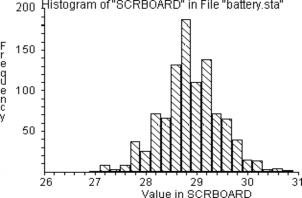
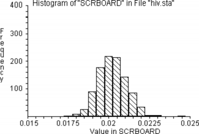
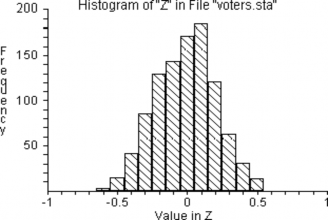
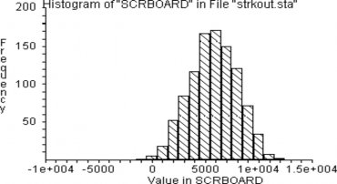
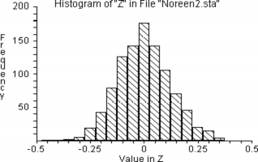

---
jupyter:
  jupytext:
    metadata_filter:
      notebook:
        additional: all
        excluded:
        - language_info
    text_representation:
      extension: .Rmd
      format_name: rmarkdown
      format_version: '1.0'
      jupytext_version: 0.8.6
  kernelspec:
    display_name: Python 3
    language: python
    name: python3
resampling_with:
    ed2_fname: 30-Exercise-sol
---

```{r setup, include=FALSE}
source("_common.R")
```

# Exercise Solutions {#sec-exercise-solutions}

:::{.callout-warning}
## Draft page partially ported from original PDF

This page is an automated and partial import from the [original second-edition
PDF](https://resample.com/content/text/30-Exercise-sol.pdf).

We are in the process of updating this page for formatting, and porting any
code from the original [RESAMPLING-STATS
language](http://www.statistics101.net) to Python and R.

Feel free to read this version for the sense, but expect there to be multiple
issues with formatting.

We will remove this warning when the page has adequate formatting, and we have
ported the code.
:::

## Solution to [paired differences exercise @sec-exr-paired-differences] {#sec-soln-paired-differences}

We suggested that you ignored the pairing of the before and after samples, and that is what we will do here.  Then we will extend the treatment to take the pairing into account.

::: {.notebook name="paired_differences_solution" title="Paired differences solution"}

```{python}
import numpy as np
import pandas as pd

rnd = np.random.default_rng()

df = pd.read_csv('data/hamilton.csv')
before = np.array(df['score_before'])
after = np.array(df['score_after'])

observed_diff = np.mean(after) - np.mean(before)

# Let us start with a permutation test.
both = np.concatenate([before, after])
n_before = len(before)

# Samples in the null world.
n_trials = 10_000
results = np.zeros(n_trials)
for i in range(n_trials):
    shuffled = rnd.permuted(both)
    fake_before = shuffled[:n_before]
    fake_after = shuffled[n_before:]
    fake_diff = np.mean(fake_after) - np.mean(fake_before)
    results[i] = fake_diff

# We are interested in fake differences that are larger
# in magnitude than the observed difference (hence "abs").
# Here we have no prior hypothesis about which direction the difference
# will go.
k = np.sum(np.abs(results) >= np.abs(observed_diff))
kk = k / n_trials
print('Permutation p null-world abs >= abs observed:', kk)

# Next a bootstrap test.
n_after = len(after)  # Of course, in our case, this will be == n_before
results = np.zeros(n_trials)
for i in range(n_trials):
    fake_before = rnd.choice(both, size=n_before)
    fake_after = rnd.choice(both, size=n_after)
    fake_diff = np.mean(fake_after) - np.mean(fake_before)
    results[i] = fake_diff

k = np.sum(np.abs(results) >= np.abs(observed_diff))
kk = k / n_trials
print('Bootstrap p null-world abs >= abs observed:', kk)
```

```{r}
df <- read.csv('data/hamilton.csv')
before <- df$score_before
after <- df$score_after

observed_diff <- mean(after) - mean(before)

# Let us start with a permutation test.
both <- c(before, after)
n_before <- length(before)

# Samples in the null world.
n_trials <- 10000
results <- numeric(n_trials)
for (i in 1:n_trials) {
    shuffled <- sample(both)
    fake_before <- shuffled[1:n_before]
    fake_after <- shuffled[(n_before + 1):length(both)]
    fake_diff <- mean(fake_after) - mean(fake_before)
    results[i] <- fake_diff
}

# We are interested in fake differences that are larger
# in magnitude than the observed difference (hence "abs").
# Here we have no prior hypothesis about which direction the difference
# will go.
k <- sum(abs(results) >= abs(observed_diff))
kk <- k / n_trials
message('Permutation p null-world abs >= abs observed: ', kk)

# Next a bootstrap test.
n_after <- length(after)  # Of course, in our case, this will be == n_before
results <- numeric(n_trials)
for (i in 1:n_trials) {
    fake_before <- sample(both, size=n_before, replace=TRUE)
    fake_after <- sample(both, size=n_after, replace=TRUE)
    fake_diff <- mean(fake_after) - mean(fake_before)
    results[i] <- fake_diff
}

k <- sum(abs(results) >= abs(observed_diff))
kk <- k / n_trials
message('Bootstrap p null-world abs >= abs observed: ', kk)
```

:::
<!---
End of notebook.
-->

## Solution to [seatbelt proportions exercise @sec-exr-seatbelt-proportions] {#sec-soln-seatbelt-proportions}

::: {.notebook name="seatbelt_proportion_solution" title="Seatbelt proportion solution"}

```{python}
import numpy as np
import matplotlib.pyplot as plt

rnd = np.random.default_rng()

pittsburgh = np.repeat(['seatbelt', 'none'], [36, 36])
n_pitts = len(pittsburgh)
chicago = np.repeat(['seatbelt', 'none'], [77, 52])
n_chicago = len(chicago)

n_trials = 10_000
results = np.zeros(n_trials)

for i in range(n_trials):
    fake_pitts = rnd.choice(pittsburgh, size=n_pitts)
    fake_chicago = rnd.choice(chicago, size=n_chicago)
    fake_p_pitts = np.sum(fake_pitts == 'seatbelt') / n_pitts
    fake_p_chicago = np.sum(fake_chicago == 'seatbelt') / n_chicago
    fake_p_diff = fake_p_pitts - fake_p_chicago
    results[i] = fake_p_diff

plt.hist(results, bins=25)
plt.title('Bootstrap distribution of p differences')
plt.xlabel('p differences')

p_limits = np.quantile(results, [0.025, 0.975])

print('95% percent limits for p differences:', p_limits)
```

```{r}
pittsburgh <- rep(c('seatbelt', 'none'), c(36, 36))
n_pitts <- length(pittsburgh)
chicago <- rep(c('seatbelt', 'none'), c(77, 52))
n_chicago <- length(chicago)

n_trials <- 10000
results <- numeric(n_trials)

for (i in 1:n_trials) {
    fake_pitts <- sample(pittsburgh, size=n_pitts, replace=TRUE)
    fake_chicago <- sample(chicago, size=n_chicago, replace=TRUE)
    fake_p_pitts <- sum(fake_pitts == 'seatbelt') / n_pitts
    fake_p_chicago <- sum(fake_chicago == 'seatbelt') / n_chicago
    fake_p_diff <- fake_p_pitts - fake_p_chicago
    results[i] <- fake_p_diff
}

hist(results, breaks=25,
    main='Bootstrap distribution of p differences',
    xlab='p differences')

p_limits <- quantile(results, c(0.025, 0.975))
rounded <- round(p_limits, 3)
message('95% percent limits for p differences: ', rounded[1], ' ', rounded[2])
```

:::
<!---
End of notebook.
-->

## Solution: [unemployment percentage {#sec-exr-unemployment-percent}] {#sec-soln-unemployment-percent}

In a sample of 200 people, 7 percent are found to be unemployed. Determine a 95
percent confidence interval for the true population proportion.

::: {.notebook name="unemployment_percent_solution" title="Unemployment percent solution"}

```{python}
import numpy as np
import matplotlib.pyplot as plt

rnd = np.random.default_rng()

n_trials = 10_000
results = np.zeros(n_trials)

for i in range(n_trials):
    fake_people = rnd.choice(['no job', 'job'], size=200, p=[0.07, 0.93])
    p_unemployed = np.sum(fake_people == 'no job') / 200
    results[i] = p_unemployed

plt.hist(results, bins=25)
plt.title('Null-world distribution p unemployed')
plt.xlabel('p unemployed')

p_limits = np.quantile(results, [0.025, 0.975])

print('95% percent limits for p differences:', p_limits)
```

```{r}
n_trials <- 10000
results <- numeric(n_trials)

for (i in 1:n_trials) {
    fake_people <- sample(c('no job', 'job'),
                          size=200,
                          replace=TRUE,
                          prob=c(0.07, 0.93))
    p_unemployed <- sum(fake_people == 'no job') / 200
    results[i] <- p_unemployed
}

hist(results, breaks=25,
     main='Null-world distribution p unemployed',
     xlab='p unemployed')

p_limits <- quantile(results, c(0.025, 0.975))
rounded <- round(p_limits, 3)
message('95% percent limits for p differences: ', rounded[1], ' ', rounded[2])
```

:::
<!---
End of notebook.
-->

```matlab
REPEAT 1000
    GENERATE 200  1,100 a
    COUNT a <= 7 b
    DIVIDE b 200 c
    SCORE c scrboard
END
HISTOGRAM scrboard
PERCENTILE z (2.5 97.5) interval
PRINT interval
```


Result:

INTERVAL = 0.035 0.105 \[estimated 95 percent confidence interval\]

## Solution 21-2

We use the "bootstrap" technique of drawing many bootstrap re-samples
with replacement from the original sample, and observing how the
re-sample means are distributed.


<!--- Resampling stats script; slightly Matlab-like -->

```matlab
NUMBERS (30 32 31 28 31 29 29 24 30 31 28 28 32 31 24 23 31 27 27 31) a

REPEAT 1000
    ' Do 1000 trials or simulations
    SAMPLE 20 a b
    ' Draw 20 lifetimes from a, randomly and with replacement
    MEAN b c
    ' Find the average lifetime of the 20
    SCORE c scrboard
    ' Keep score
END

HISTOGRAM scrboard
' Graph the experiment results

PERCENTILE scrboard (2.5 97.5) interval
' Identify the 2.5th and 97.5th percentiles. These percentiles will
' enclose 95 percent of the resample means.
```



Result:

INTERVAL = 27.7 30.05 \[estimated 95 percent confidence interval\]

## Solution 21-3


<!--- Resampling stats script; slightly Matlab-like -->

```matlab
NUMBERS (.02 .026 .023 .017 .022 .019 .018 .018 .017 .022) a
REPEAT 1000
    SAMPLE 10 a b
    MEAN b c
    SCORE c scrboard
END
HISTOGRAM scrboard
PERCENTILE scrboard (2.5 97.5) interval
PRINT interval
```



Result:

INTERVAL = 0.0187 0.0219 \[estimated 95 percent confidence interval\]

## Solution 23-1

1.  Create two groups of paper cards: 25 with participation rates, and
    25 with the spread values. Arrange the cards in pairs in accordance
    with the table, and compute the correlation coefficient between the
    shuffled participation and spread variables.
2.  Shuffle one of the sets, say that with participation, and compute
    correlation between shuffled participation and spread.
3.  Repeat step 2 many, say 1000, times. Compute the proportion of the
    trials in which correlation was at least as negative as that for the
    original data.


<!--- Resampling stats script; slightly Matlab-like -->

```matlab
DATA (67.5  65.6  65.7  59.3 39.8  76.1  73.6  81.6  75.5  85.0  80.3
54.5  79.1  94.0  80.3  89.6  44.7  82.7 89.7  83.6 84.9  76.3  74.7
68.8  79.3) partic1

DATA (13 19 18 12 20 5 1 1 2 3 5 6 5 4 8 1 3 18 13 2 2 12 17 26 6)
spread1

CORR partic1 spread1 corr

' compute correlation - it’s -.37
REPEAT 1000
    SHUFFLE partic1 partic2
    ' shuffle the participation rates
    CORR partic2 spread1 corrtria
    ' compute re-sampled correlation
    SCORE corrtria z
    ' keep the value in the scoreboard
END
HISTOGRAM z
COUNT z <= -.37 n
' count the trials when result  <= -.37
DIVIDE n 1000 prob
' compute the proportion of such trials
PRINT prob
```

Conclusion: The results of 5 Monte Carlo experiments each of
a thousand such simulations are as follows:

prob = 0.028, 0.045, 0.036, 0.04, 0.025.

From this we may conclude that the voter participation rates probably
are negatively related to the vote spread in the election. The actual
value of the correlation (-.37398) cannot be explained by chance alone.
In our Monte Carlo simulation of the null-hypothesis a correlation that
negative is found only 3 percent — 4 percent of the time.

Distribution of the test statistic's value in 1000 independent trials
corresponding to the null-hypothesis:



## Solution 23-2

<!--- Resampling stats script; slightly Matlab-like -->

```matlab
NUMBERS (14 20 0 38 9 38 22 31 33 11 40 5 15 32 3 29 5 32)
homeruns
NUMBERS (135 153 120 161 138 175 126 200 205 147 165 124
169 156 36 98 82 131) strikeout
MULTIPLY homerun strikeout r
SUM r s
REPEAT 1000
    SHUFFLE strikeout  strikout2
    MULTIPLY strikout2 homeruns c
    SUM c cc
    SUBTRACT s cc d
    SCORE d scrboard
END
HISTOGRAM scrboard
COUNT scrboard >=s k
DIVIDE k 1000 kk
PRINT kk
```



Result: kk = 0

Interpretation: In 1000 simulations, random shuffling never produced a
value as high as observed. Therefore, we conclude that random chance
could not be responsible for the observed degree of correlation.

## Solution 23-3

<!--- Resampling stats script; slightly Matlab-like -->

```matlab
NUMBERS (14 20 0 38 9 38 22 31 33 11 40 5 15 32 3 29 5 32)
homeruns
NUMBERS (135 153 120 161 138 175 126 200 205 147 165 124
169 156 36 98 82 131) strikeou
CORR homeruns strikeou r
    REPEAT 1000
    SHUFFLE strikeou  strikou2
    CORR strikou2 homeruns r$
    SCORE r$ scrboard
END
HISTOGRAM scrboard
COUNT scrboard >=0.62 k
DIVIDE k 1000 kk
PRINT kk r
```


Result: kk = .001

Interpretation: A correlation coefficient as high as the observed value
(.62) occurred only 1 out of 1000 times by chance. Hence, we rule out
chance as an explanation for such a high value of the correlation
coefficient.

## Solution 23-4


<!--- Resampling stats script; slightly Matlab-like -->

```matlab
READ FILE “noreen2.dat” exrate msuppl
' read data from file
CORR exrate msuppl stat
' compute correlation stat (it’s .419)
REPEAT 1000
    SHUFFLE msuppl msuppl$
    ' shuffle money supply values
    CORR exrate msuppl$  stat$
    ' compute correlation
    SCORE stat$ scrboard
    ' keep the value in a scoreboard
END
PRINT stat
HISTOGRAM scrboard
COUNT scrboard >=0.419 k
DIVIDE k 1000 prob
PRINT prob
```

Distribution of the correlation after permutation of the data:



Result: prob = .001

Interpretation: The observed correlation (.419) between the exchange
rate and the money supply is seldom exceeded by random experiments with
these data. Thus, the observed result 0.419 cannot be explained by chance
alone and we conclude that it is statistically significant.
