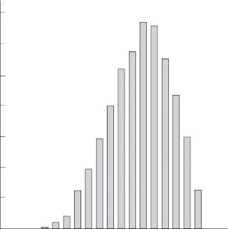

---
jupyter:
  jupytext:
    metadata_filter:
      notebook:
        additional: all
        excluded:
        - language_info
    text_representation:
      extension: .Rmd
      format_name: rmarkdown
      format_version: '1.0'
      jupytext_version: 0.8.6
  kernelspec:
    display_name: Python 3
    language: python
    name: python3
resampling_with:
    ed2_fname: 17-Chap-13
---

```{r setup, include=FALSE}
source("_common.R")
```

# Point Estimation

:::{.callout-warning}
## Draft page partially ported from original PDF

This page is an automated and partial import from the [original second-edition
PDF](https://resample.com/content/text/17-Chap-13.pdf).

We are in the process of updating this page for formatting, and porting any
code from the original [RESAMPLING-STATS
language](http://www.statistics101.net) to Python and R.

Feel free to read this version for the sense, but expect there to be multiple
issues with formatting.

We will remove this warning when the page has adequate formatting, and we have
ported the code.
:::


One of the great questions in statistical inference is: How big is it?
This can mean — How long? How deep? How much time? At what angle?

This question about size may pertain to a single object, of which there
are many measurements; an example is the location of a star in the
heavens. Or the question may pertain to a varied set of elements and
their measurements; examples include the effect of treatment with a
given drug, and the incomes of the people of the United States in 1994.

From where the observer stands, having only the evidence of a sample in
hand, it often is impossible to determine whether the data represent
multiple observations of a single object, or single (or multiple)
observations of multiple objects. For example, from crude measurements
of weight you could not know whether one person is being weighed
repeatedly, or several people have been weighed once. Hence all the
following discussion of point estimation is the same for both of these
situations.

The word "big" in the first sentence above is purposely vague, because
there are many possible kinds of estimates that one might wish to make
concerning a given object or collection. For a single object like a
star, one surely will wish to make a best guess about its location. But
about the effects of a drug treatment, or the incomes of a nation, there
are many questions that one may wish to answer. The *average* effect or
income is a frequent and important object of our interest. But one may
also wish to know about the amount of *dispersion* in the distribution
of treatment effects, or of incomes, or the sym-

metry of the distribution. And there are still other questions one may
wish to answer.

Even if we focus on the average, the issue often is less clear cut than
we may think at first. If we are to choose a single number to
characterize the population (universe) from which a given set of data
has been drawn, what should that representative number be for the case
at hand? The answer must depend on the purpose with which we ask the
question, of course. There are several main possibilities such as the
mean, the median, and the mode.

Even if we confine our attention to the mean as our measure of the
central tendency of a distribution, there are various ways of estimating
it, each of them having a different rationale. The various methods of
estimation often lead to the same estimate, especially if the
distribution is symmetric (such as the distribution of errors you make
in throwing darts at a dart board). But in an asymmetric case such as a
distribution of incomes, the results may differ among the contending
modes of estimation. So the entire topic is more messy than appears at
first look. Though we will not inquire into the complexities, it is
important that you understand that the matter is not as simple as it may
seem. (See @savage1972foundations, Chapter 15, for more discussion of this topic.)

## Ways to estimate the mean

**The Method of Moments**

Since elementary school you have been taught to estimate the mean of a
universe (or calculate the mean of a sample) by taking a simple
arithmetic average. A fancy name for that process is "the method of
moments." It is the equivalent of estimating the center of gravity of a
pole by finding the place where it will balance on your finger. If the
pole has the same size and density all along its length, that balance
point will be halfway between the endpoints, and the point may be
thought of as the arithmetic average of the distances from the balance
point of all the one-centimeter segments of the pole.

Consider this example:

**Example 13-1: Twenty-nine Out of Fifty People Polled Say They Will
Vote For The Democrat. Who Will Win The Election? The Relationship
Between The Sample Proportion and The Population Proportion in a
Two-Outcome Universe.**

You take a random sample of 50 people in Maryland and ask which party's
candidate for governor they will vote for. Twenty-nine say they will
vote for the Democrat. Let's say it is reasonable to assume in this case
that people will vote exactly as they say they will. The statistical
question then facing you is: What proportion of the voters in Maryland
will vote for the Democrat in the general election?

Your intuitive best guess is that the proportion of the
"universe" — which is composed of voters in the general election, in
this case — will be the same as the proportion of the sample. That is,
58 percent = 29/50 is likely to be your guess about the proportion that
will vote Democratic. Of course, your estimate may be too high or too
low in this particular case, but in the long run — that is, if you take
many samples like this one — on the average the sample mean will equal
the universe (population) proportion, for reasons to be discussed later.

The sample mean seems to be the "natural" estimator of the population
mean in this and many other cases. That is, it seems quite natural to
say that the best estimate is the sample mean, and indeed it probably is
best. But why? This is the problem of inverse probability that has
bedeviled statisticians for two centuries.

If the only information that you have (or that seems relevant) is the
evidence of the sample, then there would seem to be no basis for judging
that the shape and location of the population differs to the "left" or
"right" from that of the sample. That is often a strong argument.

Another way of saying much the same thing: If a sample has been drawn
randomly, each single observation is a representative estimator of the
mean; if you only have one observation, that observation is your best
guess about the center of the distribution (if you have no reason to
believe that the distribution of the population is peculiar — such as
not being symmetrical). And therefore the sum of 2, 3...n of such
observations (divided by their number) should have that same property,
based on basic principles.

But if you are on a ship at sea and a leaf comes raining down from the
sky, your best guess about the location of the tree from which it comes
is not directly above you, and if two leaves fall, the midpoint of them
is not the best location guess, either; you know that trees don't grow
at sea, and birds sometimes carry leaves out to sea.

We'll return to this subject when we discuss criteria of methods.

**Expected Value and the Method of Moments**

Consider this gamble: You and another person roll a die. If it falls
with the "6" upwards you get \$4, and otherwise you pay

\$1. If you play 120 times, at the end of the day you would expect to
have (20\*\$4 - 100\*\$1 =) -\$20 dollars. We say that -\$20 is your
"expected value," and your expected value per roll is (-\$20/120 =)
\$.166 or the loss of 1/6 of a dollar. If you get \$5 instead of \$4,
your expected value is \$0.

This is exactly the same idea as the method of moments, and we even use
the same term — "expected value," or "expectation" — for the outcome of
a calculation of the mean of a distribution. We say that the expected
value for the success of rolling a "6" with a single cast of a die is
1/6, and that the expected value of rolling a "6" or a "5" is (1/6 + 1/6
= ) 2/6.

**The Maximum Likelihood Principle**

Another way of thinking about estimation of the population mean asks:
Which population(s) would, among the possible populations, have the
highest probability of producing the observed sample? This criterion
frequently produces the same answer as the method of moments, but in
some situations the estimates differ. Furthermore, the logic of the
maximum-likelihood principle is important.

Consider that you draw without replacement six balls — 2 black and 4
white — from a bucket that contains twenty balls. What would you guess is
the composition of the bucket from which they were drawn? Is it likely that
those balls came from a bucket with 4 white and 16 black balls? Rather
obviously not, because it would be most unusual to get all the 4 white
balls in your draw. Indeed, we can estimate the probability of that
happening with simulation or formula to be about .003.

How about a bucket with 2 black and 18 whites? The probability is much
higher than with the previous bucket, but it still is low — about .075.

Let us now estimate the probabilities for all buckets across the range of
probabilities. In Figure 13-1 we see that the bucket with the highest
probability of producing the observed sample has the same proportions of
black and white balls as does the sample. This is called the "maximum
likelihood universe." Nor should this be very surprising, because that
universe obviously has an equal chance of producing samples with
proportions below and above that observed proportion — as was discussed
in connection with the method of moments.

We should note, however, that the probability that even such a
maximum-likelihood universe would produce *exactly* the observed sample
is very low (though it has an even lower probability of producing any
*other* sample).

.14

.12

.10

Probability

.08

.06

.04

.02

0

4 White and 2 Black Balls in the Sample



2 4 6 8 10 12 14 16 18 20

Number of White Balls in the Universe (N=20)

**Figure 13-1**

**Choice of Estimation Method**

When should you base your estimate on the method of moments, or of
maximum likelihood, or still some other principle? There is no general
answer. Sound estimation requires that you think long and hard about the
purpose of your estimation, and fit the method to the purpose. I am well
aware that this is a very vague statement. But though it may be an
uncomfortable idea to live with, guidance to sound statistical method
must be vague because it requires sound judgment and deep knowledge of
the particular set of facts about the situation at hand.

## Criteria of estimates

How should one judge the soundness of the process that produces an
estimate? General criteria include *representativeness* and *accuracy* .
But these are pretty vague; we'll have to get more specific.

**Unbiasedness**

Concerning representativeness: We want a procedure that will not be
systematically in error in one direction or another. In technical terms,
we want an "unbiased estimate," if possible. "Unbiased" in this case
does not mean "friendly" or "unprejudiced," but rather implies that on
the average — that is, in the long run, after taking repeated
samples — estimates that are too high will about balance (in percentage
terms) those that are too low. The mean of the universe (or the
proportion, if we are speaking of two-valued "binomial situations") is a
frequent object of our interest. And the sample mean is (in most cases)
an unbiased estimate of the population mean.

Let's now see an informal proof that the mean of a randomlydrawn sample
is an "unbiased" estimator of the population mean. That is, the errors
of the sample means will cancel out after repeated samples because the
mean of a large number of sample means approaches the population mean. A
second "law" to be informally proven is that the size of the inaccuracy
of a sample proportion is largest when the population proportion is near
50 percent, and smallest when it approaches zero percent or 100 percent.

The statement that the sample mean is an unbiased estimate of the
population mean holds for *many but not all kinds* of
samples — proportions of two-outcome (Democrat-Republican) events (as in
this case) and also the means of many measured-data universes (heights,
speeds, and so on) that we will come to later.

But, you object, I have only *said* that this is so; I haven't proven
it. Quite right. Now we will go beyond this simple assertion, though we
won't reach the level of formal proof. This discussion applies to
conventional analytic statistical theory as well as to the resampling
approach.

We want to know why the mean of a repeated sample — or the proportion,
in the case of a binomial universe — tends to equal the mean of the
universe (or the proportion of a binomial sample). Consider a population
of one thousand voters. Split the population into random sub-populations
of 500 voters each; let's call these sub-populations by the name
"samples." Almost inevitably, the proportions voting Democratic in the
samples will *not exactly* equal the "true" proportions in the
population. (Why not? Well, why should they split evenly? There is no
general reason why they should.) But if the sample proportions do *not*
equal the population proportion, we can say that the extent of the
difference between the two sample proportions and the population
proportion will be *identical but in the opposite direction* .

If the population proportion is 600/1000 = 60 percent, and one sample's
proportion is 340/500 = 68 percent, then the other sample's proportion
must be (600-340 = 260)/500 = 52 percent. So if in the very long run you
would choose each of these two samples about half the time (as you would
if you selected between the two samples randomly) the average of the
sample proportions would be (68 percent + 52 percent)/2 = 60 percent.
This shows that on the average the sample proportion is a fair and
unbiased estimate of the population proportion — if the sample is half
the size of the population.

If we now sub-divide each of our two samples of 500 (each of which was
half the population size) into equal-size subsamples of 250 each, the
same argument will hold for the proportions of the samples of 250 with
respect to the sample of 500: The proportion of a 250-voter sample is an
unbiased estimate of the proportion of the 500-voter sample from which
it is drawn. It seems inductively reasonable, then, that if the
proportion of a 250-voter sample is an unbiased estimate of the
500-voter sample from which it is drawn, and the proportion of a
500-voter sample is an unbiased estimate of the 1000-voter population,
then the proportion of a 250-voter sample should be an unbiased estimate
of the population proportion. And if so, this argument should hold for
samples of 1/2 x 250 = 125, and so on — in fact for *any* size sample.

The argument given above is not a rigorous formal proof. But I doubt
that the non-mathematician needs, or will benefit from, a more formal
proof of this proposition. You are more likely to be persuaded if you
demonstrate this proposition to yourself experimentally in the following
manner:

**Step 1.** Let "1-6" = Democrat, "7-10" = Republican

**Step 2.** Choose a sample of, say, ten random numbers, and record the
proportion Democrat (the sample proportion).

**Step 3.** Repeat step 2 a thousand times.

**Step 4.** Compute the mean of the sample proportions, and compare it
to the population proportion of 60 percent. This result should be close
enough to reassure you that *on the average* the sample proportion is an
"unbiased" estimate of the population proportion, though in any
particular sample it may be substantially off in either direction.

**Efficiency**

We want an estimate to be accurate, in the sense that it is as close to
the "actual" value of the parameter as possible. Sometimes it is
possible to get more accuracy at the cost of biasing the estimate. More
than that does not need to be said here.

**Maximum Likelihood**

Knowing that a particular value is the most likely of all values may be
of importance in itself. For example, a person betting on one horse in a
horse race is interested in his/her estimate of the winner having the
highest possible probability, and is not the slightest bit interested in
getting *nearly* the right horse. Maximum likelihood estimates are of
particular interest in such situations.

See [@savage1972foundations, Chapter 15], for many other criteria of
estimators.

**Criteria of the Criteria**

What should we look for in choosing criteria? Logically, this question
should precede the above list of criteria.

Savage [-@savage1972foundations, Chapter 15] has urged that we should always
think in terms of the *consequences* of choosing criteria, in light of our
purposes in making the estimate. I believe that he is making an important
point. But it often is very hard work to think the matter through all the way
to the consequences of the criteria chosen. And in most cases, such fine
inquiry is not needed, in the sense that the estimating procedure chosen will
be the same no matter what consequences are considered.

## Estimation of accuracy of the point estimate

So far we have discussed how to make a point estimate, and criteria of
good estimators. We also are interested in estimating the accuracy of
that estimate. That subject — which is harder to grapple with — is
discussed in Chapters 20 and 21 on confidence intervals.

Most important: One cannot sensibly talk about the accuracy of
probabilities in the abstract, without reference to some set of facts.
In the abstract, the notion of accuracy loses any meaning, and invites
confusion and argument.

## Uses of the mean

Let's consider when the use of a device such as the mean is valuable, in
the context of the data on marksmen in Table 13-1.[^gnedenko]. If we wish to
compare marksman A versus marksman B, we can immediately see that marksman
A hit the bullseye (80 shots for 3 points each time) as many times as marksman
B hit *either* the bullseye or simply got in the black (30 shots for 3 points
and 50 shots for 2 points), and A hit the black (2 points) as many times as
B just got in the white (1 point). From these two comparisons covering all the
shots, in both of which comparisons A does better, it is immediately obvious
that marksman A is better than marksman B. We can say that A's score
*dominates* B's score.

[^gnedenko]: This discussion follows [@gnedenko1962elementary, Chapter 8].

Table 13-1

**Score No. of Occurrences Percent / Probability**

  --- ---------------- ----
      **Marksman A**   
  1   0                0
  2   20               .2
  3   80               .8
      **Marksman B**   
  1   20               .2
  2   50               .5
  3   30               .3
      **Marksman C**   
  1   40               .4
  2   10               .1
  3   50               .5
      **Marksman D**   
  1   10               .1
  2   60               .6
  3   30               .3
  --- ---------------- ----

When we turn to comparing marksman C to marksman D, however, we cannot
say that one "dominates" the other as we could with the comparison of
marksmen A and B. Therefore, we turn to a summarizing device. One such
device that is useful here is the mean. For marksman C the mean score is
(40\*1)

\+ (10\*2) + (50\*3) = 210, while for marksman D the mean score is
(10\*1) + (60\*2) + (30\*3) = 220. Hence we can say that D is better
than C even though D's score does not dominate C's score in the bullseye
category.

Another use of the mean [@gnedenko1962elementary, p. 68] is shown in the
estimation of the number of matches that we need to start fires for an
operation carried out 20 times in a day (Table 13- 2). Let's say that the
number of cases where s/he needs 1, 2 \... 5 matches to start a fire are as
follows (along with their probabilities) based on the last 100 fires started:

Table 13-2

  ----------------------- --------------------- -------------------
  **Number of Matches**   **Number of Cases**   **Probabilities**
  1                       7                     .16
  2                       16                    .16
  3                       55                    .55
  4                       21                    .21
  5                       1                     .01
  ----------------------- --------------------- -------------------

If you know that the operator will be lighting twenty fires, you can
estimate the number of matches that s/he will need by multiplying the
mean number of matches (which turns out be 1\*.07 + 2\*0.16 + 3\* 0.55 +
4\*0.21 + 5\*0.01 = 2.93 ) in the ob-

served experience by 20. Here you are using the mean as an indication of
a representative case.

It is common for writers to immediately produce the data in the forms of
percentages or probabilities. But I think it is important to include in
our discussion the absolute numbers, because this is what one must begin
with in practice. And keeping the absolute numbers in mind is likely to
avoid some confusions that arise if one immediately goes to percentages
or to probabilities.

Still another use for the mean is when you have a set of observations
with error in them. The mean of the observations probably is your best
guess about which is the "right" one. Furthermore, the distance you are
likely to be off the mark is less if you select the mean of the
observations. An example might be a series of witnesses giving the
police their guesses about the height of a man who overturned an
outhouse. The mean probably is the best estimate to give to police
officers as a description of the perpetrator (though it would be helpful
to give the range of the observations as well).

We use the mean so often, in so many different circumstances, that we
become used to it and never think about its nature. So let's do so a bit
now.

Different statistical ideas are appropriate for business and engineering
decisions, biometrics, econometrics, scientific explanation (the
philosophers' case), and other fields. So nothing said here holds
everywhere and always.

One might ask: What is the "meaning" of a mean? But that is not a
helpful question. Rather, we should ask about the *uses* of a mean.
Usually a mean is used to summarize a set of data. As we saw with
marksmen C and D, it often is difficult to look at a table of data and
obtain an overall idea of how big or how small the observations are; the
mean (or other measurements) can help. Or if you wish to compare two
sets of data where the distributions of observations overlap each other,
comparing the means of the two distributions can often help you better
understand the matter.

Another complication is the confusion between *description* and
*estimation* , which makes it difficult to decide where to place the
topic of descriptive statistics in a textbook. For example, compare the
mean income of all men in the U. S., as measured by the decennial
census. This mean of the universe can have a very different meaning from
the mean of a sample of men with respect to the same characteristic. The
sample mean is a point estimate, a statistical device, whereas the mean
of the universe is a description. The use of the mean as an estimator is
fraught with complications. Still, maybe it is no more complicated than
deciding what describer to use for a population. This entire matter is
much more complex than it appears at first glance.

When the sample size approaches in size the entire population — when the
sample becomes closer and closer to being the *same* as the
population — the two issues blend. What does that tell us? Anything?
What is the relationship between a baseball player's average for two
weeks, and his/her lifetime average? This is subtle stuff — rivaling the
subtleness of arguments about inference versus probability, and about
the nature of confidence limits (see Chapters 20 and 21). Maybe the only
solid answer is to try to stay super-clear on what you are doing for
what purpose, and to ask continually what job you want the statistic (or
describer) to do for you.

The issue of the relationship of sample size to population size arises
here. If the sample size equals or approaches the population size, the
very notion of estimation loses its meaning.

The notion of "best estimator" makes no sense in some situations,
including the following: a) You draw one black ball from a bucket. You
cannot put confidence intervals around your estimate of the proportion
of black balls, except to say that the proportion is somewhere between 1
and 0. No one would proceed without bringing in more information. That
is, when there is almost no information, you simply cannot make much of
an estimate — and the resampling method breaks down, too. It does not
help much to shift the discussion to the models of the buckets, because
then the issue is the unknown population of the buckets, in which case we
need to bring in our general knowledge. b) When the sample size equals
or is close to the population size, as discussed in Chapter 13, the data
are a description rather than an estimate, because the sample is getting
to be much the same as the universe; that is, if there are twelve people
in your family, and you randomly take a sample of the amount of sugar
used by eight members of the family, the results of the sample cannot be
very different than if you compute the amount for all twelve family members.
In such a case, the interpretation of the mean becomes complex.

Underlying all estimation is the assumption of continuation, which
follows from random sampling — that there is no reason to expect the
next sample to be different from the present one in any *particular*
fashion, mean or variation. But we do expect it to be different in
*some* fashion because of sampling variability.

## Conclusion

A *Newsweek* article says, "According to a recent reader's survey in
Bride's magazine, the average blowout \[wedding\] will set you back
about \$16,000" (Feb 15, 1993, p. 67). That use of the mean (I assume)
for the average, rather than the median, could cost the parents of some
brides a pretty penny. It could be that the cost for the average
*person* — that is, the median expenditure — might be a lot less than
\$16,000. (A few million dollar weddings could have a huge effect on a
survey mean.) An inappropriate standard of comparison might enter into
some family discussions as a result of this article, and cause higher
outlays than otherwise. This chapter helps one understand the nature of
such estimates.
