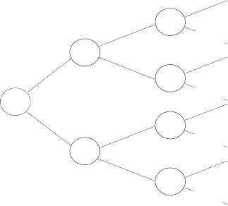

---
jupyter:
  jupytext:
    metadata_filter:
      notebook:
        additional: all
        excluded:
        - language_info
    text_representation:
      extension: .Rmd
      format_name: rmarkdown
      format_version: '1.0'
      jupytext_version: 0.8.6
  kernelspec:
    display_name: Python 3
    language: python
    name: python3
resampling_with:
    ed2_fname: 09-Chap-5
---

```{r setup, include=FALSE}
source("_common.R")
```

# Probability Theory Part I (continued)

:::{.callout-warning}
## Draft page partially ported from original PDF

This page is an automated and partial import from the [original second-edition
PDF](https://resample.com/content/text/09-Chap-5.pdf).

We are in the process of updating this page for formatting, and porting any
code from the original [RESAMPLING-STATS
language](http://www.statistics101.net) to Python and R.

Feel free to read this version for the sense, but expect there to be multiple
issues with formatting.

We will remove this warning when the page has adequate formatting, and we have
ported the code.
:::


## The special case of independence

A key concept in probability and statistics is that of the independence
of two events in which we are interested. Two events are said to be
"independent" when one of them does not have any apparent relationship
to the other. If I flip a coin that I know from other evidence is a fair
coin, and I get a head, the chance of then getting *another* head is
still 50-50 (one *in* two, or one *to* one.) And, if I flip a coin ten
times and get heads the first nine times, the probability of getting a
head on the tenth flip is *still* 50-50. Hence the concept of
independence is characterized by the phrase "The coin has no memory."
(Actually the matter is a bit more complicated. If you had previously
flipped the coin many times and knew it to be a fair coin, then the odds
would still be 50-50, even after nine heads. But, if you had never seen
the coin before, the run of nine heads might reasonably make you doubt
that the coin was a fair one.)

In the Washington Commanders example above, we needed a different set of
buckets to estimate the probability of a *nice* day plus a win, and of a
*nasty* day plus a win. But what if the Commanders' chances of winning are the
same whether the day is nice or nasty? If so, we say that the chance of
winning is *independent* of the kind of day. That is, in this special case,
**P(win\|nice day) = P(win\|nasty day) and P(nice day and win) = P(nice day)
\* P(winning\|nice day) = P(nice day) \* P(winning)**

**Note:** See chapter 4's section on conditional and unconditional
probabilities for an explanation of this notation.

In this case we need only one set of two buckets to make all the estimates.

Independence means that the elements are drawn from 2 or more *separate
sets of possibilities* . That is, **P(A\|B) = P(A\|\^B) = P(A) and vice
versa** .

<!---
Work on explosition here.  Maybe note that independence means that chances of A following B are same as chances of A following not B.[
-->


In other words, if the occurrence of the first event does not change
this probability that the second event will occur, then the events are
independent.

Another way to put the matter: Events A and B are said to be independent
of each other if *knowing* whether A occurs does not change the
probability that B will occur, and vice versa. If knowing whether A does
occur alters the probability of B occurring, then A and B are dependent.

If two events are independent, the multiplication rule simplifies to
**p(A and B) = p(A) \* p(B)** . I'll repeat once more: **This rule is
simply a mathematical shortcut, and one can make the desired estimate by
simulation.**

Also again, if two events are *not* independent — that is, if P(A\|B) is
not equal to P(A) because P(A) is dependent upon the occurrence of B,
then the formula to be used now is, **p(A and B) = p(A\|B) \* p(B)** ,
which is sufficiently confusing that you are probably better off with a
simulation.

What about if each of the probabilities is dependent on the other
outcome? There is no easy formulaic method to deal with such a
situation.

People commonly make the mistake of treating independent events as
non-independent, perhaps from superstitious belief. After a long run of
blacks, roulette gamblers say that the wheel is "due" to come up red.
And sportswriters make a living out of interpreting various sequences of
athletic events that occur by chance, and they talk of teams that are
"due" to win because of the "Law of Averages." For example, if Barry
Bonds goes to bat four times without a hit, all of us (including trained
statisticians who really know better) *feel* that he is "due" to get a
hit and that the probability of his doing so is very high — higher that
is, than his season's average. The so-called "Law of Averages" implies
no such thing, of course.

Events are often dependent in subtle ways. A boy may telephone one of
several girls chosen at random. But, if he calls the same girl *again*
(or if he does *not* call her again), the second event is not likely to
be independent of the first. And the probability of his calling her is
*different* after he has gone out with her once than before he went out
with her.

As noted in the section above, events A and B are said to be independent
of each other if the *conditional probabilities of A and B remain the
same* . And the conditional probabilities remain the same if sampling is
conducted *with replacement* .

<!---
Needs more explanation.
-->


Let's now re-consider the multiplication rule with the special but
important case of independence.

**Example 5-1: Four Events in a Row — The Multiplication Rule**

Assume that we want to know the probability of four successful archery
shots in a row, where the probability of a success on a given shot is
.25.

Instead of simulating the process with resampling trials we can, if we
wish, arrive at the answer with the "multiplication rule." This rule
says that the probability that *all* of a given number of *independent
events* (the successful shots) will occur (four out of four in this
case) is the *product* of their individual probabilities — in this case,
1/4 x 1/4 x 1/4 x 1/4 = 1/256. If in doubt about whether the
multiplication rule holds in any given case, however, you may check by
resampling simulation. For the case of four daughters in a row, assuming
that the probability of a girl is .5, the probability is 1/2 x 1/2 x 1/2
x 1/2 = 1/16.

Better yet, we'd use the more exact probability of getting a girl:
100/206, and multiply (100/206) ^4^ . An important point here, however:
We have estimated the probability of a *particular* family having four
daughters as 1 in 16 — that is, odds of 15 to 1. But note well: This is
a very different idea from stating that the odds are 15 to 1 against
*some* family's having four daughters in a row. In fact, as many
families will have four girls in a row as will have boy-girl-boy-girl in
that order or girl-boy-girl-boy or *any other series* of four children.
The chances against any particular series is the same — 1 in 16 — and
one-sixteenth of all four-children families will have each of these
series, on average. This means that if your next-door neighbor has four
daughters, you cannot say how much "out of the ordinary" the event is.
It is easy to slip into unsound thinking about this matter.

<!---
Needs more explanation
-->


Why do we *multiply* the probabilities of the independent simple events
to learn the probability that they will occur jointly (the composite
event)? Let us consider this in the context of three basketball shots
each with 1/3 probability of hitting.



2/3 Miss

2/3 Miss

2/3 Miss

1/3 Hit

1/3 Hit

1/3 Hit

1/3 Hit

Figure 5-1 is a tree diagram showing a set of sequential simple events
where each event is conditional upon a prior simple event. Hence every
probability after the first is a *conditional* probability.

Success = 1/3 x 1/3 x 1/3 = 1/27

2/3 Miss

2/3 Miss

2/3 Miss

2/3 Miss

1/3 Hit

1/3 Hit

1/3 Hit

**Figure 5-1: Tree Diagram for 3 Basketball Shots, Probability of a Hit
is 1 / 3**

In Figure 5-1, follow the top path first. On approximately one-third of
the occasions, the first shot will hit. *Among that third* of the first
shots, roughly a third will *again* hit on the second shot, that is, 1/3
of 1/3 or 1/3 x 1/3 = 1/9. The top path makes it clear that in 1/3 x 1/3
= 1/9 of the trials, *two* hits in a row will occur. Then, of the 1/9 of
the total trials in which two hits in a row occur, about 1/3 will go on
to a *third* hit, or 1/3 x 1/3 x 1/3 = 1/27. Remember that we are
dealing here with independent events; regardless of whether the player
made his first two shots, the probability is still 1 in 3 on the third
shot.

## The addition of probabilities

Back to the Washington Redskins again. You ponder more deeply the
possibility of a nasty day, and you estimate with more discrimination
that the probability of snow is .1 and of rain it is .2 (with .7 of a
nice day). Now you wonder: What is the probability of a rainy day *or* a
nice day?

To find this probability by simulation:

1.  Put 7 blue balls (nice day), 1 black ball (snowy day) and 2 gray
    balls (rainy day) into a bucket. You want to know the probability of a
    blue *or* a gray ball. To find this probability:

2.  Draw one ball and record "yes" if its color is blue or gray, "no"
    otherwise.

3.  Repeat step 1 perhaps 200 times.

4.  Find the proportion of "yes" trials.

This procedure certainly will do the job. And simulation may be
unavoidable when the situation gets more complex. But in this simple
case, you are likely to see that you can compute the probability by
*adding* the .7 probability of a nice day and the .2 probability of a
rainy day to get the desired probability. This procedure of formulaic
deductive probability theory is called the *addition rule* .

## The addition rule

The addition rule applies to *mutually exclusive* outcomes — that is,
the case where if one outcome occurs, the other(s) cannot occur; one
event implies the absence of the other when events are mutually
exclusive. Green and red coats are mutually exclusive if you never wear
more than one coat at a time. If there are only two possible
mutually-exclusive outcomes, the outcomes are *complementary* . It may
be helpful to note that mutual exclusivity equals total dependence; if
one outcome occurs, the other cannot. Hence we write formally that

`           If p(A and B) = 0         `

`           P(A or B) = P(A) + P((B)         `

An outcome and its *absence* are mutually exclusive, and add to unity.

`           P(A) + P(^A) = 1.         `

Examples include a) rain and no rain, and b) if P(sales \> \$1mil)

= .2, P(sales =\< \$1mil) = .8.

As with the multiplication rule, the addition rule can be a useful
shortcut. The answer can always be obtained by simulation, too.

We have so far implicitly assumed that a rainy day and a snowy day are
mutually exclusive. But that need not be so; both rain and snow can
occur on the same day; if we take this possibility into account, we
cannot then use the addition rule.

Consider the case in which seven days in ten are nice, one day is rainy,
one day is snowy, *and* one day is *both* rainy and snowy. What is the
chance that it will be either nice or snowy? The procedure is just as
before, except that some rainy days are included because they are also
snowy.

When A and B are *not* mutually exclusive — when it is possible that the
day might be both rainy and snowy, or you might wear both red and green
coats on the same day, we write (in the latter case) P(red and green
coats) \> 0, and the appropriate formula is

`           P(red or green) = P(red) + p(green)—P(red and green)         `

<!---
Venn diagram?  Do we need this exposition though?
-->


In this case as in much of probability theory, the simulation for the
case in which the events are not mutually exclusive is no more complex
than when they are mutually exclusive; indeed, if you simulate you never
even need to know the concept of mutual exclusivity or inquire whether
that is your situation. In contrast, the appropriate formula for
non-exclusivity is more complex, and if one uses formulas one must
inquire into the characteristics of the situation and decide which
formula to apply depending upon the classification; if you classify
wrongly and therefore apply the wrong formula, the result is a wrong
answer.

<!---
Maybe implement here to show the above.
-->


To repeat, the addition rule only works when the probabilities you are
adding are *mutually exclusive* — that is, when the two cannot occur
together.

The multiplication and addition rules are as different from each other
as mortar and bricks; both, however, are needed to build walls. The
multiplication rule pertains to a single outcome composed of two or more
elements (e.g. weather, and win-or-lose), whereas the addition rule
pertains to two or more possible outcomes for one element. Drawing from
a card deck (with replacement) provides an analogy: the addition rule is
like one draw with two or more possible cards of interest, whereas the
multiplication rule is like two or more cards being drawn with one
particular "hand" being of interest.

## Theoretical devices for the study of probability

It may help you to understand the simulation approach to estimating
composite probabilities demonstrated in this book if you also understand
the deductive formulaic approach. So we'll say a bit about it here.

The most fundamental concept in theoretical probability is the list of
events that may occur, together with the probability of each one (often
arranged so as to be equal probabilities). This is the concept that
Galileo employed in his great fundamental work in theoretical
probability about four hundred years ago when a gambler asked Galileo
about the chances of getting a nine rather than a ten in a game of three
dice (though others such as Cardano had tackled the subject earlier).
[^card-confusion]

[^card-confusion]: Here is another example of the confusion on such matters,
this one written by Charles Cotton (part-author of *The Complete Angler* ) in
\1674: Now six and eight one would think should admit of no difference in
advantage with seven, but if you will rightly consider the case, and be so vain
to make trial thereof, you will find a great advantage in seven over six and
eight. How can that be you will say, hath not six, seven and eight equal
chances? For example, in six, quarter deuce and two treys; in eight, six deuce,
cinque trey, and two quarters; and hath not seven three as aforesaid? It is
confest; but pray consider the disadvantage in the doublets, two treys and two
quarters, and you will find that six deuce is sooner thrown than two quarters,
and so consequently, cinque Ace or quarter deuce sooner than two treys: I saw
an old rook once take up a young fellow in a tavern, upon this very score: the
bargain was made that the rook should have seven always and the young gentleman
six, and throw continually; agreed to play they went, the rook got the first
day ten pound, the next day the like sum; and so for six days together losing
in all threescore pounds; notwithstanding the gentleman, I am confident, had
square dice, and threw them always himself. (cited in Bulmer 1979, p. 20)
Bulmer, M.G., *Principles of Statistics* (New York: Dover Publications, Inc.,
1979).

Galileo wrote down all the possibilities in a tree form, a refinement
for mapping out the sample space.

Galileo simply displayed the events themselves — such as "2," "4," and
"4," making up a total of 10, a specific event arrived at in a specific
way. Several different events can lead to a 10 with three dice. If we
now consider each of these events, we arrive at the concept of the
*ways* that a total of 10 can arise. We ask the number of ways that an
outcome can and cannot occur. (See the paragraph above). This is equivalent
both operationally and linguistically to the *paths* in (say) the quincunx
device or Pascal's Triangle which we shall discuss shortly.

A *tree* is the most basic display of the paths in a given situation.
Each branch of the tree — a unique path from the start on the left-hand
side to the endpoint on the right-hand side — contains the *sequence of
all the elements* that make up that event, in the order in which they
occur. The right-hand ends of the branches constitute a list of the
outcomes. That list includes all possible permutations — that is, it
distinguishes among outcomes by the orders in which the particular die
outcomes occur.

## The Concept of Sample Space

The formulaic approach begins with the idea of *sample space* , which is
the set of all possible outcomes of the "experiment" or other situation
that interests us. Here is a formal definition from Goldberg (1960/1986,
p. 46):

A *sample space S* associated with a real or conceptual experiment is a
set such that (1) each element of S denotes an outcome of the
experiment, and (2) any performance of the experiment results in an
outcome that corresponds to one and only one element of S.

Because the sum of the probabilities for all the possible outcomes in a
given experimental trial is unity, the sum of all the events in the
sample space (S) = 1.

Early on, people came up with the idea of estimating probabilities by
arraying the possibilities for, and those against, the event occurring.
For example, the coin could fall in three ways — head, tail, or on its
side. They then speedily added the qualification that the possibilities
in the list must have an equal chance, to distinguish the coin falling
on its side from the other possibilities (so ignore it). Or, if it is
impossible to make the probabilities equal, make special allowance for
inequality. Working directly with the sample space is the *method of
first principles* . The idea of a list was refined to the idea of sample
space, and "for" and "against" were refined to the "success" and
"failure" elements among the total elements.

The concept of sample space raises again the issue of how to estimate
the simple probabilities. While we usually can estimate the
probabilities accurately in gambling games because we ourselves
construct the games and therefore control the probabilities that they
produce, we have much less knowledge of the structures that underlie the
important problems in life — in science, business, the stock market,
medicine, sports, and so on. We therefore must wrestle with the issue of
what probabilities we should include in our theoretical sample space, or
in our experiments. Often we proceed by choosing as an analogy a
physical "model" whose properties we know and which we consider to be
appropriate — such as a gambling game with coins, dice, cards. This
model becomes our idealized setup. But this step makes crystal-clear
that judgment is heavily involved in the process, because choosing the
analogy requires judgment.

A *Venn diagram* is another device for displaying the elements that make
up an event. But unlike a tree diagram, it does not show the sequence of
those elements; rather, it shows the *extent of overlap among various
classes of elements* .

A Venn diagram expresses by *areas* (especially rectangular Venn
diagrams) the numbers at the end of the branches in a tree.

Pascal's Triangle is still another device. It aggregates the last
permutation branches in the tree into *combinations* — that is, without
distinguishing by order. It shows analytically (by tracing them) the
various paths that lead to various combinations.

The study of the mathematics of probability is the study of
calculational shortcuts to do what tree diagrams do. If you don't care
about the shortcuts, then you don't need the formal mathematics\--though
it may improve your mathematical insight (or it may not). The resampling
method dispenses not only with the shortcuts but also with the entire
counting of points in the sample space.

## Endnotes

1.  The material in this chapter is largely drawn from Simon (1969; 3rd
    edition with Paul Burstein, 1985).

2.  A given probability may be expressed in terms of probability, odds,
    or chances, and I shall use all three terms to help familiarize you
    with them. If the chances are 1 in 10, the odds are 9 to 1, and the
    probability is .1. If the odds are 2 to 5, the chances are 5 in 7,
    and the probability is 5/7. If the odds are 99 to 1, the chances are
    1 in 100, and the probability is .01. If the odds are 100 to 1, the
    chances are 1 in 101, and the probability is 1/101. "Likelihood" is
    a term related to "probability" but is not a complete synonym for
    it.

3.  I hope you are not offended by the references to gambling games in
    the discussion of statistics in this and other chapters. Not only
    was the theory of probability invented to answer questions about
    gambling games, but gambling games still provide useful examples.

4.  At one time, some writers believed there was a difference between
    "objectively sharply defined" and "objectively vague" probabilities.
    Raiffa gives a clear example of why this is not so:

    Suppose you are confronted with two options. In option 1, you must
    toss coin 1 (which is fair and true), guess heads or tails, and win
    \$1.00 if you match and lose \$1.00 if you fail to match. In option
    2, you have a 50-50 chance of getting coin 2, which has two heads,
    or of getting coin 3, which has two tails. Not knowing whether you
    are tossing coin 2 or 3, you must call, toss, and get the payoffs as
    in option 1. With option 1, the probability of the toss coming out
    heads is .5; with option 2, the same probability is either 0 or 1,
    and since the chance of each in turn is .5, the probability of heads
    is ultimately .5 once again. Nothing is to be gained by saying that
    one-one-one .5 is sharply defined and that the other is fuzzy. Of
    course, *if* , and this is a big "if," you could experiment with the
    coin you will toss before you are obliged to declare, then the two
    options are manifestly asymmetrical. Barring this privilege, the two
    options are equivalent (Raiffa, 1968, p. 108).

5.  "Universe" and "population" are perfect synonyms in scientific
    research. I choose to use "universe" because it seems to have fewer
    confusing associations.

## Afternote: Useful hints about simple numbers

A useful piece of shortcut knowledge: You can test whether two numbers
are equal by subtracting one from the other; if they are equal, the
result is zero.

Another useful device: You can check whether two units are paired by
giving one a minus and one a plus for the same number, and then adding
them; if the pair appear together, the sum is zero.
