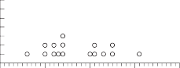
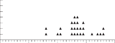
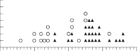

---
jupyter:
  jupytext:
    metadata_filter:
      notebook:
        additional: all
        excluded:
        - language_info
    text_representation:
      extension: .Rmd
      format_name: rmarkdown
      format_version: '1.0'
      jupytext_version: 0.8.6
  kernelspec:
    display_name: Python 3
    language: python
    name: python3
resampling_with:
    ed2_fname: 11-Chap-7
---

# Probability Theory, Part 3

This chapter discusses problems whose appropriate concept of a universe
is not finite, whereas Chapter 8 discusses problems whose appropriate
concept of a universe is finite.

How can a universe be infinite yet known? Consider, for example, the
possible flips with a given coin; the number is not limited in any
meaningful sense, yet we understand the properties of the coin and the
probabilities of a head and a tail.

## Example 7-1: The Birthday Problem

This examples illustrates the probability of duplication in a multi-outcome sample from an infinite universe (File "Birthday").

As an indication of the power *and* simplicity of resampling methods,
consider this famous examination question used in probability courses:
What is the probability that two or more people among a roomful of (say)
twenty-five people will have the same birthday? To obtain an answer we
need simply examine the first twenty-five numbers from the random-number
table that fall between "001" and "365" (the number of days in the
year), record whether or not there is a duplication among the
twenty-five, and repeat the process often enough to obtain a reasonably
stable probability estimate.

Pose the question to a mathematical friend of yours, then watch her or
him sweat for a while, and afterwards compare your answer to hers/his. I
think you will find the correct answer very surprising. It is not
unheard of for people who know how this problem works to take advantage
of their knowledge by making and winning big bets on it. (See how a bit
of knowledge of probability can immediately be profitable to you by
avoiding such unfortunate occurrences?)

More specifically, these steps answer the question for the case of
twenty-five people in the room:

**Step 1.** Let three-digit random numbers "001-365" stand for the 365
days in the year. (Ignore leap year for simplicity.)

**Step 2.** Examine for duplication among the first twenty-five random
numbers chosen "001-365." (Triplicates or higher-order repeats are
counted as duplicates here.) If there is one or more duplicate, record
"yes." Otherwise record "no."

**Step 3.** Repeat perhaps a thousand times, and calculate the
proportion of a duplicate birthday among twenty-five people.

Here is the first experiment from a random-number table, starting at the
top left of the page of numbers and ignoring numbers \>365: 021, 158,
116, 066, 353, 164, 019, 080, 312, 020, 353\...

Now try the program written as follows.

```{python, opts.label="py_ed"}
import numpy as np
```

```{python, opts.label="py_ed"}
n_with_same_birthday = np.zeros(1000)

# Do 1000 trials (experiments)
for i in range(1000):
    # Generate 25 numbers randomly between "1" and "365," put them in a.
    a = np.random.randint(1, 366, size=25)

    # Looking in a, count the number of multiples and put the result in
    # b. We request multiples > 1 because we are interested in any multiple,
    # whether it is a duplicate, triplicate, etc. Had we been interested only in
    # duplicates, we would have put in MULTIPLES a = 2 b.
    counts = np.bincount(a)
    n_duplicates = np.count_nonzero(counts > 1)

    # Score the result of each trial to our store
    n_with_same_birthday[i] = n_duplicates

    # End the loop for the trial, go back and repeat the trial until all 1000
    # are complete, then proceed.

# Determine how many trials had at least one multiple.
k = np.count_nonzero(n_with_same_birthday)

# Convert to a proportion.
kk = k / 1000

# Print the result.
print(kk)
```

Note: The file "birthday" on the Resampling Stats software disk contains
this set of commands.

We have dealt with this example in a rather intuitive and unsystematic
fashion. From here on, we will work in a more systematic, step-by-step
manner. And from here on the problems form an orderly sequence of the
classical types of problems in probability theory (Chapters 7 and 8),
and inferential statistics (Chapters 14 to 22.)

## Example 7-2: Three Daughters Among Four Children

This problem illustrates a problem with two outcomes (Binomial \[1\]) and sampling with Replacement Among Equally Likely Outcomes.

What is the probability that exactly three of the four children in a
four-child family will be daughters?

The first step is to state that the approximate probability that a
single birth will produce a daughter is 50-50 (1 in 2). This estimate is
not strictly correct, because there are roughly 106 male children born
to each 100 female children. But the approximation is close enough for
most purposes, and the 50-50 split simplifies the job considerably.
(Such "false" approximations are part of the everyday work of the
scientist. The appropriate question is not whether or not a statement is
"only" an approximation, but whether or not it is a *good enough*
approximation for your purposes.)

The probability that a fair coin will turn up heads is .50 or 50-50,
close to the probability of having a daughter. Therefore, flip a coin in
groups of four flips, and count how often three of the flips produce
*heads* . (You must decide in *advance* whether three heads means three
girls or three boys.) It is as simple as that.

In resampling estimation it is of the highest importance to work in a
careful, step-by-step fashion — to write down the steps in the
estimation, and then to do the experiments just as described in the
steps. Here are a set of steps that will lead to a correct answer about
the probability of getting three daughters among four children:

**Step 1.** Using coins, let "heads" equal "boy" and "tails" equal
"girl."

**Step 2.** Throw four coins.

**Step 3.** Examine whether the four coins fall with exactly three tails
up. If so, write "yes" on a record sheet; otherwise write "no."

**Step 4.** Repeat step 2 perhaps two hundred times.

**Step 5.** Count the proportion "yes." This proportion is an estimate
of the probability of obtaining exactly 3 daughters in 4 children.

The first few experimental trials might appear in the record sheet as
follows:

**Number of Tails Yes or No**

1 No

0 No

3 Yes

2 No

1.  No

2.  No

-- --

-- --

-- --

The probability of getting three daughters in four births could also be
found with a deck of cards, a random number table, a die, or with
RESAMPLING STATS. For example, half the cards in a deck are black, so
the probability of getting a black card ("daughter") from a full deck is
1 in 2. Therefore, deal a card, record "daughter" or "son," *replace*
the card, shuffle, deal again, and so forth for 200 sets of four cards.
Then count the proportion of groups of four cards in which you got four
daughters.

A RESAMPLING STATS computer solution to the "3Girls" problem mimics the
above steps:

```{python, opts.label="py_ed"}
girl_counts = np.zeros(10000)

# Do 10000 trials
for i in range(10000):

    # Generate 4 numbers at random, either "1" or "2." This is analogous to
    # flipping a coin 4 times to generate 4 heads or tails. We keep these numbers
    # in a, letting "1" represent girls.
    children = np.random.randint(1, 3, size=4)

    # Count the number of girls and put the result in b.
    b = np.count_nonzero(children == 1)

    # Keep track of each trial result in z.
    girl_counts[i] = b

    # End this trial, repeat the experiment until 1000 trials are complete,
    # then proceed.

# Count the number of experiments where we got exactly 3 girls, and put this
# result in k.
n_three_girls = np.count_nonzero(girl_counts == 3)

# Convert to a proportion.
three_girls_prop = n_three_girls / 10000

# Print the results.
print(three_girls_prop)
```

Note: The file "3girls" on the Resampling Stats software disk contains
this set of commands.

Notice that the procedure outlined in the steps above would have been
different (though almost identical) if we asked about the probability of
*three or more* daughters rather than *exactly three* daughters among
four children. For *three or more* daughters we would have scored "yes"
on our scorekeeping pad for *either* three or four heads, rather than
for just three heads. Likewise, in the computer solution we would have
used the command "Count a \>= 3 k."

It is important that, in this case, in contrast to what we did in
Example 6-1 (the introductory poker example), the card is *replaced*
each time so that each card is dealt from a full deck. This method is
known as *sampling with replacement* . One samples with replacement
whenever the successive events are *independent* ; in this case we
assume that the chance of having a daughter remains the same (1 girl in
2 births) no matter what sex the previous births were \[2\]. But, if the
first card dealt is black and would *not* be replaced, the chance of the
second card being black would no longer be 26 in 52 (.50), but rather 25
in 51 (.49), if the first *three* cards are black and would not be
replaced, the chances of the fourth card's being black would sink to 23
in 49 (.47).

To push the illustration further, consider what would happen if we used
a deck of only six cards, half (3 of 6) black and half (3 of 6) red,
instead of a deck of 52 cards. If the chosen card is replaced each time,
the 6-card deck produces the same results as a 52-card deck; in fact, a
two-card deck would do as well. But, if the sampling is done *without*
replacement, it is *impossible* to obtain 4 "daughters" with the 6-card
deck because there are only 3 "daughters" in the deck. To repeat, then,
whenever you want to estimate the probability of some series of events
where each event is independent of the other, you must sample *with
replacement* .

## Variations of the daughters problem

In later chapters we will frequently refer to a problem which is
identical in basic structure to the problem of three girls in four
children — the probability of getting 9 females in ten calf births if
the probability of a female birth is (say) .5 — when we set this problem
in the context of the possibility that a genetic engineering practice is
effective in increasing the proportion of females (desirable for the
production of milk).

Another variation: What if we feel the need to get a bit more precise,
and to consider the biological fact that more males are born than
females — perhaps 52 to 48. This variation would make a solution using
coins more tedious. But with the RESAMPLING STATS program it is not at
all more difficult. The only commands in the above program that need to
be changed are

```{python, opts.label="py_ed"}
# Generate 4 numbers at random, either "1" or "2." This is analogous to
# flipping a coin 4 times to generate 4 heads or tails. We keep these
# numbers in a, letting "1" represent girls.
children = np.random.choice([1, 2], 4)
```

```{python, opts.label="py_ed"}
# Count the number of girls and put the result in b.
b = np.count_nonzero(children == 1)
```

These commands now become

```{python, opts.label="py_ed"}
# Generate 4 numbers at random, from 1 to 100.
children = np.random.randint(1, 101, size=4)
```

```{python, opts.label="py_ed"}
# Let "1" to "48" represent girls, count the number of girls, and put the
# result in b.
b = np.count_nonzero(children <= 48)
```

The rest of the program remains unchanged.

## A note on clarifying and labeling problems

In conventional analytic texts and courses on inferential statistics,
students are taught to distinguish between various classes of problems
in order to decide which formula to apply. I doubt the wisdom of
categorizing and labeling problems in that fashion, and the practice is
unnecessary here. I consider it better that the student think through
every new problem in the most fundamental terms. The exercise of this
basic thinking avoids the mistakes that come from too-hasty and
superficial pigeon-holing of problems into categories. Nevertheless, in
order to help readers connect up the resampling material with the
conventional curriculum of analytic methods, the examples presented here
are given their conventional labels. And the examples given here cover
the range of problems encountered in courses in probability and
inferential statistics.

To repeat, one does not need to classify a problem when one proceeds
with the Monte Carlo resampling method; you simply model the features of
the situation you wish to analyze. In contrast, with conventional
methods you must classify the situation and then apply procedures
according to rules that depend upon the classification; often the
decision about which rules to follow must be messy because
classification is difficult in many cases, which contributes to the
difficulty of choosing correct conventional formulaic methods.

## Binomial trials

The problem of the three daughters in four births is known in the
conventional literature as a "binomial sampling experiment with
equally-likely outcomes." "Binomial" means that the *individual* simple
event (a birth or a coin flip) can have only *two outcomes* (boy or
girl, heads or tails), "binomial" meaning "two names" in Latin \[1\].

A fundamental property of binomial processes is that the individual
trials are *independent* , a concept discussed earlier. A binomial
sampling process is a *series* of binomial events about which one may
ask many sorts of questions — the probability of exactly X heads
("successes") in N trials, or the probability of X or more "successes"
in N trials, and so on.

"Equally likely outcomes" means we assume that the probability of a girl
or boy in any one birth is the same (though this assumption is slightly
contrary to fact); we represent this assumption with the
equal-probability heads and tails of a coin. Shortly we will come to
binomial sampling experiments where the probabilities of the individual
outcomes are *not* equal.

The term "with replacement" was explained earlier; if we were to use a
deck of red and black cards (instead of a coin) for this resampling
experiment, we would *replace* the card each time a card is drawn.

Example 6-1, the introductory poker example given earlier, illustrated
sampling without replacement, as will other examples to follow.

This problem would be done conventionally with the binomial theorem
using probabilities of .5, or of .48 and .52, asking about 3 successes
in 4 trials.

## Example 7-3: Three or More Successful Basketball Shots in Five Attempts

This is an example of two-outcome sampling with unequally-likely outcomes, with
replacement — a binomial experiment.

What is the probability that a basketball player will score three or
more baskets in five shots from a spot 30 feet from the basket, if on
the average she succeeds with 25 percent of her shots from that spot?

In this problem the probabilities of "success" or "failure" are not
equal, in contrast to the previous problem of the daughters. Instead of
a 50-50 coin, then, an appropriate "model" would be a thumbtack that has
a 25 percent chance of landing "up" when it falls, and a 75 percent
chance of landing down.

If we lack a thumbtack known to have a 25 percent chance of landing
"up," we could use a card deck and let spades equal "success" and the
other three suits represent "failure." Our resampling experiment could
then be done as follows:

1.  Let "spade" stand for "successful shot," and the other suits stand
    for unsuccessful shot.

2.  Draw a card, record its suit and replace. Do so five times (for five
    shots).

3.  Record whether the outcome of step 2 was three or more spades. If so
    indicate "yes," and otherwise "no."

4.  Repeat steps 2-4 perhaps four hundred times.

5.  Count the proportion "yes" out of the four hundred throws. That
    proportion estimates the probability of getting three or more
    baskets out of five shots if the probability of a single basket is
    .25.

    The first three repetitions on your score sheet might look like
    this:

    +-----------------+-----------------+-----------------+-----------------+
    |  1) No          | S (Spade)       |  2) No          | N N N N N       |
    |                 |                 |                 |                 |
    |                 | N (Non-spade) N |                 |                 |
    |                 |                 |                 |                 |
    |                 | N N             |                 |                 |
    +-----------------+-----------------+-----------------+-----------------+
    |                 | N               |                 | .               |
    +-----------------+-----------------+-----------------+-----------------+
    |                 | N               |                 | .               |
    +-----------------+-----------------+-----------------+-----------------+
    |  3) Yes         | S               |                 | .               |
    +-----------------+-----------------+-----------------+-----------------+
    |                 | S               |                 | .               |
    +-----------------+-----------------+-----------------+-----------------+
    |                 | S               |                 | .               |
    +-----------------+-----------------+-----------------+-----------------+

    Instead of cards, we could have used two-digit random numbers, with
    (say) "1-25" standing for "success," and "26-00" ("00" in place of
    "100") standing for failure. Then the steps would simply be:

    1.  Let the random numbers "1-25" stand for "successful shot,"
        "26-00" for unsuccessful shot.

    2.  Draw five random numbers;

    3.  Count how many of the numbers are between "01" and "25." If
        three or more, score "yes."

    4.  Repeat step 2 four hundred times.

        If you understand the earlier "girls" program, then the program
        "bball" should be easy: To create 1000 samples, we start with a
        REPEAT statement. We then GENERATE 5 numbers between "1" and "4"
        to simulate the 5 shots, each with a 25 percent — or 1 in
        4 — chance of scoring. We decide that "1" will stand for a
        successful shot, and "2" through "4" will stand for a missed
        shot, and therefore we COUNT the number of "1"'s in a to
        determine the number of shots resulting in baskets in the
        current sample. The next step is to transfer the results of each
        trial to vector z by way of a SCORE statement. We then END the
        loop. The final step is to search the vector z after the 1000
        samples have been generated and COUNT the times that 3 or more
        baskets were made. We place the results in k, and then PRINT.

        `                   REPEAT 1000                 `

```{python, opts.label="py_ed"}
n_baskets = np.zeros(1000)

# Do 1000 experimental trials.
for i in range(1000):

    # Generate 5 random numbers, each between 1 and 4, put them in "a".
    # Let "1" represent a basket, "2" through "4" be a miss.
    a = np.random.randint(1, 5, size=5)

    # Count the number of baskets, put that result in b.
    b = np.count_nonzero(a == 1)

    # Keep track of each experiment's results in z.
    n_baskets[i] = b

    # End the experiment, go back and repeat until all 1000 are completed, then
    # proceed.

# Determine how many experiments produced more than two baskets, put that
# result in k.
n_more_than_2 = np.count_nonzero(n_baskets > 2)

# Convert to a proportion.
prop_more_than_2 = n_more_than_2 / 1000

# Print the result.
print(prop_more_than_2)
```

Note: The file "bball" on the Resampling Stats software disk contains
this set of commands.

## Note to the student of analytic probability theory

This problem would be done conventionally with the binomial theorem,
asking about the chance of getting 3 successes in 5 trials, with the
probability of a success = .25.

## Example 7-4: One in the Black, Two in the White, and No Misses in Three Archery Shots

This is an example of a multiple outcome \[Multinomial\] sampling with unequally likely outcomes; with replacement.

Assume from past experience that a given archer puts 10 percent of his
shots in the black ("bullseye") and 60 percent of his shots in the white
ring around the bullseye, but misses with 30 percent of his shots. How
likely is it that in three shots the shooter will get exactly one
bullseye, two in the white, and no misses? Notice that unlike the
previous cases, in this example there are more than two outcomes for
each trial.

This problem may be handled with a deck of three colors (or suits) of
cards in proportions varying according to the probabilities of the
various outcomes, and sampling with replacement. Using random numbers is
simpler, however:

**Step 1.** Let "1" = "bullseye," "2-7" = "in the white," and "8-0"

= "miss."

**Step 2.** Choose three random numbers, and examine whether there are
one "1" and two numbers "2-7." If so, record "yes," otherwise "no."

**Step 3.** Repeat step 2 perhaps 400 times, and count the proportion of
"yeses." This estimates the probability sought.

This problem would be handled in conventional probability theory with
what is known as the Multinomial Distribution.

This problem may be quickly solved on the computer with RESAMPLING STATS
with the program labeled "bullseye" below. Bullseye has a complication
not found in previous problems: It tests whether two different sorts of
events *both* happen — a bullseye plus two shots in the white.

After GENERATing three randomly-drawn numbers between 1 and 10, we check
with the COUNT command to see if there is a bullseye. If there is, the
IF statement tells the computer to continue with the operations,
checking if there are two shots in the white; if there is no bullseye,
the IF command tells the computer to END the trial and start another
trial. A thousand repetitions are called for, the number of trials
meeting the criteria are counted, and the results are then printed.

In addition to showing how this particular problem may be handled with
RESAMPLING STATS, the "bullseye" program teaches you some more
fundamentals of computer programming. The IF statement and the two
loops, one within the other, are basic tools of programming.

```{python, opts.label="py_ed"}
white_counts = np.zeros(1000)

# Do 1000 experimental trials
for i in range(1000):

    # To represent 3 shots, generate 3 numbers at random between "1" and "10"
    # and put them in a. We will let a "1" denote a bullseye, "2"-"7" a shot in
    # the white, and "8"-"10" a miss.
    a = np.random.randint(1, 11, size=3)

    # Count the number of bullseyes, put that result in b.
    b = np.count_nonzero(a == 1)

    # If there is exactly one bullseye, we will continue with counting the
    # other shots. (If there are no bullseyes, we need not bother — the
    # outcome we are interested in has not occurred.)
    if b == 1:

        # Count the number of shots in the white, put them in c. (Recall we are
        # doing this only if we got one bullseye.)
        c = np.count_nonzero(np.logical_and(a >= 2, a <=7))

        # Keep track of the results of this second count.
        white_counts[i] = c

        # End the "IF" sequence — we will do the following steps without regard
        # to the "IF" condition.

    # End the above experiment and repeat it until 1000 repetitions are
    # complete, then continue.

# Count the number of occasions on which there are two in the white and a
# bullseye.
n_desired = np.count_nonzero(white_counts == 2)

# Convert to a proportion.
prop_desired = n_desired / 1000

# Print the results.
print(prop_desired)
```

Note: The file "bullseye" on the Resampling Stats software disk contains
this set of commands.

This example illustrates the addition rule that was introduced and
discussed in Chapter 5. In Example 7-4, a bullseye, an in-the-white
shot, and a missed shot are "mutually exclusive" events because a single
shot cannot result in more than one of the three possible outcomes. One
can calculate the probability of *either of two* mutually-exclusive
outcomes by adding their probabilities. The probability of *either* a
bullseye or a shot in the white is .1 + .6 = .7. The probability of an
arrow *either* in the white *or* a miss is .6 + .3 = .9. The logic of
the addition rule is obvious when we examine the random numbers given to
the outcomes. Seven of 10 random numbers belong to "bullseye" or "in the
white," and nine of 10 belong to "in the white" or "miss."

## Example 7-5: Two Groups of Heart Patients

We want to learn how likely it is that, by chance, group A would have as
little as two deaths more than group B.

Table 7-1

**Two Groups of Heart Patients**

  --------- ---------- ---------
            **Live**   **Die**
  Group A   79         11
  Group B   21         9
  --------- ---------- ---------

This problem, phrased here as a question in probability, is the
prototype of a problem in statistics that we will consider later (which
the conventional theory would handle with a "chi square distribution").
We can handle it in either of two ways, as follows:

**1.** Put 120 balls into a bucket, 100 white (for live) and 20 black (for
die).

**2a.** Draw 30 balls randomly and assign them to Group B; the others
are assigned to group A.

**3a.** Count the numbers of black balls in the two groups and determine
whether Group A's excess "deaths" (= black balls), compared to Group B,
is two or fewer (or what is equivalent in this case, whether there are
11 or fewer black balls in Group A); if so, write "Yes," otherwise "No."

**4a.** Repeat steps 2a and 3a perhaps 1000 times and compute the
proportion "Yes."

A second way we shall think about this sort of problem may be handled as
follows:

**2b.** Draw balls one by one, replacing the drawn ball each time, until
you have accumulated 90 balls for Group A and 30 balls for Group B. (You
could, of course, just as well use a bucket for 4 white and 1 black balls
or 8 white and 2 black in this approach.)

**3b.** As in approach "a" above, count the numbers of black balls in
the two groups and determine whether Group A's excess

deaths is two or fewer; if so, write "Yes," otherwise "No."

**4b.** As above, repeat steps 2a and 3a perhaps 1000 times and compute
the proportion "Yes."

We must also take into account the possibility of a similar eye-catching
"unbalanced" result of a much larger proportion of deaths in Group B. It
will be a tough decision how to do so, but a reasonable option is to
simply double the probability computed in step 4a or 4b.

Deciding which of these two approaches — the "permutation" (without
replacement) and "bootstrap" (with replacement) methods — is the more
appropriate is often a thorny matter; it will be discussed latter in
Chapter 18. In many cases, however, the two approaches will lead to
similar results.

Later, we will actually carry out these procedures with the aid of
RESAMPLING STATS, and estimate the probabilities we seek.

## Example 7-6: Dispersion of a Sum of Random Variables — Hammer Lengths — Heads and Handles

The distribution of lengths for hammer *handles* is as follows: 20
percent are 10 inches long, 30 percent are 10.1 inches, 30 percent are
10.2 inches, and 20 percent are 10.3 inches long. The distribution of
lengths for hammer *heads* is as follows: 2.0 inches, 20 percent; 2.1
inches, 20 percent; 2.2 inches, 30 per-

cent; 2.3 inches, 20 percent; 2.4 inches, 10 percent.

If you draw a handle and a head at random, what will be the mean total
length? In Chapter 5 we saw that the conventional formulaic method tells
you that an answer with a formula that says the sum of the means is the
mean of the sums, but it is easy to get the answer with simulation. But
now we ask about the *dispersion* of the sum. There are formulaic rules
for such measures as the variance. But consider this other example: What
proportion of the hammers made with handles and heads drawn at random
will have lengths equal to or greater than

1.  inches? No simple formula will provide an answer. And if the number
    of categories is increased considerably, any formulaic approach will
    be become burdensome if not undoable. But Monte Carlo simulation
    produces an answer quickly and easily, as follows:

    1.  Fill a bucket with 2 balls marked "10 inches," 3 balls marked
        "10.1"\... 2 marked "10.3," for the handles. Fill another bucket
        with 2 balls marked "2.0"\... 1 marked "2.4" for the heads.

    2.  Pick a ball from each bucket, calculate the sum, and replace the
        balls.

    3.  Repeat perhaps 200 times (more when you write a computer
        program), and calculate the proportion greater than 12.4 inches.

You may also want to forego learning the standard "rule," and simply
estimate the mean this way, also. As an exercise, compute the
interquartile range — the difference between the 25th and the 75th
percentiles.

## Example 7-7: The Product of Random Variables — Theft by Employees

The distribution of the number of thefts per month you can expect in
your business is as follows:

  ------------ -----------------
  **Number**   **Probability**
  0            .5
  1            .2
  2            .1
  3            .1
  4            .1
  ------------ -----------------

The amounts that may be stolen on any theft are as follows:

  ------------ -----------------
  **Amount**   **Probability**
  \$50         .4
  \$75         .4
  \$100        .1
  \$125        .1
  ------------ -----------------

The same procedure as used above to estimate the mean length of
hammers — add the lengths of handles and heads — can be used for this
problem except that the results of the drawings from each bucket are
multiplied rather than added.

In this case there is again a simple rule: The mean of the products
equals the product of the means. But this rule holds only when the two
urns are indeed independent of each other, as they are in this case.

The next two problems are a bit harder than the previous ones; you might
skip them for now and come back to them a bit later. However, with the
Monte Carlo simulation method they are within the grasp of any
introductory student who has had just a bit of experience with the
method. In contrast, a standard book whose lead author is Frederick
Mosteller, as respected a statistician as there is, says of this type of
problem: "Naturally, in this book we cannot expect to study such
difficult problems in their full generality \[that is, show how to solve
them, rather than merely state them\], but we can lay a foundation for
their study" [@mosteller1970probability].

## Example 7-8: Flipping Pennies to the End

Two players, each with a stake of ten pennies, engage in the following
game: A coin is tossed, and if it is (say) heads, player A gives player
B a penny; if it is tails, player B gives player A a penny. What is the
probability that one player will lose his or her entire stake of 10
pennies if they play for 200 tosses?

This is a classic problem in probability theory; it has many everyday
applications in situations such as inventory management. For example,
what is the probability of going out of stock of a given item in a given
week if customers and deliveries arrive randomly? It also is a model for
many processes in modern particle physics.

Solution of the penny-matching problem with coins is straightforward.
Repeatedly flip a coin and check if one player or the other reaches a
zero balance before you reach 200 flips. Or with random numbers:

**Step 1.** Numbers "1-5" = head = "+1"; Numbers "6-0" = tail =

"-1."

**Step 2.** Proceed down a series of 200 numbers, keeping a running
tally of the "+1"'s and the "-1"'s. If the tally reaches "+10" or "-10"
on or before the two-hundredth digit, record "yes"; otherwise record
"no."

**Step 3.** Repeat step 2 perhaps 400 or 1000 times, and calculate the
proportion of "yeses." This estimates the probability sought.

The following RESAMPLING STATS program also solves the problem. The
heart of the program starts at the line where the program models a coin
flip with the statement "GENERATE 1 1,2 C." After you study that, go
back and notice the REPEAT 200 loop that describes the procedure for flipping a
coin 200 times. Finally, note how the REPEAT 1000 loop simulates 1000 games,
each game consisting of 200 coin flips.


```{python, opts.label="py_ed"}
someone_won = np.zeros(1000)

# Do 1000 trials
for i in range(1000):

    # Record the number 10: a's stake
    a_stake = 10

    # Same for b
    b_stake = 10

    # An indicator flag that will be set to "1" when somebody wins
    flag = 0

    # Repeat the following steps 200 times.
    # Notice we use "j" as the counter variable, to avoid overwriting
    # "i", the counter variable for the 1000 trials.
    for j in range(200):
        # Generate the equivalent of a coin flip, letting 1 = heads,
        # 2 = tails
        c = np.random.randint(1, 3)

        # If it's a heads
        if c == 1:

            # Add 1 to b's stake
            b_stake = b_stake + 1

            # Subtract 1 from a's stake
            a_stake = a_stake - 1

        # End the IF condition

        # If it's a tails
        if c == 2:

            # Add one to a's stake
            a_stake = a_stake + 1

            # Subtract 1 from b's stake
            b_stake = b_stake - 1

        # End the IF condition

        # If a has won
        if a_stake == 20:

            # Set the indicator flag to 1
            flag = 1

        # If b has won
        if b_stake == 20:

            # Set the indicator flag to 1
            flag = 1

    # End the repeat loop for 200 plays (note that the indicator flag stays at
    # 0 if neither a nor b has won)

    # Keep track of whether anybody won
    someone_won[i] = flag

# End the 1000 trials

# Find out how often somebody won
n_wins = np.count_nonzero(someone_won)

# Convert to a proportion
prop_wins = n_wins / 1000

# Print the results
print(prop_wins)
```

Note: The file "pennies" on the Resampling Stats software disk contains
this set of commands.

A similar example: Your warehouse starts out with a supply of twelve
capacirators. Every three days a new shipment of two capacirators is
received. There is a .6 probability that a capacirator will be used each
morning, and the same each afternoon. (It is as if a random drawing is
made each half-day to see if a capacirator is used; two capacirators may
be used in a single day, or one or none). How long will be it, on the
average, before the warehouse runs out of stock?

## Example 7-9: A Drunk's Random Walk

If a drunk chooses the direction of each step randomly, will he ever get
home? If he can only walk on the road on which he lives, the problem is
almost the same as the gambler's-ruin problem above ("pennies"). But if
the drunk can go north-south as well as east-west, the problem becomes a
bit different and interesting.

Looking now at figure \@ref(fig:drunk-walk) --- what is the probability of the
drunk reaching *either* his house (at 3 steps east, 2 steps north) *or* my
house (1 west, 4 south) before he finishes taking twelve steps?

One way to handle the problem would be to use a four-directional spinner
such as is used with a child's board game, and then keep track of each
step on a piece of graph paper. The reader may construct a RESAMPLING
STATS program as an exercise.

```{r drunk-walk, echo=FALSE, fig.align='center', fig.cap="Drunk's random walk"}
include_svg('images/drunks_walk.svg')
```

## Example 7-10

Let's end this chapter with an actual example that will be used again in
Chapter 8 when discussing probability in finite universes, and then at
great length in the context of statistics in Chapter 18. This example
also illustrates the close connection between problems in pure
probability and those in statistical inference.

As of 1963, there were 26 U.S. states in whose liquor systems the retail
liquor stores are privately owned, and 16 "monopoly" states where the
state government owns the retail liquor stores. (Some states were
omitted for technical reasons.) These were the representative 1961
prices of a fifth of Seagram 7 Crown whiskey in the two sets of states:

**16 monopoly states:** \$4.65, \$4.55, \$4.11, \$4.15, \$4.20, \$4.55,
\$3.80,

\$4.00, \$4.19, \$4.75, \$4.74, \$4.50, \$4.10, \$4.00, \$5.05, \$4.20.

Mean = \$4.35

**26 private-ownership states:** \$4.82, \$5.29, \$4.89, \$4.95, \$4.55,
\$4.90,

\$5.25, \$5.30, \$4.29, \$4.85, \$4.54, \$4.75, \$4.85, \$4.85, \$4.50,
\$4.75,

\$4.79, \$4.85, \$4.79, \$4.95, \$4.95, \$4.75, \$5.20, \$5.10, \$4.80,
\$4.29.

Mean = \$4.84



GOVERNMENT

5

0

350 400 450 500 550

Cents

Mean: \$4.35



PRIVATE

5

0

350 400 450 500 550

Cents

Mean: \$4.84



PRIVATE + GOVERNMENT

5

0

350 400 450 500 550

Cents

**Figure 7-2: Liquor Prices**

Let us consider that all these states' prices constitute one single
universe (an assumption whose justification will be discussed later). If
so, one can ask: If these 42 states constitute a single universe, how
likely is it that one would choose two samples at random, containing 16
and 26 observations, that would have prices as different as \$.49 (the
difference between the means that was actually observed)?

This can be thought of as problem in pure probability because we begin
with a known universe and ask how it would behave with random drawings
from it. We sample *with replacement* ; the decision to do so, rather
than to sample without replacement (which is the way I had first done
it, and for which there may be better justification) will be discussed
later. We do so to introduce a "bootstrap"-type procedure (defined
later) as follows: Write each of the forty-two observed state prices on
a separate card. The shuffled deck simulated a situation in which each
state has an equal chance for each price. Repeatedly deal groups of 16
and 26 cards, replacing the cards as they are chosen, to simulate
hypothetical monopoly-state and private-state samples. For each trial,
calculate the difference in mean prices.

These are the steps systematically:

**Step A:** Write each of the 42 prices on a card and shuffle.

**Steps B and C** (combined in this case): i) Draw cards randomly with
replacement into groups of 16 and 26 cards. Then ii) calculate the mean
price difference between the groups, and iii) compare the
simulation-trial difference to the observed mean difference of \$4.84 -
\$4.35 = \$.49; if it is as great or greater than

\$.49, write "yes," otherwise "no."

**Step D:** Repeat step B-C a hundred or a thousand times. Calculate the
proportion "yes," which estimates the probability we seek.

The probability that the postulated universe would produce a difference
between groups as large or larger than observed in 1961 is estimated by
how frequently the mean of the group of randomly-chosen sixteen prices
from the simulated state-ownership universe is less than (or equal to)
the mean of the actual sixteen state-ownership prices. The following
computer program performs the operations described above.

```{python, opts.label="py_ed"}
# Import the plotting library
import matplotlib.pyplot as plt
# %matplotlib inline
```

```{python, opts.label="py_ed"}
fake_diffs = np.zeros(1000)

priv = np.array([
    482, 529, 489, 495, 455, 490, 525, 530, 429, 485, 454, 475, 485, 485, 450,
    475, 479, 485, 479, 495, 495, 475, 520, 510, 480, 429])

govt = np.array([
    465, 455, 411, 415, 420, 455, 380, 400, 419, 475, 474, 450, 410, 400, 505,
    420])

# Join the two vectors of data
both = np.concatenate((priv, govt))

# Repeat 1000 simulation trials
for i in range(1000):

    # Sample 26 with replacement for private group
    fake_priv = np.random.choice(both, size=26)

    # Sample 16 with replacement for govt. group
    fake_govt = np.random.choice(both, size=16)

    # Find the mean of the "private" group.
    p = np.mean(fake_priv)

    # Mean of the "govt." group
    g = np.mean(fake_govt)

    # Difference in the means
    diff = p - g

    # Keep score of the trials
    fake_diffs[i] = diff

# Graph of simulation results to compare with the observed result.
plt.hist(fake_diffs)
plt.title(
    'Difference in average prices (cents) (Actual difference = \$0.49)');

```

The results shown above — not even one "success" in 1,000 trials — imply
that there is only a very small probability that two groups with mean
prices as different as were observed would happen by chance if drawn
with replacement from the universe of 42 observed prices.

Here we think of these states as if they came from a non-finite
universe, which is one possible interpretation for one particular
context. However, in Chapter 8 we will postulate a finite universe,
which is appropriate if it is reasonable to consider that these
observations constitute the entire universe (aside from those states
excluded from the analysis because of data complexities).

## The general procedure

Chapter 19 generalizes what we have done in the probability problems
above into a general procedure, which will in turn be a subpart of a
general procedure for all of resampling.

## Endnotes

1.  Conventional labels such as "binomial" are used here for general
    background and as guideposts to orient the student of conventional
    statistics. You do not need to know these labels to understand the
    resampling approach; one of the advantages of resampling is that it
    avoids errors resulting from incorrect pigeonholing of problems.

2.  This assumption is slightly contrary to scientific fact. A better
    example would be: What is the probability that four mothers
    delivering successively in a hospital will all have daughters? But
    that example has other difficulties — which is the way science
    always is.
