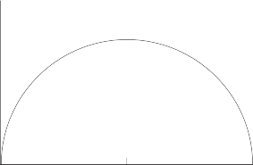

---
jupyter:
  jupytext:
    metadata_filter:
      notebook:
        additional: all
        excluded:
        - language_info
    text_representation:
      extension: .Rmd
      format_name: rmarkdown
      format_version: '1.0'
      jupytext_version: 0.8.6
  kernelspec:
    display_name: Python 3
    language: python
    name: python3
resampling_with:
    ed2_fname: 26-Chap-22
---

```{r setup, include=FALSE}
source("_common.R")
```

# And Some Last Words About the Reliability of Sample Averages

:::{.callout-warning}
## Draft page partially ported from original PDF

This page is an automated and partial import from the [original second-edition
PDF](https://resample.com/content/text/26-Chap-22.pdf).

We are in the process of updating this page for formatting, and porting any
code from the original [RESAMPLING-STATS
language](http://www.statistics101.net) to Python and R.

Feel free to read this version for the sense, but expect there to be multiple
issues with formatting.

We will remove this warning when the page has adequate formatting, and we have
ported the code.
:::


## The problem of uncertainty about the dispersion

The inescapable difficulty of estimating the amount of dispersion in the
population has greatly exercised statisticians over the years. Hence I
must try to clarify the matter. Yet in practice this issue turns out not
to be the likely source of much error even if one is somewhat wrong
about the extent of dispersion, and therefore we should not let it be a
stumbling block in the way of our producing estimates of the accuracy of
samples in estimating population parameters.

Student's *t* test was designed to get around the problem of the lack of
knowledge of the population dispersion. But Wallis and Roberts wrote
about the *t* test: "\[F\]ar-reaching as have been the consequences of
the *t* distribution for technical statistics, in elementary
applications it does not differ enough from the normal distribution...to
justify giving beginners this added complexity." [wallis1956statistics], p. x) "Although
Student's *t* and the *F* ratio are explained...the student...is advised
not ordinarily to use them himself but to use the shortcut methods...
These, being non-parametric and involving simpler computations, are more
nearly foolproof in the hands of the beginner — and, ordinarily, only a
little less powerful." (p. xi)[^wallis-continued]

[^wallis-continued]: They go on to say, "Techniques and details, beyond a
   comparatively small range of fairly basic methods, are likely to do more
   harm than good in the hands of beginners...The great ideas...are lost...
   nonparametric [methods] ... involving simpler computations are more nearly
   foolproof in the hands of the beginner ..." [@wallis1956statistics, viii,
   xi] Their stance is very much in contrast to that of Fisher, who wrote
   somewhere about the *t* test as a "revolution."

If we knew the *population* parameter — the proportion, in the case we
will discuss — we could easily determine how inaccurate the *sample*
proportion is likely to be. If, for example, we wanted to know about the
likely inaccuracy of the proportion of a sample of 100 voters drawn from
a population of a million that is 60% Democratic, we could simply
simulate drawing (say) 200 samples of 100 voters from such a universe,
and examine the average inaccuracy of the 200 sample proportions.

But in fact we do *not* know the characteristics of the actual universe.
Rather, the nature of the actual universe is what we seek to learn
about. Of course, if the amount of variation among samples were *the
same no matter what* the Republican-Democrat proportions in the
universe, the issue would still be simple, because we could then
estimate the average inaccuracy of the sample proportion for any
universe and then assume that it would hold for our universe. But it is
reasonable to suppose that the amount of variation among samples will be
different for different Democrat-Republican proportions in the universe.

Let us first see why the amount of variation among samples drawn from a
given universe is different with different relative proportions of the
events in the universe. Consider a universe of 999,999 Democrats and one
Republican. Most samples of 100 taken from this universe will contain
100 Democrats. A few (and only a very, very few) samples will contain 99
Democrats and one Republican. So the *biggest* possible difference
between the sample proportion and the population proportion (99.9999%)
is *less than one percent* (for the very few samples of 99% Democrats).
And most of the time the difference will only be the tiny difference
between a sample of 100 Democrats (sample proportion = 100%), and the
population proportion of 99.9999%.

Compare the above to the possible difference between a sample of 100
from a universe of half a million Republicans and half a million
Democrats. At worst a sample *could* be off by as much as 50% (if it got
zero Republicans or zero Democrats), and at best it is unlikely to get
exactly 50 of each. So it will almost always be off by 1% or more.

It seems, therefore, intuitively reasonable (and in fact it is true)
that the likely difference between a sample proportion and the
population proportion is greatest with a 50%-50% universe, least with a
0%-100% universe, and somewhere in between for probabilities, in the
fashion of Figure 22-1.



Error in average sample

in %

.5 1.0

Population Proportion

**Figure 22-1: Relationship Between the Population Propor tion and the
Likely Error In a Sample**

Perhaps it will help to clarify the issue of estimating dispersion if we
consider this: If we compare estimates for a second sample based on a)
the *population* , versus b) the *first sample* , the former will be
more accurate than the latter, because of the sampling variation in the
first sample that affects the latter estimate. But we cannot estimate
that sampling variation without knowing more about the population.

## Notes on the use of confidence intervals

1.  Confidence intervals are used more frequently in the physical
    sciences — indeed, the concept was developed for use in
    astronomy — than in bio-statistics and in the social sciences; in
    these latter fields, measurement is less often the main problem and
    the distinction between hypotheses often is difficult.

2.  Some statisticians suggest that one can do hypothesis tests with the
    confidence-interval concept. But that seems to me equivalent to
    suggesting that one can get from New York to Chicago by flying first
    to Los Angeles. Additionally, the logic of hypothesis tests is much
    clearer than the logic of confidence intervals, and it corresponds
    to our intuitions so much more easily.

3.  Discussions of confidence intervals sometimes assert that one cannot
    make a probability statement about where the

population mean may be, yet can make statements about the probability
that a particular set of samples may bound that mean.

If one takes the operational-definition point of view (see discussion of
that concept in connection with the concept of probability), and we
agree that our interest is upcoming events and probably decision-making,
then we obviously are interested in putting betting odds on the location
of the population mean (and subsequent samples). And a statement about
process will not help us with that, but only a probability statement.

Moving progressively farther away from the sample mean, we can find a
universe that has only some (any) specified small probability of
producing a sample like the one observed. One can say that this point
represents a "limit" or "boundary" between which and the sample mean may
be called a confidence interval, I suppose.

This issue is discussed in more detail in Simon (forthcoming).

## Overall summary and conclusions about confidence intervals

The first task in statistics is to measure how much — to make a
quantitative estimate of the universe from which a given sample has been
drawn, including especially the average and the dispersion; the theory
of point estimation is discussed in Chapter 13.

The next task is to make inferences about the meaning of the estimates.
A hypothesis test helps us decide whether two or more universes are the
same or different from each other. In contrast, the confidence interval
concept helps us decide on the reliability of an estimate.

Confidence intervals and hypothesis tests are not entirely disjoint. In
fact, hypothesis testing of a single sample against a benchmark value
is, under all interpretations, I think, operationally identical with
constructing a confidence interval and checking whether it includes that
benchmark value. But the underlying reasoning is different because the
questions which they are designed to answer are different.

Having now worked through the entire procedure of producing a confidence
interval, it should be glaringly obvious why statistics is such a
difficult subject. The procedure is very long, and involves a very large
number of logical steps. Such a long logical train is very hard to
control intellectually, and very hard to follow with one's intuition.
The actual computation of the probabilities is the very least of it,
almost a trivial exercise.
