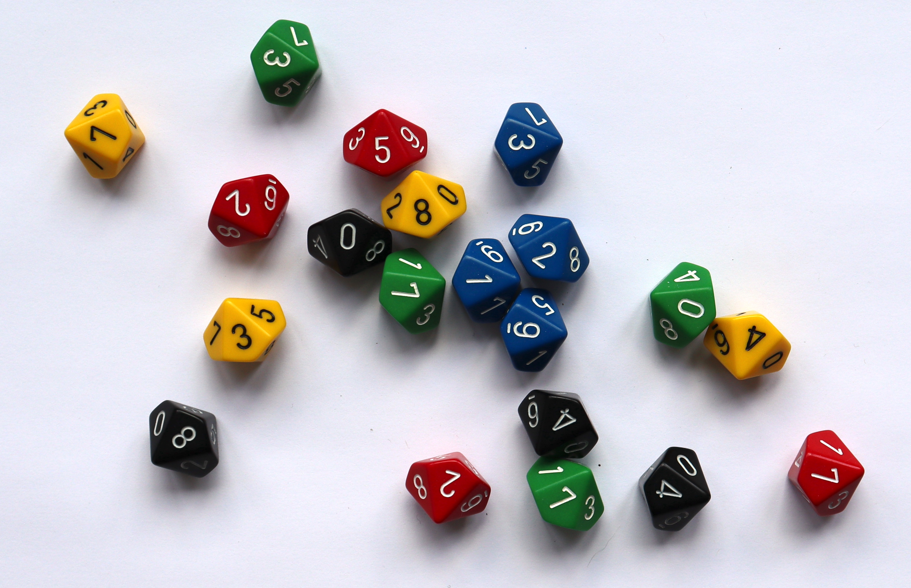

---
jupyter:
  jupytext:
    metadata_filter:
      notebook:
        additional: all
        excluded:
        - language_info
    text_representation:
      extension: .Rmd
      format_name: rmarkdown
      format_version: '1.0'
      jupytext_version: 0.8.6
  kernelspec:
    display_name: Python 3
    language: python
    name: python3
resampling_with:
    ed2_fname: 05-Chap-1
---

```{r setup, include=FALSE}
source("_common.R")
```

# The resampling method {#sec-resampling-method}

This chapter is a brief introduction to the resampling method of
solving problems in probability and statistics.  We're going to dive
right in and solve a problem hands-on.

You will see that the resampling method is easy to understand and
apply: all it requires is to understand the physical problem. You then
simulate a statistical model of the physical problem with techniques
that are intuitively obvious, and estimate the probability sought with
repeated random sampling.

After finding a solution, we will look at the more conventional
formulaic approach, and how that compares.  Here's the spoiler: it
requires you to understand complex formulas, and to choose the correct
one from many.

After reading this chapter, you will understand why we are excited
about the resampling method, and why it will allow you to approach
even even hard problems without knowing sophisticated statistic
techniques.

## The resampling approach in action

Recall the problem from section @sec-what-problems in which the contractor owns
20 ambulances:

> *You are the manager and part owner* of one of several contractors
>  providing ambulances to a hospital. You own 20 ambulances. Based on
>  past experience, the chance that any one ambulance will be unfit
>  for service on any given day is about one in ten. You want to know
>  the chance on a particular day — tomorrow — that three or more
>  of them will be out of action.

The resampling approach produces the estimate as follows.

### Randomness from physical methods

We collect 10 coins, and mark one of them with a pen or pencil or tape
as being the coin that represents "out-of-order;" the other nine coins
stand for "in operation". For any one ambulance, this set of 10 coins
provides a "model" for the one-in-ten chance — a probability of .10
(10 percent) — of it being out of order on a given day.  We put the
coins into a little jar or bucket.

For ambulance #1, we draw a single coin from the bucket.  This coin
represents whether that ambulance is going to be broken tomorrow.
After replacing the coin and shaking the bucket, we repeat the same
procedure for ambulance #2, ambulance #3 and so forth. Having repeated
the procedure *20* times, we now have a representation of all
ambulances for a single day.

We can now repeat this whole process as many times as we like: each
time, we come up with a representation for a different day, telling us
how many ambulances will be out-of-service on that day.

After collecting evidence for, say, 50 experimental days we determine
the proportion of the experimental days on which three or more
ambulances are out of order. That proportion is an estimate of the
probability that three or more ambulances will be out of order on a
given day — the answer we seek. This procedure is an example of Monte
Carlo simulation, which is the heart of the resampling method of
statistical estimation.

A more direct way to answer this question would be to examine the
firm's actual records for the past 100 days or, better, 500 days (if
that's available) to determine how many days had three or more
ambulances out of order. But the resampling procedure described above
gives us an estimate even if we do not have such long-term
information. This is realistic; it is frequently the case in the real
world that we must make estimates on the basis of insufficient history
about an event.

A quicker resampling method than the coins could be obtained with 20
ten-sided dice or spinners (like those found in the popular Dungeons &
Dragons games). For each die, we identify one of its ten sides as
"out-of-order".

Funnily enough, standard 10-sided dice have the numbers 0 through 9 on their
faces, rather than 1 through 10.  @fig-one-d10s shows a standard 10-sided die:

{#fig-one-d10s}

We decide, arbitrarily, that the 9 side means "out-of-order". We could even put
a little bit of paint on the 9 side to remind us. The die represents an
ambulance.  If we roll the die, and get this face, this indicates that the
ambulance was out of order.  If we get any of the other faces — 0 through 8 —
this ambulance was in working order. A single throw of all 20 dice will be our
experimental trial that represents a single day; we just have to count whether
three or more ambulances turn up "out of order".  @fig-20-d10s show the result
of one trial — throwing 20 dice:

{#fig-20-d10s}

As you can see, the trial in @fig-20-d10s gave us a single 9, so there was only
one ambulance out of order.

In a hundred quick throws of the 20 dice — which probably takes less than 5
minutes — we can get a fast and reasonably accurate answer to our question.

## Randomness from your computer {#sec-randomness-computer}

Computers make it easy to generate random numbers for resampling.

:::{.callout-note}
## What do we mean by random?

Random numbers are numbers where it is impossible to predict which number is
coming next. If we ask the computer for a number between 0 and 9, we will get
one of the numbers 0 though 9, but we cannot do any better than that in
predicting *which* number it will give us. There is an equal (10%) chance we
will get any of the numbers 0 through 9 — just as there is when we roll a fair
10-sided die. We will go into more detail about what exactly we mean by
*random* and *chance* later in the book (@sec-what-is-chance).
:::

<!---
Press Your Luck
The Michael Larsen Incident

https://web.archive.org/web/20170712041017/http://www.rotten.com/library/conspiracy/press-your-luck/
-->

We can use random numbers from computers to simulate our problem.  For
example, we can ask the computer to choose a random number between 0
and 9 to represent one ambulance. Let's say the number 9 represents
"out-of-order" and 0 through 8 "in operation", then any one random number
gives us a trial observation for a single ambulance.  To get an experimental
trial for a single day we look at 20 numbers and count how many of them are 9.
We then look at, say, one hundred sets of 20 numbers and count the proportion
of sets whose 20 numbers show three or more ambulances being "out-of-order".
Once again, that proportion estimates the probability that three or more
ambulances will be out-of-order on any given day.

Soon we will do all these steps with some  code, but for
now, consider Table @tbl-veh-numbers.  In each row, we placed 20
numbers, each one representing an ambulance.  We added 25 such rows,
each representing a simulation of one day.

```{python, eval=TRUE, echo=FALSE}
import numpy as np
import pandas as pd

n_vehicles = 20
n_trials = 25

rng = np.random.default_rng()
trials = rng.integers(0, 10, size=(n_trials, n_vehicles))

df = pd.DataFrame(
    trials,
    index=[f'Day {i + 1}' for i in range(n_trials)],
    columns=[f'A{i + 1}' for i in range(n_vehicles)]
)
```

```{r, veh-numbers, eval=TRUE, echo=FALSE}
kableExtra::kable_styling(
    ketable(py$df,
            caption = '25 simulations of 20 ambulances, with counts
            {#tbl-veh-numbers}'),
    latex_options = "scale_down")
```

To know how many ambulances were "out of order" on any given day, we
count number of ones in that row.  We place the counts in the final column
called "#9" (for "number of nines"):

```{python, eval=TRUE, echo=FALSE}
# Count the number of nines in each row, put in new column
df_counts = df.copy()
df_counts['#9'] = (df == 9).sum(axis=1)
```

```{r, veh-numbers-counts, eval=TRUE, echo=FALSE}
kableExtra::kable_styling(ketable(
  py$df_counts,
  caption = '25 simulations of 20 ambulances, with counts
  {#tbl-veh-numbers-counts}'),
  latex_options = "scale_down")
```

Each value in the last column of Table @tbl-veh-numbers-counts
is the count of 9s in that row and, therefore, the result from our
simulation of one day.

We can estimate how often three or more ambulances would break down by looking
for values of three or greater in the last column.  We find there are 
`r sum(py$df_counts['#9'] >= 3)`
rows with three or more in the last column. Finally we divide this number of
rows by the number of trials (`r py$n_trials`) to get an estimate of the
*proportion* of days with three or more breakdowns. The result is
`r sum(py$df_counts['#9'] >= 3) / py$n_trials`.

## Solving the problem using 

Here we rush ahead to show you how to do this simulation in .

We go through the  code for the simulation, but we don't
expect you to understand all of it right now.  The rest of this book
goes into more detail on reading and writing  code, and how you
can use  to build your own simulations.  Here we just want to show
you what this code looks like, to give you an idea of where we are headed.

While you can *run* the code below on your own computer, for now we
only need you to read it and follow along; the text explains what each
line of code does.

:::{.callout-note}
## Coming back to the example

If you are interested, you can come back to this example later, and run it for
yourself.  To do this, we recommend you read @sec-about-technology that
explains how to execute notebooks online or on your own computer.
:::

:::::: {.notebook name="ambulances" title="Ambulances"}

The first thing to say about the code you will see below is there are some
lines that do not do anything; these are the lines beginning with a `#`
character (read `#` as "hash").  Lines beginning with `#` are called
*comments*.  When  sees a `#` at the start of a line, it ignores
everything else on that line, and skips to the next. Here's an example of a
comment:

```{python}
# Python will completely ignore this text.
```

```{r}
# R will completely ignore this text.
```

Because  ignores lines beginning with `#`, the text after the `#`
is just for us, the humans reading the code.  The person writing the code will
often use comments to explain what the code is doing.

Our next task is to use  to simulate a single day of
ambulances.  We will again represent each ambulance by a random number
from 0 through 9.  20 of these numbers represents a simulation of all
20 ambulances available to the contractor.  We call a simulation
of all ambulances for a specific day one *trial*.

::: python
Before we begin our first trial, we need to load some helpful routines
from the NumPy software library.  NumPy is a Python library that has
many important functions for creating and working with numerical data.
We will use routines from NumPy in almost all our examples.

```{python}
# Get the Numpy library, and call it "np" for short.
import numpy as np
```

We also need to ask NumPy for an object that can generate random numbers. Such
an object is known as a "random number generator".

```{python}
# Ask NumPy for a random number generator.
# Name it `rnd` — short for "random"
rnd = np.random.default_rng()
```

:::{.callout-note}
## NumPy's Random Number Generator

Here are some examples of the random operations we can perform with
NumPy:

1. Make a random choice between three words:

   ```{python}
   rnd.choice(['apple', 'orange', 'banana'])
   ```

2. Make five random choices of three words, using the "size=" argument:

   ```{python}
   rnd.choice(['apple', 'orange', 'banana'], size=5)
   ```

3. Shuffle a list of numbers:

   ```{python}
   rnd.permutation([1, 2, 3, 4, 5])
   ```

4. Generate five random numbers between 1 and 10:

   ```{python}
   rnd.integers(1, 11, size=5)
   ```
:::

:::

Recall that we want twenty 10-sided dice — one per ambulance.  Our dice should
be 10-sided, because each ambulance has a 1-in-10 chance of being out of order.

The program to simulate one trial of the ambulances problem therefore
begins with these commands:

```{python}
# Ask NumPy to generate 20 numbers from 0 through 9.

# These are the numbers we will ask NumPy to select from.
# We store the numbers together in an *array*.
numbers = np.array([0, 1, 2, 3, 4, 5, 6, 7, 8, 9])

# Get 20 (size=20) values from the *numbers* list.
# Store the 20 numbers with the name "a"
a = rnd.choice(numbers, size=20)

# The result is a sequence (array) of 20 numbers.
a
```

```{r}
# Ask R to generate 20 numbers from 0 through 9.

# These are the numbers we will ask R to select from.
numbers <- c(0, 1, 2, 3, 4, 5, 6, 7, 8, 9)

# Get 20 values from the *numbers* sequence.
# Store the 20 numbers with the name "a"
# We will explain the replace=TRUE later.
a <- sample(numbers, 20, replace=TRUE)

# The result is a sequence of 20 numbers.
a
```

The commands above ask the computer to store the results of the random drawing
in a location in the computer's memory to which we give a name such as "a" or
"ambulances" or "aardvark" — the name is up to us.

Next, we need to count the number of defective ambulances:

```{python}
# Count the number of nines in the random numbers.
# The "a == 9" part identifies all the numbers equal to 9.
# The "sum" part counts how many numbers "a == 9" found.
b = np.sum(a == 9)
# Show the result
b
```

```{r}
# Count the number of nines in the random numbers.
# The "a == 9" part identifies all the numbers equal to 9.
# The "sum" part counts how many numbers "a == 9" found.
b <- sum(a == 9)
# Show the result
b
```

:::{.callout-note}
## Counting sequence elements

We see that the code uses:

```{python}
np.sum(a == 9)
```

```{r}
sum(a == 9)
```

What exactly happens here under the hood?  First `a == 9` creates an sequence
of values that only contains
 or 
values, depending on whether each element is equal to 9 or not.

Then, we ask  to add up (`sum`).  counts  as 1, and  as 0; thus we can use `sum` to count
the number of  values.

This comes down to asking "how many elements in `a` are equal to 9".

Don't worry, we will go over this again in the next chapter.
:::


The `sum` command is a *counting* operation. It asks the computer to *count*
the number of `9`s among the twenty numbers that are in location `a` following
the random draw carried out by the [`rnd.choice`]{.python}[`sample`]{.r}
operation. The result of the `sum` operation will be somewhere between 0 and
20, the number of simulated ambulances that were out-of-order on a given
simulated day. The result is then placed in another location in the computer's
memory that we label `b`.

Above you see that we have worked out how to tell the computer to do a single
trial — one simulated day.

### Repeating trials

We could run the code above for one trial over and over, and write down the
result on a piece of paper.  If we did this 100 times we would have 100 counts
of the number of simulated ambulances that had broken down for each simulated
day.  To answer our question, we will then count the number of times the count
was more than three, and divide by 100, to get an estimate of the proportion of
days with more than three out-of-order ambulances.

One of the great things about the computer is that it is very good at repeating
tasks many times, so we do not have to.  Our next task is to ask the computer
to repeat the single trial many times — say 1000 times — and count up the
results for us.

Of course  is very good at repeating things, but the instructions to tell
 to repeat things will take a little while to get used to. Soon, we will
spend some time going over it in more detail.  For now though, we show you how
what it looks like, and ask you to take our word for it.

The standard way to repeat steps in  is a `for` loop.  For
example, let us say we wanted to display [(`print`)]{.python} "Hello" five
times.  Here is how we would do that with a `for` loop:

```{python}
# Read the next line as "repeat the following steps five times".
for i in np.arange(0, 5):
    # The indented stuff is the code we repeat five times.
    # Print "Hello" to the screen.
    print("Hello")
```

```{r}
# Read the next line as "repeat the following steps five times".
for (i in 1:5) {
    # The stuff between the curly brackets is the code we
    # repeat five times.
    # Print "Hello" to the screen.
    message("Hello")
}
```

You can probably see where we are going here.  We are going to put the code for
one trial inside a `for` loop, to repeat that trial code many times.

Our next job is to *store* the results of each trial.  If we are going to run
1000 trials, we need to store 1000 results.

To do this, we start with a sequence of 1000 zeros, that we will fill in later,
like this:

```{python}
# Ask NumPy to make a sequence of 1000 zeros that we will use
# to store the results of our 1000 trials.
# Call this sequence "z"
z = np.zeros(1000)
```

```{r}
# Ask R to make a sequence of 1000 zeros that we will use
# to store the results of our 1000 trials.
# Call this sequence "z"
z <- numeric(1000)
```

For now, `z` contains 1000 zeros, but we will soon use a `for` loop to execute
1000 trials.  For each trial we will calculate our result (the number of
broken-down ambulances), and we will store the result in the `z` store.  We end
up with 1000 trial results stored in `z`.

With these parts, we are now ready to solve the ambulance problem, using
.

### The solution

This is our big moment!  Here we will combine the elements shown above to
perform our ambulance simulation over, say, 1000 days.  Just a quick reminder:
we do not expect you to understand all the detail of the code below; we will
cover that later. For now, see if you can follow along with the gist of it.

To solve resampling problems, we typically proceed as we have done above.  We
figure out the structure of a single trial and then place that trial in a `for`
loop that executes it multiple times (once for each day, in our case).

Now, let us apply this procedure to our ambulance problem.  We simulate 1000
days.  You will see that we have just taken the parts above, and put them
together.  The only new part here, is the step at the end, where we store the
result of the trial.  Bear with us for that; we will come to it soon.

```{python}
# Ask NumPy to make a sequence of 1000 zeros that we will use
# to store the results of our 1000 trials.
# Call this sequence "z"
z = np.zeros(1000)

# These are the numbers we will ask NumPy to select from.
numbers = [0, 1, 2, 3, 4, 5, 6, 7, 8, 9]

# Read the next line as "repeat the following steps 1000 times".
for i in np.arange(0, 1000):
    # The indented stuff is the code we repeat 1000 times.

    # Get 20 (size=20) values from the *numbers* list.
    # Store the 20 numbers with the name "a"
    a = rnd.choice(numbers, size=20)

    # Count the number of nines in the random numbers.
    # The "a == 9" part identifies all the numbers equal to 9.
    # The "sum" part counts how many numbers "a == 9" found.
    b = np.sum(a == 9)

    # Store the result from this trial in the sequence "z"
    z[i] = b

    # Now go back and repeat the trial, until done.
```

```{r}
# Ask R to make a sequence of 1000 zeros that we will use
# to store the results of our 1000 trials.
# Call this sequence "z"
z <- numeric(1000)

# These are the numbers we will ask R to select from.
numbers <- 0:9

# Read the next line as "repeat the following steps 1000 times".
for (i in 1:1000) {
    # The stuff between the curly brackets is the code we
    # repeat 1000 times.

    # Get 20 values from the *numbers* sequence.
    # Store the 20 numbers with the name "a"
    a <- sample(numbers, 20, replace=TRUE)

    # Count the number of nines in the random numbers.
    # The "a == 9" part identifies all the numbers equal to 9.
    # The "sum" part counts how many numbers "a == 9" found.
    b <- sum(a == 9)

    # Store the result from this trial in the sequence "z"
    z[i] <- b

    # Now go back and repeat the trial, until done.
}
```

The [`z[i] = b`]{.python}[`z[i] <- b`]{.r}
statement that follows the `sum` *counting* operation simply keeps track of
the results of each trial, placing the number of defective ambulances for each
trial inside the sequence called `z`. The sequence has 1000 positions: one for
each trial.

When we have run the code above, we have stored 1000 trial results in the
sequence `z`.  These are 1000 counts of out-of-order ambulances, one for each
of our simulated days.  Our last task is to calculate the proportion of these
days for which we had more than three broken-down ambulances.

Since our aim is to count the number of days in which more than 3 (4 or more)
defective ambulances occur, we use another *counting* `sum` command
at the end of the 1000 trials.  This command *counts* how many times more than
3 defects occurred in the 1000 days recorded in our `z` sequence, and we place
the result in another location, `k`. This gives us the total number of days
where 4 or more defective ambulances are seen to occur. Then we divide the
number in `k` by 1000, the number of trials. Thus we obtain an estimate of the
chance, expressed as a probability between 0 and 1, that 4 or more ambulances
will be defective on a given day. And we store that result in a location that
we call `kk`, which  subsequently prints to the screen.

```{python}
# How many trials resulted in more than 3 ambulances out of order?
k = np.sum(z > 3)

# Convert to a proportion.
kk = k / 1000

# Print the result.
print(kk)
```

```{r}
# How many trials resulted in more than 3 ambulances out of order?
k <- sum(z > 3)

# Convert to a proportion.
kk <- k / 1000

# Show the result.
message(kk)
```

This is the estimate we wanted; the proportion of days where more than three
ambulances were out of action.

We have crept up on the solution, so it might not be clear to you how few steps
you needed to do this task.  Here is the whole solution to the problem, without
the comments:

```{python}
import numpy as np
rnd = np.random.default_rng()

z = np.zeros(1000)
numbers = [0, 1, 2, 3, 4, 5, 6, 7, 8, 9]

for i in np.arange(0, 1000):
    a = rnd.choice(numbers, size=20)
    b = np.sum(a == 9)
    z[i] = b

k = np.sum(z > 3)
kk = k / 1000
print(kk)
```

```{r}
z <- numeric(1000)
numbers <- 0:9

for (i in 1:1000) {
    a <- sample(numbers, 20, replace=TRUE)
    b <- sum(a == 9)
    z[i] <- b
}

k <- sum(z > 3)
kk <- k / 1000
message(kk)
```

::::::

Notice that the code above is *exactly* the same as the code we built up in
steps.  But notice too, that the answer we got from this code was slightly
different from the answer we got first.

Why did we get a different answer from the same code?

:::{.callout-note}
## Randomness in estimates

This is an essential point — our code uses *random numbers* to get an
*estimate* of the quantity we want — in this case, the probability of three or
more ambulances being out of order.  Every run of our code will use a different
set of random numbers.  Therefore, every run of our code will give us a very
slightly different number.  As you will soon see, we can make our estimate more
and more accurate, and less and less different between each run, by doing many
trials in each run.  Here we did 1000 trials, but we will usually do 10000
trials, to give us a good estimate, that does not vary much from run to run.
:::

Don't worry about the detail of how each of these commands works — we will
cover those details gradually, over the next few chapters.  But, we hope that
you can see, in principle, how each of the operations that the computer carries
out are analogous to the operations that you yourself executed when you solved
this problem using the equivalent of a ten-sided die. This is exactly the
procedure that we will use to solve every problem in probability and statistics
that we must deal with.

While writing programs like these take a bit of getting used to, it is
vastly simpler than the older, more conventional approaches to such
problems routinely taught to students.


## How resampling differs from the conventional approach {#sec-resamp-differs}

In the standard approach the student learns to choose and solve a
formula. Doing the algebra and arithmetic is quick and easy. The
difficulty is in choosing the correct formula. Unless you are a
professional mathematician, it may take you quite a while to arrive at
the correct formula — considerable hard thinking, and perhaps some
digging in textbooks. More important than the labor, however, is that
you may come up with the wrong formula, and hence obtain the wrong
answer. And how would you know if you were wrong?

Most students who have had a standard course in probability and
statistics are quick to tell you that it is not easy to find the correct
formula, even immediately after finishing a course (or several courses)
on the subject. After leaving school or university, it is harder still
to choose the right formula. Even many people who have taught statistics at the
university level (including this writer) must look at a book to get the
correct formula for a problem as simple as the ambulances, and then we are
often still not sure we have the right answer. This is the grave disadvantage of
the standard approach.

In the past few decades, resampling and other Monte Carlo simulation
methods have come to be used extensively in scientific research. But in
contrast to the material in this book, simulation has mostly been used
in situations so complex that mathematical methods have not yet been
developed to handle them. Here are examples of such situations:

<!---
Better examples.  These are out of date.
-->

1.  For a flight to Mars, calculating the correct route involves a great many
    variables, too many to solve with formulas. Hence, the Monte Carlo
    simulation method is used.

2.  The Navy might want to know how long the average ship will have to
    wait for dock facilities. The time of completion varies from ship to
    ship, and the number of ships waiting in line for dock work varies
    over time. This problem can be handled quite easily with the
    experimental simulation method, but formal mathematical analysis
    would be difficult or impossible.

3.  What are the best tactics in baseball? Should one bunt? Should one
    put the best hitter up first, or later? By trying out various
    tactics with dice or random numbers, Earnshaw Cook (in his book
    *Percentage Baseball*), found that it is best never to bunt, and
    the highest-average hitter should be put up first, in contrast to
    usual practice. Finding this answer would have been much more difficult
    with the analytic method.

    <!---
    Simon gives reference as "Cook, Earnshaw, Percentage Baseball, Baltimore,
    1971."

    This might be "Percentage baseball" (1966) or "Percentage baseball and the computer" (1971) - more likely the second.

    "Percentage Baseball" doesn't seem to refer to the use of dice for simulation, or random numbers, but I might have missed it.
    -->

4.  Which search pattern will yield the best results for a ship
    searching for a school of fish? Trying out "models" of various
    search patterns with simulation can provide a fast answer.

5.  What strategy in the game of Monopoly will be most likely to win?
    The simulation method systematically plays many games (with a
    computer) testing various strategies to find the best one.

But those five examples are all complex problems. This book and its
earlier editions break new ground by using this method for *simple
rather than complex problems* , especially in statistics rather than
pure probability, and in teaching *beginning rather than advanced*
students to solve problems this way. (Here it is necessary to emphasize
that the resampling method is used to *solve the problems themselves
rather than as a demonstration device to teach the notions found in the
standard conventional approach* . Simulation has been used in elementary
courses in the past, but only to demonstrate the operation of the
analytical mathematical ideas. That is very different than using the
resampling approach to solve statistics problems themselves, as is done
here.)

Once we get rid of the formulas and tables, we can see that statistics
is a matter of *clear thinking, not fancy mathematics* . Then we can get
down to the business of learning how to do that clear statistical
thinking, and putting it to work for you. *The study of probability* is
purely mathematics (though not necessarily formulas) and technique. But
*statistics has to do with meaning* . For example, what is the meaning
of data showing an association just discovered between a type of
behavior and a disease? Of differences in the pay of men and women in
your firm? Issues of causation, acceptability of control, and design of
experiments cannot be reduced to technique. This is "philosophy" in the
fullest sense. Probability and statistics calculations are just one
input. Resampling simulation enables us to get past issues of
mathematical technique and focus on the crucial statistical elements of
statistical problems.

We hope you will find, as you read through the chapters, that the
resampling way of thinking is a good way to think about the more
traditional statistical methods that some of you may already know.  Our
approach will be to use resampling to understand the ideas, and then apply this
understanding to reason about traditional methods.  You may also find
that the resampling methods are not only easier to understand — they are often
more useful, because they are so general in their application.
