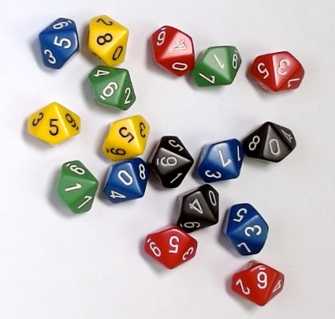

---
jupyter:
  jupytext:
    metadata_filter:
      notebook:
        additional: all
        excluded:
        - language_info
    text_representation:
      extension: .Rmd
      format_name: rmarkdown
      format_version: '1.0'
      jupytext_version: 0.8.6
  kernelspec:
    display_name: Python 3
    language: python
    name: python3
resampling_with:
    ed2_fname: null
---

```{r setup, include=FALSE}
source("_common.R")
```

# Resampling with code {#sec-resampling-code}

@sec-resampling-method used simulation and resampling from
tables of random numbers, dice, and coins.  Making random choices in this way
can make it easier to understand the process, but of course, physical methods
of making random outcomes can be slow and boring.

We saw that short computer programs can do a huge number of resampling
trials in a less than a second.  The flexibility of a programming language
makes it possible to simulate many different outcomes and tests.

Programs can build up tables of random numbers, and do basic
tasks like counting the number of values in a row or taking
proportions.  With these simple tools, we can simulate many problems
in probability and statistics.

In this chapter, we will model another problem using
, but this chapter will add three new things.

* The problem we will work on is a little different from the ambulances problem
  from @sec-resampling-method.  It is a real problem about deciding whether a
  new cancer treatment is better than the alternatives, and it introduces the
  idea of making a model of the world, to ask questions about chances and
  probabilities.
* We will slow down a little to emphasize the steps in solving this kind of
  problem.  First we work out how to simulate a single *trial*.  Then we work
  out how to run many simulated trials.
* We sprinted through the code in @sec-resampling-method, with the promise we
  would come back to the details.  Here we go into more detail about some ideas
  from the code in the last chapter.  These are:

  * Storing several values together in one place, with
    [arrays]{.python}[vectors]{.r}.
  * Using *functions* (code recipes) to apply procedures.
  * *Comparing* numbers to other numbers.
  * *Counting* numbers that match a condition.

In the next chapter, we will talk more about *using s* to
store results, and *for loops* to repeat a procedure many times.

## Statistics and probability

We have already emphasized that *statistics* is a way of drawing conclusions
about data from the real world, in the presence of random variation;
*probability* is the way of reasoning about random variation.  This chapter
introduces our first *statistical* problem, where we use probability to draw
conclusions about some important data — about a potential cure for a type of
cancer.  We will not make much of the distinction between probability and
statistics here, but we will come back to it several times in later chapters.

::: todo
Check we have discussed this before.
:::

## A new treatment for Burkitt lymphoma

[Burkitt lymphoma](https://en.wikipedia.org/wiki/Burkitt_lymphoma) is an
unusual cancer of the lymphatic system.  The lymphatic system is a vein-like
network throughout the body that is involved in the immune reaction to disease.
In developed countries, with standard treatment, the cure rate for Burkitt
lymphoma is about 90%.

In 2006, researchers at the US National Cancer Institute (NCI), tested a new
treatment for Burkitt lymphoma [@dunleavy2006burkitt]. They gave the new
treatment to 17 patients, and found that all 17 patients were doing well after
two years or more of follow up.  By "doing well", we mean that their lymphoma
had not progressed; as a short-hand, we will say that these patients were
"cured", but of course, we do not know what happened to them after this follow
up.

Here is where we put on our statistical hat and ask ourselves the following
question — *how surprised are we that the NCI researchers saw their result of
17 out of 17 patients cured?*

At this stage you might and should ask, what could we possibly mean by
"surprised"?  That is a good and important question, and we will discuss that
much more in the chapters to come.  For now, please bear with us as we do a
thought experiment.

Let us forget the 17 out of 17 result of the NCI study for a moment. Imagine
that there is another hospital, called Saint Hypothetical General, just down
the road from the NCI, that was also treating 17 patients with Burkitt
lymphoma. Saint Hypothetical were not using the NCI treatment, they were using
the standard treatment.

We already know that each patient given the standard treatment has a 90% chance
of cure.  Given that 90% cure rate, what is the chance that 17 out of 17 of the
Hypothetical group will be cured?

You may notice that this question about the Hypothetical group is similar to
the problem of the 16 ambulances in Chapter @sec-resampling-method. In that
problem, we were interested to know how likely it was that 3 or more of 16
ambulances would be out of action on any one day, given that each ambulance had
a 10% chance of being out of action.  Here we would like to know the chances
that all 17 patients would be cured, given that each patient has a 90% chance
of being cured (and a 10% chance of relapse).

## A physical model of the hypothetical hospital

As in the ambulance example, we could make a physical model of chance in
this world.  For example, to simulate whether a given patient is cured or not
by a 90% effective treatment, we could throw a ten sided die and record the
result.  We could say, arbitrarily, that a result of 0 means "not cured", and
all the numbers 1 through 9 mean "cured" (typical 10-sided dice have sides
numbered 0 through 9).

We could roll 17 dice to simulate one "trial" in this random world.  For each
trial, we record the number of dice that show numbers 1 through 9 (and not
0).  This will be a number between 0 and 17, and it is the number of patients
"cured" in our simulated trial.

@fig-17-d10s is the result of one such trial we did with a set of 17 10-sided
dice we happened to have to hand:

{#fig-17-d10s}

The trial in @fig-17-d10s shows are four dice with the 0 face uppermost, and
the rest with numbers from 1 through 9.  Therefore, there were 13 out of 17
not-zero numbers, meaning that 13 out of 17 simulated "patients" were "cured"
in this simulated trial.

<!---
Check we have adapted text above to picture.
-->

We could repeat this simulated trial procedure 100 times, and we would then
have 100 counts of the not-zero numbers. Each of the 100 counts would be the
number of patients cured in that trial.  We can ask how many of these 100
counts were equal to 17.  This will give us an estimate of the probability we
would see 17 out of 17 patients cured, given that any one patient has a 90%
chance of cure.  For example, say we saw 15 out of 100 counts were equal to
17.  That would give us an estimate of 15 / 100 or 0.15 or 15%, for the
probability we would see 17 out of 17 patients cured.

So, if Saint Hypothetical General did see 17 out of 17 patients cured with the
standard treatment, they would be a little surprised, because they would only
expect to see that happen 15% of the time.  But they would not be *very*
surprised — 15% of the time is uncommon, but not *very* uncommon.

## A trial, a run, a count and a proportion

Here we stop to emphasize the steps in the process of a random simulation.

1. *We decide what we mean by one trial*.  Here one trial has the same meaning
   in medicine as resampling — we mean the result of treating 17 patients. One
   *simulated trial* is then the simulation of one set of outcomes from 17
   patients.
2. Work out the *outcome* of interest from the trial.  The outcome here is the
   number of patients cured.
3. We work out a way to *simulate one trial*.  Here we chose to throw 17
   10-sided dice, and count the number of not zero values.  This is the outcome
   from one simulation trial.
4. We *repeat* the simulated trial procedure many times, and collect the
   results from each trial.  Say we repeat the trial procedure 100 times; we
   will call this a *run* of 100 trials.
5. We *count* the number of trials with an outcome that matches the outcome we
   are interested in. In this case we are interested in the outcome 17 out of
   17 cured, so we count the number of trials with a score of 17.  Say 15 out
   of the run of 100 trials had an outcome of 17 cured. That is our *count*.
6. Finally we divide the count by the number of trials to get the *proportion*.
   From the example above, we divide 15 by 100 to 0.15 (15%).  This is our
   estimate of the chance of seeing 17 out of 17 patients cured in any one
   trial.  We can also call this an estimate of the *probability* that 17 out
   of 17 patients will be cured on any on trial.

Our next step is to work out the code for step 2: *simulate one trial*.

## Simulate one trial with code

We can use the computer to do something very similar to rolling 17 10-sided
dice, by asking the computer for 17 random whole numbers from 0 through 9.

:::{.callout-note}
## Whole numbers

A whole number is a number that is not negative, and does not have fractional
part (does not have anything after a decimal point).  0 and 1 and 2 and 3 are
whole numbers, but -1 and $\frac{3}{5}$ and 11.3 are not. The whole numbers
from 0 through 9 are 0, 1, 2, 3, 4, 5, 6, 7, 8, 9.
:::

We have already discussed what we mean by *random* in
@sec-randomness-computer.

::: python
We will be asking the computer to generate many random numbers.  So, before we
start, we again import NumPy and get its *random number generator*:

```{python}
import numpy as np

# Ask for NumPy's default random number generator and name
# it `rnd`.  `rnd` is short for "random".
rnd = np.random.default_rng()
```
:::

## From numbers to s

We [next]{.python} need to prepare the *sequence* of numbers that we want
 to select from.

We have already seen the idea that  has *values* that are
individual numbers.   Remember, a *variable* is a *named value*.  Here we
attach the name `a` to the value 1.

```{python}
a = 1
# Show the value of "a"
a
```

```{r}
a <- 1
# Show the value of "a"
a
```

 also allows *values* that are *sequences of numbers*.   calls these sequences *s*.

::: r
The name *vector* sounds rather technical and mathematical, but the only
important idea for us is that a *vector* stores a *sequence* of numbers.
:::

Here we make a  that contains the 10 numbers we will
select from:

```{python}
# Make an array of numbers, store with the name "some_numbers".
some_numbers = np.array([0, 1, 2, 3, 4, 5, 6, 7, 8, 9])
# Show the value of "some_numbers"
some_numbers
```

```{r}
# Make a vector of numbers, store with the name "some_numbers".
some_numbers <- c(0, 1, 2, 3, 4, 5, 6, 7, 8, 9)
# Show the value of "some_numbers"
some_numbers
```

Notice that the value for `some_numbers` is ,
and that this value *contains* 10 numbers.

Put another way, `some_numbers` is now the name we can use for this collection
of 10 values.

[Arrays]{.python}[Vectors]{.r} are very useful for simulations and data
analysis, and we will be using these for nearly every example in this book.

## Functions {#sec-introducing-functions}

*Functions* are another tool that we will be using everywhere, and that you seen already, although we have not introduced them until now.

You can think of functions as named *production lines*.

For example, consider the  *function* [`round`]{.r}[`np.round`]{.python}

::: python
:::

```{python}
# We load the Numpy library so we have access to the Numpy functions.
import numpy as np
```

[`round`]{.r}[`np.round`]{.python} is the name for a simple production line,
that takes in a number, and (by default) sends back the number rounded to the
nearest *integer*.

:::{.callout-note}
## What is an integer?

An *integer* is a positive or negative *whole number*.

In other words, a number is an *integer* if the number is *either* a whole
number (0, 1, 2 ...), *or* a negative whole number (-1, -2, -3 ...). All of
-208, -2, 0, 10, 105 are integers, but $\frac{3}{5}$, -10.3 and 0.2 are not.

We will use the term *integer* fairly often, because it is a convenient way to
name all the positive and negative whole numbers.
:::

Think of a function as a named *production line*.  We sent the function
(production line) raw material (components) to work on.  The production line
does some work on the components. A finished result comes off the other end.

Therefore, think of [`round`]{.r}[`np.round`]{.python} as the name of a
production line, that takes in a *component* (in this case, any number), and
does some work, and sends back the finished *result* (in this case, the number
rounded to the nearest integer.

The components we send to a function are called *arguments*.  The finished
result the function sends back is the *return value*.

* **Arguments**: the value or values we send to a function.
* **Return value**: the values the function sends back.

See @fig-round_function_pl for an illustration of
[`round`]{.r}[`np.round`]{.python} as a production line.

```{r fig-round_function_pl, opts.label='svg_fig', fig.cap="The `round` function as a production line"}
include_svg('diagrams/round_function_pl.svg')
```

In the next few code s, you see examples where
[`round`]{.r}[`np.round`]{.python} takes in a not-integer number, as an
*argument*, and sends back the nearest integer as the *return value*:

```{python}
# Put in 3.2, round sends back 3.
np.round(3.2)
```

```{python}
# Put in -2.7, round sends back -3.
np.round(-2.7)
```

```{r}
# Put in 3.2, round sends back 3.
round(3.2)
```

```{r}
# Put in -2.7, round sends back -3.
round(-2.7)
```

Like many functions, [`round`]{.r}[`np.round`]{.python} can take more than one
argument (component).  You can send `round` the number of digits you want to
round to, after the number of you want it to work on, like this (see
@fig-round_ndigits_pl):

```{python}
# Put in 3.1415, and the number of digits to round to (2).
# round sends back 3.14
np.round(3.1415, 2)
```

```{r}
# Put in 3.1415, and the number of digits to round to (2).
# round sends back 3.14
round(3.1415, 2)
```

```{r fig-round_ndigits_pl, opts.label='svg_fig', fig.cap="`round` with optional arguments specifying number of digits"}
include_svg('diagrams/round_function_ndigits_pl.svg')
```

Notice that the second argument — here 2 — is *optional*.  We only have to send
`round` one argument: the number we want it to round.  But we can *optionally*
send it a second argument — the number of decimal places we want it to round
to.  If we don't specify the second argument, then `round` assumes we want to
round to 0 decimal places, and therefore, to the nearest integer.

## Functions and named arguments {#sec-named-arguments}

In the example above, we sent `round` two arguments. `round` knows that we mean
the first argument to be the number we want to round, and the second argument
is the number of decimal places we want to round to.   It knows which is which
by the *position* of the arguments — the *first* argument is the *number* it
should round, and *second* is the number of digits.

In fact, internally, the `round` function also gives these arguments *names*.
It calls the number it should round — [`a`]{.python}[`x`]{.r} — and the number
of digits it should round to — [`digits`]{.r}[`decimals`]{.python}.  This is
useful, because it is often clearer and simpler to identify the argument we are
specifying with its name, instead of just relying on its position.

If we aren't using the argument names, we call the round function as we did
above:

```{python}
# Put in 3.1415, and the number of digits to round to (2).
# round sends back 3.14
np.round(3.1415, 2)
```

```{r}
# Put in 3.1415, and the number of digits to round to (2).
# round sends back 3.14
round(3.1415, 2)
```

In this call, we relied on the fact that we, the people writing the code, and
you, the person reading the code, remembers that the second argument (2) means
the number of decimal places it should round to.   But, we can also specify the
argument using its name, like this (see
[@fig-round_function_named]{.r}[@fig-np_round_function_named]{.python}):

```{python}
# Put in 3.1415, and the number of digits to round to (2).
# Use the name of the number-of-decimals argument for clarity:
np.round(3.1415, decimals=2)
```

```{r}
# Put in 3.1415, and the number of digits to round to (2).
# Use the name of the number-of-decimals argument for clarity:
round(3.1415, digits=2)
```

```{r fig-round_function_named, opts.label='svg_fig', fig.cap="The `round` function with argument names"}
include_svg('diagrams/round_function_named.svg')
```

```{r fig-np_round_function_named, opts.label='svg_fig', fig.cap="The `np.round` function with argument names"}
include_svg('diagrams/np_round_function_named.svg')
```

Here  sees the *first* argument, as before, and assumes that it
is the number we want to round.  Then it sees the second, named argument —
[`digits=2`]{.r}[`decimals=2`]{.python} — and knows, *from the name*, that we mean this to be the number of decimals to round to.

In fact, we could even specify *both* arguments by name, like this:

```{python}
# Put in 3.1415, and the number of digits to round to (2).
np.round(a=3.1415, decimals=2)
```

```{r}
# Put in 3.1415, and the number of digits to round to (2).
# Name both arguments.
round(x=3.1415, digits=2)
```

We don't usually name both arguments for `round`, as we have above, because it
is so obvious that the first argument is the thing we want to round, and so
naming the argument does not make it any more clear what the code is doing.
But — as so often in programming — whether to use the names, or let  work out which argument is which by position, is a judgment call.
The judgment you are making is about the way to write the code to be most clear
for your reader, where your most important reader may be you, coming back to
the code in a week or a year.

:::{.callout-note}
## How do you know what names to use for the function arguments?

You can find the names of the function arguments in the help for the function,
either online, or in the notebook interface.  For example, to get the help for
[`round`]{.r}[`np.round`]{.python}, including the argument names, you could
make a new , and type [`?round`]{.r}[`np.round?`]{.python},
then execute the cell [by running the chunk]{.r}[by pressing
Shift-Enter]{.python}.  This will show the help for the function in the
notebook interface.
:::


## Ranges {#sec-ranges}

Now let us return to the variable `some_numbers` that we created above:

```{python}
# Make an array of numbers, store with the name "some_numbers".
some_numbers = np.array([0, 1, 2, 3, 4, 5, 6, 7, 8, 9])
# Show the value of "some_numbers"
some_numbers
```

```{r}
# Make a vector of numbers, store with the name "some_numbers".
some_numbers <- c(0, 1, 2, 3, 4, 5, 6, 7, 8, 9)
# Show the value of "some_numbers"
some_numbers
```

In fact, we often need to do this: generate a sequence or *range* of integers,
such as 0 through 9.

::: {.callout-note}
### Pick a number from 1 through 5

Ranges can be confusing in normal speech because it is not always clear whether
they include their beginning and end.  For example, if someone says "pick a
number between 1 and 5", do they mean to pick from *all* of the numbers,
including the first and last (any of 1 or 2 or 3 or 4 or 5)?  Or do they mean
only the numbers that are *between* 1 and 5 (so 2 or 3 or 4)?  Or do they mean
all the numbers up to, but not including 5 (so 1 or 2 or 3 or 4)?

To avoid this confusion, we will nearly always use "from" and "through" in
ranges, meaning that we do include both the start and the end number.  For
example, if we say "pick a number from 1 through 5" we mean one of 1 or 2 or
3 or 4 or 5.
:::

Creating ranges of numbers is so common that  has a [special
syntax]{.r}[standard Numpy function `np.arange`]{.python} to do that.

::: python

```{python}
# An array containing all the numbers from 0 through 9.
some_numbers = np.arange(0, 10)
some_numbers
```

Notice that we send `np.arange` the *arguments* 0 and 10.  The first
argument, here 0, is the *start* value.  The second argument, here 10, is the
*stop* value.  Numpy (in the `arange` function) understands this to mean:
*start* at 0 (the start value) and go up to *but do not include* 10 (the stop
value).

You can therefore read `np.arange(0, 10)` as "the sequence of integers starting
at 0, up to, but not including 10".

Like `np.round`, the arguments to `np.arange` also have names, so, we could also write:

```{python}
# An array containing all the numbers from 0 through 9.
# Now using named arguments.
some_numbers = np.arange(start=0, stop=10)
some_numbers
```

So far, we have sent `arange` two arguments, but we can also send just one
argument, like this:

```{python}
# An array containing all the numbers from 0 through 9.
some_integers = np.arange(10)
some_integers
```

When we sent `arange` a single argument, like this, `arange` understands this
to mean we have sent just the *stop* value, and that is should assume a *start*
value of 0.

Again, if we wanted, we could send this argument by name:

```{python}
# An array containing all the numbers from 0 through 9.
# Specify the stop value by explicit name, for clarity.
some_integers = np.arange(stop=10)
some_integers
```

:::
<!---
End of Python section
-->

::: r
R allows you to write a colon (`:`) between two values, to mean that you want a *vector* (sequence) that is all the integers from the first value (before the colon) *through* the second value (after the colon):
:::

```{r}
# A vector containing all the integers from 0 through 9.
some_integers = 0:9
some_integers
```

Here are some more examples of [the colon syntax]{.r}[`np.arange`]{.python}:

```{python}
# All the integers starting at 10, up to, but not including 15.
# In other words, 10 through 14.
np.arange(10, 15)
```

```{python}
# Here we are only sending one value (7). np.arange understands this to be
# the stop value, and assumes 0 as the start value.
# In other words, 0 through 6
np.arange(7)
```

```{r}
# All the integers from 10 through 14
10:14
```

```{r}
# All the integers from -1 through 5
-1:5
```

::: python

## `range` in Python {#sec-python-range}

So far you have seen ranges of integers using `np.arange`.  The `np.` prefix
refers to the fact that `np.arange` is a function from the Numpy module
(library).  The `a` in `arange` signals that the result `np.arange` returns is
an *array*:

```{python}
arr = np.arange(7)
# Show the result
arr
```

```{python}
# Show what type of thing this is.
type(arr)
```

We do often use `np.arange` to get a range of integers in a convenient array
format, but Python has another way of getting a range of integers — the `range`
function.

The `range` function is very similar to `np.arange`, but it is *not* part of
Numpy — it is basic function in Python — and it does *not* return an *array* of
numbers, it returns something else.  Here we ask for a `range` from 0 through 6
(0 up to, but not including 7):

```{python}
# Notice no `np.` before `range`.
r = range(7)
r
```

Notice that the thing that came back is something that *represents* or *stands
in for* the number 0 through 6.  It is not an array, but a specific type of
thing called — a `range`:

```{python}
type(r)
```

The `range` above is a container for the numbers 0 through 6.  We can get the
numbers out of the container in many different ways, but one of them is to
convert this container to an array, using the `np.array` function.  The
`np.array` function takes the thing we pass it, and makes it into an array.
When we apply `np.array` to `r` above, we get the numbers that `r` contains:

```{python}
# Get the numbers from the range `r`, convert to an array.
a_from_r = np.array(r)
# Show the result
a_from_r
```

The `range` function has the same `start` and `stop` arguments that `np.arange`
does, and with the same meaning:

```{python}
# 3 up to, not including 12.
# (3 through 11)
r_2 = range(3, 12)
r_2
```

```{python}
np.array(r_2)
```

You may reasonably ask — why do I need this `range` thing, if I have the very
similar `np.arange`?  The answer is — you don't *need* `range`, and you can
always use `np.arange` where you would use `range`, but for reasons we will go
into later (@sec-for-range), `range` is a good option when we want to represent
a sequence of numbers as input to a `for` loop.  We cover `for` loops in more
detail in @sec-for-loops, but for now, the only thing to remember is that
`range` and `np.arange` are both ways of expressing sequential ranges of
integers.

:::

## Choosing values at random {#sec-random-choice}

We can use the [`rnd.choice`]{.python}[`sample`]{.r} function to select a
single value *at random* from the sequence of numbers in `some_integers`.

:::{.callout-note}
## More on 

The  function will be a fundamental tool for taking many kinds of samples, and we cover it in more detail in @sec-sampling-tools.
:::

```{python}
# Select an integer from the choices in some_integers.
my_integer = rnd.choice(some_integers)
# Show the value that results.
my_integer
```

```{r}
# Select 1 integer (the second argument) from the choices in some_integers
# (the first argument).
my_integer <- sample(some_integers, 1)
# Show the value that results.
my_integer
```

Like [`np.round`]{.python}[`round`]{.r} (above),
[`rnd.choice`]{.python}[`sample`]{.r} is a *function*.

:::python
:::{#nte-functions-methods .callout-note}
## Functions and methods

Actually, to be precise, we should call `rnd.choice` a *method*.  A method is a
*function attached to a value*. In this case the function `choice` is attached
to the value `rnd`.  That's not an important distinction for us at the moment,
so please forgive our strategic imprecision, and let us continue to say that
`rnd.choice` is a function.
:::
:::

As you remember, a function is a named *production line*. In our case, the
production line has the name [`rnd.choice`]{.python}[the `sample`
function]{.r}.

We sent [`rnd.choice`]{.python}[the `sample` function]{.r}. a value to work on
— an *argument*.  In this case, the argument was the value of `some_integers`.

::: r
`sample` also needs the number of random values we should select from the first
argument.  We can send the number of values we want with the *second argument*.
:::

[@fig-rnd_choice_pl]{.python}[@fig-sample_pl]{.r} is a diagram illustrating an
example run of the  function (production line).

::: python
```{r fig-rnd_choice_pl, opts.label='svg_fig', fig.cap="Example run of the `rnd.choice` function"}
include_svg('diagrams/rnd_choice_pl.svg')
```
:::

::: r
```{r fig-sample_pl, opts.label='svg_fig', fig.cap="Example run of the `sample` function"}
include_svg('diagrams/sample_pl.svg')
```
:::

Here is the same code again, with new comments.

```{python}
# Send the value of "some_integers" to rnd.choice
# some_integers is the *argument*.
# Put the *return* value from the function into "my_number".
my_number = rnd.choice(some_integers)
# Show the value that results.
my_number
```

```{r}
# Send the value of "some_integers" to sample.
# some_integers is the *argument*.  Ask sample to return 1 of the values.
# Put the *return* value from the function into "my_number".
my_number <- sample(some_integers, 1)
# Show the value that results.
my_number
```

## Creating s with sampling {#sec-sampling-arrays}

::: python
In the code above, we asked Python to select a single number at random
— because that is what `rnd.choice` does by default.

In fact, the people who wrote `rnd.choice`, wrote it to be flexible in the
work that it can do.  In particular, we can tell `rnd.choice` to select *any
number of values* at random, by adding a new *argument* to the function.

In our case, we would like Numpy to select 17 numbers at random from the
sequence of `some_integers`.

To do this, we add an argument to the function that tells it *how many* numbers
we want it to select.
:::

::: r
In the code above, we asked R to select a single number at
random — by sending 1 as the second argument to the function.

As you can imagine, we can tell `sample` to select *any number of values*
at random, by changing the second argument to the function.

In our case, we would like R to select 17 numbers at random from the sequence
of `some_integers`.

But — there is a complication here.  By default, `sample` selects numbers from
the first argument *without replacement*, meaning that, by default, sample
cannot select the same number twice, and in our case, where we want 17 numbers,
that is bad, because `sample` is going to run out of numbers. To get the result
we want, we must also add an extra argument: `replace=TRUE`. `replace=TRUE`
tells R to sample `some_integers` *with replacement*, where `sample` can select
the same number more than once in the same sample. Sampling with and without
replacement is a fundamental distinction in probability and statistics.
@sec-sampling-tools goes into much more detail about this, but for now, please
take our word for it that using `replace=TRUE` for `sample` gives us the same
effect as rolling several 10-sided dice.
:::

```{python}
# Get 17 values from the *some_integers* array.
# Store the 17 numbers with the name "a"
a = rnd.choice(some_integers, 17)
# Show the result.
a
```

```{r}
# Get 17 values from the *some_integers* vector.
# Sample *with replacement*, so sample can select numbers more than once.
# Store the 17 numbers with the name "a"
a <- sample(some_integers, 17, replace=TRUE)
# Show the result.
a
```

As you can see, the function sent back (returned) 17 numbers.  Because it is
sending back more than one number, the thing it sends back is
, where the  has 17 elements.

### `sum` — adding all the values

Bear with us for a short diversion.  You will see why we made this diversion
soon.

 has a function [`sum`]{.r}[`np.sum`]{.python} that will
add up all the numbers in .

You can see the contents of `a` above.

[`sum`]{.r}[`np.sum`]{.python} adds all the numbers in the 
together, to give the *sum* of the .  The *sum* is just the
result of adding all the values in the .  Put another way, it
is the result of adding the second element to the first, then adding third
element to the result, and the fourth element to the result, and so on.

```{python}
np.sum(a)
```

```{r}
sum(a)
```

## Counting results

We now have the code to do the equivalent of throwing 17 ten-sided dice. This
is the basis for one simulated trial in the world of Saint Hypothetical
General.

Our next job is to get the code to count the number of numbers that are not
zero in the  `a`.  That will give us the number of
patients who were cured in simulated trial.

Another way of asking this question, is to ask how many elements in `a` are
greater than zero.

### Comparison

To ask whether a number is greater than zero, we use *comparison*.  Here is a
*greater than zero* comparison on a single number:

```{python}
n = 5
# Is the value of n greater than 0?
# Show the result of the comparison.
n > 0
```

```{r}
n <- 5
# Is the value of n greater than 0?
# Show the result of the comparison.
n > 0
```

`>` is a *comparison* — it *asks a question* about the numbers either side of
it. In this case `>` is asking the question "is the value of `n` (on the left
hand side) greater than 0 (on the right hand side)?" The value of `n` is 5, so
the question becomes, "is 5 greater than 0?"  The answer is Yes, and  represents this Yes answer as the value .

In contrast, the comparison below boils down to "is 0 greater than 0?", to
which the answer is No, and  represents this as
.

```{python}
p = 0
# Is the value of p greater than 0?
# Show the result of the comparison.
p > 0
```

```{r}
p <- 0
# Is the value of p greater than 0?
# Show the result of the comparison.
p > 0
```

So far you have seen the results of comparison on a single number.  Now say we
do the same comparison on .  For example,
say we ask the question "is the value of `a` greater than 0"?  Remember, `a` is
 containing 17 values.  We are comparing 17
values to one value (0). What answer do you think  will
give?  You may want to think a little about this before you read on.

As a reminder, here is the current value for `a`:

```{python}
# Show the current value for "a"
a
```

```{r}
# Show the current value for "a"
a
```

Now you have had some time to think, here is what happens:

```{python}
# Is the value of "a" greater than 0
# Show the result of the comparison.
a > 0
```

```{r}
# Is the value of "a" greater than 0?
# Show the result of the comparison.
a > 0
```

There are 17 values in `a`, so the comparison to 0 means there are 17
comparisons, and 17 answers.  therefore returns
 ** of 17 elements, containing these 17
answers.  The first answer is the answer to the question "is the value of the
*first* element of `a` greater than 0", and the second is the answer to "is the
value of the *second* element of `a` greater than 0".

Let us store the result of this comparison to work on:

```{python}
# Is the value of "a" greater than 0
# Store as another array "q".
q = a > 0
# Show the value of r
q
```

```{r}
# Is the value of "a" greater than 0?
# Store as another vector "q".
q <- a > 0
# Show the value of q
q
```

## Counting  values with `sum` {#sec-count-with-sum}

Notice above that there is one  element in `q` for every
element in `a` that was greater than 0.  It only remains to *count* the number
of  values in `q`, to get the count of patients in our
simulated trial who were cured.

We can use the  function [`sum`]{.r}[`np.sum`]{.python} to
count the number of  elements in .
As you can see above,
[`sum`]{.r}[`np.sum`]{.python}
adds up all the elements in , to give a single number. This
will work as we want for the `q` , because 
counts  as equal to 0 and  as equal to 1:

```{python}
# Question: is False equal to 0?
# Answer - Yes! (True)
False == 0
```

```{python}
# Question: is True equal to 1?
# Answer - Yes! (True)
True == 1
```

```{r}
# Question: is FALSE equal to 0?
# Answer - Yes! (TRUE)
FALSE == 0
```

```{r}
# Question: is TRUE equal to 1?
# Answer - Yes! (TRUE)
TRUE == 1
```

Therefore, the function `sum`, when applied to  of  and  values, will count the number of  values in the .

To see this in action we can make a new  of 
and  values, and try using
[`sum`]{.r}[`np.sum`]{.python}
on the new array.

```{python}
# An array containing three True values and two False values.
trues_and_falses = np.array([True, False, True, True, False])
# Show the new array.
trues_and_falses
```

```{r}
# A vector containing three TRUE values and two FALSE values.
trues_and_falses <- c(TRUE, FALSE, TRUE, TRUE, FALSE)
# Show the new vector.
trues_and_falses
```

The `sum` operation adds all the elements in the .
Because  counts as 1, and  counts as
0, adding all the elements in `trues_and_falses` is the same as adding up the
values 1 + 0 + 1 + 1 + 0, to give 3.

We can apply the same operation on `q` to count the number of  values.

```{python}
# Count the number of True values in "q"
# This is the same as the number of values in "a" that are greater than 0.
b = np.sum(q)
# Show the result
b
```

```{r}
# Count the number of TRUE values in "q"
# This is the same as the number of values in "a" that are greater than 0.
b <- sum(q)
# Show the result
b
```

## The procedure for one simulated trial

We now have the whole procedure for one simulated trial. We can put the whole procedure in one :

```{python}
# Procedure for one simulated trial

# Get 17 values from the *some_integers* array.
# Store the 17 numbers with the name "a"
a = rnd.choice(some_integers, 17)
# Is the value of "a" greater than 0
q = a > 0
# Count the number of True values in "q"
b = np.sum(q)
# Show the result of this simulated trial.
b
```

```{r}
# Procedure for one simulated trial

# Get 17 values from the *some_integers* vector.
# Store the 17 numbers with the name "a"
a <- sample(some_integers, 17, replace=TRUE)
# Is the value of "a" greater than 0?
q <- a > 0
# Count the number of TRUE values in "q"
b <- sum(q)
# Show the result of this simulated trial.
b
```

## Repeating the trial

Now we know how to do one simulated trial, we could just keep running the  above, and writing down the result each time.  Once we had run the  100 times, we would have 100 counts.  Then we could look at the 100 counts to see how many were equal to 17 (all 17 simulated patients cured on that trial).  At least that would be much faster than rolling 17 dice 100 times, but we would also like the computer to automate the process of repeating the trial, and keeping track of the counts.

Please forgive us as we race ahead again, as we did in the last chapter.  As in
the last chapter, we will use a *results*  called `z` to
store the count for each trial.  As in the last chapter, we will use a `for`
loop to repeat the trial procedure many times.  As in the last chapter, we will
not explain the counts  of the `for` loop in any detail, because we are going to cover those in the next chapter.

Let us now imagine that we want to do 100 simulated trials at Saint Hypothetical General.  This will give us 100 counts.  We will want to store the count for each trial.

To do this, we make  called `z` to hold the
100 counts.  We have called the  `z`, but we could have
called it anything we liked, such as `counts` or `results` or `cecilia`.

```{python}
# An array to hold the 100 count values.
# Later, we will fill this in with real count values from simulated trials.
z = np.zeros(100)
```

```{r}
# A vector to hold the 100 count values.
# Later, we will fill this in with real count values from simulated trials.
z <- numeric(100)
```

Next we use a `for` loop to *repeat the single trial procedure*.

Notice that the single trial procedure, inside this `for` loop, is the same as the single trial procedure above — the only two differences are:

* The trial procedure is inside the loop, and
* We are storing the count for each trial as we go.

We will go into more detail on how this works in the next chapter.

```{python}
# Procedure for 100 simulated trials.

# An array to store the counts for each trial.
z = np.zeros(100)

# Repeat the trial procedure 100 times.
for i in np.arange(100):
    # Get 17 values from the *some_integers* array.
    # Store the 17 numbers with the name "a".
    a = rnd.choice(some_integers, 17)
    # Is the value of "a" greater than 0.
    q = a > 0
    # Count the number of True values in "q".
    b = np.sum(q)
    # Store the result at the next position in the "z" array.
    z[i] = b
    # Now go back and do the next trial until finished.
# Show the result of all 100 trials.
z
```

```{r}
# Procedure for 100 simulated trials.

# A vector to store the counts for each trial.
z <- numeric(100)

# Repeat the trial procedure 100 times.
for (i in 1:100) {
    # Get 17 values from the *some_integers* vector.
    # Store the 17 numbers with the name "a"
    a <- sample(some_integers, 17, replace=TRUE)
    # Is the value of "a" greater than 0?
    q <- a > 0
    # Count the number of TRUE values in "q".
    b <- sum(q)
    # Store the result at the next position in the "z" vector.
    z[i] = b
    # Now go back and do the next trial until finished.
}
# Show the result of all 100 trials.
z
```

Finally, we need to count how many of the trials results we stored in `z` gave
a "cured" count of 17.

We can ask the question whether a single number is equal to 17 using the *double equals* comparison: `==`.

```{python}
s = 17
# Is the value of s equal to 17?
# Show the result of the comparison.
s == 17
```

```{r}
s <- 17
# Is the value of s equal to 17?
# Show the result of the comparison.
s == 17
```

::: {.callout-note}
::: Python
## Single and double equals

Notice that the *double equals* `==` means something entirely different to
Python than the single equals `=`.  In the code above, Python reads `s = 17` to
mean "Set the variable `s` to have the value 17".  In technical terms the
single equals is called an *assignment* operator, because it means *assign* the
value 17 to the variable `s`.

The code `s == 17` has a completely different meaning.
:::

::: r
## Double equals

The *double equals* `==` above is a *comparison* in R.
:::
It means "give  if the value in `s` is equal to 17, and  otherwise".  The `==` is a *comparison* operator — it is for
comparing two values — here the value in `s`
and the value 17.  This comparison, like all comparisons, returns an answer
that is either  or .  In our case `s`
has the value 17, so the comparison becomes `17 == 17`, meaning "is 17 equal to
17?", to which the answer is "Yes", and  sends back .
::::::

We can ask this question of *all 100 counts* by asking the question: is the  `z` equal to 17, like this:

```{python}
# Is the value of z equal to 17?
were_cured = z == 17
# Show the result of the comparison.
were_cured
```

```{r}
# Is the value of z equal to 17?
were_cured <- z == 17
# Show the result of the comparison.
were_cured
```

Finally we use `sum` to count the number of  values in the
`were_cured` , to give the number of trials where all 17
patients were cured.

```{python}
# Count the number of True values in "were_cured"
# This is the same as the number of values in "z" that are equal to 17.
n_all_cured = np.sum(were_cured)
# Show the result of the comparison.
n_all_cured
```

```{r}
# Count the number of TRUE values in "were_cured"
# This is the same as the number of values in "z" that are equal to 17.
n_all_cured <- sum(were_cured)
# Show the result of the comparison.
n_all_cured
```

`n_all_cured` is the number of simulated trials for which all patients were
cured.  It only remains to get the proportion of trials for which this was
true, and to do this, we divide by the number of trials.

```{python}
# Proportion of trials where all patients were cured.
p = n_all_cured / 100
# Show the result
p
```

```{r}
# Proportion of trials where all patients were cured.
p <- n_all_cured / 100
# Show the result
p
```

From this experiment, we see that there is roughly a one-in-six chance that
all 17 patients are cured when using a 90% effective treatment.

## What have we learned from Saint Hypothetical?

We started with a question about the results of the NCI trial on the new drug.
The question was — was the result of their trial — 17 out of 17 patients cured
— surprising.

Then, for reasons we did not explain in detail, we changed tack, and asked the
same question about a hypothetical set of 17 patients getting the *standard*
treatment in Saint Hypothetical General.

That Hypothetical question turns out to be fairly easy to answer, because we
can use simulation to estimate the chances that 17 out of 17 patients would be
cured in such a hypothetical trial, on the assumption that each patient has a
90% chance of being cured with the standard treatment.

The answer for Saint Hypothetical General was — we would be somewhat surprised,
but not astonished.  We only get 17 out of 17 patients cured about one time in
six.

Now let us return to the NCI trial.  Should the trial authors be surprised by
their results?  If they assumed that their new treatment was *exactly as
effective* as the standard treatment, the result of the trial is a bit unusual,
just by chance.  It is up to us to decide whether the result is unusual enough
to make us think that the actual NCI treatment might in fact have been *more
effective* than the standard treatment.

You will see this move again and again as we go through the book.

* We take something that really happened — in this case the 17 out of 17 patients cured.
* Then we imagine a hypothetical world in which the results only depend on
  chance.
* We do simulations in that hypothetical world to see how often we get a result
  like the one that happened in the real world.
* If the real world result (17 out of 17) is an unusual, surprising result in
  the simulations from the hypothetical world, we take that as evidence that
  the real world result might not be due to chance alone.

We have just described the main idea in statistical inference.  If that all
seems strange and backwards to you, do not worry, we will go over that idea
many times in this book.  It is not a simple idea to grasp in one go.  We hope
you will find that, as you do more simulations, and think of more hypothetical
worlds, the idea will start to make more sense.  Later, we will start to think
about asking *other questions* about probability and chance in the real world.

## Conclusions

Can you see how each of the operations that the computer carries out are
analogous to the operations that you yourself executed when you solved this
problem using 10-sided dice? This is exactly the procedure that we will use to
solve every problem in probability and statistics that we must deal with.
Either we will use a device such as coins or dice, or a random number table as
an analogy for the physical process we are interested in (patients being cured,
in this case), or we will simulate the analogy on the computer using the  program above.

The program above may not seem simple at first glance, but we think you will
find, over the course of this book, that these programs become much simpler to
understand than the older conventional approach to such problems that has
routinely been taught to students for decades.
