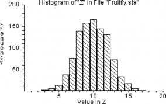
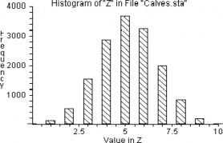
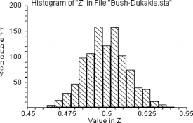
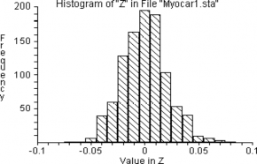

---
jupyter:
  jupytext:
    metadata_filter:
      notebook:
        additional: all
        excluded:
        - language_info
    text_representation:
      extension: .Rmd
      format_name: rmarkdown
      format_version: '1.0'
      jupytext_version: 0.8.6
  kernelspec:
    display_name: Python 3
    language: python
    name: python3
resampling_with:
    ed2_fname: 19-Chap-15
---

```{r setup, include=FALSE}
source("_common.R")
```
# Hypothesis-Testing with Counted Data, Part 1 {#sec-testing-counts-one}

:::{.callout-warning}
## Draft page partially ported from original PDF

This page is an automated and partial import from the [original second-edition
PDF](https://resample.com/content/text/19-Chap-15.pdf).

We are in the process of updating this page for formatting, and porting any
code from the original [RESAMPLING-STATS
language](http://www.statistics101.net) to Python and R.

Feel free to read this version for the sense, but expect there to be multiple
issues with formatting.

We will remove this warning when the page has adequate formatting, and we have
ported the code.
:::


## Introduction

The first task in inferential statistics is to make one or more *point
estimates* — that is, to make one or more statements about *how much*
there is of something we are interested in — including especially the
mean and the dispersion. (That work goes under the label "estimation"
and is discussed in @sec-point-estimation.) Frequently the next step, after making
such quantitative estimation of the universe from which a sample has
been drawn, is to consider whether two or more samples are different
from each other, or whether the single sample is different from a
specified value; this work goes under the label "hypothesis testing." We
ask: Did something happen? Or: Is there a difference between two
universes? These are yes-no questions.

In other cases, the next step is to inquire into the reliability of the
estimates; this goes under the label "confidence intervals." (Some
writers include assessing reliability under the rubric of estimation,
but I judge it better not to do so).

So: Having reviewed how to convert hypothesis-testing problems into
statistically testable questions in @sec-framing-questions, we now must ask: How
does one employ resampling methods to make the statistical test? As is
always the case when using resampling techniques, there is no unique
series of steps by which to proceed. The crucial criterion in assessing
the model is whether it accurately simulates the actual event. With
hypothesis-testing problems, any number of models may be correct.
Generally speaking, though, the model that makes fullest use of the
quantitative information available from the data is the best model.

When attempting to deduce the characteristics of a universe from sample
data, or when asking whether a sample was drawn from a particular
universe, a crucial issue is whether a "one-tailed test" or a
"two-tailed test" should be applied. That is, in examining the results
of our resampling experiment based on the benchmark universe, do we
examine both ends of the frequency distribution, or just one? If there
is strong reason to believe *a priori* that the difference between the
benchmark (null) universe and the sample will be in a given
direction — for example if you hypothesize that the sample mean will be
*smaller* than the mean of the benchmark universe — you should then
employ a *one-tailed test* . If you do *not* have strong basis for such
a prediction, use the *two-tailed* test. As an example, when a scientist
tests a new medication, his/her hypothesis would be that the number of
patients who get well will be higher in the treated group than in the
control group. Thus, s/he applies the one-tailed test.

<!---
Have we already introduced one- and two-tailed tests?
-->


Some language first:

**Hypothesis:** In inferential statistics, a statement or claim about a
universe that can be tested and that you wish to investigate.

**Testing:** The process of investigating the validity of a hypothesis.

**Benchmark (or null) hypothesis:** A particular hypothesis chosen for
convenience when testing hypotheses in inferential statistics. For
example, we could test the hypothesis that there is *no difference*
between a sample and a given universe, or between two samples, or that a
parameter is less than or greater than a certain value. The benchmark
universe refers to this hypothesis. (The concept of the benchmark or
null hypothesis was discussed in @sec-prob-theory-one-b and
@sec-framing-questions.)

Now let us begin the actual statistical testing of various sorts of
hypotheses about samples and populations.

## Should a single sample of counted data be considered different from a benchmark universe?

**Example 15-1: Does Irradiation Affect the Sex Ratio in Fruit Flies?**
(Where the Benchmark Universe Mean (in this case, the Proportion) is
Known, is the Mean (Proportion) of the Population Affected by the
Treatment?) (Program "Fruitfly")

You think you have developed a technique for irradiating the genes of
fruit flies so that the sex ratio of the offspring will *not* be half
males and half females. In the first twenty cases you treat, there are
fourteen males and six females. Does this experimental result confirm
that the irradiation does work?

First convert the scientific question — whether or not the treatment
affects the sex distribution — into a probability-statistical question:
Is the observed sample likely to have come from a benchmark universe in
which the sex ratio is one male to one female? The benchmark (null)
hypothesis, then, is that the treatment makes no difference and the
sample comes from the one-male-to-one-female universe. Therefore, we
investigate *how likely a one-to-one universe is to produce a
distribution of fourteen or more of just one sex* .

A coin has a one-to-one (one out of two) chance of coming up tails.
Therefore, we might flip a coin in groups of twenty flips, and count the
number of heads in each twenty flips. Or we can use a random number
table. The following steps will produce a sound estimate:

**Step 1.** Let heads = male, tails = female.

**Step 2.** Flip twenty coins and count the number of males. If 14 or
more males occur, record "yes." Also, if 6 or fewer males occur, record
"yes" because this means we have gotten 14 or more females. Otherwise,
record "no."

**Step 3.** Repeat step 2 perhaps 100 times.

**Step 4.** Calculate the proportion "yes" in the 100 trials. This
proportion estimates the probability that a fruit-fly population with a
propensity to produce 50 percent males will by chance produce as many as
14 or as few as 6 males in a sample of 20 flies.

Table 15-1 shows the results obtained in twenty-five trials of twenty
flips each. In two of the twenty-five trials (8 percent) there were
fourteen or more heads, which we call "males," and in one of the
twenty-five trials (4 percent) there were only six heads, meaning there
were fourteen tails ("females"). We can therefore estimate that, even if
the treatment does *not* affect the sex and the births over a long
period really are one to one, three out of twenty-five times (12
percent) we would get fourteen or more of one sex or the other.
Therefore, finding fourteen males out of twenty births is not
overwhelming evidence that the treatment has any effect, even though the
result is suggestive.

How accurate is the estimate? Seventy-five more trials were made, and of
the 100 trials ten contained fourteen or more "males" (10 percent), and
seven trials contained fourteen or more "females" (7 percent), a total
of 17 percent. So the first twenty-five trials gave a fairly reliable
indication. As a matter of fact, analytically-based computation (not
explained here) shows that the probability of getting fourteen or more
females out of twenty births is .057 and, of course, the same for
fourteen or more males from a one-to-one universe, implying a total
probability of .114 of getting fourteen or more males *or* females.

Table 15-1

**Results From 25 Random Trials for "Fruitfly" Problem**

  -------------- ----------- ----------- -------------- ----------- ----------- -------------- ----------- -----------
  **Trial of**   **\#**      **\>=14**   **Trial of**   **\#**      **\>=14**   **Trial of**   **\#**      **\>=14**
  **20 Coin**    **of**      **or**      **20 Coin**    **of**      **or**      **20 Coin**    **of**      **or**
  **Flips**      **Heads**   **\<=6**    **Flips**      **Heads**   **\<=6**    **Flips**      **Heads**   **\<=6**
  1              11          no          10             10          no          19             13          no
  2              12          no          11             10          no          20             10          no
  3              8           no          12             10          no          21             11          no
  4              12          no          13             9           no          22             14          yes
  5              12          no          14             9           no          23             9           no
  6              7           no          15             12          no          24             7           no
  7              9           no          16             7           no          25             10          no
  8              8           no          17             14          yes                                    
  9              6           yes         18             12          no                                     
  -------------- ----------- ----------- -------------- ----------- ----------- -------------- ----------- -----------

Now let us obtain larger and more accurate simulation samples with the
computer. The key step in the  program "Fruitfly" represents
male fruit flies with the string `'male'` and female fruit flies with the string 
`'female'`. The [`sample`]{.r}[`rnd.choice`]{.python} function is then used to 
generate 20 of these strings with an equal probability that either string is 
selected. This simulates randomly choosing 20 fruit flies on the benchmark
assumption — the "null hypothesis" — that each fruit fly has an equal chance of
being a male or female. Now we want to discover the chances of getting more 
than 13 (i.e., 14 or more) males or more than 13 females under these conditions.
 So we use [`sum`]{.r}[`np.sum`]{.python} to count the number of males in
each random sample and then store this value in the `scores` 
 of this number for each sample. We repeat these 
process 10,000 times.

After one thousand samples have been drawn, we COUNT how often there
were more than 13 males and then count the number of times there were
fewer than 7 males (because if there were fewer than 7 males there must
have been more than 13 females). When we ADD the two results together we
have the probability that the results obtained from the sample of
irradiated fruit flies would be obtained from a random sample of fruit
flies.

::: {.notebook name="fruit_fly" title="Fruit fly simulation"}

::: nb-only
This notebook uses simulation to test the null hypothesis that it is equally 
likely that new fruit files are male or female. 
:::

```{python opts.label="py_ed"}
import numpy as np
import matplotlib.pyplot as plt

# set up the random number generator
rnd = np.random.default_rng()
```

```{python opts.label="py_ed"}

# Set the number of trials
n_trials = 10000

# set the sample size for each trial
sample_size = 20

# An empty array to store the trials
scores = np.zeros(n_trials)

# Do 1000 trials
for i in range(n_trials):

    # Generate 20 simulated fruit flies, where each has an equal chance of being
    # male or female
    a = rnd.choice(['male', 'female'], size = sample_size, p = [0.5, 0.5], replace = True)

    # count the number of males in the sample
    b = np.sum(a == 'male')

    # store the result of this trial
    scores[i] = b
  
# Produce a histogram of the trial results
plt.title(f"Number of males in {n_trials} samples of \n{sample_size} simulated fruit flies")
plt.hist(scores)
plt.xlabel('Number of Males')
plt.ylabel('Frequency')
plt.show()
```

```{r opts.label="r_ed"}

# Set the number of trials
n_trials <- 10000

# set the sample size for each trial
sample_size <- 20

# An empty array to store the trials
scores <- numeric(n_trials)

# Do 1000 trials
for (i in 1:n_trials)

    {
    # Generate 20 simulated fruit flies, where each has an equal chance of being
    # male or female
    a <- sample(c('male', 'female'), size = sample_size, prob = c(0.5, 0.5),
    replace = TRUE)

    # count the number of males in the sample
    b <- sum(a == 'male')

    # store the result of this trial
    scores[i] <- b
    }
  
# Produce a histogram of the trial results
title_of_plot <- paste0("Number of males in", n_trials, " samples of \n", sample_size, " simulated fruit flies")
hist(scores, xlab = 'Number of Males', main = title_of_plot)
```

**20 Fruitflies**



**\# males**

In the histogram above, we see that in 16 percent of the trials, the
number of males was 14 or more, or 6 or fewer. Or instead of reading the
results from the histogram, we can calculate the result by tacking on
the following commands to the above program:


<!--- Resampling stats file; Matlab syntax closeish -->

```matlab
' Program file: "fruitfly.rss"

COUNT z >=14 j
' Determine the number of trials in which we had 14 or more males.
COUNT z <=6 k
' Determine the number of trials in which we had 6 or fewer males.
ADD j k m
' Add the two results together.
DIVIDE m 1000 mm
' Convert to a proportion.
PRINT mm
' Print the results.

' Note: The file "fruitfly" on the Resampling Stats software disk contains
' this set of commands.
```

Notice that the strength of the evidence for the effectiveness of the
radiation treatment depends upon the original question: whether or not
the treatment had *any* effect on the sex of the fruit fly, which is a
two-tailed question. If there were reason to believe at the start that
the treatment could increase *only* the number of *males* , then we
would focus our attention on the result that in only two of our first
twenty-five trials were fourteen or more males. There would then be only
a 2/25 = .08 probability of getting the observed results by chance if
the treatment really has no effect, rather than the weaker odds against
obtaining fourteen or more of *either* males or females.

Therefore, whether you decide to figure the odds of just fourteen or
more males (what is called a "one-tail test") or the odds for fourteen
or more males *plus* fourteen or more females (a "two-tail test"),
depends upon your advance knowledge of the subject. If you have no
reason to believe that the treatment will have an effect *only* in the
direction of creating more males and if you figure the odds for the
one-tail test anyway, then you will be kidding yourself. Theory comes to
bear here. If you have a strong hypothesis, deduced from a strong
theory, that there will be more males, then you should figure one-tail
odds, but if you have no such theory you should figure the weaker
two-tail odds.[^maybe-bayes]

[^maybe-bayes]: If you are very knowledgeable, you may do some in-between
    figuring (with what is known as "Bayesian analysis"), but leave this alone
    unless you know well what you are doing.

In the case of the next problem concerning calves, we shall see that a
one-tail test is appropriate because we have no interest in producing
more male calves. Before leaving this example, let us review our
intellectual strategy in handling the problem. First we observe a result
(14 males in 20 flies) which differs from the proportion of the
benchmark population (50 percent males). Because we have treated this
sample with irradiation and observed a result that differs from the
untreated benchmark-population's mean, we speculate that the irradiation
caused the sample to differ from the untreated population. We wish to
check on whether this speculation is correct.

When asking whether this speculation is correct, we are implicitly
asking whether future irradiation would also produce a proportion of
males higher than 50 percent. That is, we are implicitly asking whether
irradiated flies would produce more samples with male proportions as
high as 14/20 than would occur by chance in the absence of irradiation.

If samples as far away as 14/20 from the benchmark population mean of
10/20 would occur frequently by chance, then we would not be impressed
with that experimental evidence as proof that irradiation does affect
the sex ratio. Hence we set up a model that will tell us the frequency
with which samples of 14 or more males out of 20 births would be
observed by chance. Carrying out the resampling procedure tells us that
perhaps a tenth of the time such samples would be observed by chance.
That is not extremely frequent, but it is not infrequent either. Hence
we would probably conclude that the evidence is provocative enough to
justify further experimentation, but not so strong that we should
immediately believe in the truth of this speculation.

The logic of attaching meaning to the probabilistic outcome of a test of
a hypothesis is discussed in @sec-significance-concept. There also is more
about the concept of the level of significance in @sec-significance-concept.

Because of the great importance of this sort of case, which brings out
the basic principles particularly clearly, let us consider another
example:

**Example 15-2: Does the Bio-Engineer's Treatment Increase the Female
Calf Rate? What is the probability that among 10 calves born, 9 or more
will be female?**

Let's consider this question in the context of a set of queries for
performing statistical inference that will be discussed further in
@sec-testing-procedures.

***The question*** (From Hodges and Lehman): Female calves are more
valuable than males. A bio-engineer claims to be able to cause more
females to be born than the expected 50 percent rate. He conducts his
procedure, and nine females are born out of the next 10 pregnancies
among the treated cows. Should you believe his claim? That is, what is
the probability of a result this (or more) surprising occurring by
chance if his procedure has no effect? In this problem, we assume that
on average 100 of 206 births are female, in contrast to the 50-50
benchmark universe in the previous problem.

***What is the purpose of the work?*** Female calves are more valuable
than male calves.

***Statistical inference?*** Yes.

***Confidence interval or Test of hypothesis?*** Test of hypothesis.

***Will you state the costs and benefits of various outcomes, or a loss
function?*** Yes. One need only say that the benefits are very large,
and if the results are promising, it is worth gathering more data to
confirm results.

***How many samples of data are part of the hypothesis test?***

One.

***What is the size of the first sample about which you wish to make
significance statements?*** Ten.

***What comparison(s) to make?*** Compare the sample to the benchmark
universe.

***What is the benchmark universe*** **that embodies the null
hypothesis?** 100/206 female.

***Which symbols for the observed entities?*** Balls in bucket, or numbers.

***What values or ranges of values*** **?** "1-100" and "101-206."

***Finite or infinite universe*** **?** Infinite.

***Which sample(s) do you wish to compare to which, or to the null
universe (and perhaps to the alternative universe)?*** Ten calves.

***What procedure to produce the sample entities?*** Sampling with
replacement.

***Simple (single step) or complex (multiple "if" drawings)?*** Can
think of it either way.

***What to record as the outcome of each resample trial?*** The
proportion (or number) of females.

***What is the criterion*** **to be used in the test?** The probability
that in a sample of ten calves, nine (or more) females would be drawn by
chance from the benchmark universe of 100/206 females.

***"One tail" or "two tail" test?*** One tail, because the farmer is
only interested in females. Finding a large proportion of males would
not be of interest; it would not cause rejecting the null hypothesis.

The actual computation of probability may be done in several ways, as
discussed earlier for four children and for ten cows. Conventional
methods are discussed for comparison in @sec-testing-procedures. Here is the
resampling solution in RESAMPLING STATS:


<!--- Resampling stats file; Matlab syntax closeish -->

```matlab
' Program file: "testing_counts_1_02.rss"

REPEAT 15000
    GENERATE 10 1,206 a
    COUNT a BETWEEN 101 206 b
    SCORE b z
END
HISTOGRAM z
COUNT z >=9 k
DIVIDE k 15000 kk
PRINT kk
' **10 Calves**
```



**\# females**

Result: kk = 0.013867

We read from the result in vector `kk` in the "calves" program that the
probability of 9 or 10 females occurring by chance is a bit more than one
percent.

**Example 15-3: A Public-Opinion Poll** (Is the Proportion of a
Population Greater Than a Given Value?) (Program "CABLEPOL")

A municipal official wants to determine whether a majority of the town's
residents are for or against the awarding of a cable-television
franchise, and he asks you to take a poll. You judge that the telephone
book is a fair representation of the universe in which the politician
was interested, and you therefore decided to interview by telephone. Of
a sample of fifty people who expressed opinions, thirty said "yes" they
were for the plan and twenty said "no," they were against it. How
conclusively do the results show that the people in town want cable
television?

Now comes some necessary subtle thinking in the interpretation of what
seems like a simple problem. Notice that our aim in the analysis is to
avoid the mistake of saying that the town favors the plan when in fact
it does not favor the plan. Our chance of making this mistake is
greatest when the voters are evenly split, so we choose as the benchmark
(null) hypothesis that 50 percent of the town does not want the plan.
This statement really means that "50 percent or more do not want the
plan." We could assess the probability of obtaining our result from a
population that is split (say) 52-48 against, but such a probability
would necessarily be even smaller, and we are primarily interested in
assessing the maximum probability of being wrong. If the maximum
probability of error turns out to be inconsequential, then we need not
worry about less likely errors.

This problem is very much like the one-group fruit fly irradiation
problem in Example 15-1. The only difference is that now we are
comparing the observed sample against an arbitrary value of 50 percent
(because that is the break-point in a situation where the majority
decides) whereas in the fruitfly example we compared the observed sample
against the normal population proportion (also 50 percent, because that
is the normal proportion of males). But it really does not matter *why*
we are comparing the observed sample to the figure of 50 percent; the
procedure is the same in both cases. (Please notice that there is
nothing special about the 50 percent figure; the same procedure would be
followed for 20 percent or 85 percent.)

In brief, we a) designate "1-5" as "no" in the random-number table,
"6-0" as "yes," b) count the number of "yeses" and "noes" in the first
fifty numbers, c) repeat for perhaps a hundred trials, then d) count the
proportion of the trials in which a 50-50 universe would produce thirty
or more "yes" answers.

In operational steps, the procedure is as follows:

**Step 1.** "1-5" = no, "6-0" = yes.

**Step 2.** In 50 random numbers, count the "yeses," and record "false
positive" if 30 or more "yeses."

**Step 3.** Repeat step 2 perhaps 100 times.

**Step 4.** Calculate the proportion of experimental trials showing
"false positive." This estimates the probability that as many as 30
"yeses" would be observed by chance in a sample of 50 people *if* half
(or more) are really against the plan.

In Table 15-2, we see the results of twenty trials; 4 of 20 times (20
percent) 30 or more "yeses" were observed by chance. So our
"significance level" or "prob value" is 20 percent, which is normally
too high to feel confident that our poll results are reliable. This is
the probability that as many as thirty of fifty people would say "yes"
by chance if the population were "really" split evenly. (If the
population were split so that *more* than 50 percent were against the
plan, the probability would be even *less* that the observed results
would occur by chance. In this sense, the benchmark hypothesis is
conservative). On the other hand, if we had been counting "1-5" as "yes"
instead of "no," there would only have been one "false positive." This
indicates how samples can vary just by chance.

Table 15-2

**Results of Twenty Random Trials for Problem "Cablepol"**

**Trials With**

**Trial Number of "Noes" Number of "Yeses" \>=30 "Yeses"**

  ---- ---- ---- -----
  1    23   27   
  2    25   25   
  3    26   24   
  4    22   28   
  5    22   28   
  6    20   30   \ +
  7    25   25   
  8    21   29   
  9    28   22   
  10   19   31   \ +
  11   28   22   
  12   19   31   \ +
  13   18   32   \ +
  14   23   27   
  15   34   16   
  16   27   23   
  17   22   28   
  18   26   24   
  19   28   22   
  20   27   23   
  ---- ---- ---- -----

Taken together, the evidence suggests that the mayor would be wise not
to place very much confidence in the poll results, but rather ought to
act with caution or else take a larger sample of voters.

The RESAMPLING STATS program "Cablepol" GENERATEs samples of 50
simulated voters on the assumption that only 50 percent are in favor of
the franchise. Then it COUNTs the number of samples where over 29 (30 or
more) of the 50 respondents said they were in favor of the franchise.
(That is, we use a "one-tailed test.") The result in KK is the chance of
a "false positive," that is, 30 or more people saying they favor a
franchise when support for the proposal is actually split evenly down
the middle.


<!--- Resampling stats file; Matlab syntax closeish -->

```matlab
' Program file: "testing_counts_1_03.rss"

REPEAT 1000
    ' Do 1000 trials.
    GENERATE 50 1,2 a
    ' Generate randomly 50 "1"s and "2"s, put them in a. Let "1" = "yes" and
    ' "2" = "no."
END
COUNT a =1 b
' Count the number of yeses, put the result in b.
SCORE b z
' Keep track of each trial result in z.
```

End the trial, go back and repeat until all 1000 trials are complete,
then proceed.


<!--- Resampling stats file; Matlab syntax closeish -->

```matlab
' Program file: "testing_counts_1_04.rss"

HISTOGRAM z
' Produce a histogram of the trial results.
```

In the histogram below, we see that 11 percent of our trials had 30 or
more voters in favor, despite the fact that they were drawn from a
population that was split 50-50. RESAMPLING STATS will calculate this
proportion directly if we add the following commands to the above:


<!--- Resampling stats file; Matlab syntax closeish -->

```matlab
' Program file: "cablepol.rss"

COUNT z >= 30 k
' Determine how many trials had 30 or more in favor.
DIVIDE k 1000 kk
' Convert to a proportion.
PRINT kk
' Print the result.

' Note: The file "cablepol" on the Resampling Stats software disk contains
' this set of commands.
```

**Samples of 50 Voters**


**\# voters in favor**

The section above discusses testing hypotheses about a single sample of
counted data relative to a benchmark universe. This section discusses
the issue of whether *two* samples with counted data should be
considered the same or different.

**Example 15-4: Did the Bush-Dukakis Poll Indicate that Bush Would
Win?**

What is the probability that a sample outcome such as actually observed
(840 Bush, 660 Dukakis) would occur by chance if Dukakis is "really"
ahead — that is, if Dukakis has 50 percent (or more) of the support? To
restate in sharper statistical language: What is the probability that
the observed sample or one even more favorable to Bush would occur if
the universe has a mean of 50 percent or below?

Here is a procedure that responds to that question:

1.  Create a benchmark universe with one ball marked "B" and another
    marked "D."

2.  Draw a ball, record its marking, and replace. (We sample with
    replacement to simulate the practically-infinite population of U. S.
    voters.)

3.  Repeat step 2 1500 times and count the number of "B"s. If 840 or
    greater, record "Y"; otherwise, record "N."

4.  Repeat steps 3 and 4 perhaps 1000 or 10,000 times, and count the
    number of "Y"s. The outcome estimates the probability that 840 or
    more Bush choices would occur if the universe is "really" half or
    more in favor of Dukakis.

    This procedure may be done as follows with a computer and Resampling
    Stats (program "bush-hyp"):


<!--- Resampling stats file; Matlab syntax closeish -->

```matlab
' Program file: "testing_counts_1_06.rss"

REPEAT 1000
    GENERATE 1500 1,2 a
    ' Generate 1500 "1's" and "2's," selected randomly, letting "1" = Bush
    COUNT a =1 b
    ' Count Bush votes
    SCORE b z
    ' Keep score
END HISTOGRAM z
COUNT z >=840 k
' How often \>= 840 Bush votes in random draw?
DIVIDE k 1000 kk
' As a proportion of simulated resamples
PRINT kk
' The result was kk = 0. This implies shows a probability so small as
' not to occur once in a thousand times that Bush's "victory" in the
' sample would occur by chance if he really were behind. The results
' of the various runs may be seen in the histogram and printout
' following.
MAXSIZE a 1500
' Enlarge vector a's capacity to 1500 (default is 1000 in some
' versions of Resampling Stats)
REPEAT 1000
    GENERATE 1500 1,2 a
    ' Generate 50 "1's" and "2's," selected randomly, letting "1" = Bush
    COUNT a =1 b
    ' Count Bush votes
    DIVIDE b 1500 c
    ' Find proportion pro-Bush
    SCORE b z
    ' Keep score
END HISTOGRAM z
COUNT z >=.56 k
' How often \>= .56 Bush votes in random draw?
DIVIDE k 1000 kk
' As a proportion of simulated resamples
PRINT kk
' **Samples of 1500 Voters**
```



**proportion voters for Bush**

**Bin Center Freq Pct Cum Pct**

  ------- ----- ------ ------
  0.465   4     0.4    0.4
  0.47    14    1.4    1.8
  0.475   28    2.8    4.6
  0.48    46    4.6    9.2
  0.485   97    9.7    18.9
  0.49    106   10.6   29.5
  0.495   159   15.9   45.4
  0.5     121   12.1   57.5
  0.505   157   15.7   73.2
  0.51    102   10.2   83.4
  0.515   75    7.5    90.9
  0.52    39    3.9    94.8
  0.525   35    3.5    98.3
  0.53    11    1.1    99.4
  0.535   5     0.5    99.9
  0.54    1     0.1    100
  ------- ----- ------ ------

**Example 15-5: Comparison of Possible Cancer Cure to Placebo
Effect** (Do Two Binomial Populations Differ in Their Proportions)
(Program "CANCER").

Example 15-1 used an observed sample of male and female fruitflies
to test the benchmark (null) hypothesis that the flies came from a
universe with a one-to-one sex ratio, and the poll data problem also
compared results to a 50-50 hypothesis. The calves problem also
compared the results to a single benchmark universe — a proportion
of 100/206 females. Now we want to compare *two samples with each
other* , rather than comparing one sample with a hypothesized
universe. That is, in this example we are not comparing one sample
to a benchmark universe, but rather asking whether *both* samples
come from the *same* universe. The universe from which both samples
come, *if* both belong to the same universe, may be thought of as
the benchmark universe, in this case.

The scientific question is whether pill P cures a rare cancer. A
researcher gave pill P to six patients selected randomly from a
group of twelve cancer patients; of the six, five got well. He gave
an inactive placebo to the other six patients, and two of them got
well. Does the evidence justify a conclusion that the pill has a
curative effect?

(An identical statistical example would serve for an experiment on
methods of teaching reading to children. In such a situation the
researcher would respond to inconclusive results by running the
experiment on more subjects, but in cases like the cancer-pill
example the researcher often cannot obtain more subjects.)

We can answer the stated question by *combining* the two samples and
testing both samples against the resulting combined universe. In
this case, the universe is twelve subjects, seven (5 + 2) of whom
got well. How likely would such a universe produce two samples as
far apart as five of six, and two of six, patients who get well? In
other words, how often will two samples of six subjects, each drawn
from a universe in which 7/12 of the patients get well, be as far
apart as 5 -- 2 = 3 patients in favor of the sample designated
"pill"? This is obviously a one-tail test, for there is no reason to
believe that the pill group might do *less* well than the placebo
group.

We might construct a twelve-sided die, seven of whose sides are
marked "get well." Or we would use pairs of numbers from the
random-number table, with numbers "01-07" corresponding to get well,
numbers "08-12" corresponding to "not get well," and all other
numbers omitted. (If you wish to save time, you can work out a
system that uses more numbers and skips fewer, but that is up to
you.) Designate the first six subjects "pill" and the next six
subjects "placebo."

The specific procedure might be as follows:

**Step 1.** "01-07" = get well, "08-12" = do not get well

**Step 2.** Select two groups, A and B, each with six random numbers
from "01" to "12."

**Step 3.** Record how many "get well" in each group.

**Step 4.** Subtract the result in group A from that in group B (the
difference may be negative).

**Step 5.** Repeat steps 1-4 perhaps 100 times.

**Step 6.** Compute the proportion of trials in which the pill does
better by three or more cases. In the trials shown in Table 15-3, in
three cases (12 percent) the difference between the randomly-drawn
groups is three cases or greater. Apparently it is *somewhat*
unusual — it happens 12 percent of the time — for this universe to
generate "pill" samples in which the number of recoveries exceeds
the number in the "placebo" samples by three or more. Therefore the
answer to the scientific question, based on these samples, is that
there is *some* reason to think that the medicine does have a
favorable effect. But the investigator might sensibly await more
data before reaching a firm conclusion about the pill's efficiency,
given the 7 to 1 odds (12 percent probability).

Table 15-3

**Results of 25 Random Trials for Probability "Cancer"**

  ----------- ---------------- ------------------- ----------------
  **Trial**   **Pill Cures**   **Placebo Cures**   **Difference**
  1           4                4                   0
  2           3                5                   -2
  3           4                3                   1
  4 \*        5                2                   3
  5           4                3                   1
  6           2                5                   -3
  7           4                4                   0
  8           4                5                   -1
  9           4                4                   0
  10 \*       5                2                   3
  11          4                5                   -1
  12          5                3                   2
  13          3                5                   -2
  14          3                2                   1
  15          3                4                   -1
  16          5                4                   1
  17 \*       6                3                   3
  18          4                5                   -1
  19          3                4                   -1
  20          2                3                   -1
  21          4                4                   0
  22          4                4                   0
  23          3                5                   -2
  24          3                3                   0
  25          3                3                   0
  ----------- ---------------- ------------------- ----------------

Now for a RESAMPLING STATS solution. Again, the benchmark hypothesis
is that pill P has no effect, and we ask how often, on this
assumption, the results that were obtained from the actual test of
the pill would occur by chance.

Given that in the test 7 of 12 patients overall got well, the
benchmark hypothesis assumes 7/12 to be the chances of any random
patient being cured. We GENERATE two similar samples of 6 patients,
both taken from the same universe composed of the combined
samples — the bootstrap procedure. Letting the numbers "1" through
"7" denote patients who got well and "8-12" denote persons not
getting well, we COUNT the number who got well in each sample. Then
we SUBTRACT the number who got well in the "pill" sample from the
number who got well in the "no-pill" sample. We SCORE the resulting
difference for each trial in Z.

In the actual test, 3 more patients got well in the sample given the
pill than in the sample given the placebo. We therefore count how
many of the trials yield results where the difference between the
sample given the pill and the sample not given the pill was greater
than 2 (equal to or greater than 3). This result is the probability
that the results derived from the actual test would be obtained from
random samples drawn from a population which has a constant cure
rate, pill or no pill.


<!--- Resampling stats file; Matlab syntax closeish -->

```matlab
' Program file: "testing_counts_1_07.rss"

REPEAT 1000
    ' Do 1000 experiments.
    GENERATE 6 1,12 a
    ' Randomly generate 6 numbers between "1" and "12." Let "1-7" = cure,
    ' "8-12" = no cure. This will be the "medicine" group.
    GENERATE 6 1,12 b
    ' Similarly for the "placebo" group.
    COUNT a between 1 7 aa
    ' Count the number of cures in the trial "medicine" group. ("Medicine"
    ' is in quotes because the vector a is an arbitrary random selection
    ' of our experiment — one we know has no medicinal value because the
    ' cure rate — 7/12 — is the same as for the "placebo" experimental
    ' group.)
    COUNT b between 1 7 bb
    ' Count the number of cures in the trial "placebo" group.
    SUBTRACT aa bb c
    ' Subtract trial "placebo" cures from trial "medicine" cures.
    SCORE c z
    ' Keep track of each trial result in z.
END
' End one experiment, go back and repeat until 1000 are complete, then
' proceed.
HISTOGRAM z
' Produce a histogram of the trial results.
```

**Cancer**

12 Treatments (6 Medicine, 6 Placebo)


**excess cures ("medicine" - "placebo")**

Recall our actual observed results: In the medicine group, three
more patients were cured than in the placebo group. From the
histogram, we see that in only 8 percent of the simulated trials did
the "medicine" group do as well or better. The results seem to
suggest — but by no means conclusively — that the medicine's
performance is not due to chance. Further study would probably be
warranted. The following commands added to the above program will
calculate this proportion directly:


<!--- Resampling stats file; Matlab syntax closeish -->

```matlab
' Program file: "cancer.rss"

COUNT z >=3 k DIVIDE k 1000 kk
' Convert to a proportion.
PRINT kk
' Print the result.

' Note: The file "cancer" on the Resampling Stats software disk
' contains this set of commands.
```

As I wrote when I first proposed this bootstrap method in 1969, this
method is not the standard way of handling the problem; it is not
even analogous to the standard analytic difference-of-proportions
method (though since then it has become widely accepted). Though the
method shown is quite direct and satisfactory, there are also *many
other* resampling methods that one might construct to solve the same
problem. By all means, invent your own statistics rather than simply
trying to copy the methods described here; the examples given here
only illustrate the process of inventing statistics rather than
offering solutions for all classes of problems.

**Example 15-6: Did Attitudes About Marijuana Change?**

<!---
Example 8.18 in W+W 1990.  Looks like fake data.
-->

Consider two polls, each asking 1500 Americans about marijuana
legalization. One poll, taken in 1980, found 52 percent of
respondents in favor of decriminalization; the other, taken in 1985,
found 46 percent in favor of decriminalization [@wonnacott1990introductory page
275]. Our null (benchmark) hypothesis is that both samples came from the same
universe (the universe made up of the total of the two sets of observations).
If so, let us then ask how likely would be two polls to produce results as
different as were observed? Hence we construct a universe with a mean of 49
percent (the mean of the two polls of 52 percent and 46 percent), and
repeatedly draw pairs of samples of size 1500 from it.

To see how the construction of the appropriate question is much more
challenging intellectually than is the actual mathematics, let us
consider another possibility suggested by a student: What about
considering the universe to be the earlier poll with a mean of 52
percent, and then asking the probability that the later poll of 1500
people with a mean of 46 percent would come from it? Indeed, on
first thought that procedure seems reasonable.

Upon reflection — and it takes considerable thought on these matters
to get them right — that would *not* be an appropriate procedure.
The student's suggested procedure would be the same as assuming that
we had long-run solid knowledge of the universe, as if based on
millions of observations, and then asking about the probability of a
particular sample drawn from it. That does not correspond to the
facts.

The only way to find the approach you eventually consider best — and
there is no guarantee that it is indeed *correct* — is by close
reference to the particular facts of the case.

## Example: Infarction and Cholesterol: Framingham Study {#sec-framingham-example}

It is so important to understand the logic of hypothesis tests, and
of the resampling method of doing them, that we will now tackle
another problem similar to the preceding one.

This will be the first of several problems that use data from the
famous Framingham study (drawn from Kahn and Sempos [-@kahn1989statistical])
concerning the development of myocardial infarction 16 years after the
Framingham study began, for men ages 35- 44 with serum cholesterol above 250,
compared to those with serum cholesterol below 250. The raw data are shown in
Table 15-4 (divided into "high" and "low" cholesterol by Kahn and Sempos).

Table 15-4

**Development of Myocardial Infarction in Framingham After 16 Years**

**Men Age 35-44, by Level of Serum Cholesterol**

  ----------------------- ------------------ ----------------------- -----------
  **Serum Cholesterol**   **Developed MI**   **Didn't Develop MI**   **Total**
   \> 250                 10                 125                     135
  \<= 250                 21                 449                     470
  ----------------------- ------------------ ----------------------- -----------

Source: [@shurtleff1970framingham], cited in [@kahn1989statistical, page 61,
Table 3-8].

The statistical logic properly begins by asking: How likely is that
the two observed groups "really" came from the same "population"
with respect to infarction rates? That is, we start with this
question: How sure should one be that there is a difference in
myocardial infarction rates between the high and low-cholesterol
groups? Operationally, we address this issue by asking how likely it
is that two groups as different in disease rates as the observed
groups would be produced by the same "statistical universe."

Key step: We assume that the relevant "benchmark" or
"null hypothesis" population (universe) is the composite of the two
observed groups. That is, if there were no "true" difference in
infarction rates between the two serum-cholesterol groups, and the
observed disease differences occurred just because of sampling
variation, the most reasonable representation of the population from
which they came is the composite of the two observed groups.

Therefore, we compose a hypothetical "benchmark" universe containing
(135 + 470 =) 605 men at risk, and designate (10 + 21 =) 31 of them
as infarction cases. We want to determine how likely it is that a
universe like this one would produce — just by chance — two groups
that differ as much as do the actually observed groups. That is, how
often would random sampling from this universe produce one
sub-sample of 135 men containing a large enough number of
infarctions, and the other sub-sample of 470 men producing few
enough infarctions, that the difference in occurrence rates would be
as high as the observed difference of .029? (10/135 = .074, and
21/470 = .045, and .074 - .045 = .029).

So far, everything that has been said applies both to the
conventional formulaic method and to the "new statistics" resampling
method. But the logic is seldom explained to the reader of a piece
of research — if indeed the researcher her/ himself grasps what the
formula is doing. And if one just grabs for a formula with a prayer
that it is the right one, one need never analyze the statistical
logic of the problem at hand.

Now we tackle this problem with a method that you would think of
yourself if you began with the following mind-set: How can I
simulate the mechanism whose operation I wish to understand? These
steps will do the job:

**Step 1:** Fill a bucket with 605 balls, 31 red (infarction) and the
rest (605 — 31 = 574) green (no infarction).

**Step 2:** Draw a sample of 135 (simulating the high
serum-cholesterol group), one ball at a time and throwing it back
after it is drawn to keep the simulated probability of an infarction
the same throughout the sample; record the number of reds. Then do
the same with another sample of 470 (the low serum-cholesterol
group).

**Step 3:** Calculate the difference in infarction rates for the two
simulated groups, and compare it to the actual difference of

.029; if the simulated difference is that large, record "Yes" for
this trial; if not, record "No."

**Step 4:** Repeat steps 2 and 3 until a total of (say) 400 or 1000
trials have been completed. Compute the frequency with which the
simulated groups produce a difference as great as actually observed.
This frequency is an estimate of the probability that a difference
as great as actually observed in Framingham would occur even if
serum cholesterol has no effect upon myocardial infarction.

The procedure above can be carried out with balls in a bucket
in a few hours. Yet it is natural to seek the added convenience of
the computer to draw the samples. Here is a RESAMPLING STATS program
("myocar1"):


<!--- Resampling stats file; Matlab syntax closeish -->

```matlab
' Program file: "testing_counts_1_09.rss"

URN 31#1 574#2 men
' A bucket called "men" with 31 "1's" (=infarctions) and 574 "2's" (=no
' infarction)
REPEAT 1000
    SAMPLE 135 men high
    ' Sample (with replacement!) 135 of the numbers in this bucket, give this
    ' group the name "high"
    SAMPLE 470 men low
    ' Same for a group of 470, call it "low"
    COUNT high =1 a
    ' Count infarctions in first group
    DIVIDE a 135 aa
    ' Express as a proportion
    COUNT low =1 b
    ' Count infarctions in second group
    DIVIDE b 470 bb
    ' Express as a proportion
    SUBTRACT aa bb c
    ' Find the difference in infarction rates
    SCORE c z
    ' Keep score of this difference
END HISTOGRAM z
COUNT z >=.029 k
' How often was the resampled difference \>= the observed difference?
DIVIDE k 1000 kk
' Convert this result to a proportion
PRINT kk
```



**Difference between paired resamples (propor tion with
infarction)**

Result: kk = 0.102 (the proportion of resample pairs with a
difference \>= .029)

The results of the test using this program may be seen in the
histogram. We find — perhaps surprisingly — that a difference as
large as observed would occur by chance fully 10 percent of the
time. (If we were not guided by the theoretical expectation that
high serum cholesterol produces heart disease, we might include the
10 percent difference going in the other direction, giving a 20
percent chance). Even a ten percent chance is sufficient to call
into question the conclusion that high serum cholesterol is
dangerous. At a minimum, this statistical result should call for
more research before taking any strong action clinically or
otherwise.

Where should one look to determine which procedures should be used
to deal with a problem such as set forth above? Unlike the formulaic
approach, the basic source is not a manual which sets forth a menu
of formulas together with sets of rules about when they are
appropriate. Rather, you consult your own understanding about what
is happening in (say) the Framingham situation, and the question
that needs to be answered, and then you construct a "model" that is
as faithful to the facts as is possible. The bucket-sampling described
above is such a model for the case at hand.

To connect up what we have done with the conventional approach, one
could apply a z test (conceptually similar to the t test, but
applicable to yes-no data; it is the Normal-distribution
approximation to the large binomial distribution). Do so, we find
that the results are much the same as the resampling result — an
eleven percent probability.

Someone may ask: Why do a resampling test when you can use a
standard device such as a z or t test? The great advantage of
resampling is that it avoids using the wrong method. The researcher
is more likely to arrive at sound conclusions with resampling
because s/he can understand what s/he is doing, instead of blindly
grabbing a formula which may be in error.

The textbook from which the problem is drawn is an excellent one;
the difficulty of its presentation is an inescapable consequence of
the formulaic approach to probability and statistics. The body of
complex algebra and tables that only a rare expert understands down
to the foundations constitutes an impenetrable wall to
understanding. Yet without such understanding, there can be only
rote practice, which leads to frustration and error.

**Example 15-8: Is One Pig Ration More Effective Than the Other?**
(Testing For a Difference in Means With a Two-by-Two Classification)
(Program "Pigs1")

Each of two new types of ration is fed to twelve pigs. A farmer
wants to know whether ration A or ration B is better.[^pig-example] The weight
gains in pounds for pigs fed on rations A and B are:

[^pig-example]: The data for this example are based on Dixon and Massey
    [-@dixon1983introduction, p. 124], who offer an orthodox method of
    handling the problem with a t-test.

A: 31, 34, 29, 26, 32, 35, 38, 34, 31, 29, 32, 31

B: 26, 24, 28, 29, 30, 29, 31, 29, 32, 26, 28, 32

The statistical question may be framed as follows: should one
consider that the pigs fed on the different rations come from the
same universe with respect to weight gains?

In the actual experiment, 9 of the 12 pigs who were fed ration A
also were in the top half of weight gains. How likely is it that one
group of 12 randomly-chosen pigs would contain 9 of the 12 top
weight gainers?

One approach to the problem is to divide the pigs into two
groups — the twelve with the highest weight gains, and the twelve
with the lowest weight gains — and examine whether an unusually
large number of high-weight-gain pigs were fed on one or the other
of the rations.

We can make this test by ordering and grouping the twentyfour pigs:

**High-weight group:**

38 (ration A), 35 (A), 34 (A), 34 (A), 32 (B), 32 (A), 32 (A), 32
(B), 31 (A),

31 (B), 31 (A), 31 (A)

**Low-weight group:**

30 (B), 29 (A), 29 (A), 29 (B), 29 (B), 29 (B), 28 (B), 28 (B), 26
(A), 26 (B),

26 (B), 24 (B).

Among the twelve high-weight-gain pigs, nine were fed on ration A.
We ask: Is this further from an even split than we are likely to get
by chance? Let us take twelve red and twelve black cards, shuffle
them, and deal out twelve cards (the other twelve need not be dealt
out). Count the proportion of the hands in which one ration comes up
nine or more times in the first twelve cards, to reflect ration A's
appearance nine times among the highest twelve weight gains. More
specifically:

**Step 1.** Constitute a deck of twelve red and twelve black cards,
and shuffle.

**Step 2.** Deal out twelve cards, count the number red, and record
"yes" if there are nine or more of *either* red or black.

**Step 3.** Repeat step 2 perhaps fifty times.

**Step 4.** Compute the proportion "yes." This proportion estimates
the probability sought.

Table 15-4 shows the results of fifty trials. In three (marked by
asterisks) of the fifty (that is, 6 percent of the trials) there
were nine or more either red or black cards in the first twelve
cards. Again the results suggest that it would be *slightly unusual*
for the results to favor one ration or the other so strongly just by
chance if they come from the same universe.

Table 15-4

**Results of Fifty Random Trials for Problem "PIGS1"**

  ----------- --------- --------- ----------- --------- --------- ----------- --------- ---------
  **Trial**   **Blk**   **Red**   **Trial**   **Blk**   **Red**   **Trial**   **Blk**   **Red**
  1           7         5         19          5         7         37          6         6
  2           7         5         20          5         7         38          5         7
  3           6         6         21          4         8         39          7         5
  4           6         6         \*22        9         3         40          5         7
  5           6         6         23          7         5         41          6         6
  6           4         8         24          5         7         42          4         8
  7           6         6         25          5         7         43          7         5
  8           6         6         26          7         5         44          5         7
  9           5         7         27          6         6         45          8         4
  10          8         4         \*28        9         3         46          5         7
  11          6         6         29          7         5         47          5         7
  12          7         5         30          7         5         48          6         6
  13          8         4         31          8         4         49          6         6
  14          5         7         \*32        3         9         50          6         6
  15          6         6         33          5         7                               
  16          7         5         34          6         6                               
  17          8         4         35          5         7                               
  18          8         4         36          5         7                               
  ----------- --------- --------- ----------- --------- --------- ----------- --------- ---------

Now a RESAMPLING STATS procedure to answer the question:

The NUMBERS statement creates an array of numbers "1" through "24,"
which will represent the rankings of weight gains for each of the 24
pigs. We REPEAT the following procedure for 1000 trials. First we
SHUFFLE the elements of array A so that the rank numbers for weight
gains are randomized and placed in array B. We then TAKE the first
12 elements of B and place them in C; this represents the rankings
of a randomly-selected group of 12 pigs. We next COUNT in C the
number of pigs whose rankings for weight gain were in the top
half — that is, a rank of less than 13. We SCORE that number and END
the loop.

Since we did not know beforehand the direction of the effect of
ration A on weight gain, we want to count the times that *either
more than 8* of the random selection of 12 pigs were in the top half
of the rankings, *or that fewer than 4* of these pigs were in the
top half of the weight gain rankings — (The latter is the same as
counting the number of times that more than 8 of the 12
*non-selected* random pigs were in the top half in weight gain.)

We do so with the final two COUNT statements. By adding the two
results J and K together, we have the number of times out of 1000
that differences in weight gains in two groups as dramatic as those
obtained in the actual experiment would occur by chance.


<!--- Resampling stats file; Matlab syntax closeish -->

```matlab
' Program file: "testing_counts_1_10.rss"

NUMBERS 1,24 a
' Constitute the set of the weight gain rank orders. A is now a vector
' consisting of the numbers 1 — 24, in that order.
REPEAT 1000
    ' Do the following experiment 1000 times.
    SHUFFLE a b
    ' Shuffle the ranks of the weight gains, put the shuffled ranks in b.
    TAKE b 1,12 c
    ' Take the first 12 ranks, put them in c
    COUNT c <= 12 d
    ' Determine how many of these randomly selected 12 ranks are less than
    ' 12 (i.e. 1-12), put that result in d.
    SCORE d z
    ' Keep track of each trial result in z.
END
' End one experiment, go back and repeat until 1000 trials are
' complete.
HISTOGRAM z
' Produce a histogram of the trial results.
```

**PIGS1: Random Selection of 12 Weight Gains (24 Pigs)**


**\# of top half weight gains picked**

We see from the histogram that, in about 3 percent of the trials,
either more than 8 or fewer than 4 top half ranks (1-12) made it
into the random group of twelve that we selected. RESAMPLING STATS
will calculate this for us as follows:


<!--- Resampling stats file; Matlab syntax closeish -->

```matlab
' Program file: "pigs1.rss"

COUNT z >= 9 j
' Determine how many of the trials yielded 9 or more top ranks.
COUNT z <= 3 k
' Determine how many trials yielded 3 or fewer of the top ranks.
ADD j k m
' Add the two together.
DIVIDE m 1000 mm
' Convert to a proportion.
PRINT mm
' Print the results.

' Note: The file "pigs1" on the Resampling Stats software disk
' contains this set of commands.
```

The decisions that are warranted on the basis of the results depend
upon one's purpose. If writing a scientific paper on the merits of
ration A is the ultimate purpose, it would be sensible to test
another batch of pigs to get further evidence. (Or you could proceed
to employ another sort of test for a slightly more precise
evaluation.) But if the goal is a decision on which type of ration
to buy for a small farm and they are the same price, just go ahead
and buy ration A because, even if it is no better than ration B, you
have strong evidence that it is *no worse* .

**Example 15-9: Do Planet Densities Differ?**

**Consider the five planets known to the ancient world.**

Mosteller and Rourke [-@mosteller1973sturdy, pages 17--19] ask us to compare
the densities of the three planets *farther* from the sun than is the earth
(Mars, density 0.71; Jupiter, 0.24; and Saturn, 0.12) against the densities of
the planets *closer* to the sun than is the earth (Mercury, 0.68; Venus,
0.94).

The average density of the distant planets is .357, of the closer
planets is .81. Is this difference (.353) statistically significant,
or is it likely to occur in a chance ordering of these planets?

We can answer this question with a permutation test; such sampling
without replacement makes sense here because we are considering the
entire set of planets, rather than a sample drawn from a larger
population of planets (the word "population" is used here, rather
than "universe," to avoid confusion.) And because the number of
objects is so small, one could examine all possible arrangements
(permutations), and see how many have (say) differences in mean
densities between the two groups as large as observed.

Another method that Mosteller and Rourke suggest is by a comparison of the
density *ranks* of the two sets, where Saturn has rank 1 and Venus has rank 5.
This might have a scientific advantage if the sample data are dominated by a
single "outlier," whose domination is removed when we rank the data.

We see that the sum of the ranks for the "closer" set is 3+5=8. We
can then ask: If the ranks were assigned at random, how likely is it
that a set of two planets would have a sum as large as 8? Again,
because the sample is small, we can examine all the possible
permutations, as Mosteller and Rourke do in Table 3-1 [@mosteller1973sturdy,
page 56] (Substitute "Closer" for "B," "Further" for "A"). In two of the ten
permutations, a sum of ranks as great as 8 is observed, so the probability of
a result as great as observed happening by chance is 20 percent, using these
data. (We could just as well consider the difference in mean ranks between the
two groups: (8/2 - 7/3 =) 1.6.)

<!---
Perhaps easier to reproduce M+R table here - no-one will have that reference to
hand.
-->


To illuminate the logic of this test, consider comparing the heights
of two samples of trees. If sample A has the five tallest trees, and
sample B has the five shortest trees, the difference in mean ranks
will be (6+7+8+9+10=) 40 — (1+2+3+4+5=) 15, the largest possible
difference. If the groups are less sharply differentiated — for
example, if sample A has \#3 and sample B has \#8 — the difference
in ranks will be less than the maximum of 40, as you can quickly
verify.

The method we have just used is called a Mann-Whitney test, though
that label is usually applied when the data are too many to examine
all the possible permutations; in that case one conventionally uses
a table prepared by formula. In the case where there are too many
for a complete permutation test, our resampling algorithm is as
follows (though we'll continue with the planets example):

1.  Compute the mean ranks of the two groups.

2.  Calculate the difference between the means computed in step 1.

3.  Create a bucket containing the ranks from 1 to the number of
    observations (5, in the case of the planets), and shuffle them.

4.  Since we are working with the ranked data, we must draw without
    replacement, because there can only be one \#3, one \#7, and so
    on. So draw the number of observations corresponding to the
    number of observations — 2 "Closer" and 3 "Further."

5.  Compute the mean ranks of the two simulated groups of planets.

6.  Calculate the difference between the means computed in step 5
    and record.

7.  Repeat steps 3 to 7 perhaps 1000 times.

8.  Count how often the shuffled difference in ranks exceeds the
    observed difference of 1.6.


<!--- Resampling stats file; Matlab syntax closeish -->

```matlab
' Program file: "testing_counts_1_12.rss"

NUMBERS 1,5 ranks
' step 3 above
REPEAT 1000
    ' step 7
    SHUFFLE ranks ranks$
    ' step 3
    TAKE ranks$ 1,2 closer
    ' step 4
    TAKE ranks$ 3,5 further
    ' step 4
    MEAN closer m_close
    ' step 5
    MEAN farther m_far
    ' step 5
    SUBTRACT m_close m_far diff
    ' step 6
    SCORE diff z
    ' step 6
END
' step 7
COUNT z >=1.6 k
' step 8
DIVIDE k 1000 prob
' PRINT prob
```

Result: prob = 0.21

Interpretation: 21 percent of the time, random shufflings produced a
difference in ranks as great as or greater than observed. Hence, on the
strength of this evidence, we should *not* conclude that there is a
statistically significant difference in densities between the faurther
planets and the closer planets.

This chapter has begun the actual work of testing hypotheses. The next
chapter continues with discussion of somewhat more complex problems with
counted data — more complex to think about, but no more difficult to
actually treat mathematically with resampling simulation. If you have
understood the general logic of the procedures used up until this point,
you are in command of all the necessary conceptual knowledge to
construct your own tests to answer any statistical question. A lot more
practice, working on a variety of problems, obviously would help. But
the key elements are simple: 1) Model the real situation accurately, 2)
experiment with the model, and 3) compare the results of the model with
the observed results.
