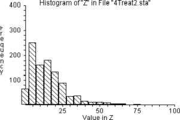

---
jupyter:
  jupytext:
    metadata_filter:
      notebook:
        additional: all
        excluded:
        - language_info
    text_representation:
      extension: .Rmd
      format_name: rmarkdown
      format_version: '1.0'
      jupytext_version: 0.8.6
  kernelspec:
    display_name: Python 3
    language: python
    name: python3
resampling_with:
    ed2_fname: 21-Chap-17
---

```{r setup, include=FALSE}
source("_common.R")
```

# The Statistics of Hypothesis-Testing with Counted Data, Part 2

:::{.callout-warning}
## Draft page partially ported from original PDF

This page is an automated and partial import from the [original second-edition
PDF](https://resample.com/content/text/21-Chap-17.pdf).

We are in the process of updating this page for formatting, and porting any
code from the original [RESAMPLING-STATS
language](http://www.statistics101.net) to Python and R.

Feel free to read this version for the sense, but expect there to be multiple
issues with formatting.

We will remove this warning when the page has adequate formatting, and we have
ported the code.
:::


Here's the bad-news-good-news message again: The bad news is that the
subject of inferential statistics is extremely difficult — not because
it is complex but rather because it is subtle. The cause of the
difficulty is that the world around us is difficult to understand, and
spoon-fed mathematical simplifications which you manipulate mechanically
simply mislead you into thinking you understand that about which you
have not got a clue.

The good news is that you — and that means *you* , even if you say you
are "no good at math" — can understand these problems with a layperson's
hard thinking, even if you have no mathematical background beyond
arithmetic and you think that you have no mathematical capability.
That's because the difficulty lies in such matters as pin-pointing the
right question, and understanding how to interpret your results.

The problems in the previous chapter were tough enough. But this chapter
considers problems with additional complications, such as when there are
more than two groups, or paired comparisons for the same units of
observation.

## Comparisons among more than two samples of counted data

**Example 17-1: Do Any of Four Treatments Affect the Sex Ratio in Fruit
Flies?** (When the Benchmark Universe Proportion is Known, Is the Propor
tion of the Binomial Population Affected by Any of the Treatments?)
(Program "4treat")

Suppose that, instead of experimenting with just one type of radiation
treatment on the flies (as in Example 15-1), you try *four* different
treatments, which we shall label A, B, C, and D. Treatment A produces
fourteen males and six females, but treatments B, C, and D produce ten,
eleven, and ten males, respectively. It is immediately obvious that
there is no reason to think that treatment B, C, or D affects the sex
ratio. But what about treatment A?

A frequent and dangerous mistake made by young scientists is to scrounge
around in the data for the most extreme result, and then treat it as if
it were the only result. In the context of this example, it would be
fallacious to think that the probability of the fourteen-males-to-six
females split observed for treatment A is the same as the probability
that we figured for a *single* experiment in Example 15-1. Instead, we
must consider that our benchmark universe is composed of *four sets* of
twenty trials, each trial having a 50-50 probability of being male. We
can consider that our previous trials 1-4 in Example 15-1 constitute a
*single* new trial, and each subsequent set of four previous trials
constitute another new trial. We then ask how likely a new trial of our
sets of twenty flips is to produce *one* set with fourteen or more of
one or the other sex.

Let us make the procedure explicit, but using random numbers instead of
coins this time:

**Step 1.** Let "1-5" = males, "6-0" = females

**Step 2.** Choose four groups of twenty numbers. If for *any* group
there are 14 or more males, record "yes"; if 13 or less, record "no."

**Step 3.** Repeat perhaps 1000 times.

**Step 4.** Calculate the proportion "yes" in the 1000 trials. This
proportion estimates the probability that a fruit fly population with a
proportion of 50 percent males will produce as many as 14 males in at
least one of four samples of 20 flies.

We begin the trials with data as in Table 17-1. In two of the six
simulation trials, more than one sample shows 14 or more males. Another
trial shows fourteen or more *females* . Without even concerning
ourselves about whether we should be looking at males or females, or
just males, or needing to do more trials, we can see that it would be
*very common indeed* to have one of four treatments show fourteen or
more of one sex just by chance. This discovery clearly indicates that a
result that would be fairly unusual (three in twenty-five) for a single
sample alone is commonplace in one of four observed samples.

Table 17-1

**Number of "Males" in Groups of 20 (Based on Random Numbers)**

**Trial Group A Group B Group C Group D Yes / No**

**\>= 14 or \<= 6**

  --- ---- ---- ---- ---- -----
  1   11   12   8    12   No
  2   12   7    9    8    No
  3   6    10   10   10   Yes
  4   9    9    12   7    No
  5   14   12   13   10   Yes
  6   11   14   9    7    Yes
  --- ---- ---- ---- ---- -----

A key point of the RESAMPLING STATS program "4TREAT" is that each sample
consists of *four sets* of 20 randomly generated hypothetical fruit
flies. And if we consider 1000 trials, we will be examining 4000 sets of
20 fruit flies.

In each trial we GENERATE up to 4 random samples of 20 fruit flies, and
for each, we count the number of males ("1"s) and then check whether
that group has more than 13 of either sex (actually, more than 13 "1"s
or less than 7 "1"s). If it does, then we change J to 1, which informs
us that for this sample, at least 1 group of 20 fruit flies had results
as unusual as the results from the fruit flies exposed to the four
treatments.

After the 1000 runs are made, we count the number of trials where one
sample had a group of fruit flies with 14 or more of either sex, and
PRINT the results.


<!--- Resampling stats file; Matlab syntax closeish -->

```matlab
' Program file: "4treat.rss"

REPEAT 1000
    ' Do 1000 experiments.
    COPY (0) j
    ' j indicates whether we have obtained a trial group with 14 or more of
    ' either sex. We start at "0" (= no).
    REPEAT 4
        ' Repeat the following steps 4 times to constitute 4 trial groups of 20
        ' flies each.
        GENERATE 20 1,2 a
        ' Generate randomly 20 "1"s and "2"s and put them in a; let "1"

        ' = male.
        COUNT a =1 b
        ' Count the number of males, put the result in b.
        IF b >= 14
            ' If the result is 14 or more males, then
        END
        COPY (1) j
        ' Set the indicator to "1."

        ' End the IF condition.
        IF b <= 6
            ' If the result is 6 or fewer males (the same as 14 or more females), then
        END
        COPY (1) j
        ' Set the indicator to "1."

        ' End the IF condition.
    END
END
' End the procedure for one group, go back and repeat until all four
' groups have been done.
SCORE j z
' j now tells us whether we got a result as extreme as that observed (j =
' "1" if we did, j = "0" if not). We must keep track in z of this result
' for each experiment.

' End one experiment, go back and repeat until all 1000 are complete.
COUNT z =1 k
' Count the number of experiments in which we had results as extreme as
' those observed.
DIVIDE k 1000 kk
' Convert to a proportion.
PRINT kk
' Print the result.

' Note: The file "4treat" on the Resampling Stats software disk contains
' this set of commands.
```

In one set of 1000 trials, there were more than 13 or less than 7 males
33 percent of the time — clearly not an unusual occurrence.

**Example 17-2: Do Four Psychological Treatments Differ in
Effectiveness?** (Do Several Two-Outcome Samples Differ Among Themselves
in Their Propor tions? (Program "4treat1")

Consider four different psychological treatments designed to
rehabilitate juvenile delinquents. Instead of a numerical test score,
there is only a "yes" or a "no" answer as to whether the juvenile has
been rehabilitated or has gotten into trouble again. Label the
treatments P, R, S, and T, each of which is administered to a separate
group of twenty juvenile delinquents. The number of rehabilitations per
group has been: P, 17; R, 10; S, 10; T, 7. Is it improbable that all
four groups come from the same universe?

This problem is like the placebo vs. cancer-cure problem, but now there
are more than two samples. It is also like the four-sample
irradiated-fruit flies example (Example 17-1), except that now we are
*not* asking whether any or some of the samples differ from a *given
universe* (50-50 sex ratio in that case). Rather, we are now asking
whether there are differences *among* the samples themselves. Please
keep in mind that we are still dealing with two-outcome (yes-or-no,
well-or-sick) problems. Later we shall take up problems that are similar
except that the outcomes are "quantitative."

If all four groups were drawn from the same universe, that universe has
an estimated rehabilitation rate of 17/20 + 10/20 + 10/20 + 7/20 = 44/80
= 55/100, because the observed data *taken as a whole* constitute our best
guess as to the nature of the universe from which they come — again, *if* they
all come from the same universe. (Please think this matter over a bit, because
it is important and subtle. It may help you to notice the absence of any
*other* information about the universe from which they have all come, if they
have come from the same universe.)

Therefore, select twenty two-digit numbers for each group from the
random-number table, marking "yes" for each number "1-55" and "no" for
each number "56-100." Conduct a number of such trials. Then count the
proportion of times that the difference between the highest and lowest
groups is larger than the widest observed difference, the difference
between P and T (17-7 = 10). In Table 17-2, none of the first six trials
shows anywhere near as large a difference as the observed range of 10,
suggesting that it would be rare for four treatments that are "really"
similar to show so great a difference. There is thus reason to believe
that P and T differ in their effects.

Table 7-2

**Results of Six Random Trials for Problem "Delinquents"**

  ----------- ------- ------- ------- ------- ----------------------------
  **Trial**   **P**   **R**   **S**   **T**   **Largest Minus Smallest**
  1           11      9       8       12      4
  2           10      10      12      12      2
  3           9       12      8       12      4
  4           9       11      12      10      3
  5           10      10      11      12      1
  6           11      11      9       11      2
  ----------- ------- ------- ------- ------- ----------------------------

The strategy of the RESAMPLING STATS solution to "Delinquents" is
similar to the strategy for previous problems in this chapter. The
benchmark (null) hypothesis is that the treatments do not differ in
their effects observed, and we estimate the probability that the
observed results would occur by chance using the benchmark universe. The
only new twist is that we must instruct the computer to find the groups
with the highest and the lowest numbers of rehabilitations.

Using RESAMPLING STATS we GENERATE four "treatments," each represented
by 20 numbers, each number randomly selected between 1 and 100. We let
1-55 = success, 56-100

= failure. Follow along in the program for the rest of the procedure:


<!--- Resampling stats file; Matlab syntax closeish -->

```matlab
' Program file: "4treat1.rss"

REPEAT 1000
    ' Do 1000 trials
    GENERATE 20 1,100 a
    ' The first treatment group, where "1-55" = success, "56-100" = failure
    GENERATE 20 1,100 b
    ' The second group
    GENERATE 20 1,100 c
    ' The third group
    GENERATE 20 1,100 d
    ' The fourth group
    COUNT a <=55 aa
    ' Count the first group's successes
    COUNT b <=55 bb
    ' Same for second, third & fourth groups
    COUNT c <=55 cc
    COUNT d <=55 dd
END
SUBTRACT aa bb ab
' Now find all the pairwise differences in successes among the groups
SUBTRACT aa cc ac
SUBTRACT aa dd ad
SUBTRACT bb cc bc
SUBTRACT bb dd bd
SUBTRACT cc dd cd
CONCAT ab ac ad bc bd cd e
' Concatenate, or join, all the differences in a single vector e
ABS e f
' Since we are interested only in the magnitude of the difference, not its
' direction, we take the ABSolute value of all the differences.
MAX f g
' Find the largest of all the differences
SCORE g z
' Keep score of the largest

' End a trial, go back and repeat until all 1000 are complete.
COUNT z >=10 k
' How many of the trials yielded a maximum difference greater than the
' observed maximum difference?
DIVIDE k 1000 kk
' Convert to a proportion
PRINT kk
' Note: The file "4treat1" on the Resampling Stats software disk contains
' this set of commands.
```

One percent of the experiments with randomly generated treatments from a
common success rate of .55 produced differences in excess of the
observed maximum difference (10).

An alternative approach to this problem would be to deal with *each*
result's departure from the mean, rather than the largest difference
among the pairs. Once again, we want to deal with *absolute* departures,
since we are interested only in magnitude of difference. We could take
the absolute value of the differences, as above, but we will try
something different here. *Squaring* the differences also renders them
all positive: this is a common approach in statistics.

The first step is to examine our data and calculate this measure: The
mean is 11, the differences are 6, 1, 1, and 4, the

squared differences are 36, 1, 1, and 16, and their sum is 54. Our
experiment will be, as before, to constitute four groups of 20 at random
from a universe with a 55 percent rehabilitation rate. We then calculate
this same measure for the random groups. If it is frequently larger than
54, then we conclude that a uniform cure rate of 55 percent could easily
have produced the observed results. The program that follows also GENER-
ATES the four treatments by using a REPEAT loop, rather than spelling
out the GENERATE command 4 times as above. In RESAMPLING STATS:


<!--- Resampling stats file; Matlab syntax closeish -->

```matlab
' Program file: "testing_counts_2_02.rss"

REPEAT 1000
    ' Do 1000 trials
    REPEAT 4
        ' Repeat the following steps 4 times to constitute 4 groups of 20 and
        ' count their rehabilitation rates.
        GENERATE 20 1,100 a
        ' Randomly generate 20 numbers between 1 and 100 and put them in a; let
        ' 1-55 = rehabilitation, 56-100 no rehab.
        COUNT a between 1 55 b
        ' Count the number of rehabs, put the result in b.
        SCORE b w
        ' Keep track of the 4 rehab rates for the group of 20.
    END
    ' End the procedure for one group of 20, go back and repeat until all 4
    ' are done.
    MEAN w x
    ' Calculate the mean
    SUMSQRDEV w x y
    ' Find the sum of squared deviations between group rehab rates (w) and the
    ' overall rate (x).
    SCORE y z
    ' Keep track of the result for each trial.
    CLEAR w
    ' Erase the contents of w to prepare for the next trial.
END
' End one experiment, go back and repeat until all 1000 are complete.
HISTOGRAM z
' Produce a histogram of trial results.
```

**4 Treatments**



**sum of squared differences**

From this histogram, we see that in only 1 percent of the cases did our
trial sum of squared differences equal or exceed 54, confirming our
conclusion that this is an unusual result. We can have RESAMPLING STATS
calculate this proportion:


<!--- Resampling stats file; Matlab syntax closeish -->

```matlab
' Program file: "4treat2.rss"

COUNT z >= 54 k
' Determine how many trials produced differences as great as those
' observed.
DIVIDE k 1000 kk
' Convert to a proportion.
PRINT kk
' Print the results.

' Note: The file "4treat2" on the Resampling Stats software disk contains
' this set of commands.
```

The conventional way to approach this problem would be with what is
known as a "chi-square test."

**Example 17-3: Three-way Comparison**

In a national election poll of 750 respondents in May, 1992, George Bush
got 36 percent of the preferences (270 voters), Ross Perot got 30
percent (225 voters), and Bill Clinton got 28 percent (210 voters) (
*Wall Street Journal* , October 29, 1992, A16). Assuming that the poll
was representative of actual voting, how likely is it that Bush was
actually *behind* and just came out ahead in this poll by chance? Or to
put it differently, what was the probability that Bush actually had a
plurality of support, rather than that his apparent advantage was a
matter of sampling variability? We test this by constructing a universe
in which Bush is slightly behind (in practice, just equal), and then
drawing samples to see how likely it is that those samples will show
Bush ahead.

We must first find that universe — among all possible universes that
yield a conclusion contrary to the conclusion shown by the data, and one
in which we are interested — that has the highest probability of
producing the observed sample. With a two-person race the universe is
obvious: a universe that is evenly split except for a single vote
against "our" candidate who is now in the lead, i.e. in practice a 50-50
universe. In that simple case we then ask the probability that *that*
universe would produce a sample as far out in the direction of the
conclusion drawn from the observed sample as the observed sample.

With a three-person race, however, the decision is not obvious (and if
this problem becomes too murky for you, skip over it; it is included
here more for fun than anything else). And there is no standard method
for handling this problem in conventional statistics (a solution in
terms of a confidence interval was first offered in 1992, and that one
is very complicated and not very satisfactory to me). But the sort of
thinking that we must labor to accomplish is also required for any
conventional solution; the difficulty is inherent in the problem, rather
than being inherent in resampling, and resampling will be at least as
simple and understandable as any formulaic approach.

The relevant universe is (or so I think) a universe that is 35 Bush — 35
Perot — 30 Clinton (for a race where the poll indicates a 36-30-28
split); the 35-35-30 universe is of interest because it is the universe
that is closest to the observed sample that does not provide a win for
Bush (leaving out the "undecideds" for convenience); it is roughly
analogous to the 50-50 split in the two-person race, though a clear-cut
argument would require a lot more discussion. A universe that is split
34-34-32, or any of the other possible universes, is less likely to
produce a 36-30-28 sample (such as was observed) than is a 35-35-30
universe, I believe, but that is a checkable matter. (In technical
terms, it might be a "maximum likelihood universe" that we are looking
for.)

We might also try a 36-36-28 universe to see if that produces a result
very different than the 35-35-30 universe.

Among those universes where Bush is behind (or equal), a universe that
is split 50-50-0 (with just one extra vote for the closest opponent to
Bush) would be the most likely to produce a 6 percent difference between
the top two candidates by chance, but we are not prepared to believe
that the voters are split in such a fashion. This assumption shows that
we are bringing some judgments to bear from outside the observed data.

For now, the point is not *how* to discover the appropriate benchmark
hypothesis, but rather its *criterion* — which is, I repeat, that
universe (among all possible universes) that yields a conclusion
contrary to the conclusion shown by the data (and in which we are
interested) and that (among such universes that yield such a conclusion)
has the highest probability of producing the observed sample.

Let's go through the logic again: 1) Bush apparently has a 6 percent
lead over the second-place candidate. 2) We ask if the second-place
candidate might be ahead if all voters were polled. We test that by
setting up a universe in which the second-place candidate is
infinitesimally ahead (in practice, we make the two top candidates equal
in our hypothetical universe). And we make the third-place candidate
somewhere close to the top two candidates. 3) We then draw samples from
this universe and observe how often the result is a 6 percent lead for
the top candidate (who starts off just below equal in the universe).

From here on, the procedure is straightforward: Determine how likely
that universe is to produce a sample as far (or further) away in the
direction of "our" candidate winning. (One could do something like this
even if the candidate of interest were not now in the lead.)

This problem teaches again that one must think explicitly about the
choice of a benchmark hypothesis. The grounds for the choice of the
benchmark hypothesis should precede the program, or should be included
as an extended comment within the program.

This program embodies the previous line of thought.


<!--- Resampling stats file; Matlab syntax closeish -->

```matlab
' Program file: "testing_counts_2_04.rss"

URN 35#1 35#2 30#3 univ 1= Bush, 2= Perot, 3=Clinton
REPEAT 1000
    SAMPLE 750 univ samp
    ' Take a sample of 750 votes
    COUNT samp =1 bush
    ' Count the Bush voters, etc.
    COUNT samp =2 pero
    ' Perot voters
    COUNT samp =3 clin
    ' Clinton voters
    CONCAT pero clin others
    ' Join Perot & Clinton votes
    MAX others second
    ' Find the larger of the other two
    SUBTRACT bush second d
    ' Find Bush's margin over 2nd
    SCORE d z
END
HISTOGRAM z
COUNT z >=46 m
' Compare to the observed margin in the sample of 750 corresponding to a 6
' percent margin by Bush over 2nd place finisher (rounded)
DIVIDE m 1000 mm
PRINT mm
' **Samples of 750 Voters**
```


**Bush's margin over 2** **nd** **mm = 0.018**

When we run this program with a 36-36-28 split, we also get a similar
result — 2.6 percent. That is, the analysis shows a probability of only
2.6 percent that Bush would score a 6 percentage point "victory" in the
sample, by chance, if the universe were split as specified. So Bush
could feels reasonably confident that at the time the poll was taken, he
was ahead of the other two candidates.

## Paired Comparisons With Counted Data

**Example 17-4: The Pig Rations Again, But Comparing Pairs of Pigs**
(Paired-Comparison Test) (Program "Pigs2")

To illustrate how several different procedures can reasonably be used to
deal with a given problem, here is another way to decide whether pig
ration A is "really" better: We can assume that the order of the pig
scores listed *within each ration group* is random — perhaps the order
of the stalls the pigs were kept in, or their alphabetical-name order,
or any other random order *not related to their weights* . Match the
first pig eating ration A with the first pig eating ration B, and also
match the second pigs, the third pigs, and so forth. Then count the
number of matched pairs on which ration A does better. On nine of twelve
pairings ration A does better, that is, 31.0 \> 26.0, 34.0 \> 24.0, and
so forth.

Now we can ask: *If* the two rations are equally good, how often will
one ration exceed the other nine or more times out of twelve, just by
chance? This is the same as asking how often either heads *or* tails
will come up nine or more times in twelve tosses. (This is a
"two-tailed" test because, as far as we know, either ration may be as
good as or better than the other.) Once we have decided to treat the
problem in this manner, it is quite similar to Example 15-1 (the first
fruitfly irradiation problem). We ask how likely it is that the outcome
will be as far away as the observed outcome (9 "heads" of 12) from 6 of
12 (which is what we expect to get by chance in this case if the two
rations are similar).

So we conduct perhaps fifty trials as in Table 17-3, where an asterisk
denotes nine or more heads or tails.

**Step 1.** Let odd numbers equal "A better" and even numbers equal "B
better."

**Step 2.** Examine 12 random digits and check whether 9 or more, or 3
or less, are odd. If so, record "yes," otherwise "no."

**Step 3.** Repeat step 2 fifty times.

**Step 4.** Compute the proportion "yes," which estimates the
probability sought.

The results are shown in Table 17-3.

In 8 of 50 simulation trials, one or the other ration had nine or more
tosses in its favor. Therefore, we estimate the probability to be .16
(eight of fifty) that samples this different would be generated by
chance if the samples came from the same universe.

Table 17-3

**Results From Fifty Simulation Trials Of The Problem "Pigs2"**

+-----------+-----------+-----------+-----------+-----------+-----------+
| **Trial** | **Heads"  | **"Tails" | **Trial** | **"Heads" | **"Tails" |
|           | or        | or        |           | or        | or        |
|           | Odds"**   | "Evems"** |           | Odds"**   | "Evens"** |
|           |           |           |           |           |           |
|           | **(Ration | **(Ration |           | **(Ration | **(Ration |
|           | A)**      | B)**      |           | A)**      | B)**      |
+-----------+-----------+-----------+-----------+-----------+-----------+
| 1         | 6         | 6         | 26        | 6         | 6         |
+-----------+-----------+-----------+-----------+-----------+-----------+
| 2         | 4         | 8         | 27        | 5         | 7         |
+-----------+-----------+-----------+-----------+-----------+-----------+
| 3         | 6         | 6         | 28        | 7         | 5         |
+-----------+-----------+-----------+-----------+-----------+-----------+
| 4         | 7         | 5         | 29        | 4         | 8         |
+-----------+-----------+-----------+-----------+-----------+-----------+
| \* 5      | 3         | 9         | 30        | 6         | 6         |
+-----------+-----------+-----------+-----------+-----------+-----------+
| 6         | 5         | 7         | \* 31     | 9         | 3         |
+-----------+-----------+-----------+-----------+-----------+-----------+
| 7         | 8         | 4         | \* 32     | 2         | 10        |
+-----------+-----------+-----------+-----------+-----------+-----------+
| 8         | 6         | 6         | 33        | 7         | 5         |
+-----------+-----------+-----------+-----------+-----------+-----------+
| 9         | 7         | 5         | 34        | 5         | 7         |
+-----------+-----------+-----------+-----------+-----------+-----------+
| \*10      | 9         | 3         | 35        | 6         | 6         |
+-----------+-----------+-----------+-----------+-----------+-----------+
| 11        | 7         | 5         | 36        | 8         | 4         |
+-----------+-----------+-----------+-----------+-----------+-----------+
| \*12      | 3         | 9         | 37        | 6         | 6         |
+-----------+-----------+-----------+-----------+-----------+-----------+
| 13        | 5         | 7         | 38        | 4         | 8         |
+-----------+-----------+-----------+-----------+-----------+-----------+
| 14        | 6         | 6         | 39        | 5         | 7         |
+-----------+-----------+-----------+-----------+-----------+-----------+
| 15        | 6         | 6         | 40        | 8         | 4         |
+-----------+-----------+-----------+-----------+-----------+-----------+
| 16        | 8         | 4         | 41        | 5         | 7         |
+-----------+-----------+-----------+-----------+-----------+-----------+
| 17        | 5         | 7         | 42        | 6         | 6         |
+-----------+-----------+-----------+-----------+-----------+-----------+
| \*18      | 9         | 3         | 43        | 5         | 7         |
+-----------+-----------+-----------+-----------+-----------+-----------+
| 19        | 6         | 6         | 44        | 7         | 5         |
+-----------+-----------+-----------+-----------+-----------+-----------+
| 20        | 7         | 5         | 45        | 6         | 6         |
+-----------+-----------+-----------+-----------+-----------+-----------+
| 21        | 4         | 8         | 46        | 4         | 8         |
+-----------+-----------+-----------+-----------+-----------+-----------+
| \* 22     | 10        | 2         | 47        | 5         | 7         |
+-----------+-----------+-----------+-----------+-----------+-----------+
| 23        | 6         | 6         | 48        | 5         | 7         |
+-----------+-----------+-----------+-----------+-----------+-----------+
| 24        | 5         | 7         | 49        | 8         | 4         |
+-----------+-----------+-----------+-----------+-----------+-----------+
| \*25      | 3         | 9         | 50        | 7         | 5         |
+-----------+-----------+-----------+-----------+-----------+-----------+

Now for a RESAMPLING STATS program and results. "Pigs2" is different
from "Pigs1" in that it compares the weight-gain results of *pairs* of
pigs, instead of simply looking at the *rankings* for weight gains.

The key to "Pigs2" is the GENERATE statement. If we assume that ration A
does not have an effect on weight gain (which is the "benchmark" or
"null" hypothesis), then the results of the actual experiment would be
no different than if we randomly GENERATE numbers "1" and "2" and treat
a "1" as a larger weight gain for the ration A pig, and a "2" as a
larger weight gain for the ration B pig. Both events have a .5 chance of
oc-

curring for each pair of pigs because if the rations had no effect on
weight gain (the null hypothesis), ration A pigs would have larger
weight gains about half of the time. The next step is to COUNT the
number of times that the weight gains of one group (call it the group
fed with ration A) were larger than the weight gains of the other (call
it the group fed with ration B). The complete program follows:


<!--- Resampling stats file; Matlab syntax closeish -->

```matlab
' Program file: "pigs2.rss"

REPEAT 1000
    ' Do 1000 trials
    GENERATE 12 1,2 a
    ' Generate randomly 12 "1"s and "2"s, put them in a. This represents 12
    ' "pairings" where "1" = ration a "wins," "2" = ration b = "wins."
    COUNT a =1 b
    ' Count the number of "pairings" where ration a won, put the result in b.
    SCORE b z
    ' Keep track of the result in z
END
' End the trial, go back and repeat until all 100 trials are complete.
COUNT z >= 9 j
' Determine how often we got 9 or more "wins" for ration a.
COUNT z <= 3 k
' Determine how often we got 3 or fewer "wins" for ration a.
ADD j k m
' Add the two together
DIVIDE m 100 mm
' Convert to a proportion
PRINT mm
' Print the result.

' Note: The file "pigs2" on the Resampling Stats software disk contains
' this set of commands.
```

Notice how we proceeded in Examples 15-6 and 17-4. The data were
originally quantitative — weight gains in pounds for each pig. But for
simplicity we classified the data into simpler counted-data formats. The
first format (Example 15-6) was a rank order, from highest to lowest.
The second format (Example 17-4) was simply higher-lower, obtained by
randomly pairing the observations (using alphabetical letter, or pig's
stall number, or whatever was the cause of the order in which the data
were presented to be random). Classifying the data in either of these
ways loses some information and makes the subsequent tests somewhat
cruder than more refined analysis could provide (as we shall see in the
next chapter), but the loss of efficiency is not crucial in many such
cases. We shall see how to deal directly with the quantitative data in
Chapter 18.

**Example 17-5: Merged Firms Compared to Two Non-Merged Groups**

In a study by Simon, Mokhtari, and Simon [-@simon1996mergers], a set of 33
advertising agencies that merged over a period of years were each compared to
entities within two groups (each also of 33 firms) that did not merge; one
non-merging group contained firms of roughly the same size as the final merged
entities, and the other non-merging group contained pairs of non-merging firms
whose total size was roughly the same as the total size of the merging
entities.

The idea behind the matching was that each pair of merged firms was
compared against

1.  a pair of contemporaneous firms that were roughly the same size as
    the merging firms *before* the merger, and

2.  a single firm that was roughly the same size as the merged entity
    *after* the merger.

    Here (Table 17-4) are the data (provided by the authors):

    Table 17-4

    **Revenue Growth In Year 1 Following Merger**

    **Set \# Merged Match1 Match2**

      ---- ---------- ---------- -----------
      1    -0.20000   0.02564    0.000000
      2    -0.34831   -0.12500   0.080460
      3    0.07514    0.06322    -0.023121
      4    0.12613    -0.04199   0.164671
      5    -0.10169   0.08000    0.277778
      6    0.03784    0.14907    0.430168
      7    0.11616    0.15183    0.142857
      8    -0.09836   0.03774    0.040000
      9    0.02137    0.07661    .0111111
      10   -0.01711   0.28434    0.189139
      11   -0.36478   0.13907    0.038869
      12   0.08814    0.03874    0.094792
      13   -0.26316   0.05641    0.045139
      14   -0.04938   0.05371    0.008333
      15   0.01146    0.04805    0.094817
      16   0.00975    0.19816    0.060929
      17   0.07143    0.42083    -0.024823
      18   0.00183    0.07432    0.053191
      19   0.00482    -0.00707   0.050083
      20   -0.05399   0.17152    0.109524
      21   0.02270    0.02788    -0.022456
      22   0.05984    0.04857    0.167064
      23   -0.05987   0.02643    0.020676
      24   -0.08861   -0.05927   0.077067
      25   -0.02483   -0.01839   0.059633
      26   0.07643    0.01262    0.034635
      27   -0.00170   -0.04549   0.053571
      28   -0.21975   0.34309    0.042789
      29   0.38237    0.22105    0.115773
      30   -0.00676   0.25494    0.237047
      31   -0.16298   0.01124    0.190476
      32   0.19182    0.15048    0.151994
      33   0.06116    0.17045    0.093525
      ---- ---------- ---------- -----------

    Comparisons were made in several years before and after the mergings
    to see whether the merged entities did better or worse than the
    non-merging entities they were matched with by the researchers, but
    for simplicity we may focus on just one of the more important years
    in which they were compared — say, the revenue growth rates in the
    year after the merger.

    Here are those average revenue growth rates for the three groups:

    **Year's rev. growth**

      --------- ----------
      MERGED    -0.0213
      MATCH 1   0.092085
      MATCH 2   0.095931
      --------- ----------

    We could do a general test to determine whether there are
    differences among the means of the three groups, as was done in the
    "Differences Among 4 Pig Rations" problem (chapter 18). However, we
    note that there may be considerable variation from one matched set
    to another -- variation which can obscure the overall results if we
    resample from a large general bucket.

    Therefore, we use the following resampling procedure that maintains
    the separation between matched sets by converting each observation
    into a rank (1, 2 or 3) within the matched set.

    Here (Table 17-5) are those ranks:

    Table 17-5

    **Ranked Within Matched Set** (1 = worst, 3 = best)

    **Set \# Merged Match1 Match2**

      ---- --- --- ---
      1    1   3   2
      2    1   2   3
      3    3   2   1
      4    2   1   3
      5    1   2   3
      6    1   3   2
      7    1   3   2
      8    1   2   3
      9    1   2   3
      10   1   2   3
      11   1   3   2
      12   2   1   3
      13   1   3   2
      14   1   3   2
      15   1   2   3
      16   1   3   2
      17   2   3   1
      18   1   3   2
      ---- --- --- ---

      ------------ ------------ ------------ ------------
      **Set \#**   **Merged**   **Match1**   **Match2**
      19           2            1            3
      20           1            3            2
      21           2            2            3
      22           2            2            3
      23           1            3            2
      24           1            2            3
      25           1            2            3
      26           3            1            2
      27           2            1            3
      28           1            3            2
      29           3            2            1
      30           1            3            2
      31           1            2            3
      32           3            1            2
      33           1            3            2
      ------------ ------------ ------------ ------------

    These are the average ranks for the three groups (1 = worst, 3

    = best):

      --------- ------
      MERGED    1.45
      MATCH 1   2.18
      MATCH 2   2.36
      --------- ------

    Is it possible that the merged group received such a low (poor)
    average ranking just by chance? The null hypothesis is that the
    ranks within each set were assigned randomly, and that "merged" came
    out so poorly just by chance. The following procedure simulates
    random assignment of ranks to the "merged" group:

    1.  Randomly select 33 integers between "1" and "3" (inclusive).

    2.  Find the average rank & record.

    3.  Repeat steps 1 and 2, say, 1000 times.

    4.  Find out how often the average rank is as low as 1.45

Here's a RESAMPLING STATS program ("merge.sta"):


<!--- Resampling stats file; Matlab syntax closeish -->

```matlab
' Program file: "testing_counts_2_06.rss"

REPEAT 1000
    GENERATE 33 (1 2 3) ranks
    MEAN ranks ranksum
    SCORE ranksum z
END
HISTOGRAM z
COUNT z <=1.45 k
DIVIDE k 1000 kk
PRINT kk
```


Result: kk = 0

Interpretation: 1000 random selections of 33 ranks never produced an
average as low as the observed average. Therefore we rule out chance as
an explanation for the poor ranking of the merged firms.

Exactly the same technique might be used in experimental medical studies
wherein subjects in an experimental group are matched with two different
entities that receive placebos or control treatments.

For example, there have been several recent three-way tests of
treatments for depression: drug therapy versus cognitive therapy versus
combined drug and cognitive therapy. If we are interested in the
combined drug-therapy treatment in particular, comparing it to standard
existing treatments, we can proceed in the same fashion as in the merger
problem.

We might just as well consider the real data from the merger as
hypothetical data for a proposed test in 33 triplets of people that have
been matched within triplet by sex, age, and years of education. The
three treatments were to be chosen randomly within each triplet.

Assume that we now switch scales from the merger data, so that \#1 =
best and \#3 = worst, and that the outcomes on a series of tests were
ranked from best (\#1) to worst (\#3) within each triplet. Assume that
the combined drug-and-therapy regime has the best average rank. How sure
can we be that the observed result would not occur by chance? Here are
the data from the merger study, seen here as Table 17-5-b:

Table 17-5-b

**Ranked Therapies Within Matched Patient Triplets**

**(hypothetical data identical to merger data) (1 = best, 3 = worst)**

**Triplet \# Therapy Only Combined Drug Only**

  ---- --- --- ---
  1    1   3   2
  2    1   2   3
  3    3   2   1
  4    2   1   3
  5    1   2   3
  6    1   3   2
  7    1   3   2
  8    1   2   3
  9    1   2   3
  10   1   2   3
  11   1   3   2
  12   2   1   3
  13   1   3   2
  14   1   3   2
  15   1   2   3
  16   1   3   2
  17   2   3   1
  18   1   3   2
  19   2   1   3
  20   1   3   2
  21   2   1   3
  22   2   1   3
  23   1   3   2
  24   1   2   3
  25   1   2   3
  26   3   1   2
  27   2   1   3
  28   1   3   2
  29   3   2   1
  30   1   3   2
  31   1   2   3
  32   3   1   2
  33   1   3   2
  ---- --- --- ---

These are the average ranks for the three groups ("1" = best, "3"=
worst):

  ---------- ------
  Combined   1.45
  Drug       2.18
  Therapy    2.36
  ---------- ------

In these hypothetical data, the average rank for the drug and therapy
regime is 1.45. Is it likely that the regimes do not "really" differ
with respect to effectiveness, and that the drug and therapy regime came
out with the best rank just by the luck of the draw? We test by asking,
"If there is no difference, what is the probability that the treatment
of interest will get an average rank this good, just by chance?"

We proceed exactly as with the solution for the merger problem (see
above).

In the above problems, we did not concern ourselves with chance outcomes
for the other therapies (or the matched firms) because they were not our
primary focus. If, in actual fact, one of them had done exceptionally
well or poorly, we would have paid little notice because their
performance was not the object of the study. We needed, therefore, only
to guard against the possibility that chance good luck for *our therapy
of interest* might have led us to a hasty conclusion.

Suppose now that we are not interested primarily in the combined
drug-therapy treatment, and that we have three treatments being tested,
all on equal footing. It is no longer sufficient to ask the question
"What is the probability that the combined therapy could come out this
well just by chance?" We must now ask "What is the probability that
*any* of the therapies could have come out this well by chance?"
(Perhaps you can guess that this probability will be higher than the
probability that our *chosen therapy* will do so well by chance.)

Here is a resampling procedure that will answer this question:

1.  Put the numbers "1", "2" and "3" (corresponding to ranks) in a bucket

2.  Shuffle the numbers and deal them out to three locations that
    correspond to treatments (call the locations "t1," "t2," and "t3")

3.  Repeat step two another 32 times (for a total of 33 repetitions, for
    33 matched triplets)

4.  Find the average rank for each location (treatment.

5.  Record the minimum (best) score.

6.  Repeat steps 2-4, say, 1000 times.

7.  Find out how often the minimum average rank for any treatment is as
    low as 1.45


<!--- Resampling stats file; Matlab syntax closeish -->

```matlab
' Program file: "testing_counts_2_07.rss"

NUMBERS (1 2 3) a
' Step 1 above
REPEAT 1000
    ' Step 6
    REPEAT 33
        ' Step 3
        SHUFFLE a a
        ' Step 2
        SCORE a t1 t2 t3
        ' Step 2
    END
END
' Step 3
MEAN t1 tt1
' Step 4
MEAN t2 tt2
MEAN t3 tt3
CLEAR t1
' Clear the vectors where we've stored the ranks for this trial (must do
' this whenever we have a SCORE statement that's part of a "nested" repeat
' loop)
CLEAR t2
CLEAR t3
CONCAT tt1 tt2 tt3 b
' Part of step 5
MIN b bb
' Part of step 5
SCORE bb z
' Part of step 5
```

Step 6


<!--- Resampling stats file; Matlab syntax closeish -->

```matlab
' Program file: "testing_counts_2_08.rss"

HISTOGRAM z
COUNT z <=1.45 k
' Step 7
DIVIDE k 1000 kk
PRINT kk
' Interpretation: 1000 random shufflings of 33 ranks, apportioned to three
' "treatments," never produced for the best treatment in the three an
' average as low as the observed average, therefore we rule out chance as
' an explanation for the success of the combined therapy.
```

An interesting feature of the mergers (or depression treatment) problem
is that it would be hard to find a conventional test that would handle
this three-way comparison in an efficient manner. Certainly it would be
impossible to find a test that does not require formulae and tables that
only a talented professional statistician could manage satisfactorily,
and even s/ he is not likely to fully understand those formulaic
procedures.


Result: kk = 0

## Technical note

Some of the tests introduced in this chapter are similar to standard
nonparametric rank and sign tests. They differ less in the structure of the
test statistic than in the way in which significance is assessed (the
comparison is to multiple simulations of a model based on the benchmark
hypothesis, rather than to critical values calculated analytically).
