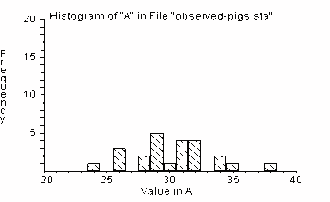
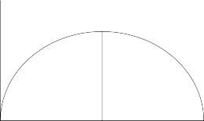
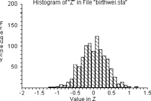
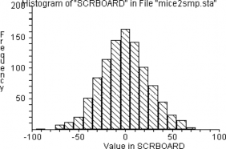
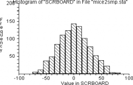
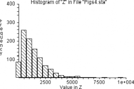

---
jupyter:
  jupytext:
    metadata_filter:
      notebook:
        additional: all
        excluded:
        - language_info
    text_representation:
      extension: .Rmd
      format_name: rmarkdown
      format_version: '1.0'
      jupytext_version: 0.8.6
  kernelspec:
    display_name: Python 3
    language: python
    name: python3
resampling_with:
    ed2_fname: 22-Chap-18
---

```{r setup, include=FALSE}
source("_common.R")
```

# The Statistics of Hypothesis-Testing With Measured Data {#sec-testing-measured}

:::{.callout-warning}
## Draft page partially ported from original PDF

This page is an automated and partial import from the [original second-edition
PDF](https://resample.com/content/text/22-Chap-18.pdf).

We are in the process of updating this page for formatting, and porting any
code from the original [RESAMPLING-STATS
language](http://www.statistics101.net) to Python and R.

Feel free to read this version for the sense, but expect there to be multiple
issues with formatting.

We will remove this warning when the page has adequate formatting, and we have
ported the code.
:::


<!---
Discussion here of dispersion - have we discussed this before?

Methods of estimating dispersion.
-->


@sec-testing-counts-one and @sec-point-estimation discussed testing
a hypothesis with data that either arrive in dichotomized (yes-no) form, or
come as data in situations where it is convenient to dichotomize. We next
consider hypothesis testing using measured data. Conventional statistical
practice employs such devices as the "t-test" and "analysis of variance." In
contrast to those complex devices, the resampling method does not differ
greatly from what has been discussed in previous chapters.

### Example: The Pig Rations Still Once Again, Using Measured Data {#sec-pig-rations-measured}

**Testing for the Difference Between Means of Two Equal-Sized Samples of
Measured-Data Observations) (Program "Pigs3")**

Let us now treat the pig-food problem without converting the
quantitative data into qualitative data, because a conversion always
loses information.

The term "lose information" can be understood intuitively. Consider two
sets of three sacks of corn. Set A includes sacks containing,
respectively, one pound, two pounds, and three pounds. Set B includes
sacks of one pound, two pounds, and a hundred pounds. If we *rank* the
sacks by weight, the two sets can no longer be distinguished. The
one-pound and two-pound sacks have ranks one and two in both cases, and
their relative places in their sets are the same. But if we know *not
only* that the one-pound sack is the smallest of its set and the
three-pound or hundred-pound sack is the largest, but *also* that the
largest sack is three pounds (or a hundred pounds), we have more
information about a set than if we only know the ranks of its sacks.

Rank data are also known as "ordinal" data, whereas data measured in
(say) pounds are known as "cardinal" data. Even though converting from
cardinal (measured) to ordinal (ranked) data loses information, the
conversion may increase convenience, and may therefore be worth doing in
some cases.



We begin a measured-data procedure by noting that if the two pig foods
are the same, then each of the observed weight gains came from the *same
benchmark universe* . This is the basic tactic in our statistical
strategy. That is, if the two foods came from the same universe, *our
best guess about the composition of that universe is that it includes
weight gains just like the twenty-four we have observed* , and in the
same proportions, because that is all the information that we have about
the universe; this is the bootstrap method. Since ours is (by
definition) a sample from an infinite (or at least, a very large)
universe of possible weight gains, we assume that there are *many*
weight gains in the universe just like the ones we have observed, in the
same proportion as we have observed them. For example, we assume that
2/24 of the universe is composed of 34-pound weight gains, as seen in
Figure 18-1:

**Figure 18-1**

We recognize, of course, that weight gains other than the exact ones we
observed certainly would occur in repeated experiments. And if we
thought it reasonable to do so, we could assume that the "distribution"
of the weight gains would follow a regular "smooth" shape such as Figure
18-2. But deciding just how to draw Figure 18-2 from the data in Figure
18-1 requires that we make arbitrary assumptions about unknown
conditions. And if we were to draw Figure 18-2 in a form that would be
sufficiently regular for conventional mathematical analysis, we might
have to make some *very strong* assumptions going far beyond the
observed data.

Drawing a smooth curve such as Figure 18-2 from the raw data in Figure
18-1 might be satisfactory — if done with wisdom and good judgment. But
there is no necessity to draw such a smooth curve, in this case or in
most cases. We can proceed by assuming simply that the benchmark
universe — the universe to which we shall compare our samples,
conventionally

Relative Probability

called the "null" or "hypothetical" universe — is composed only of
elements similar to the observations we have in hand. We thereby lose no
efficiency and avoid making unsound assumptions.



Size of Weight Gain, 30.2 = Mean

**Figure 18-2**

To carry out our procedure in practice: 1) Write down each of the
twenty-four weight gains on a blank index card. We then have one card
each for 31, 34, 29, 26, and so on. 2) Shuffle the twenty-four cards
thoroughly, and pick one card. 3) Record the weight gain, and replace
the card. (Recall that we are treating the weight gains as if they come
from an infinite universe — that is, as if the probability of selecting
any amount is the same no matter which others are selected randomly.
Another way to say this is to state that each selection is independent
of each other selection. If we did not replace the card before selecting
the next weight gain, the selections would no longer be independent. See
@sec-compound-probability for further discussion of this issue.) 4) Repeat this
process until you have made two sets of 12 observations. 5) Call the first hand
"food A" and the second hand "food B." Determine the average weight gain for
the two hands, and record it as in Table 18-1. Repeat this procedure many
times.

In operational steps:

**Step 1.** Write down each observed weight gain on a card, e.g. 31, 34,
29\...

**Step 2.** Shuffle and deal a card.

**Step 3.** Record the weight and replace the card.

**Step 4.** Repeat steps 2 and 3 eleven more times; call this group A.

**Step 5.** Repeat steps 2-3 another twelve times; call this group B.

**Step 6.** Calculate the mean weight gain of each group.

**Step 7.** Subtract the mean of group A from the mean of group B and
record. If larger (more positive) than 3.16 (the difference between the
observed means) or more negative than -3.16, record "more." Otherwise
record "less."

**Step 8.** Repeat this procedure perhaps fifty times, and calculate the
proportion "more." This estimates the probability sought.

In none of the first ten simulated trials did the difference in the
means of the random hands exceed the observed difference (3.16 pounds,
in the top line in the table) between foods A and B. (The difference
between group *totals* tells the same story and is faster, requiring no
division calculations.)

In the old days before a computer was always easily available, I would
quit making trials at such a point, confident that a difference in means
as great as observed is not likely to happen by chance. (Using the
convenient "multiplication rule" described in @sec-prob-theory-one-b, we can estimate
the probability of such an occurrence happening by chance in 10
successive trials as $\frac{1}{2} * \frac{1}{2} * \frac{1}{2} ...
= \frac{1}{2}^{10} = 1/1024 \approx .001$ = .1 percent, a small chance indeed.)
Nevertheless, let us press on to do 50 trials.

Table 18-1

+-------------+-------------+-------------+-------------+-------------+
| **Trial     | **Mean of   | **Mean of   | **Differenc |             |
| \#**        | First 12    | Second 12   | e           |             |
|             | Observation | Observation | Greater     |             |
|             | s           | s           | or**        |             |
|             | (First      | (Second     |             |             |
|             | Hand)**     | Hand)**     | **Less Than |             |
|             |             |             | Observed    |             |
|             |             |             | Differenc** |             |
+-------------+-------------+-------------+-------------+-------------+
| Observed    | 382 /       | 344 /       | 3.16        |             |
|             | 12=31.83    | 12=28.67    |             |             |
+-------------+-------------+-------------+-------------+-------------+
| 1           | 368 /       | 357 /       | .87         | Less        |
|             | 12=30.67    | 12=29.75    |             |             |
+-------------+-------------+-------------+-------------+-------------+
| 2           | 364 /       | 361 /       | .25         | Less        |
|             | 12=30.33    | 12=30.08    |             |             |
+-------------+-------------+-------------+-------------+-------------+
| 3           | 352 /       | 373 /       | (1.75)      | Less        |
|             | 12=29.33    | 12=31.08    |             |             |
+-------------+-------------+-------------+-------------+-------------+
| 4           | 378 /       | 347 /       | 2.58        | Less        |
|             | 12=31.50    | 12=28.92    |             |             |
+-------------+-------------+-------------+-------------+-------------+
| 5           | 365 /       | 360 /       | .42         | Less        |
|             | 12=30.42    | 12=30.00    |             |             |
+-------------+-------------+-------------+-------------+-------------+
| 6           | 352 /       | 373 /       | (1.75)      | Less        |
|             | 12=29.33    | 12=31.08    |             |             |
+-------------+-------------+-------------+-------------+-------------+
| 7           | 355 /       | 370 /       | (1.25)      | Less        |
|             | 12=29.58    | 12=30.83    |             |             |
+-------------+-------------+-------------+-------------+-------------+
| 8           | 366 /       | 359 /       | .58         | Less        |
|             | 12=30.50    | 12=29.92    |             |             |
+-------------+-------------+-------------+-------------+-------------+
| 9           | 360 /       | 365 /       | (.42)       | Less        |
|             | 12=30.00    | 12=30.42    |             |             |
+-------------+-------------+-------------+-------------+-------------+
| 10          | 355 /       | 370 /       | (1.25)      | Less        |
|             | 12=29.58    | 12=30.83    |             |             |
+-------------+-------------+-------------+-------------+-------------+
| 11          | 359 /       | 366 /       | (.58)       | Less        |
|             | 12=29.92    | 12=30.50    |             |             |
+-------------+-------------+-------------+-------------+-------------+
| 12          | 369 /       | 356 /       | 1.08        | "           |
|             | 12=30.75    | 12=29.67    |             |             |
+-------------+-------------+-------------+-------------+-------------+

**Results of Fifty Random Samples for the Problem "PIGS3"**

**e**

+-------------+-------------+-------------+-------------+-------------+
| **Trial     | **Mean of   | **Mean of   | **Differenc |             |
| \#**        | First 12    | Second 12   | e           |             |
|             | Observation | Observation | Greater     |             |
|             | s           | s           | or**        |             |
|             | (First      | (Second     |             |             |
|             | Hand)**     | Hand)**     | **Less Than |             |
|             |             |             | Observed    |             |
|             |             |             | Differenc** |             |
+-------------+-------------+-------------+-------------+-------------+
| Observed    | 382 /       | 344 /       | 3.16        |             |
|             | 12=31.83    | 12=28.67    |             |             |
+-------------+-------------+-------------+-------------+-------------+
| 13          | 360 /       | 365 /       | (.42)       | Less        |
|             | 12=30.00    | 12=30.42    |             |             |
+-------------+-------------+-------------+-------------+-------------+
| 14          | 377 /       | 348 /       | 2.42        | Less        |
|             | 12=31.42    | 12=29.00    |             |             |
+-------------+-------------+-------------+-------------+-------------+
| 15          | 365 /       | 360 /       | .42         | Less        |
|             | 12=30.42    | 12=30.00    |             |             |
+-------------+-------------+-------------+-------------+-------------+
| 16          | 364 /       | 361 /       | .25         | Less        |
|             | 12=30.33    | 12=30.08    |             |             |
+-------------+-------------+-------------+-------------+-------------+
| 17          | 363 /       | 362 /       | .08         | Less        |
|             | 12=30.25    | 12=30.17    |             |             |
+-------------+-------------+-------------+-------------+-------------+
| 18          | 365 /       | 360 /       | .42         | Less        |
|             | 12=30.42    | 12=30.00    |             |             |
+-------------+-------------+-------------+-------------+-------------+
| 19          | 369 /       | 356 /       | 1.08        | Less        |
|             | 12=30.75    | 12=29.67    |             |             |
+-------------+-------------+-------------+-------------+-------------+
| 20          | 369 /       | 356 /       | 1.08        | Less        |
|             | 12=30.75    | 12=29.67    |             |             |
+-------------+-------------+-------------+-------------+-------------+
| 21          | 369 /       | 356 /       | 1.08        | Less        |
|             | 12=30.75    | 12=29.67    |             |             |
+-------------+-------------+-------------+-------------+-------------+
| 22          | 364 /       | 361 /       | .25         | Less        |
|             | 12=30.33    | 12=30.08    |             |             |
+-------------+-------------+-------------+-------------+-------------+
| 23          | 363 /       | 362 /       | .08         | Less        |
|             | 12=30.25    | 12=30.17    |             |             |
+-------------+-------------+-------------+-------------+-------------+
| 24          | 363 /       | 362 /       | .08         | Less        |
|             | 12=30.25    | 12=30.17    |             |             |
+-------------+-------------+-------------+-------------+-------------+
| 25          | 364 /       | 361 /       | .25         | Less        |
|             | 12=30.33    | 12=30.08    |             |             |
+-------------+-------------+-------------+-------------+-------------+
| 26          | 359 /       | 366 /       | (.58)       | Less        |
|             | 12=29.92    | 12=30.50    |             |             |
+-------------+-------------+-------------+-------------+-------------+
| 27          | 362 /       | 363 /       | (.08)       | Less        |
|             | 12=30.17    | 12=30.25    |             |             |
+-------------+-------------+-------------+-------------+-------------+
| 28          | 362 /       | 363 /       | (.08)       | Less        |
|             | 12=30.17    | 12=30.25    |             |             |
+-------------+-------------+-------------+-------------+-------------+
| 29          | 373 /       | 352 /       | 1.75        | Less        |
|             | 12=31.08    | 12=29.33    |             |             |
+-------------+-------------+-------------+-------------+-------------+
| 30          | 367 /       | 358 /       | .75         | Less        |
|             | 12=30.58    | 12=29.83    |             |             |
+-------------+-------------+-------------+-------------+-------------+
| 31          | 376 /       | 349 /       | 2.25        | Less        |
|             | 12=31.33    | 12=29.08    |             |             |
+-------------+-------------+-------------+-------------+-------------+
| 32          | 365 /       | 360 /       | .42         | Less        |
|             | 12=30.42    | 12=30.00    |             |             |
+-------------+-------------+-------------+-------------+-------------+
| 33          | 357 /       | 368 /       | (1.42)      | Less        |
|             | 12=29.75    | 12=30.67    |             |             |
+-------------+-------------+-------------+-------------+-------------+
| 34          | 349 /       | 376 /       | 2.25        | Less        |
|             | 12=29.08    | 12=31.33    |             |             |
+-------------+-------------+-------------+-------------+-------------+
| 35          | 356 /       | 396 /       | (1.08)      | Less        |
|             | 12=29.67    | 12=30.75    |             |             |
+-------------+-------------+-------------+-------------+-------------+
| 36          | 359 /       | 366 /       | (.58)       | Less        |
|             | 12=29.92    | 12=30.50    |             |             |
+-------------+-------------+-------------+-------------+-------------+
| 37          | 372 /       | 353 /       | 1.58        | Less        |
|             | 12=31.00    | 12=29.42    |             |             |
+-------------+-------------+-------------+-------------+-------------+
| 38          | 368 /       | 357 /       | .92         | Less        |
|             | 12=30.67    | 12=29.75    |             |             |
+-------------+-------------+-------------+-------------+-------------+
| 39          | 344 /       | 382 /       | (3.16)      | Equal       |
|             | 12=28.67    | 12=31.81    |             |             |
+-------------+-------------+-------------+-------------+-------------+
| 40          | 365 /       | 360 /       | .42         | Less        |
|             | 12=30.42    | 12=30.00    |             |             |
+-------------+-------------+-------------+-------------+-------------+
| 41          | 375 /       | 350 /       | 2.08        | Less        |
|             | 12=31.25    | 12=29.17    |             |             |
+-------------+-------------+-------------+-------------+-------------+
| 42          | 353 /       | 372 /       | (1.58)      | Less        |
|             | 12=29.42    | 12=31.00    |             |             |
+-------------+-------------+-------------+-------------+-------------+
| 43          | 357 /       | 368 /       | (.92)       | Less        |
|             | 12=29.75    | 12=30.67    |             |             |
+-------------+-------------+-------------+-------------+-------------+
| 44          | 363 /       | 362 /       | .08         | Less        |
|             | 12=30.25    | 12=30.17    |             |             |
+-------------+-------------+-------------+-------------+-------------+
| 45          | 353 /       | 372 /       | (1.58)      | Less        |
|             | 12=29.42    | 12=31.00    |             |             |
+-------------+-------------+-------------+-------------+-------------+
| 46          | 354 /       | 371 /       | (1.42)      | Less        |
|             | 12=29.50    | 12=30.92    |             |             |
+-------------+-------------+-------------+-------------+-------------+
| 47          | 353 /       | 372 /       | (1.58)      | Less        |
|             | 12=29.42    | 12=31.00    |             |             |
+-------------+-------------+-------------+-------------+-------------+
| 48          | 366 /       | 350 /       | .58         | Less        |
|             | 12=30.50    | 12=29.92    |             |             |
+-------------+-------------+-------------+-------------+-------------+
| 49          | 364 /       | 361 /       | .25         | Less        |
|             | 12=30.53    | 12=30.08    |             |             |
+-------------+-------------+-------------+-------------+-------------+
| 50          | 370 /       | 355 /       | 1.25        | Less        |
|             | 12=30.83    | 12=29.58    |             |             |
+-------------+-------------+-------------+-------------+-------------+

**Table 18-1** ***(continued)***

**e**

Table 18-1 shows fifty trials of which only one (the thirty-ninth) is as
"far out" as the observed samples. These data give us an estimate of the
probability that, if the two foods come from the same universe, a
difference this great or greater would occur just by chance. (Compare
this 2 percent estimate with the probability of roughly 1 percent
estimated with the conventional *t* test — a "significance level" of 1
percent.) On the average, the test described in this section yields a
significance level as high as such mathematical-probability tests as the
*t* test — that is, it is just as efficient — though the tests
described in Examples 15-6 and 17-1 are likely to be less efficient
because they convert measured data to ranked or classified data.
[^non-parametric]

[^non-parametric]: Technical Note: The test described in this section is
    non-parametric and therefore makes no assumptions about the shapes of the
    distributions, which is good because we would be on soft ground if we
    assumed normality in the pig-food case, given the sample sizes. This test
    does not, however, throw away information as do the rank and median tests
    illustrated earlier. And indeed, this test proves to be more powerful than
    the other non-parametric tests. After developing this test, I discovered
    that its general logic follows the tradition of the "randomization" tests,
    based on an idea by R.A. Fisher [-@fisher1935design; -@fisher1960design,
    chapter III, section 21] and worked out for the two-sample cases by E.J.G.
    Pitman [-@pitman1937significance]. But the only earlier mentions of
    sampling from the universe of possibilities are in M. Dwass
    [-@dwass1957modified] and J.H. Chung and D. Fraser
    [-@chung1958randomization]. I am grateful to J. Pratt for bringing the
    latter literature to my attention.

It is *not* appropriate to say that these data give us an estimate of
the probability that the foods "do not come" from the same universe.
This is because we can *never* state a probability that a sample came
from a given universe unless the alternatives are fully specified in
advance.[^p-given]

[^p-given]: This short comment is the tip of the iceberg of an argument
    that has been going on for 200 years among statisticians. It needs much
    more discussion to be understandable or persuasive.

This example also illustrates how the *dispersion within samples*
affects the difficulty of finding out whether the samples differ from
each other. For example, the average weight gain for food A was 32
pounds, versus 29 pounds for food B. If *all* the food A-fed pigs had
gained weight within a range of say 29.9 and 30.1 pounds, and if all the food
B-fed pigs had gained weight within a range of 28.9 and 29.1 pounds — that is,
if the highest weight gain in food B had been lower than the lowest weight gain
in food A — then there would be no question that food A is better, and even
fewer observations would have made this statistically conclusive. Variation
(dispersion) is thus of great importance in statistics and in the social
sciences. The larger the dispersion among the observations *within* the
samples, the larger the *sample size* necessary to make a conclusive comparison
between two groups or reliable estimates of summarization statistics. (The
dispersion might be measured by the mean absolute deviation (the average
absolute difference between the mean and the individual observations, treating
both plus and minus differences as positive), the variance (the average
*squared* difference between the mean and the observations), the standard
deviation (the square root of the variance), the range (the difference between
the smallest and largest observations), or some other device.)

<!---
Lots about dispersion here.  Needs better introduction?
-->

If you are performing your tests by hand rather than using a computer (a
good exercise even nowadays when computers are so accessible), you might
prefer to work with the median instead of the mean, because the median
requires less computation. (The median also has the advantage of being
less influenced by a single far-out observation that might be quite
atypical; all measures have their special advantages and disadvantages.)
Simply compare the difference in medians of the twelve-pig resamples to
the difference in medians of the actual samples, just as was done with
the means. The only operational difference is to substitute the word
"median" for the word "mean" in the steps listed above. You may need a
somewhat larger number of trials when working with medians, however, for
they tend to be less precise than means.

<!---
Discussion of bootstrap and median?
-->


The RESAMPLING STATS program compares the difference in the sums of the
weight gains for the actual pigs against the difference resulting from
two randomly-chosen groups of pigs, using the same numerical weight
gains of individual pigs as were obtained in the actual experiment. If
the differences in average weight gains of the randomly ordered groups
are rarely as large as the difference in weight gains from the actual
sets of pigs fed food A-alpha and food B-beta, then we can conclude that
the foods do make a difference in pigs' weight gains.

Note first that pigs in group A gained a total of 382 pounds while group
B gained a total of 344 pounds — 38 fewer. To minimize computations, we
will deal with totals like these, not averages.

First we construct vectors A and B of the weight gains of the pigs fed
with the two foods. Then we combine the two vectors into one long vector
and select two groups of 12 randomly and with replacement (the two
SAMPLE commands). We SUM the weight gains for the two resamples, and
calculate the difference. We keep SCORE of those differences, graph them
on a HISTOGRAM, and see how many times resample A exceeded resample B by
at least 38 pounds, or vice versa (we are testing whether the two are
different, not whether food A produces larger weight gains).


<!--- Resampling stats file; Matlab syntax closeish -->

```matlab
' Program file: "testing_measured_00.rss"

NUMBERS (31 34 29 26 32 35 38 34 31 29 32 31) a
' Record group a's weight gains.
NUMBERS (26 24 28 29 30 29 31 29 32 26 28 32) b
' Record group b's weight gains.
CONCAT a b c
' Combine a and b together in one long vector.
REPEAT 1000
    ' Do 1000 experiments.
    SAMPLE 12 c d
    ' Take a "resample" of 12 with replacement from c and put it in d.
    SAMPLE 12 c e
    ' Take another "resample."
    SUM d dd
    ' Sum the first "resample."
    SUM e ee
    ' Sum the second "resample."
    SUBTRACT dd ee f
    ' Calculate the difference between the two resamples.
    SCORE f z
    ' Keep track of each trial result.
END
' End one experiment, go back and repeat until all trials are complete,
' then proceed.
HISTOGRAM z
' Produce a histogram of trial results.
```

**PIGS3: Difference Between Two Resamples**

Sum of Weight Gains


**1** **st** **resample less 2** **nd**

From this histogram we see that none of the trials produced a difference
between groups as large as that observed (or larger). RESAMPLING STATS
will calculate this for us with the following commands:


<!--- Resampling stats file; Matlab syntax closeish -->

```matlab
' Program file: "pigs3.rss"

COUNT z >= 38 k
' Determine how many of the trials produced a difference between resamples

' \>= 38.
COUNT z <= -38 l
' Likewise for a difference of -38.
ADD k l m
' Add the two together.
DIVIDE m 1000 mm
' Convert to a proportion.
PRINT mm
' Print the result.

' Note: The file "pigs3" on the Resampling Stats software disk contains
' this set of commands.
```

### Example: Is There a Difference in Liquor Prices Between State-Run and Privately-Run Systems? {#sec-liquor-public-measured}

This is an example of **testing for differences between means of unequal-sized samples of measured data**.

In the 1960s I studied the price of liquor in the sixteen "monopoly"
states (where the state government owns the retail liquor stores)
compared to the twenty-six states in which retail liquor stores are
privately owned. (Some states were omitted for technical reasons. And it
is interesting to note that the situation and the price pattern has
changed radically since then.) These data were introduced in the context
of a problem in probability in @sec-infinite-universes.

These were the representative 1961 prices of a fifth of Seagram 7 Crown
whiskey in the two sets of states:[^liquor-data]

[^liquor-data]: The data are from *The Liquor Handbook* (1962, p. 68). Eight
  states are omitted for various reasons. For more information, see Simon and
  Simon [-@simon1996effects].

16 monopoly states: \$4.65, \$4.55, \$4.11, \$4.15, \$4.20, \$4.55,
\$3.80,

\$4.00, \$4.19, \$4.75, \$4.74, \$4.50, \$4.10, \$4.00, \$5.05, \$4.20

Mean = \$4.35

26 private-ownership states: \$4.82, \$5.29, \$4.89, \$4.95, \$4.55,
\$4.90,

\$5.25, \$5.30, \$4.29, \$4.85, \$4.54, \$4.75, \$4.85, \$4.85, \$4.50,
\$4.75,

\$4.79, \$4.85, \$4.79, \$4.95, \$4.95, \$4.75, \$5.20, \$5.10, \$4.80,
\$4.29.

Mean = \$4.84

The *economic* question that underlay the investigation — having both
theoretical and policy ramifications — is as follows: Does state
ownership affect prices? The *empirical* question is whether the prices
in the two sets of states were systematically different. In
*statistical* terms, we wish to test the hypothesis that there was a
difference between the groups of states related to their mode of liquor
distribution, or whether the observed \$.49 differential in means might
well have occurred by happenstance. In other words, we want to know
whether the two sub-groups of states differed systematically in their
liquor prices, or whether the observed pattern could well have been
produced by chance variability.

The first step is to examine the two sets of data graphically to see
whether there was such a clear-cut difference between them — of the
order of Snow's data on cholera, or the Japanese Navy data on
beri-beri — that no test was necessary. The separate displays, and then
the two combined together, are shown in @fig-liquor_price_plots; the answer is
not clear-cut and hence a formal test is necessary.

<!---
Refer back to @sec-inference-ideas tables 11.3 and 11.4.
-->

```{r fig-liquor_price_plots, echo=FALSE, fig.align='center', fig.cap="Liquor prices by government and private"}
include_svg('images/liquor_price_plots.svg')
```


At first I used a resampling permutation test as follows: Assuming that
the entire universe of possible prices consists of the set of events
that were observed, because that is all the information available about
the universe, I wrote each of the forty-two observed state prices on a
separate card. The shuffled deck simulated a situation in which each
state has an equal chance for each price.

On the "null hypothesis" that the two groups' prices do *not* reflect
different price-setting mechanisms, but rather differ only by chance, I
then examined how often that simulated universe stochastically produces
groups with results as different as observed in 1961. I repeatedly dealt
groups of 16 and 26 cards, without replacing the cards, to simulate
hypothetical monopoly-state and private-state samples, each time
calculating the difference in mean prices.

The probability that the benchmark null-hypothesis universe would
produce a difference between groups as large or larger than observed in
1961 is estimated by how frequently the mean of the group of
randomly-chosen sixteen prices from the simulated state-ownership
universe is less than (or equal to) the mean of the actual sixteen
state-ownership prices. If the simulated difference between the
randomly-chosen groups was frequently equal to or greater than observed
in 1961, one would not conclude that the observed difference was due to
the type of retailing system because it could well have been due to
chance variation.

The results — not even one "success" in 10,000 trials — imply that there
is a very small probability that two groups with mean prices as
different as were observed would happen by chance if drawn from the
universe of 42 observed prices. So we "reject the null hypothesis" and
instead find persuasive the proposition that the type of liquor
distribution system influences the prices that consumers pay.[^liquor-tests]

[^liquor-tests]: Various tests indicate that the difference between the groups
    of states was highly significant. See Simon and Simon [-@simon1996effects].

As I shall discuss later, the logical framework of this resampling
version of the permutation test differs greatly from the formulaic
version, which would have required heavy computation. The standard
conventional alternative would be a Student's t-test, in which the user
simply plugs into an unintuitive formula and reads the result from a
table. And because of the unequal numbers of cases and unequal
dispersions in the two samples, an appropriate t-test is far from
obvious, whereas resampling is not made more difficult by such realistic
complications.

<!---
Discussion of t-test?  Have we introduced the t-test?
-->


A program to handle the liquor problem with an infinite-universe
bootstrap distribution simply substitutes the random sampling command
SAMPLE for the SHUFFLE/TAKE commands. The results of the new test are
indistinguishable from those in the program given above.

Still another difficult question is whether *any* hypothesis test is
appropriate, because the states were not randomly selected for inclusion
in one group or another, and the results could be caused by factors
other than the liquor system; this applies to both the above methods.
The states constitute the entire universe in which we are interested,
rather than being a sample taken from some larger universe as with a
biological experiment or a small survey sample. But this objection
pertains to a conventional test as well as to resampling methods. And a
similar question arises throughout medical and social science — to the
two water suppliers between which John Snow detected vast differences in
cholera rates, to rates of lung cancer in human smokers, to analyses of
changes in speeding laws, and so on.

The appropriate question is not whether the units were assigned
randomly, however, but whether there is strong reason to believe that
the results are not meaningful because they are the result of a
*particular* "hidden" variable.

These debates about fundamentals illustrate the unsettled state of
statistical thinking about basic issues. Other disciplines also have
their controversies about fundamentals. But in statistics these issues
arise as early as the introductory course, because all but the most
contrived problems are shot through with these questions. Instructors
and researchers usually gloss over these matters, as Gigerenzer et al.,
show ( *The Empire of Chance* ). Again, because with resampling one does
not become immersed in the difficult mathematical techniques that
underlie conventional methods, one is quicker to see these difficult
questions, which apply equally to conventional methods and resampling.

<!---
Discussion of fogginess that arises from uncertainty about maths.
-->


**Example 18-3: Is There a Difference Between Treatments to Prevent Low
Birthweights?**

Next we consider the use of resampling with *measured* data to test the
hypothesis that drug A prevents low birthweights (Rosner, 1982, p. 257).
The data for the treatment and control groups are shown in Table 18-2.

Table 18-2

**Birthweights in a Clinical Trial to Test a Drug for Preventing Low
Birthweights**

  --------------------- -------------------
  **Treatment Group**   **Control Group**
  6.9                   6.4
  7.6                   6.7
  7.3                   5.4
  7.6                   8.2
  6.8                   5.3
  7.2                   6.6
  8.0                   5.8
  5.5                   5.7
  5.8                   6.2
  7.3                   7.1
  8.2                   7.0
  6.9                   6.9
  6.8                   5.6
  5.7                   4.2
  8.6                   6.8
  Average: 7.08         6.26
  --------------------- -------------------

 Source: Rosner, Table 8.7

The treatment group averaged .82 pounds more than the control group.
Here is a resampling approach to the problem:

1.  If the drug has no effect, our best guess about the "universe" of
    birthweights is that it is composed of (say) a million each of the
    observed weights, all lumped together. In other words, in the
    absence of any other information or compelling theory, we assume
    that the combination of our samples is our best estimate of the
    universe. Hence let us write each of the birthweights on a card, and
    put them into a hat. Drawing them one by one and then replacing them
    is the operational equivalent of a very large (but equal) number of
    each birthweight.

2.  Repeatedly draw two samples of 15 birthweights each, and check how
    frequently the observed difference is as large as, or larger than,
    the actual difference of .82 pounds.

We find in the RESAMPLING STATS program below that only 1 percent of the
pairs of hypothetical resamples produced means that differed by as much
as .82. We therefore conclude that the observed difference is unlikely
to have occurred by chance.


<!--- Resampling stats file; Matlab syntax closeish -->

```matlab
' Program file: "testing_measured_02.rss"

NUMBERS (6.9 7.6 7.3 7.6 6.8 7.2 8.0 5.5 5.8 7.3 8.2 6.9 6.8 5.7 8.6) treat
NUMBERS (6.4 6.7 5.4 8.2 5.3 6.6 5.8 5.7 6.2 7.1 7.0 6.9 5.6 4.2 6.8) control
CONCAT treat control all
' Combine all birthweight observations in same vector
REPEAT 1000
    ' Do 1000 simulations
    SAMPLE 15 all treat$
    ' Take a resample of 15 from all birth weights (the \$ indicates a
    ' resampling counterpart to a real sample)
    SAMPLE 15 all control$
    ' Take a second, similar resample
    MEAN treat$ mt
    ' Find the means of the two resamples
    MEAN control$ mc
    SUBTRACT mt mc dif
    ' Find the difference between the means of the two resamples
    SCORE dif z
    ' Keep score of the result
END
' End the simulation experiment, go back and repeat
HISTOGRAM z
' Produce a histogram of the resample differences
COUNT z >= 0.82 k
' How often did resample differences exceed the observed difference of
' .82?
```



**Resample differences in pounds**

Result: Only 1.3 percent of the pairs of resamples produced means that
differed by as much as .82. We can conclude that the observed difference
is unlikely to have occurred by chance.

**Example 18-4: Bootstrap Sampling with Replacement**

Efron and Tibshirani [-@efron1993bootstrap, page 11] present this as their
basic problem illustrating the bootstrap method: Seven mice were given a new
medical treatment intended to improve their survival rates after surgery, and
nine mice were not treated. The numbers of days the treated mice survived were
94, 38, 23, 197, 99, 16 and 14, whereas the numbers of days the untreated mice
(the control group) survived were 52, 10, 40, 104, 51, 27, 146, 30, and 46. The
question we ask is: Did the treatment prolong survival, or might chance
variation be responsible for the observed difference in mean survival times?

We start by supposing the treatment did NOT prolong survival and that
chance was responsible.
<!---
Clarify - sampling variation was responsible.
-->
If that is so, then we consider that the two
groups came from the same universe. Now we'd like to know how likely it
is that two groups drawn from this common universe would differ as much
as the two observed groups differ.

If we had unlimited time and money, we would seek additional samples in
the same way that we obtained these. Lacking time and money, we create a
hypothetical universe that embodies everything we know about such a
common universe. We imagine replicating each sample element millions of
times to create an almost infinite universe that looks just like our
samples. Then we can take resamples from this hypothetical universe and
see how they behave.

Even on a computer, creating such a large universe is tedious so we use
a shortcut. We replace each element after we pick it for a resample.
That way, our hypothetical (bootstrap) universe is effectively infinite.

The following procedure will serve:

1.  Calculate the difference between the means of the two observed
    samples -- it's 30.63 days in favor of the treated mice.

2.  Consider the two samples combined (16 observations) as the relevant
    universe to resample from.

3.  Draw 7 hypothetical observations with replacement and designate them
    "Treatment"; draw 9 hypothetical observations with replacement and
    designate them "Control."

4.  Compute and record the difference between the means of the two
    samples.

    Repeat steps 2 and 3 perhaps 1000 times.

5.  Determine how often the resampled difference exceeds the observed
    difference of 30.63.

The following program ("mice2smp") follows the above procedure:


<!--- Resampling stats file; Matlab syntax closeish -->

```matlab
' Program file: "testing_measured_03.rss"

NUMBERS (94 38 23 197 99 16 141) treatmt
' treatment group
NUMBERS (52 10 40 104 51 27 146 30 46) control
' control group
CONCAT treatmt control u
' U is our universe (step 2 above)
REPEAT 1000
    ' step 5 above
    SAMPLE 7 u treatmt$
    ' step 3 above
    SAMPLE 9 u control$
    ' step 3
    MEAN treatmt$ tmean
    ' step 4
    MEAN control$ cmean
    ' step 4
    SUBTRACT tmean cmean diff
    ' step 4
    SCORE diff scrboard
    ' step 4
END
' step 5
HISTOGRAM scrboard
COUNT scrboard >=30.63 k
' step 6
DIVIDE k 1000 prob
PRINT prob
```




Result: PROB = 0.112

Interpretation: 1000 simulated resamples (of sizes 7 and 9) from a
combined universe produced a difference as big as 30.63 more than 11
percent of the time. We cannot rule out the possibility that chance
might be responsible for the observed advantage of the treatment group.

**Example 18-5: Permutation Sampling Without Replacement**

This section discusses at some length the question of when sampling with
replacement (the bootstrap), and sampling without replacement
(permutation or "exact" test) are the appropriate resampling methods.
The case at hand seems like a clearcut case where the bootstrap is
appropriate. (Note that in this case we draw both samples from a
combined universe consisting of all observations, whether we do so with
or without replacement.) Nevertheless, let us see how the technique
would differ if one were to consider that the permutation test is
appropriate. The algorithm would then be as follows (with the steps that
are the same as above labeled "a" and those that are different labeled
"b"):

**1a.** Calculate the difference between the means of the two observed
samples -- it's 30.63 days in favor of the treated mice.

**2a.** Consider the two samples combined (16 observations) as the
relevant universe to resample from.

**3b.** Draw 7 hypothetical observations without replacement and
designate them "Treatment"; draw 9 hypothetical observations with
replacement and designate them "Control."

**4a.** Compute and record the difference between the means of the two
samples.

**5a.** Repeat steps 2 and 3 perhaps 1000 times

**6a.** Determine how often the resampled difference exceeds the
observed difference of 30.63.

Here is the RESAMPLING STATS program:


<!--- Resampling stats file; Matlab syntax closeish -->

```matlab
' Program file: "testing_measured_04.rss"

NUMBERS (94 38 23 197 99 16 141) treatmt
' treatment group
NUMBERS (52 10 40 104 51 27 146 30 46) control
' control group
CONCAT treatmt control u
' U is our universe (step 2 above)
REPEAT 1000
    ' step 5 above
    SHUFFLE u ushuf
    TAKE ushuf 1,7 treatmt$
    ' step 3 above
    TAKE ushuf 8,16 control$
    ' step 3
    MEAN treatmt$ tmean
    ' step 4
    MEAN control$ cmean
    ' step 4
    SUBTRACT tmean cmean diff
    ' step 4
    SCORE diff scrboard
    ' step 4
END
' step 5
HISTOGRAM scrboard
COUNT scrboard >=30.63 k
' step 6
DIVIDE k 1000 prob
PRINT prob
```




Result: prob = 0.145

Interpretation: 1000 simulated resamples (of sizes 7 and 9) from a
combined universe produced a difference as big as 30.63 more than 14
percent of the time. We therefore should not rule out the possibility
that chance might be responsible for the observed advantage of the
treatment group.

## Differences among four means

**Example 18-6: Differences Among Four Pig Rations** (Test for
Differences Among Means of More Than Two Samples of Measured Data) (File
"PIGS4")

In Examples 15-1 and 15-4 we investigated whether or not the results
shown by a *single* sample are sufficiently different from a null
(benchmark) hypothesis so that the sample is unlikely to have come from
the null-hypothesis benchmark universe. In Examples 15-7, 17-1, and 18-1
we then investigated whether or not the results shown by *two* samples
suggest that both had come from the *same* universe, a universe that was
assumed to be the composite of the two samples. Now as in Example 17-2
we investigate whether or not *several* samples come from the same
universe, except that now we work with measured data rather than with
counted data.

If one experiments with each of 100 different pig foods on twelve pigs,
some of the foods will show much better results than will others *just
by chance* , just as one family in sixteen is likely to have the very
"high" number of 4 daughters in its first four children. Therefore, it
is wrong reasoning to try out the 100 pig foods, select the food that
shows the best results, and then compare it statistically with the
average (sum) of all the other foods (or worse, with the poorest food).
With such a procedure and enough samples, you will surely find one (or
more) that seems very atypical statistically. A bridge hand with 12 or
13 spades seems very atypical, too, but if you deal enough bridge hands
you will sooner or later get one with 12 or 13 spades — as a purely
chance phenomenon, dealt randomly from a standard deck. Therefore we
need a test that prevents our falling into such traps. Such a test
usually operates by taking into account the differences among *all* the
foods that were tried.

The method of Example 18-1 can be extended to handle this problem.
Assume that *four* foods were each tested on twelve pigs. The weight
gains in pounds for the pigs fed on foods A and B were as before. For
foods C and D the weight gains were:

Ration C: 30, 30, 32, 31, 29, 27, 25, 30, 31, 32, 34, 33

Ration D: 32, 25, 31, 26, 32, 27, 28, 29, 29, 28, 23, 25

Now construct a benchmark universe of *forty-eight* index cards, one for
each weight gain. Then deal out sets of four hands randomly. More
specifically:

**Step 1.** Constitute a universe of the forty-eight observed weight
gains in the four samples, writing the weight gains on cards.

**Step 2.** Draw four groups of twelve weight gains, with replacement,
since we are drawing from a hypothesized infinite universe in which
consecutive draws are independent. Determine whether the difference
between the lowest and highest group means is as large or larger than
the observed difference. If so write "yes," otherwise "no."

**Step 3.** Repeat step 2 fifty times.

**Step 4.** Count the trials in which the differences between the
simulated groups with the highest and lowest means are as large or
larger than the differences between the means of the highest and lowest
observed samples. The proportion of such trials to the total number of
trials is the probability that all four samples would differ as much as
do the observed samples if they (in technical terms) come from the same
universe.

The problem "Pigs4," as handled by the steps given above, is quite
similar to the way we handled Example TKTK, except that the data are measured
(in pounds of weight gain) rather than simply counted (the number of
rehabilitations).

Instead of working through a program for the procedure outlined above, let us
consider a different approach to the problem — computing the difference
between each *pair* of foods, six differences in all, converting all minus (-)
signs to (+) differences. Then we can *total* the six differences, and compare
the total with the sum of the six differences in the *observed* sample. The
proportion of the resampling trials in which the observed sample sum is
exceeded by the sum of the differences in the trials is the probability that
the observed samples would differ as much as they do if they come from the
same universe.[^otherwise-sos]

[^otherwise-sos]: Technical Note: Computing the sum of squared differences
    renders this test superficially more similar to the analysis of variance
    but will not alter the results. This test has not been discussed in the
    statistical literature, to my knowledge, except perhaps for a faint
    suggestion at the end of Chung and Fraser [-@chung1958randomization]. This
    and the two-sample test can easily be performed with canned computer
    programs as well as . In addition to their advantages of
    nonparametricity, they are equally efficient and vastly easier to teach
    and to understand than the t-test and the analysis of variance. Therefore,
    we believe that these tests should be "treatments of choice," as the
    doctors say.

One naturally wonders whether this latter test statistic is better than
the range, as discussed above. It would seem obvious that using the
information contained in all four samples should increase the precision
of the estimate. And indeed it is so, as you can confirm for yourself by
comparing the results of the two approaches. But in the long run, the
estimate provided by the two approaches would be much the same. That is,
there is no reason to think that one or another of the estimates is
*biased* . However, successive samples from the population would steady
down faster to the true value using the four-groupbased estimate than
they would using the range. That is, the four-group-based estimate would
require a smaller sample of pigs.

Is there reason to prefer one or the other approach from the point of
view of some decision that might be made? One might think that the range
procedure throws light on which *one* of the foods is best in a way that
the four-group-based approach does not. But this is not correct. Both
approaches answer this question, and *only* this question: Are the
results from the four foods likely to have resulted from the same
"universe" of weight gains or not? If one wants to know whether the
*best* food is similar to, say, all the other three, the appropriate
approach would be a *two* -sample approach similar to various *two*
-sample examples discussed earlier. (It would be still *another*
question to ask whether the best food is different from the worst. One
would then use a procedure different from either of those discussed
above.)

If the foods cost the same, one would not need even a twosample analysis
to decide which food to feed. Feed the one whose results are best in the
experiment, without bothering to ask whether it is "really" the best;
you can't go wrong as long as it doesn't cost more to use it. (One could
inquire about the probability that the food yielding the best results in
the experiment would attain those results by chance even if it was worse
than the others by some stipulated amount, but pursuing that line of thought
may be left to the student as an exercise.)

In the problem "Pigs4," we want a measure of how the groups differ. The
obvious first step is to add up the total weight gains for each group:
382, 344, 364, 335. The next step is to calculate the differences
between all the possible combinations of groups: 382-344=38, 382-364=18,
382-335=47, 344-364= -20, 344-335=9, 364-335=29.

## Using Squared Differences

Here we face a choice. We could work with the absolute
differences — that is, the results of the subtractions — treating each
result as a positive number even if it is negative. We have seen this
approach before. Therefore let us now take the opportunity of showing
another approach. Instead of working with the absolute differences, we
*square* each difference, and then SUM the squares. An advantage of
working with the squares is that they are positive — a negative number
squared is positive — which is convenient. Additionally, conventional
statistics works mainly with squared quantities, and therefore it is
worth getting familiar with that point of view. The squared differences
in this case add up to 5096.

Using RESAMPLING STATS, we shuffle all the weight gains together, select
four random groups, and determine whether the squared differences in the
resample exceed 5096. If they do so with regularity, then we conclude
that the observed differences could easily have occurred by chance.

With the CONCAT command, we string the four vectors into a single
vector. After SHUFFLEing the 48-pig weight-gain vector G into H, we TAKE
four randomized samples. And we compute the squared differences between
the pairs of groups and SUM the squared differences just as we did above
for the observed groups.

Last, we examine how often the simulated-trials data produce differences
among the groups as large as (or larger than) the actually observed
data — 5096.


<!--- Resampling stats file; Matlab syntax closeish -->

```matlab
' Program file: "pigs4.rss"

NUMBERS (34 29 26 32 35 38 31 34 30 29 32 31) a
NUMBERS (26 24 28 29 30 29 32 26 31 29 32 28) b
NUMBERS (30 30 32 31 29 27 25 30 31 32 34 33) c
NUMBERS (32 25 31 26 32 27 28 29 29 28 23 25) d
' (Record the data for the 4 foods)
CONCAT a b c d g
' Combine the four vectors into g
REPEAT 1000
    ' Do 1000 trials
    SHUFFLE g h
    ' Shuffle all the weight gains.
    SAMPLE 12 h p
    ' Take 4 random samples, with replacement.
    SAMPLE 12 h q
    SAMPLE 12 h r
    SAMPLE 12 h s
    SUM p i
    ' Sum the weight gains for the 4 resamples.
    SUM q j
    SUM r k
    SUM s l
    SUBTRACT i j ij
    ' Find the differences between all the possible pairs of resamples.
    SUBTRACT i k ik
    SUBTRACT i l il
    SUBTRACT j k jk
    SUBTRACT j l jl
    SUBTRACT k l kl
    MULTIPLY ij ij ijsq
    ' Find the squared differences.
    MULTIPLY ik ik iksq
    MULTIPLY il il ilsq
    MULTIPLY jk jk jksq
    MULTIPLY jl jl jlsq
    MULTIPLY kl kl klsq
    ADD ijsq iksq ilsq jksq jlsq klsq total
    ' Add them together.
    SCORE total z
    ' Keep track of the total for each trial.
END
' End one trial, go back and repeat until 1000 trials are complete.
HISTOGRAM z
' Produce a histogram of the trial results.
COUNT z >= 5096 k
' Find out how many trials produced differences among groups as great as
' or greater than those observed.
DIVIDE k 1000 kk
' Convert to a proportion.
PRINT kk
' Print the result.

' Note: The file "pigs4" on the Resampling Stats software disk contains
' this set of commands.
```

**PIGS4: Differences Among Four Pig Rations**



**sums of squares**

We find that our observed sum of squares — 5096 — was exceeded by
randomly-drawn sums of squares in only 3 percent of our trials. We
conclude that the four treatments are likely not all similar.

## Exercises

Solutions for problems may be found in the section titled, "Exercise
Solutions" at the back of this book.

**Exercise 18-1**

The data shown in Table 18-3 [@hollander1999nonparametric, p. 39, Table 3.1]
might be data for the outcomes of two different mechanics, showing the length
of time until the next overhaul is needed for nine pairs of similar vehicles.
Or they could be two readings made by different instruments on the same sample
of rock. In fact, they represent data for two successive tests for depression
on the Hamilton scale, before and after drug therapy.

<!---
Note on source in Hollander: Salsburg (1970): Personal communication (with the coooperation of Pfizer and co, Groton, Conn.)
-->


Table 18-3

**Hamilton Depression Scale Values**

  ---------------- ------------------ -----------------
  **Patient \#**   **Score Before**   **Score After**
  ---------------- ------------------ -----------------
  1                1.83               .878
  2                .50                .647
  3                1.62               .598
  4                2.48               2.05
  5                1.68               1.06
  6                1.88               1.29
  7                1.55               1.06
  8                3.06               3.14
  9                1.3                1.29
  ---------------- ------------------ -----------------

The task is to perform a test that will help decide whether there is a
difference in the depression scores at the two visits (or the
performances of the two mechanics). Perform both a bootstrap test and a
permutation test, and give some reason for preferring one to the other
in principle. How much do they differ in practice?

**Exercise 18-2**

Thirty-six of 72 (.5) taxis surveyed in Pittsburgh had visible
seatbelts. Seventy-seven of 129 taxis in Chicago (.597) had visible
seatbelts. Calculate a confidence interval for the difference in
proportions, estimated at -.097. (Source: Peskun, Peter H., "A New
Confidence Interval Method Based on the Normal Approximation for the
Difference of Two Binomial Probabilities," *Journal of the American
Statistical Association* , 6/93 p. 656).
