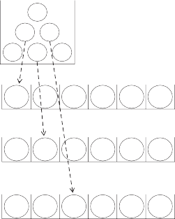
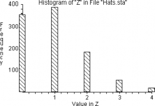
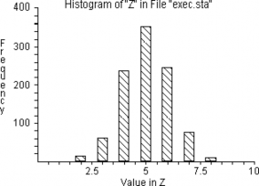

---
jupyter:
  jupytext:
    formats: ''
    notebook_metadata_filter: all,-language_info
    split_at_heading: true
    text_representation:
      extension: .Rmd
      format_name: rmarkdown
      format_version: '1.0'
      jupytext_version: 1.0.0-rc0
  kernelspec:
    display_name: Python 3
    language: python
    name: python3
---

Probability Theory, Part 4: Estimating Probabilities from Finite Universes
==========================================================================

Introduction
------------

The examples in Chapter 7 dealt with *infinite universes* , in which the
probability of a given simple event is unaffected by the outcome of the
previous simple event. But now we move on to finite universes,
situations in which you begin with a *given set of objects* whose number
is not enormous---say, a total of two, or two hundred, or two thousand.
If we liken such a situation to a bucket containing balls of different
colors each with a number on it, we are interested in the probability of
drawing various sets of numbered and colored balls from the bucket on the
condition that we *do not replace* balls after they are drawn.

In the cases addressed in this chapter, it is important to remember that
the single events no longer are independent of each other. A typical
situation in which sampling without replacement occurs is when items are
chosen from a finite universe--- for example, when children are selected
randomly from a classroom. If the class has five boys and five girls,
and if you were to choose three girls in a row, then the chance of
selecting a fourth girl on the next choice obviously is lower than the
chance that you would pick a girl on the first selection.

The key to dealing with this type of problem is the same as with earlier
problems: You must choose a simulation procedure that produces simple
events having the same probabilities as the simple events in the actual
problem involving sampling without replacement. That is, you must make
sure that your simulation does not allow duplication of events that have
already occurred. The easiest way to sample without replace-

ment with resampling techniques is by simply ignoring an outcome if it
has already occurred.

Examples 8-1 through 8-10 deal with some of the more important sorts of
questions one may ask about drawings without replacement from such an
urn. To get an overview, I suggest that you read over the titles of
Examples 8-1 to 8-10 before beginning to work through the examples
themselves.

This chapter also revisits the general procedure used in solving
problems in probability and statistics with simulation, here in
connection with problems involving a finite universe. The steps that one
follows in simulating the behavior of a universe of interest are set
down in such fashion that one may, by random drawings, deduce the
probability of various events. Having had by now the experience of
working through the problems in Chapters 5 and 7, the reader should have
a solid basis to follow the description of the general procedure which
then helps in dealing with specific problems.

Let us begin by describing some of the major sorts of problems with the
aid of a bucket with six balls.

Some building-block programs
----------------------------

**Case 1.** Each of six balls is labeled with a number between "1" and
"6." We ask: What is the probability of choosing balls 1, 2, and 3 *in
that order* if we choose three balls without replacement? Figure 8-1
diagrams the events we consider "success."


5

1 3

  ---------- --- --- ---
             1   2   3
                     
  pick \#:   1   2   3
  ---------- --- --- ---

 4 2 6

**Figure 8-1: The Event Classified as "Success" for Case 1**

**Case 2.** We begin with the same bucket as in Case 1, but now ask the
probability of choosing balls 1, 2, and 3 *in any order* if we choose
three balls without replacement. Figure 8-2 diagrams two of the events
we consider success. These possibilities include that which is shown in
Figure 8-1 above, plus other possibilities.


  ---------- --- --- --- --- --
  1          2   3           
             3   2   1       
                             
                 2   3   1   
                             
  pick \#:       1   2   3   
  ---------- --- --- --- --- --

 5

1 3

4 2 6

**Figure 8-2: An Incomplete List of the Events Classified as "Success"
for Case 2**

**Case 3.** The odd-numbered balls "1," "3," and "5," are painted red
and the even-numbered balls "2," "4," and "6" are painted black. What is
the probability of getting a red ball and then a black ball in that
order? Some possibilities are illustrated in Figure 8-3, which includes
the possibility shown in Figure 8-1. It also includes *some but not* all
possibilities found in Figure 8-2; for example, Figure 8-2 includes
choosing balls 2, 3 and 1 in that order, but Figure 8-3 does not.


1 2 3

5

3 2 1

1 3

4 2 6

pick \#: 1 2 3

**Figure 8-3: An Incomplete List of the Events Classified as "Success"
for Case 3**


**Case 4.** What is the probability of getting two red balls and one
black ball in any order?

1 2 3

5

1 3 2

1 3

4 2 6

pick \#: 1 2 3

**Figure 8-4: An Incomplete List of the Events Classified as "Success"
for Case 4**

**Case 5.** Various questions about *matching* may be asked with respect
to the six balls. For example, what is the probability of getting ball 1
on the first draw *or* ball 2 on the second draw *or* ball 3 on the
third draw? (Figure 8-5) Or, what is the probability of getting all
balls on the draws corresponding to their numbers?



5

1 3

4 2 6

1

pick \#: 1 2

3 4 5 6

or (and)

2

pick \#: 1 2

pick \#: 1 2

3 4 5 6

or (and)

3

3 4 5 6

**Figure 8-5: An Incomplete List of the Events Classified as "Success"
for Case 5**

Problems in finite universes
----------------------------

Example 8-1: What is the Probability of Selecting Four Girls and One Boy When Selecting Five Students From Any Twenty-five Girls and Twenty-five Boys?(Sampling Without Replacement When There are Two Outcomes and the Order Does Not Matter)
----------------------------------------------------------------------------------------------------------------------------------------------------------------------------------------------------------------------------------------------

The important difference between this example and the infinite-universe
examples in the prior chapter is that the probability of obtaining a boy
or a girl in a single simple event *differs* from one event to the next
in this example, whereas it stays the same when the sampling is with
replacement. To illustrate, the probability of a girl is .5 (25 out of
50) when the first student is chosen, but the probability of a girl is
either 25/49 or 24/49 when the second student is chosen, depending on
whether a boy or a girl was chosen on the first pick. Or after, say,
three girls and one boy are picked, the probability of getting a girl on
the next choice is (28-3)/(50-4) = 22/46 which is clearly not equal to
.5.

As always, we must create a satisfactory analog to the process whose
probability we want to learn. In this case, we can use a deck of 50
cards, half red and half black, and deal out five cards *without
replacing them* after each card is dealt; this simulates the choice of
five students from among the fifty.

We can also work the example with random numbers. But if so, we cannot
simply designate "01-25" as boys and "26-50" as girls (ignoring 51-00
when they occur), because if we did so the probability of a girl would
be the same on each pick. Instead, to simulate non-replacement, we
specify that no number can be taken into the sample twice, just as no
student can be chosen twice. That is, if we come across a number more
than once, we simply ignore it after the first occurrence. More
specifically:

**Step 1.** Let "01-25" = girls, "26-50" = boys

**Step 2.** Select five non-duplicating numbers; if a number comes up
more than once, ignore it. Count whether there are four numbers "01-25,"
and one "26-50." If so, write "yes," otherwise "no."

**Step 3.** Repeat step 2 perhaps 400 times, and count the proportion
"yes," which estimates the probability sought.

The results of a few experimental trials are shown in Table 8-1.

+-----------------------+-----------------------+-----------------------+
|                       | Table 8-1             |                       |
|                       |                       |                       |
|                       | **Experimental        |                       |
|                       | Trials**              |                       |
+-----------------------+-----------------------+-----------------------+
| **Experiment**        | **Numbers Chosen**    | **Success ?**         |
+-----------------------+-----------------------+-----------------------+
| 1                     | 18, 22, \[18 selected | No                    |
|                       | but ignored\] 27, 2,  |                       |
|                       | 49                    |                       |
+-----------------------+-----------------------+-----------------------+
| 2                     | 37, 19, 18, 7, 9      | Yes                   |
+-----------------------+-----------------------+-----------------------+
| 3                     | 13, 14, 2, 29, 24     | Yes                   |
+-----------------------+-----------------------+-----------------------+

It is important to notice that in this problem we do not distinguish
among particular girls (or boys). That is, it does not matter *which*
girl (or boy) is selected in a given trial. Nor did we pay attention to
the *order* in which we selected girls or boys. This is an instance of
Case 4 discussed above. Subsequent problems will deal with situations
where the order of selection, and the particular individuals, do matter.

A solution to this problem with RESAMPLING STATS is presented below.
Let's take an overview of the steps in that program:

We seek to find the probability of randomly selecting four girls out of
five children in a classroom of fifty children with equal numbers of
boys and girls. We simulate the class by creating an array A with
numbers "1" through "50" in order, designating "1" through "25" as girls
and "26" through "50" boys. We then REPEAT the following steps a
thousand times.

We first SHUFFLE the elements of Vector A into Vector B to randomize the
order of the children. We next TAKE the first five children in this
randomly-ordered array B and place them in C. This simulates the random
selection of five children. Then we COUNT the number of girls---numbers
"1" to "25"---in C. Next, we SCORE the number of girls selected for each
random sample (D) into z. We need not concern ourselves with whether one
boy was chosen, because we know that if four (and only four) girls are
chosen, one boy must have been selected as well.

After the thousand samples are completed, we determine how many of the
random samples of five children contained four girls by COUNTing the
number of times four girls were selected. Finally, we PRINT the result.

```{python, opts.label="py_ed"}
import numpy as np
```

```{python, opts.label="py_ed"}
trial_results = np.zeros(10000)

# Constitute the set of 25 girls and 25 boys.
girls = ['girl'] * 25   # 25 girls
boys = ['boy'] * 25  # 25 boys
whole_class = np.array(girls + boys)

# Repeat the following steps 1000 times.
for i in range(10000):

    # Shuffle the numbers
    np.random.shuffle(whole_class)

    # Take the first 5 numbers, call them c.
    c = whole_class[:5]

    # Count how many girls there are, put the result in d.
    d = np.count_nonzero(c == 'girl')

    # Keep track of each trial result in z.
    trial_results[i] = d

    # End the experiment, go back and repeat until all 1000 trials are
    # complete.

# Count the number of times we got four girls, put the result in k.
k = np.count_nonzero(trial_results == 4)

# Convert to a proportion.
kk = k / 10000

# Print the result.
print(kk)
```

Note: The file "fourgirl" on the Resampling Stats software disk contains
this set of commands.

We can also find the probabilities of other outcomes from a histogram of
trial results obtained with the following command:

```{python, opts.label="py_ed"}
# Import the plotting package.
import matplotlib.pyplot as plt
# %matplotlib inline
# Do histogram, with one bin for each possible number.
plt.hist(trial_results, bins=range(7))
plt.title('# of girls');
```

In the resulting histogram we can see that in 14 percent of the trials,
4 of the 5 selected were girls.

It should be noted that for this problem---as for most other
problems---there are several other resampling procedures that will also
do the job correctly.

In analytic probability theory this problem is worked with a formula for
"combinations."


Example 8-2: Nine Spades and Four Clubs in a Bridge Hand (Multiple-Outcome Sampling Without Replacement, Order Does not Matter)
-------------------------------------------------------------------------------------------------------------------------------

This problem is similar to Example 8-1 except that now there are four
equally-likely outcomes instead of only two. The RESAMPLING STATS
solution is straightforward in the program "9spades."

```{python, opts.label="py_ed"}
# Constitute the deck of 52 cards.
# Make a 4 element array of strings, with the suit names.
suits = np.array(['spade', 'clubs', 'diamonds', 'hearts'])
# Repeat the suit names 13 times each, to make a 52 card deck.
deck = np.repeat(suits, 13)
# Show the deck
deck
```

```{python, opts.label="py_ed"}
trial_results = np.zeros(10000)

# Repeat the trial 10000 times.
for i in range(10000):

    # Shuffle the deck
    np.random.shuffle(deck)

    # Deal out one hand of 13 cards. (Take the first 13 elements
    # from "deck" and call them "hand".)
    hand = deck[:13]

    # Count the number of spades in "hand", put the result in "n_spades".
    n_spades = np.count_nonzero(hand == 'spade')

    # If we have nine spades, we'll continue on to count the clubs. If we don't
    # have nine spades, the number of clubs is irrelevant---we have not gotten
    # the hand we are interested in.
    if n_spades == 9:

        # Count the clubs, put the result in "n_clubs"
        n_clubs = np.count_nonzero(hand == 'club')
        # Keep track of the number of clubs in each trial
        trial_results[i] = n_clubs

        # End the IF condition.

    # End one experiment, repeat all 1000 trials (experiments).

# Count the number of trials where we got 4 clubs. This is the answer we want -
# the number of hands out of 1000 with 9 spades and 4 clubs. (Recall that we
# only counted the clubs if the hand already had 9 spades.)
n_9_and_4 = np.count_nonzero(trial_results == 4)

# Convert to a proportion.
prop_9_and_4 = n_9_and_4 / 10000

# Print the result
print(prop_9_and_4)
```

```{python, opts.label="py_ed"}
hand
```

Note: The file "9spades" on the Resampling Stats software disk contains
this set of commands.

Example 8-3: A Total of Fifteen Points in a Bridge Hand When Ace = 4, King = 3, Queen = 2, and Jack = 1.
--------------------------------------------------------------------------------------------------------

This problem bears the same relationship to Example 8-2 that Example 4-5
bears to Example 4-4.

```{python, opts.label="py_ed"}
# Constitute a deck with 4 jacks (point value 1), 4 queens (value 2), 4
# kings (value 3), 4 aces (value 4), and 36 other cards with no point
# value
jacks = [1] * 4
queens = [2] * 4
kings = [3] * 4
aces = [4] * 4
others = [0] * 36
whole_deck = np.array(jacks + queens + kings + aces + others)
whole_deck
```

```{python, opts.label="py_ed"}
trial_results = np.zeros(10000, dtype=int)

# Do 10000 trials.
for i in range(10000):
    # `           SHUFFLE deck deck$         `
    # Shuffle the deck of cards.
    np.random.shuffle(whole_deck)

    # `           TAKE deck$ 1,13 hand         `
    # Take thirteen cards.
    hand = whole_deck[:13]

    # `           SUM hand points         `
    # 
    # Total the points.
    points = np.sum(hand)

    # `           SCORE points z         `
    # 
    # Keep score of the result.
    trial_results[i] = points

    # End one experiment, go back and repeat until all 1000 are done.
```

```{python, opts.label="py_ed"}
# Produce a histogram of trial results.
plt.hist(trial_results, bins=range(25))
plt.title('Points in bridge hands');
```

From this histogram, we see that in about 5 percent of our trials we obtained a
total of exactly 15 points. RESAMPLING STATS will calculate this for us
directly if we add the following commands on to the program:

```{python, opts.label="py_ed"}
# `           COUNT z = 15 k         `
# 
# How many times did we have a hand with fifteen points?
k = np.count_nonzero(trial_results == 15)

# `           DIVIDE k 1000 kk         `
# 
# Convert to a proportion.
kk = k / 10000

# `           PRINT kk         `
# 
# Print the result.
print(kk)
```

Note: The file "bridge" on the Resampling Stats software disk contains
this set of commands.

Example 8-4: Four Girls and Then One Boy From Twenty-five Girls and Twenty-five Boys Order Matters, Sampling Without Replacement, Two Outcomes, Several of Each Item
--------------------------------------------------------------------------------------------------------------------------------------------------------------------

What is the probability of getting an ordered series of *four girls and
then one boy* , from a universe of twenty-five girls and twenty-five
boys? This illustrates Case 3 above. Clearly we can use the same
sampling mechanism as in Example 8-1, but now we record "yes" for a
smaller number of composite events.

We record "no" if only one boy is chosen but he is chosen 1st, 2nd, 3rd,
or 4th, whereas in Example 8-1 such outcomes are recorded as "yeses."

**Step 1.** Let "01-25" = girls, "26-50" = boys.

**Step 2.** Select five non-duplicating numbers. Check whether the
series includes four numbers "01-25" followed by a number "26-50." If
so, write "yes," otherwise "no."

**Step 3.** Repeat step 2 perhaps 1000 times, and count the proportion
"yes" which estimates the probability sought.

The RESAMPLING STATS program "4girlboy" starts out similarly to the
earlier problem "Fourgirls." As in that problem, an array simulating a
class of 50 children is created. But whereas in the previous problem any
4 of the first 5 children had to be girls, in this problem, the *first*
4 children must be girls, and then the fifth must be a boy for a trial
to be considered a success. We thus TAKE the first 4 randomly-chosen
children and place them in c. We must then determine the number of these
children which are girls by counting those that have a number between
"1" and "25," and placing the result in d.

If we find that all 4 of the children selected are girls, then we
proceed to pick a fifth child and put it in e. If, however, of the first
4 children selected all were *not* girls, then we skip the steps through
the first END statement, because we would already know that this trial
will not be a "success." To determine whether this fifth child selected
is a boy---that is, checking whether it has a number between "26" and
"50"---we use a COUNT statement. If it is a boy, then f will equal "1";
if it is not a boy, then f will equal "0." (Remember that if the first 4
children selected were not all girls, then f will not get any value.) We
then SCORE the value in f to e. This ends the conditional statement and
the loop.

`           NUMBERS 1,50 a         `

Constitute the set of girls (numbers 1-25) and boys (numbers 26-50), put
them in a.

`           REPEAT 1000         `

Do the following experimental trial 1000 times.

`           SHUFFLE a b         `

Shuffle the numbers, put the shuffled numbers in b.

`           TAKE b 1,4 c         `

Take the first 4 numbers, put them in c.

`           COUNT c between 1 25 d         `

Count the number of girls, put the result in d.

`           IF d = 4         `

If we have 4 girls\...

`           TAKE b 5 e         `

Take the fifth number (not 5 numbers) from b and put it in e.

`           COUNT e between 26 50 f         `

How many boys in e? (It would have to be either 0 or 1)

`           SCORE f z         `

Keep track of each trial result.

`           END         `

`           END         `

End the IF condition

End the experiment, go back and repeat until all 1000 are complete.

`           COUNT z =1 k         `

Count the number of trials in which we got 1 boy (recall that we only
counted the boy if we had already gotten the required 4 girls).

`           DIVIDE k 1000 kk         `

Convert to a proportion.

`           PRINT kk         `

Print the result.

Note: The file "4girlboy" on the Resampling Stats software disk contains
this set of commands.

This type of problem is conventionally done with a *permutation*
formula.

Example 8-5: Four or More Couples Getting Their Own Partners When Ten Couples are Paired Randomly (Probability of Matching by Chance) (Program "Couples")
---------------------------------------------------------------------------------------------------------------------------------------------------------

Ten couples of boys and girls come to a party. In order to get them
acquainted with each other, the host pairs them at random for the first
dance by picking a boy's name from one hat and a girl's name from
another. What is the chance that four or more couples will get the
partners they came with?

By now the solution seems obvious to you: Simulate the drawings from the
two hats filled with boys' and girls' names, and see how often four or
more matches occur.

**Step 1.** Let "ace" through "10" of hearts be girls, "ace" through
"10" of spades be boys.

**Step 2.** Shuffle the hearts and deal them out in a row; shuffle the
spades and deal in a row just below the hearts.

**Step 3.** Count the pairs---a pair is one card from the heart row and
one card from the spade row---that contain the same denomination. If 4
or more pairs match, record "yes," otherwise "no."

**Step 4.** Repeat steps (2) and (3) perhaps 200 times.

**Step 5.** Count the proportion "yes." This estimates the probability
of 4 or more pairs.

Exercise for the student: Write the steps to do this example with random
numbers.

Now let's examine the RESAMPLING STATS solution "Couples." The key step
is to fill array A with 10 elements numbered "1" to "10" in order, with
each number standing for a male. We fill array B in similar fashion to
represent the females.

In each of the 1000 samples we SHUFFLE the elements of B, which stands
for the females, to create a new vector C. As long as *either* the males
or the females are randomly ordered, the probability of getting a
correct match is determined by chance. There are several ways to
determine whether a match occurs. Our method is using the SUBTRACT
command to compare each element of A with each element of C. A match
causes a "0," this would mean that the third couple was matched
correctly because they have the same numbers---"3"s. We then COUNT the
number of "0"s in D to determine the number of couples correctly matched
in the current sample. The result for the current sample is placed in E,
then transferred to Z in order to keep SCORE for each of the 1000
samples. This ends the loop.

`           NUMBERS 1,10 a         `

An array of 10 males.

`           NUMBERS 1,10 b         `

An identical array of 10 females---the pair for each of the males.

`           REPEAT 1000         `

Do the experiment 1000 times.

`           SHUFFLE b c         `

Shuffle the females.

`           END         `

`           SUBTRACT a c d         `

This operation pairs each shuffled female with a male and subtracts. If
it is an original pairing (1/1, 2/2, etc.), the result will be a 0. The
number of 0's indicates how many of the 10 males got paired up again
with their original partner.

`           COUNT d =0 e         `

Count the number of 0's and put the result in e.

`           SCORE e z         `

Keep track of each trial result.

End the trial, go back and repeat until all 1000 are complete.

`           HISTOGRAM z         `

Produce a histogram of the results.


From this histogram, we see that in about 3 percent of the trials did 4
or more couples end up being re-paired with their own partners. We can
calculate this proportion directly with RESAMPLING STATS:

`           COUNT z >= 4 k         `

Determine how many trials had 4 or more males being matched with their
partner after the shuffling. (Note that this is the same as the number
of females being matched with their original partner.)

`           DIVIDE k 1000 kk         `

Convert to a proportion.

`           PRINT kk         `

Print the result.

Note: The file "couples" on the Resampling Stats software disk contains
this set of commands.

Example 8-6: Matching Hats: Another famous problem of this sort: The hat-checker at a restaurant mixes up the hats of a party of 6 men. What is the probability that at least one will get his own hat?
-------------------------------------------------------------------------------------------------------------------------------------------------------------------------------------------------------

Instead of matching men with women, as in the earlier problem, however,
we are now matching men with their hats. See the program "Hats" for the
solution. First, assign each of the 6 men a number, and place these
numbers in A. Next, assign each man's hat the same number in B, but
arrange them in random order by shuffling the numbers from B into C,
which represents the group of mixed-up hats. The rest of the problem is
the same as in "Couples" except that in the second COUNT statement, we
now are interested in any trial where at least one (\>= 1) man received
the right hat.

`           NUMBERS 1,6 a         `

Constitute the set of six men.

`           NUMBERS 1,6 b         `

Constitute the set of their six hats.

`           REPEAT 1000         `

Do 1000 trials.

`           SHUFFLE b c         `

Mix up the hats.

`           SUBTRACT a c d         `

Subtract the shuffled hats from the set of men. A "0" will indicate that
a man has received his own hat.

`           COUNT d =0 e         `

Count the number of "0's"---the number of men who received their own
hats back.

`           SCORE e z         `

Keep track of each trial result.

`           END         `

End one experiment, go back and repeat until all 1000 are complete.

`           HISTOGRAM z         `

Produce a histogram of the trial results.



From the histogram, we see that in roughly 62 percent of the trial
results at least one man received his own hat back. RESAMPLING STATS
will calculate this for us with the following commands:

`           COUNT z >= 1 k         `

Determine how many trials resulted in at least one man getting his hat
back.

`           DIVIDE k 1000 kk         `

Convert to a proportion.

`           PRINT kk         `

Print the results

Note: The file "hats" on the Resampling Stats software disk contains
this set of commands.

Example 8-7: Twenty executives are to be assigned to two divisions of a firm
----------------------------------------------------------------------------

The top manager wants to spread the talent reasonably evenly, but she
does not want to label particular executives with a quality rating and
therefore considers distributing them with a random selection. She
therefore wonders: What are probabilities of the best ten among the
twenty being split among the divisions in the ratios 5 and 5, 4 and 6, 3
and 7, etc. if their names are drawn from a hat? One might imagine much
the same sort of problem in choosing two teams for a football or
baseball contest.

One may proceed as follows:

1.  Put 10 balls labeled "W" (for "worst") and 10 balls labeled "B"
    (best) in a bucket.

2.  Draw 10 balls without replacement and count the W's.

3.  Repeat (say) 400 times.

4.  Count the number of times each split---5 W's and 5 B's, 4 and 6,
    etc.---appears in the results.

    The problem can be done with RESAMPLING STATS as follows:

    `               URN 10#1 10#2 a             `

    `               REPEAT 1000             `

    `               SHUFFLE a b TAKE b 1,10 c COUNT c =1 d SCORE d z             `

    `               END HISTOGRAM z             `

    

    Example 8-8: Executives Moving
    ------------------------------

    A major retail chain moves its store managers from city to city
    every three years in order to calculate individuals' knowledge and
    experience. To make the procedure seem fair, the new locations are
    drawn at random. Nevertheless, the movement is not popular with
    managers' families. Therefore, to make the system a bit sporting and
    to give people some hope of remaining in the same location, the
    chain allows managers to draw in the lottery the same posts they are
    now in. What are the probabilities that 1, 2, 3\... will get their
    present posts again if the number of managers is 30?

    The problem can be solved with the following steps:

    1.  Number a set of green balls from "1" to "30" and put them into
        Bucket A randomly. Number a set of red balls from "1" to "30" and
        then put into Bucket B. For greater concreteness one could use 30
        little numbered dolls in Bucket A and 30 little toy houses in
        Bucket B.

    2.  Shuffle Bucket A, and array all its green balls into a row (vector
        A). Array all the red balls from Bucket B into a second row B just
        below row A.

    3.  Count how many green balls in row A have the same numbers as the
        red balls just below them, and record that number on a
        scoreboard.

    4.  Repeat steps 2 and 3 perhaps 1000 times. Then count in the
        scoreboard the numbers of "0," "1," "2," "3."

Example 8-9: State Liquor Systems Again
---------------------------------------

Let's end this chapter with the example of state liquor systems that was
examined in the previous chapter and which will be discussed again later
in the context of problems in statistics.

Remember that as of 1963, there were 26 U.S. states in whose liquor
systems the retail liquor stores are privately owned, and 16 "monopoly"
states where the state government owns the retail liquor stores. These
were the 1961 prices:

**16 monopoly states:** \$4.65, \$4.55, \$4.11, \$4.15, \$4.20, \$4.55,
\$3.80,

\$4.00, \$4.19, \$4.75, \$4.74, \$4.50, \$4.10, \$4.00, \$5.05, \$4.20

Mean: \$4.35

**26 private-ownership states:** \$4.82, \$5.29, \$4.89, \$4.95, \$4.55,
\$4.90,

\$5.25, \$5.30, \$4.29, \$4.85, \$4.54, \$4.75, \$4.85, \$4.85, \$4.50,
\$4.75,

\$4.79, \$4.85, \$4.79, \$4.95, \$4.95, \$4.75, \$5.20, \$5.10, \$4.80,
\$4.29.

Mean: \$4.84

Let us now consider that all these states' prices constitute one single
*finite* universe. We ask: If these 42 states constitute a universe, and
if they are all shuffled together, how likely is it that if one divides
them into two samples at random (sampling without replacement),
containing 16 and 26 observations respectively, the difference in mean
prices turns out to be as great as \$.49 (the difference that was
actually observed)?

Again we write each of the forty-two observed state prices on a separate
card. The shuffled deck simulates a situation in which each state has an
equal chance for each price. Repeatedly deal groups of 16 and 26 cards,
*without replacing* the cards as they are chosen, to simulate
hypothetical monopoly-state and private-state samples. In each trial
calculate the difference in mean prices.

The steps more systematically:

**Step A.** Write each of the 42 prices on a card and shuffle.

**Steps B and C (combined in this case).** i) Draw cards randomly
without replacement into groups of 16 and 26 cards. Then ii) calculate
the mean price difference between the groups, and iii) compare the
simulation-trial difference to the observed mean difference of \$4.84 --
\$4.35 = \$.49; if it is as great or greater than \$.49, write "yes,"
otherwise "no."

**Step D.** Repeat step B-C a hundred or a thousand times. Calculate the
proportion "yes," which estimates the probability we seek.

The probability that the postulated universe would produce a difference
between groups as large or larger than observed in 1961 is estimated by
how frequently the mean of the group of randomly-chosen sixteen prices
from the simulated stateownership universe is less than (or equal to)
the mean of the actual sixteen state-ownership prices.

Please notice how the only difference between this treatment of the
problem and the treatment in Chapter 7 is that the drawing in this case
is without replacement whereas in Chapter 7 the drawing is with
replacement.

In Chapter 7 we thought of these states as if they came from a
non-finite universe, which is one possible interpretation in one
context. But one can also reasonably think about them in another
context---as if they constitute the entire universe (aside from those
states excluded from the analysis because of data complexities). If so,
one can ask: If these 42 states constitute a universe, how likely is it
that one would choose two samples at random, containing 16 and 26
observations, that would have prices as different as \$.49 (the
difference that was actually observed)?

Example 8-10: A Compound Problem: Five or More Spades in One Bridge Hand, and Four Girls and a Boy in a Five-Child Family
-------------------------------------------------------------------------------------------------------------------------

"Compound" does not necessarily mean "complicated." It means that the
problem is a compound of two or more simpler problems.

A natural way to handle such a compound problem is in stages, as we saw
in the archery problem. If a "success" is achieved in the first stage,
go on to the second stage; if not, don't go on. More specifically in
this example:

**Step 1.** Use a bridge card deck, and five coins with heads = "girl."

**Step 2.** Deal a 13-card bridge hand and count the spades. If 5 or
more spades, record "no" and end the experimental trial. Otherwise,
continue to step 3.

**Step 3.** Throw five coins, and count "heads." If four heads, record
"yes," otherwise record "no."

**Step 4.** Repeat steps 2 and 3 a thousand times.

**Step 5.** Compute the proportion of "yes" in step 3. This estimates
the probability sought.

The RESAMPLING STATS solution to "Compound" is neither long nor
difficult. We tackle it almost as if the two parts of the problem were
to be dealt with separately. We first determine, in a random bridge
hand, whether 5 spades or more are dealt, as was done in the problem
"Spades." Then, IF 5 or more spades are found, we proceed to GENERATE a
random family of 5 children. This means that we need not GENERATE
families if 5 or more spades were not dealt to the bridge hand, because
a "success" is only recorded if both conditions are met. After we SCORE
the number of girls in each sample of 5 children, we need only END the
loop and COUNT the number of samples that had 4 girls. Since we only
drew samples of children for those trials in which a bridge hand of 5
spades had already been dealt, we will have in K the number of trials
out of 1000 in which both conditions were met.

`           URN 13#1 39#0 deck         `

Deck with 13 spades ("1") and 39 other cards (0)

`           REPEAT 1000         `

Do the following experiment 1000 times.

`           SHUFFLE deck deck$         `

Shuffle the deck.

`           TAKE b deck$ 1,13 hand         `

Deal out one hand of 13 cards.

`           COUNT hand =1 spades         `

Find out how many of the 13 cards are spades (spades are represented by
the number 1).

`           IF spades >= 5         `

If we have 5 or more spades\...

`           GENERATE 5 1,2 a         `

Create a family of 5 children, randomly selecting among girls (1's) and
boys (2's).

`           COUNT a =1 j         `

Count the number of girls.

`           SCORE j z         `

Keep track of the number of girls in each trial. Recall that we are only
counting girls if we have already gotten five spades in the bridge hand.

`           END         `

`           END         `

End the IF condition.

End the experiment, go back and repeat until all 1000 trials are
complete.

`           COUNT z =4 k         `

Count the number of times we got 4 girls (and 5 or more spades).

`           DIVIDE k 1000 kk         `

Convert to a proportion.

`           PRINT kk         `

Print the results.

Result: kk = .01

Note: The file "compound" on the Resampling Stats software disk contains
this set of commands.

Summary
-------

This completes the discussion of problems in probability---that is,
problems where we assume that the structure is known. Whereas Chapter 7
dealt with samples drawn from universes considered *not finite* , this
chapter deals with problems drawn from *finite universes* and therefore
you *sample without replacement* .
