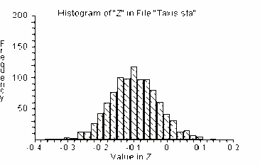
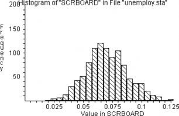
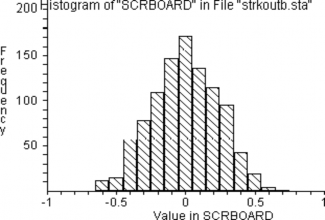

Exercise Solutions
==================

Solution 18-2
-------------

`           ` `           ` `           ` `           ` `           `
`           ` `           ` `           ` `           `

Results:

INTERVAL = -0.25921 0.039083 \[estimated 95 percent confidence
interval\]

Solution 21-1
-------------

`           ` `           ` `           ` `           ` `           `
`           `

Result:

INTERVAL = 0.035 0.105 \[estimated 95 percent confidence interval\]

Solution 21-2
-------------

We use the "bootstrap" technique of drawing many bootstrap re-samples
with replacement from the original sample, and observing how the
re-sample means are distributed.

`           ` `           ` `           `

Do 1000 trials or simulations

`           `

Draw 20 lifetimes from a, randomly and with replacement

`           ` `           `

Find the average lifetime of the 20

`           `

Keep score

`           `

Graph the experiment results

`           `

Identify the 2.5th and 97.5th percentiles. These percentiles will
enclose 95 percent of the resample means.

`           `

Result:

INTERVAL = 27.7 30.05 \[estimated 95 percent confidence interval\]

Solution 21-3
-------------

`           ` `           ` `           ` `           ` `           `
`           ` `           ` `           `

Result:

INTERVAL = 0.0187 0.0219 \[estimated 95 percent confidence interval\]

Solution 23-1
-------------

1.  Create two groups of paper cards: 25 with participation rates, and
    25 with the spread values. Arrange the cards in pairs in accordance
    with the table, and compute the correlation coefficient between the
    shuffled participation and spread variables.

2.  Shuffle one of the sets, say that with participation, and compute
    correlation between shuffled participation and spread.

3.  Repeat step 2 many, say 1000, times. Compute the proportion of the
    trials in which correlation was at least as negative as that for the
    original data.

`           ` `           ` `           ` `           ` `           `
`           `

compute correlation - it's -.37

`           ` `           `

shuffle the participation rates

`           ` `           `

compute re-sampled correlation

`           `

keep the value in the scoreboard

`           ` `           `

count the trials when result \<= -.37

`           `

compute the proportion of such trials

`           `

Conclusion: The results of 5 Monte Carlo experiments each of a thousand
such simulations are as follows:

`           `

From this we may conclude that the voter participation rates probably
are negatively related to the vote spread in the election. The actual
value of the correlation (-.37398) cannot be explained by chance alone.
In our Monte Carlo simulation of the null-hypothesis a correlation that
negative is found only 3 percent--4 percent of the time.

Distribution of the test statistic's value in 1000 independent trials
corresponding to the null-hypothesis:

Solution 23-2
-------------

`           ` `           ` `           ` `           ` `           `
`           ` `           ` `           ` `           `

Result: kk = 0

Interpretation: In 1000 simulations, random shuffling never produced a
value as high as observed. Therefore, we conclude that random chance
could not be responsible for the observed degree of correlation.

Solution 23-3
-------------

`           ` `           ` `           ` `           ` `           `
`           ` `           ` `           ` `           `

Result: kk = .001

Interpretation: A correlation coefficient as high as the observed value
(.62) occurred only 1 out of 1000 times by chance. Hence, we rule out
chance as an explanation for such a high value of the correlation
coefficient.

Solution 23-4
-------------

`           `

read data from file

`           `

compute correlation stat (it's .419)

`           ` `           `

shuffle money supply values

`           `

compute correlation

`           `

keep the value in a scoreboard

`           ` `           ` `           `

Distribution of the correlation after permutation of the data:

Result: prob = .001

Interpretation: The observed correlation (.419) between the exchange
rate and the money supply is seldom exceeded by random experiments with
these data. Thus, the observed result

0.419 cannot be explained by chance alone and we conclude that it is
statistically significant.
